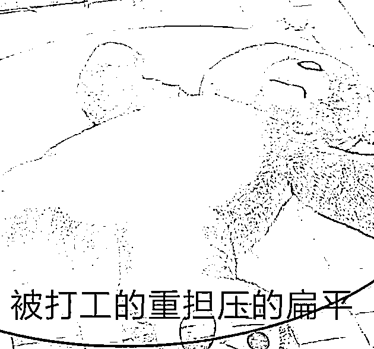

# 奇葩招聘再现，“才艺护士”究竟是何物？

> 原文：[`mp.weixin.qq.com/s?__biz=MzIyMDYwMTk0Mw==&mid=2247536947&idx=6&sn=644615bd1c3cf3a891e1622bd0702404&chksm=97cb9a0ba0bc131d9f05e0377ceb59e4e4d68560b324a5613f605a011f71e9c4d28bc8a6549d&scene=27#wechat_redirect`](http://mp.weixin.qq.com/s?__biz=MzIyMDYwMTk0Mw==&mid=2247536947&idx=6&sn=644615bd1c3cf3a891e1622bd0702404&chksm=97cb9a0ba0bc131d9f05e0377ceb59e4e4d68560b324a5613f605a011f71e9c4d28bc8a6549d&scene=27#wechat_redirect)

**01**

<ne-text style="">近年来，有关招聘的奇葩新闻可谓一件接着一件，不断刷新着网友们摇摇欲坠的三观。</ne-text>

<ne-text style="">对于普罗大众而言，这些职场里的黑色幽默总带着些许扎心的味道。</ne-text>

<ne-text style="">再与世无争的乐子人，见了它也不得不发出</ne-text><ne-text style="">“</ne-text><ne-text style="">生活不易</ne-text><ne-text style="">”</ne-text><ne-text style="">的感叹。</ne-text>

<ne-text style="">然而，不管你我如何吐槽，庞大的社会依旧会按着它既有的规则缓缓运转。</ne-text>

<ne-text ne-bold="true" style="font-weight: bold;"><ne-text ne-bold="true" style="font-weight: bold;">人才市场里的魔幻操作，没有最离谱，只有更离谱。</ne-text></ne-text>

<ne-text style="">就在不久前，山东一家公立医院的招聘公告中，就赫然出现了“才艺护士”一栏。</ne-text>

<ne-card data-card-name="image" data-card-type="inline" data-event-boundary="card" style="z-index: 1;line-height: 1em;height: auto;display: inline-block;vertical-align: baseline;margin-right: 1px;margin-bottom: 7.83px;margin-left: 1px;white-space: initial;"></ne-card>

<ne-text style="">光看这个岗位的名称，就足以让人的脑袋塞满数不清的问号。</ne-text>

<ne-text style="">又是“护士”又是“才艺”，两者可谓风马牛不相及。</ne-text>

<ne-text style="">什么时候，白衣天使的队伍里有了这样一个不伦不类的群体了？</ne-text>

<ne-card data-card-name="image" data-card-type="inline" data-event-boundary="card" style="z-index: 1;line-height: 1em;height: auto;display: inline-block;vertical-align: baseline;margin-right: 1px;margin-bottom: 7.83px;margin-left: 1px;white-space: initial;"></ne-card>

<ne-text style="">再细看岗位的要求（仅专科学历），小呸脸上原本就疑惑的表情又扭曲了几分：</ne-text>

<ne-text ne-bold="true" style="font-weight: bold;"><ne-text ne-bold="true" style="font-weight: bold;">身高</ne-text><ne-text ne-bold="true" style="font-weight: bold;">162cm</ne-text><ne-text ne-bold="true" style="font-weight: bold;">以上，</ne-text><ne-text ne-bold="true" style="font-weight: bold;">BMI</ne-text><ne-text ne-bold="true" style="font-weight: bold;">指数</ne-text><ne-text ne-bold="true" style="font-weight: bold;">18.5-24.9</ne-text><ne-text ne-bold="true" style="font-weight: bold;">（既不能是竹竿腿也不能是水桶腰），形象气质佳，普通话标准，具有一定才艺特长</ne-text><ne-text ne-bold="true" style="font-weight: bold;">…….</ne-text></ne-text>

<ne-card data-card-name="image" data-card-type="inline" data-event-boundary="card" style="z-index: 1;line-height: 1em;height: auto;display: inline-block;vertical-align: baseline;margin-right: 1px;margin-bottom: 7.83px;margin-left: 1px;white-space: initial;"></ne-card>

<ne-text style="">更绝的是，有参与过选拔的网友透露，诸如身高体重外貌等方面是硬性要求，如果不符合就会被直接淘汰。</ne-text>

<ne-text style="">任你专业知识优秀，只要</ne-text><ne-text style="">“</ne-text><ne-text style="">形象不达标</ne-text><ne-text style="">”</ne-text><ne-text style="">，也不在对方的考虑范围之内。</ne-text>

<ne-text ne-bold="true" style="font-weight: bold;"><ne-text ne-bold="true" style="font-weight: bold;">这是在招护士还是搞选秀呢？</ne-text></ne-text>

<ne-card data-card-name="image" data-card-type="inline" data-event-boundary="card" style="z-index: 1;line-height: 1em;height: auto;display: inline-block;vertical-align: baseline;margin-right: 1px;margin-bottom: 7.83px;margin-left: 1px;white-space: initial;"></ne-card>

<ne-text style="">上面的一大堆花里胡哨的要求，跟护理学、跟护士的日常工作有关系吗？</ne-text>

<ne-text style="">对于这些难以理解的门槛，很多网友都觉得“引起不适”。</ne-text>

<ne-text style="">当地有关部门在经过调查后，</ne-text><ne-text style="">**同样认定招聘环节存在不合理的地方，并责令医院整改。**</ne-text>

<ne-text style="">在最新版的招聘通知中，引发争议的要求已经取消。</ne-text>

<ne-card data-card-name="image" data-card-type="inline" data-event-boundary="card" style="z-index: 1;line-height: 1em;height: auto;display: inline-block;vertical-align: baseline;margin-right: 1px;margin-bottom: 7.83px;margin-left: 1px;white-space: initial;"></ne-card>

<ne-text style="">按照惯例，小呸除了讲述新闻之外，还想跟大家侃一侃表象背后的来龙去脉。</ne-text>

<ne-text ne-bold="true" style="font-weight: bold;"><ne-text ne-bold="true" style="font-weight: bold;">在现实生活中，用人单位向应聘者提出专业技能以外要求的情况其实并不罕见。</ne-text></ne-text>

<ne-text style="">正所谓</ne-text><ne-text style="">“</ne-text><ne-text style="">技多不压身</ne-text><ne-text style="">”</ne-text><ne-text style="">，多几个特长，代表着你能在工作中更好地承担起</ne-text><ne-text style="">“</ne-text><ne-text style="">多面手</ne-text><ne-text style="">”</ne-text><ne-text style="">的角色，自然也就多几分竞争力。</ne-text>

<ne-text style="">更何况，像医院这样的大型单位，在文化宣传、文艺活动、来访接待等方面肯定有一定的需求。</ne-text>

<ne-card data-card-name="image" data-card-type="inline" data-event-boundary="card" style="z-index: 1;line-height: 1em;height: auto;display: inline-block;vertical-align: baseline;margin-right: 1px;margin-bottom: 7.83px;margin-left: 1px;white-space: initial;"></ne-card>

<ne-text style="">在专业水平相差不大的情况下挑选形象气质更好的应聘者，也符合择优录取的原则。</ne-text>

<ne-text ne-bold="true" style="font-weight: bold;"><ne-text ne-bold="true" style="font-weight: bold;">不过，将身高体重、外貌等因素纳入评价体系，并不等价于让它们成为硬性门槛。</ne-text></ne-text>

<ne-text style="">护士的职责是护理病人、协助治疗。</ne-text>

<ne-text ne-bold="true" style="font-weight: bold;"><ne-text ne-bold="true" style="font-weight: bold;">在选拔时，护理方面的专业知识技巧在任何情况下都应该是最主要的考核点。</ne-text></ne-text>

<ne-text style="">如果它的权重低于其他要求，就是妥妥的本末倒置。</ne-text>

<ne-card data-card-name="image" data-card-type="inline" data-event-boundary="card" style="z-index: 1;line-height: 1em;height: auto;display: inline-block;vertical-align: baseline;margin-right: 1px;margin-bottom: 7.83px;margin-left: 1px;white-space: initial;"></ne-card>

<ne-text style="">这样做，不仅丧失了公平性，还极其容易引发大众对职业的误解。</ne-text>

<ne-text style=""><ne-text style="">**02**</ne-text></ne-text>

<ne-text style="">在招聘要求中设置奇奇怪怪的门槛，</ne-text><ne-text style="">“</ne-text><ne-text style="">才艺护士</ne-text><ne-text style="">”</ne-text><ne-text style="">并非唯一的例子。</ne-text>

<ne-text style="">同样在今年五月，上海某高校的教师张某某被曝出在招募团队成员时有颜值歧视的现象。</ne-text>

<ne-card data-card-name="image" data-card-type="inline" data-event-boundary="card" style="z-index: 1;line-height: 1em;height: auto;display: inline-block;vertical-align: baseline;margin-right: 1px;margin-bottom: 7.83px;margin-left: 1px;white-space: initial;"></ne-card>

<ne-text style="">一张“招募精英”的公告，在互联网上广为传播。</ne-text>

<ne-text style="">其内容的魔幻程度，与“才艺护士”相比可谓是有过之而无不及。</ne-text>

<ne-card data-card-name="image" data-card-type="inline" data-event-boundary="card" style="z-index: 1;line-height: 1em;height: auto;display: inline-block;vertical-align: baseline;margin-right: 1px;margin-bottom: 7.83px;margin-left: 1px;white-space: initial;"></ne-card>

<ne-text style="">首当其冲第一条，</ne-text><ne-text ne-bold="true" style="font-weight: bold;"><ne-text ne-bold="true" style="font-weight: bold;">“</ne-text><ne-text ne-bold="true" style="font-weight: bold;">长江以南生源</ne-text><ne-text ne-bold="true" style="font-weight: bold;">”</ne-text><ne-text ne-bold="true" style="font-weight: bold;"><ne-text style="">，直接不分青红皂白地把所有北方学子排除在外。</ne-text></ne-text></ne-text>

<ne-text style="">（</ne-text><ne-text style="">ps</ne-text><ne-text style="">：不知面对来自重庆、武汉、南京的学生，这位老师该如何抉择）</ne-text>

<ne-text ne-bold="true" style="font-weight: bold;"><ne-text ne-bold="true" style="font-weight: bold;">接下来，便是男生要一米七以上，女生得一米六以上，外加一个不明所以的</ne-text><ne-text ne-bold="true" style="font-weight: bold;">“</ne-text><ne-text ne-bold="true" style="font-weight: bold;">颜值</ne-text><ne-text ne-bold="true" style="font-weight: bold;">85</ne-text><ne-text ne-bold="true" style="font-weight: bold;">分以上</ne-text><ne-text ne-bold="true" style="font-weight: bold;">”</ne-text><ne-text ne-bold="true" style="font-weight: bold;">。</ne-text></ne-text>

<ne-text style="">整条公告可谓漏洞百出，缺乏最起码的严谨。</ne-text>

短短几行字，集地域歧视、身高歧视、外貌歧视于一身，看后血压瞬间拉满。 

<ne-card data-card-name="image" data-card-type="inline" data-event-boundary="card" style="z-index: 1;line-height: 1em;height: auto;display: inline-block;vertical-align: baseline;margin-right: 1px;margin-bottom: 7.83px;margin-left: 1px;white-space: initial;"></ne-card>

<ne-text style="">当然，最主要的槽点，还是这位老师提出的部分要求与“科创”二字毫不沾边。</ne-text>

<ne-text ne-bold="true" style="font-weight: bold;"><ne-text ne-bold="true" style="font-weight: bold;">真要进行科学研究，生在长江以北又如何？长相普普通通又如何？</ne-text></ne-text>

<ne-card data-card-name="image" data-card-type="inline" data-event-boundary="card" style="z-index: 1;line-height: 1em;height: auto;display: inline-block;vertical-align: baseline;margin-right: 1px;margin-bottom: 7.83px;margin-left: 1px;white-space: initial;"></ne-card>

<ne-text style="">对此，小呸还是一样的观点：</ne-text>

<ne-text ne-bold="true" style="font-weight: bold;"><ne-text ne-bold="true" style="font-weight: bold;">择优录取无可厚非，个人偏好可以尊重。</ne-text></ne-text>

<ne-text ne-bold="true" style="font-weight: bold;">但将颜值与科研能力挂钩，就是纯粹的胡说八道。</ne-text>

<ne-text style="">不可否认的是，从学校到职场，“内卷”二字已经成为当代年轻人身上难以摆脱的包袱。</ne-text>

<ne-text style="">愈发有限的岗位，对应着与日俱增的竞争者。</ne-text>

<ne-text style="">像</ne-text><ne-text style="">“</ne-text><ne-text style="">博士涌入中学教师队伍</ne-text><ne-text style="">”</ne-text><ne-text style="">、</ne-text><ne-text style="">“</ne-text><ne-text style="">清华毕业生应聘全职保姆</ne-text><ne-text style="">”</ne-text><ne-text style="">之类的新闻，我们早已见怪不怪。</ne-text>

<ne-text style="">全民内卷的大环境下，求职门槛变高是板上钉钉的事实。</ne-text>

<ne-card data-card-name="image" data-card-type="inline" data-event-boundary="card" style="z-index: 1;line-height: 1em;height: auto;display: inline-block;vertical-align: baseline;margin-right: 1px;margin-bottom: 7.83px;margin-left: 1px;white-space: initial;"></ne-card>

<ne-text style="">只有资源雄厚、软硬实力兼备的人，才能在职场上如鱼得水。</ne-text>

<ne-text ne-bold="true" style="font-weight: bold;"><ne-text ne-bold="true" style="font-weight: bold;">不过，纵使外貌、出身等因素也是个人竞争力的一部分，招聘门槛的设置也必须要有原则、有底线。</ne-text></ne-text>

<ne-text style="">承认先天条件，不代表否定后天努力。</ne-text>

<ne-text style="">尊重个人选择，不代表可以随心所欲。</ne-text>

<ne-text style="">一句话：</ne-text>

<ne-text ne-bold="true" style="font-weight: bold;">大家所真正希望的东西，其实也就公平二字而已。</ne-text>

<ne-card data-card-name="image" data-card-type="inline" data-event-boundary="card" style="z-index: 1;line-height: 1em;height: auto;display: inline-block;vertical-align: baseline;margin-right: 1px;margin-bottom: 7.83px;margin-left: 1px;white-space: initial;"></ne-card>

<ne-text style="">不要肆意践踏公理，不要寒了老百姓的心。</ne-text>

<ne-text style="">来源：黑白呸</ne-text>

← 向右滑动与灰产圈互动交流 →

