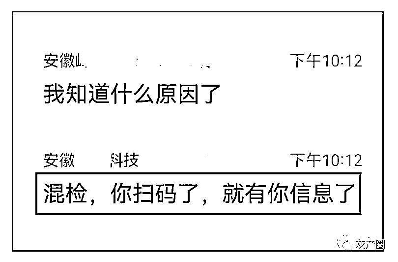
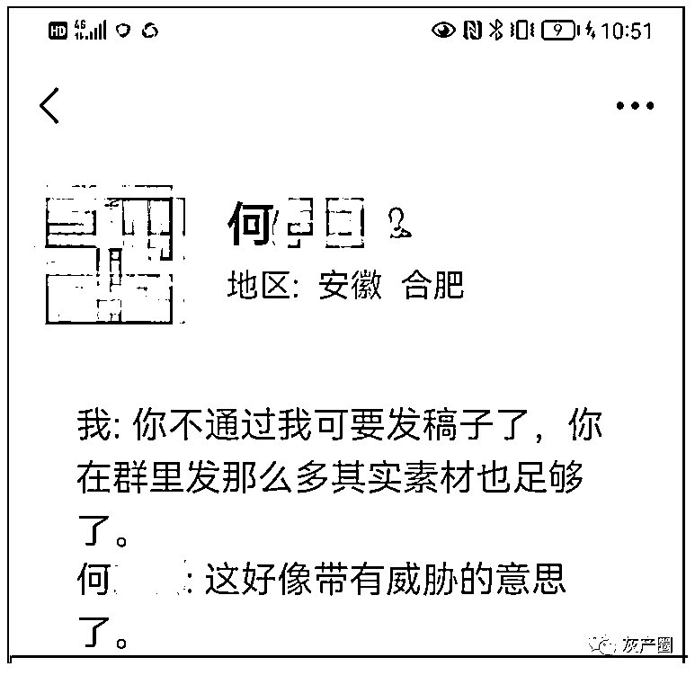

# 惊呆了！压根儿就没采样，核酸报告就已经出来了！

> 原文：[`mp.weixin.qq.com/s?__biz=MzIyMDYwMTk0Mw==&mid=2247537020&idx=1&sn=1b19afa8028bbb8bca7a1fab234db31e&chksm=97cb9a44a0bc1352cea6f9239d412c70d9ca4637ee90eeb8d07a4205f0cb954edace6d1c6a72&scene=27#wechat_redirect`](http://mp.weixin.qq.com/s?__biz=MzIyMDYwMTk0Mw==&mid=2247537020&idx=1&sn=1b19afa8028bbb8bca7a1fab234db31e&chksm=97cb9a44a0bc1352cea6f9239d412c70d9ca4637ee90eeb8d07a4205f0cb954edace6d1c6a72&scene=27#wechat_redirect)

合肥新一轮常态化免费核酸检测正在进行中。昨天检测的是包河区、蜀山区、经开区、高新区。今天检测的是瑶海区、庐阳区、新站区。

昨天晚上 9 点多，合肥市民何先生在微信朋友圈艾特合肥市卫健委称，“本人 19:45 做的核酸，检测结果竟然是 15:52 出，真牛逼。”何先生还艾特了“合肥 xx 医学”。

发过朋友圈后，何先生还嫌不过瘾，将朋友圈截屏，放在了一个 500 人的大群里。 

微信群里顿时热闹开来。有网友说，“这压根就没检测，随意出个结果。”

这位网友同时提醒何先生：“小心说你故意扰乱防疫工作，你说你晚上做的核酸有照片或者视频证据吗？” 

何先生说得很肯定：“有，扫码有时间的，后台能看到数据。” 

为了证明自己所言不虚，何先生晒出了区域核酸检测查询结果，显示为阴性，检测结果出来的时间的确是 6 月 1 日下午 15:52:42。但显示的采集时间不是何先生说的晚上，而是上午 08:20:27。 

于是，有群友提出了疑问。 

何先生解释，他 8:20 去扫码登记了，排队人太多，没做，下班回来 19:45 分做的核酸。

有群友恍然大悟：混检，你扫码了，就有你信息了。

群友批评何先生：扫码后就要做，否则就错位了。群友说，“幸亏你那个点没出事，否则你有责任的”。群友进一步解释：20 混 1，10 混 1，错位了就都错了

为进一步了解此事的前因后果，主动加何先生微信好友，但一直没通过。 

此前一直愤愤不平的何先生突然间变得大度起来，说是混检，情有可原。

如果是 20 混 1，只有做够 20 个人才能出结果。何先生还是不通过。

宾曰语云告诉何先生，通不通过都会发稿子，何先生认为这是在威胁他。 

何先生在没进行核酸采集的情况下，就出来了检测结果，他拿到的分明是份假的阴性报告。何先生为此在朋友圈吐槽，在 500 人的大群里吐槽，我告诉他要把这件事披露出来，怎么就成威胁他了呢？

拒绝加好友之后，昨天夜里 10:49，何先生告诉群友，有媒体加他微信，他没通过。何先生告诉群友，媒体对他有“威胁”的意味。他提醒网友“话题就此打住”。

昨天夜里 11 时许，宾曰语云将上述情况告诉了合肥市政府热线 12345，接线的值班人员说，**假如是 10 个人一管的话，检测 10 个人之后放在一个管里。如果是扫码后没做（核酸检测）结果就出来了，中间就可能会出现问题。**

**”如果没做（核酸检测）也去扫码的话，后面可能就已经乱了。“**接线值班员如是说。

合肥市政府热线 12345 表示会把这情况反馈给相关部门，1 到 3 个工作日给回复。

5 月 10 日，合肥市疫情防控应急指挥部发布《关于开展常态化差异化核酸检测的通告》，市域内除重点人员外，今后每 5 天开展 1 次常态化免费核酸检测，首轮于 5 月 11 日—12 日开展。该轮检测完成后，暂定每月 16 日—17 日、21 日—22 日、26 日—27 日、1 日—2 日、6 日—7 日、11 日—12 日开展，确保“应检尽检”。对于无故不按规定频次进行核酸检测者，将通过安康码弹窗提醒，如仍不及时检测、申诉，安康码使用将受限。

来源：宾曰语云 编辑：夏荷   审稿：宾语

← 向右滑动与灰产圈互动交流 →

