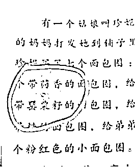
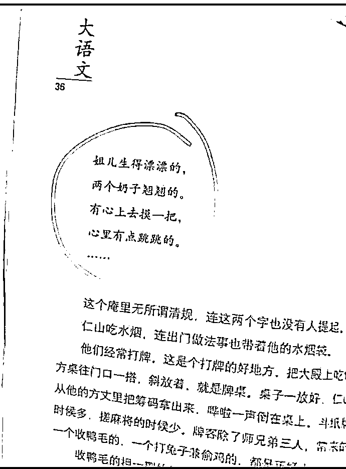
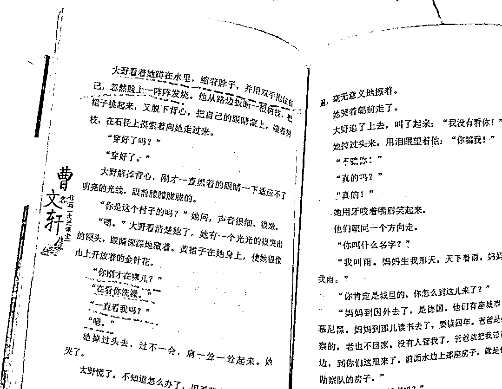
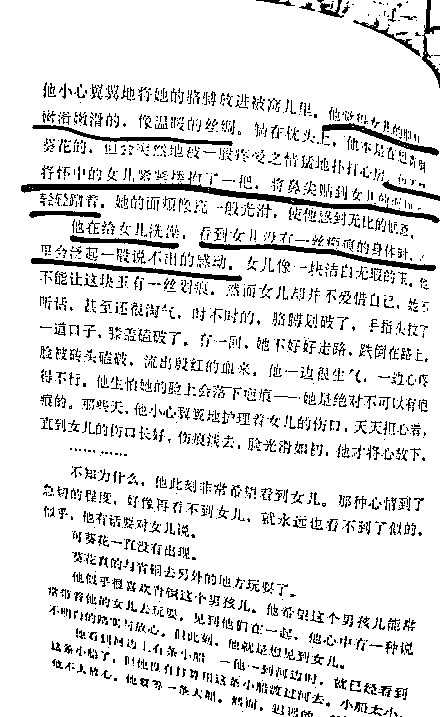
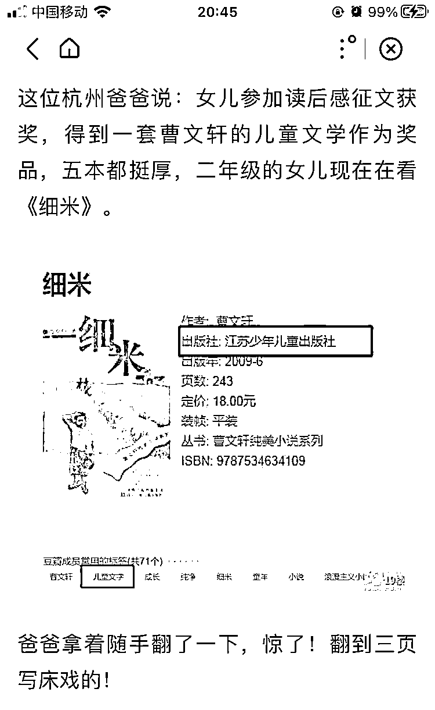
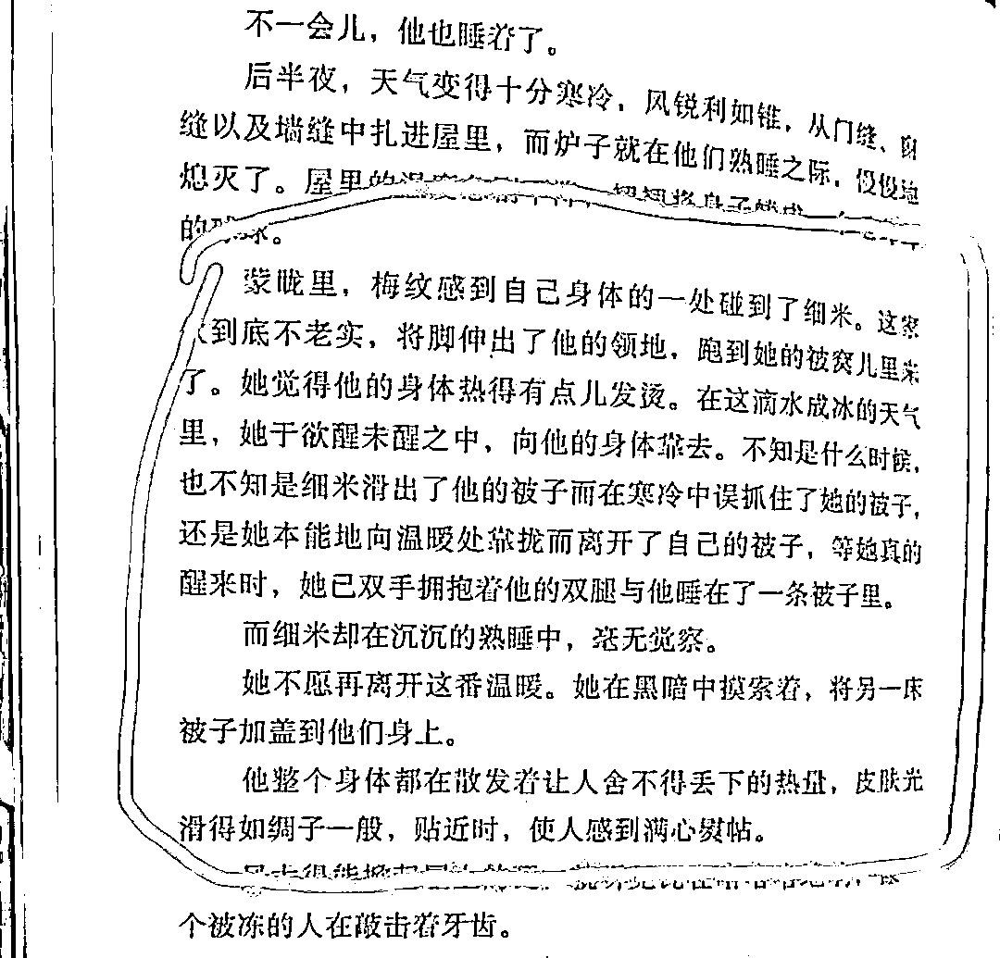
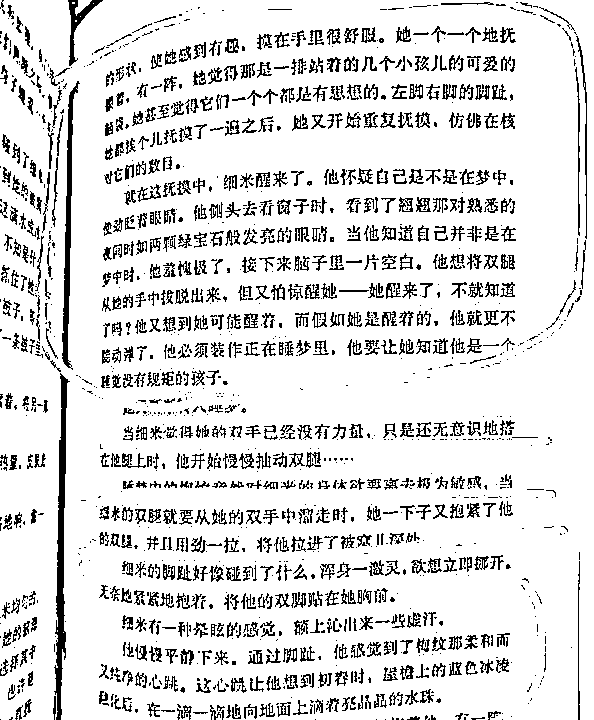
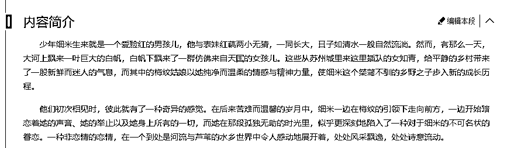
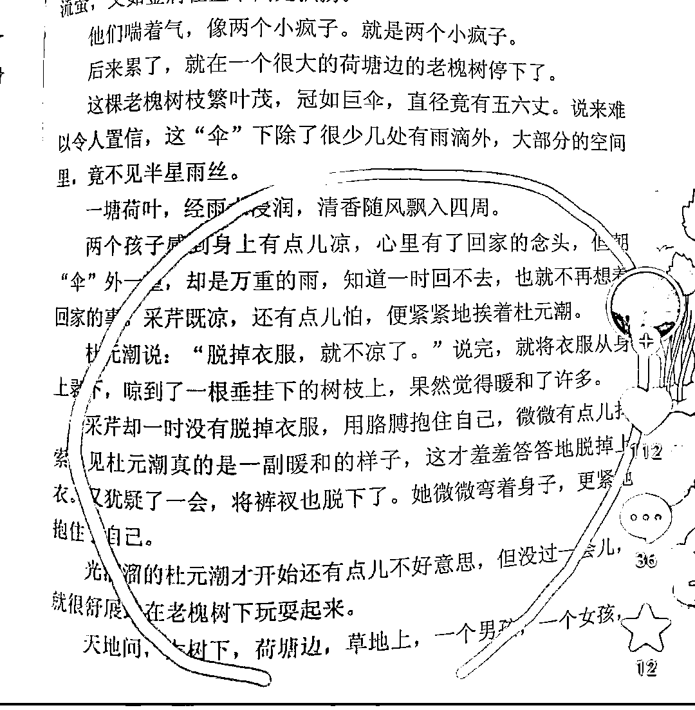
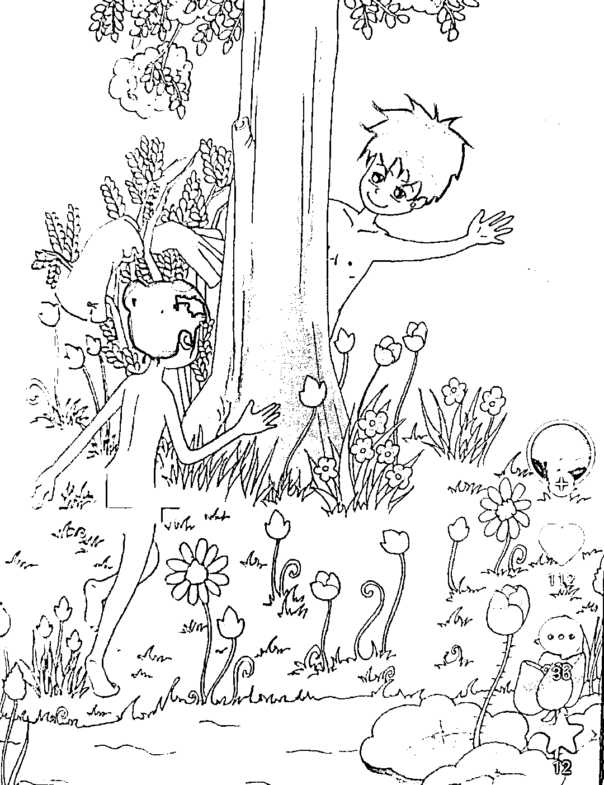

# 男子翻开女儿课外读物吓懵：赶紧把曹文轩的全扔了！出版社回应

> 原文：[`mp.weixin.qq.com/s?__biz=MzIyMDYwMTk0Mw==&mid=2247537020&idx=2&sn=fb9bbb76b302e7fbced0114df5ab5246&chksm=97cb9a44a0bc13520e530b05efe28f96262a3f0b9c27a090fc336b6bf44cb6889016713c4daf&scene=27#wechat_redirect`](http://mp.weixin.qq.com/s?__biz=MzIyMDYwMTk0Mw==&mid=2247537020&idx=2&sn=fb9bbb76b302e7fbced0114df5ab5246&chksm=97cb9a44a0bc13520e530b05efe28f96262a3f0b9c27a090fc336b6bf44cb6889016713c4daf&scene=27#wechat_redirect)

**新闻要点：**

**5 月 30 日，江苏苏州。苏州一小学家长翻开女儿课外读物，无意看到里面有这样一段话，瞬间吓懵将“曹文轩”主编的书全部都扔了。对此当事出版社回应称，这本书读者定位为中学生，而且是选自大作家汪曾祺的名篇，建议家长把文章读了之后再判断。对此网友纷纷表示不买账，表示就算中学生的读物也不该如此选择篇目。**

# **有家长发出了疑问：曹文轩你究竟是儿童读物作家还是色情作家？**

[`mp.weixin.qq.com/mp/readtemplate?t=pages/video_player_tmpl&action=mpvideo&auto=0&vid=wxv_2421254131081625601`](https://mp.weixin.qq.com/mp/readtemplate?t=pages/video_player_tmpl&action=mpvideo&auto=0&vid=wxv_2421254131081625601)

最近人教曹文轩主编的课外读物《七色花》，被很多网友发现里面有罂粟籽面包圈。这个问题太严重了，罂粟籽在我们国家是严厉禁止食用的。这种行为，让很多网友们议论纷纷。于是有很多网友又去找他主编的其他读物，居然发现了一个更加恐怖的事情！就是他主编的很多读物，居然严重涉黄！

首先争议最大的，就是曹文轩主编的《大语文》，里面就出现了一首小黄诗。这诗我看了都有点害羞，就不知道那些学生们看了，心里会在想什么。特别是男同学，他们看完后，目光会不会放在女生的 xong 上。

特别是你孩子看完后，跑来跟你说“妈妈我今天学了一首新诗哦。”然后把这首诗念给你听，你会怎么想。那估计真的是血压升高，心有点跳跳的。

当然这个文章是没问题的，这首诗出自于汪曾祺的短篇小说《受戒》。故事说的是一个和尚与农家女小英子之间的爱情故事。但是放在大语文上给学生们看，我个人认为确实有点不好。

当然这只是开胃菜，在微博上，很多网友发现了更加离谱的东西。也是曹文轩出版的，里面的内容居然写的是偷看女生洗澡。虽然说是文学艺术，但是家长还是质疑，这个给学生看，真的不好吧。

这个就更加夸张了，写的是父亲给女儿洗澡的片段。对对对，又是艺术。但是这个写法，让家长们看了，就感觉完全是小黄书的写法。甚至那家长觉得，会不会有点乱伦的意思。这要是让女学生们看到了，又想到之前父亲也帮她洗过澡，会不会就产生一点点不好的联想。

还有一个被网友举报的，就是曹文轩自己写的《细米》。这位杭州爸爸当时也是看到了新闻，知道了曹文轩这个人有问题。于是发现自己女儿当时参加征文获奖，得到了一套曹文轩的儿童文学作为奖品。

他读二年级的女儿现在正在观看曹文轩的《细米》。可当父亲拿起这边书随手翻了一下之后，在第三页他居然发现曹文轩写的是床戏！

这可把这位父亲吓坏了，自己读二年级的女儿可正在读这本书啊！这本书要是把她给带坏了，那这个做父亲的，真的会愧疚一辈子。

从这位父亲发出的图来看，第一张图好像是说故事主人公“细米”和那个女主人公梅纹，因为寒冷，最后抱在了一起睡觉。

这个第二张图，我确实有点不懂作者的意思。但是我们从网上查找，发现这个《细米》确实是一本儿童读物。然后从内容简介上来看，是细米喜欢上了美纹。写的是一种非恋情的恋情。我猜应该是一本讲述爱情类的读物，所以文章中才会出现那么多的画面。

然后我们再继续看另外一本曹文轩被质疑涉黄的《红辣椒》。这是一个用户在抖音上发表的看法，这还是她儿子告诉她的，说书里面有一个光屁股的女孩图片。就是这个文章中，出现了很多叫脱衣服，脱裤子的情节。

不仅如此，在配图里，是一张一个男孩和女孩没穿衣服嬉闹的图片。这个图片确实跟文章写的一样。因为文章里，基本上很多都写的是男女主人公，脱掉衣服和裤子。表达的意思是脱掉衣服抱在一起，会更加的舒服，暖和。

我觉得这个作为儿童读物确实有点不好吧，主要是那个插图，女孩还光着屁股。虽然曹文轩写的是艺术，但是家长们看了确实觉得很害怕。因为在家长们的眼里，这确实更偏向于儿童色情。这些东西作为一个儿童读物，定义上会不会有错呢?

来源：世相研究所

← 向右滑动与灰产圈互动交流 →

