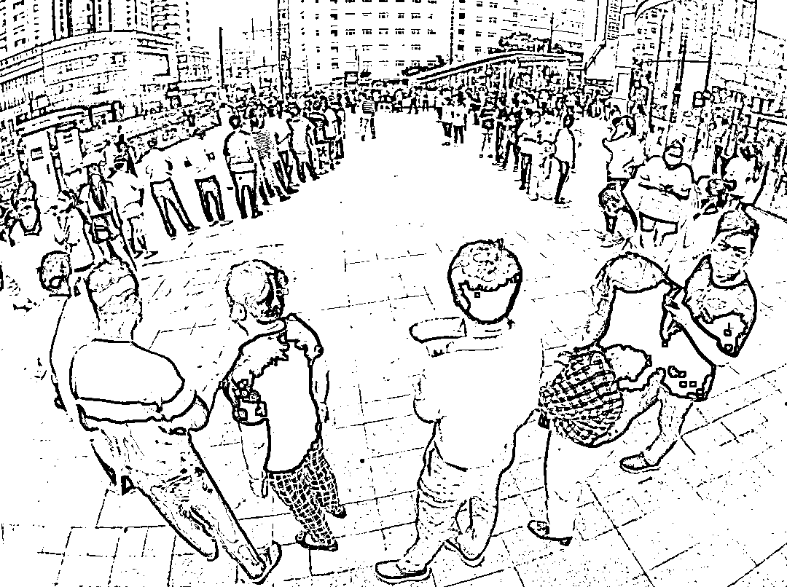
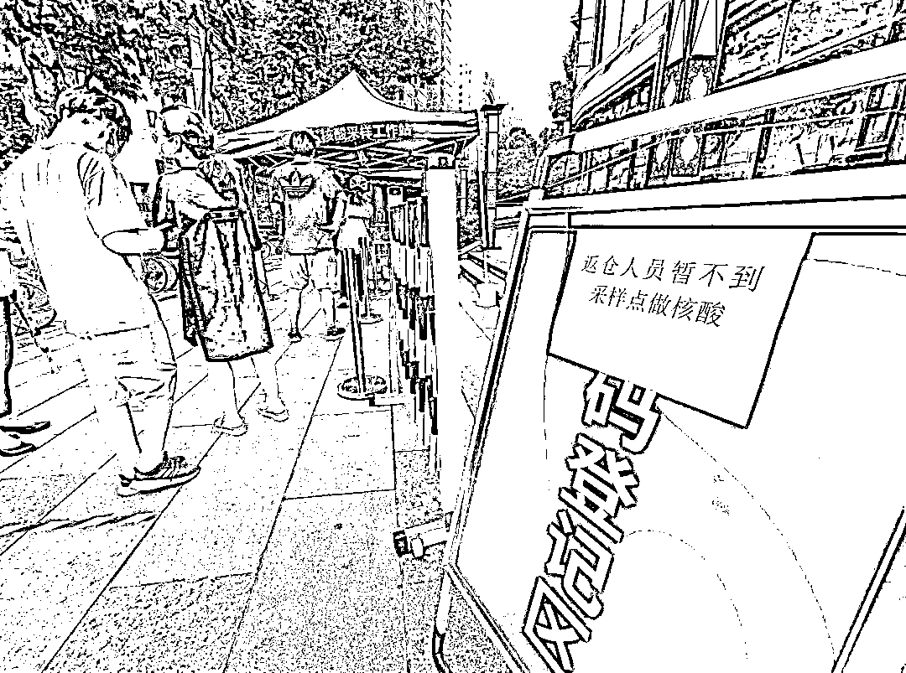
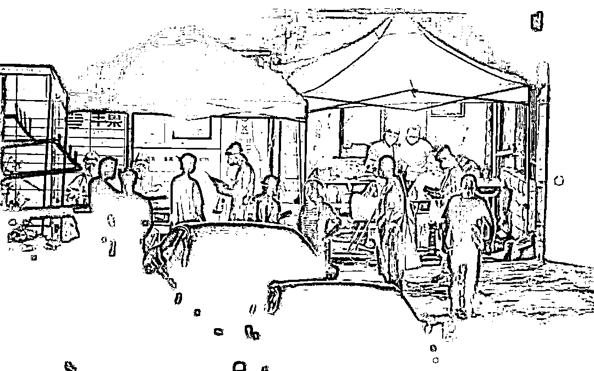
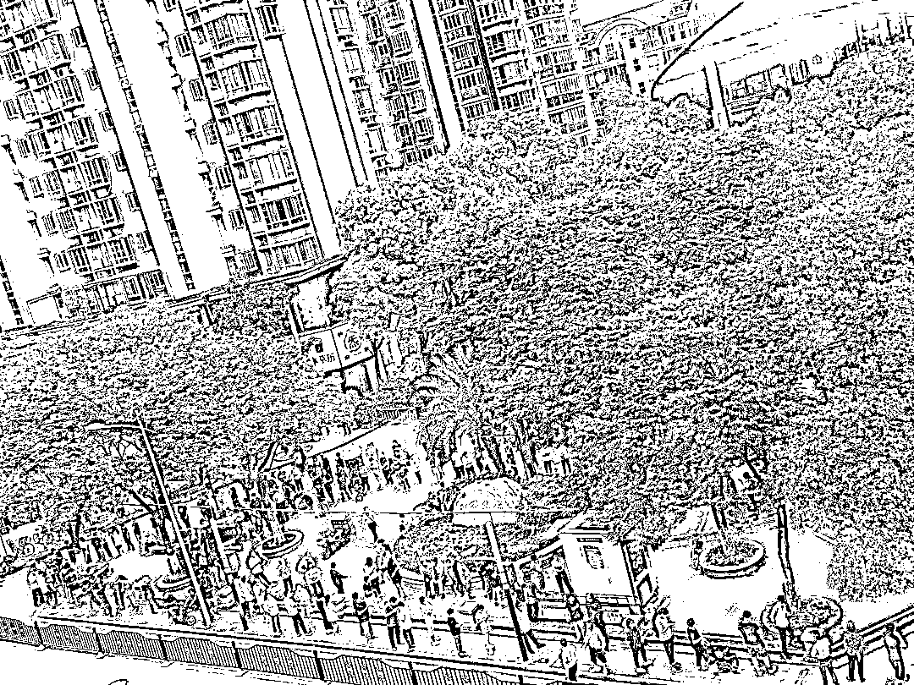
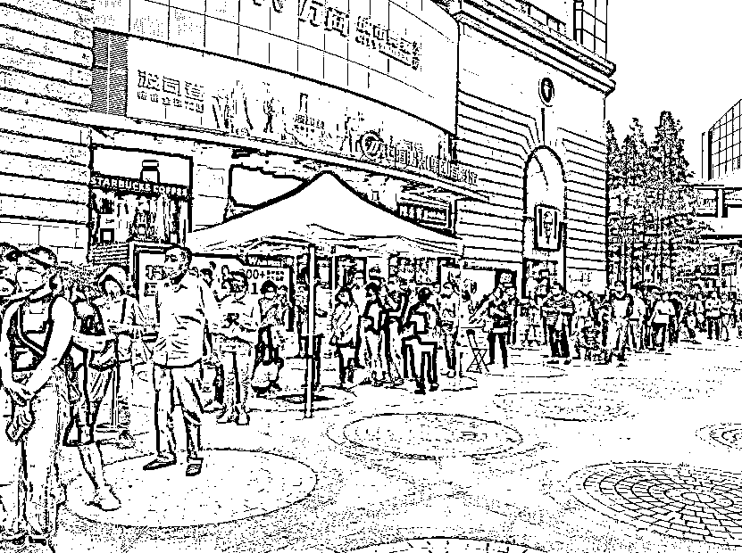
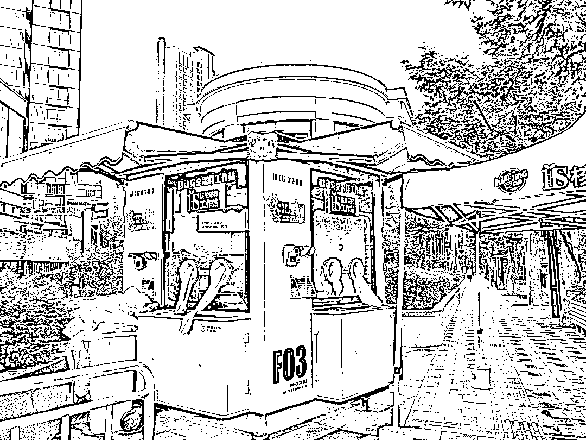

# 上海人核酸"续命"尴尬…

> 原文：[`mp.weixin.qq.com/s?__biz=MzIyMDYwMTk0Mw==&mid=2247537020&idx=3&sn=b971d638609bc70aac018242873f579f&chksm=97cb9a44a0bc13523c600d155cc03dca528f1399abca2df77638dd08a3e4ba123643754ecf3a&scene=27#wechat_redirect`](http://mp.weixin.qq.com/s?__biz=MzIyMDYwMTk0Mw==&mid=2247537020&idx=3&sn=b971d638609bc70aac018242873f579f&chksm=97cb9a44a0bc13523c600d155cc03dca528f1399abca2df77638dd08a3e4ba123643754ecf3a&scene=27#wechat_redirect)

昨天，上海进入全面有序复工复产复市、恢复正常生产生活秩序阶段，核酸采样工作也迎来了客流高峰。

种楠 摄

新民晚报记者采访发现，多个点位的核酸采样市民排起长队，最长的等待超过 3 小时。抱怨真实存在，但不少市民表示，常态化核酸采样工作刚刚起步，肯定有不少需要完善的地方，这些都是可以理解的。希望有关部门可以听到市民的心声，把这项工作做得更好。

**讲述：层层加码，“过期”、出舱人员不让做**

**闵行区的马小姐和杨浦区的陈小姐反映，小区附近的核酸采样点只接受“72 小时核酸阴性”的市民。朱小姐因为没有核酸阴性证明才去做核酸，又被告知没有核酸阴性证明无法做核酸，这可怎么办？小区里还有一些没有及时做核酸检测而被赋黄码的市民，核酸采样点也对其婉拒，要求他们“到医院去做”。**

**杨浦区市民陈小姐也说，上述规定在她的街道成了“共识”。但是查询这几天的新闻发布，均没有看到官方渠道的说明，陈小姐认为这是街道在“加码”。**

**家住静安区的周女士全家都是方舱出舱人员，已过居家健康监测期。但是，拿着解除隔离证明到家附近做核酸，却吃了闭门羹。她说，昌平路、西康路附近的一个常态化核酸检测点贴出“返舱人员暂不到采样点做核酸”的告示。工作人员表示，出院、出舱人员绿码被“锁定”，须前往医疗机构进行采样。不过，西康路、昌平路、江宁路周边几个其他点位都正常接受出院出舱人员做核酸检测，并张贴了单人单管的提示。在新丰路上一检测点，还给出院出舱人员设置了快速通道。**

****

**新民晚报记者 刘歆 摄**

**5 月 28 日，市卫健委副主任赵丹丹在疫情防控新闻发布会上明确，出院、出舱人员在居家健康监测后 3 个月内，如无发热等不适症状，可凭纸质版或电子版《解除医学隔离证明》自行前往常态化核酸检测点进行单人单管检测。对此，周女士说，本市感染人群超 60 万，这部分人也重回正常生活的权利，希望有关部门不要层层加码，更不要人为设置障碍或一刀切。**

****讲述：好不容易排到了，结果“管子没了”“下班了”**** 

**徐汇区的姚女士说，昨天是第一天上班，下班后到小区附近的核酸采样点做核酸检测。排了 1 个半小时后，眼看就要轮到，但也临近核酸采样亭的下班时间。工作人员告知“下班了”，便要暂停采样。后面依旧是长长的队伍，有人情绪激动，甚至打了报警电话。**

**家住普陀区桃浦镇的市民王女士告诉记者，核酸采样点队伍长，人手少，好不容易排到了，被告知试管用完了，等工作人员送来试管，又过了半小时。**

**昨天，常态化核酸采样亭迎来大客流，遇到物料用完、人员超出预期的情况并不少见。对此，有市民建议，临近采样点下班，应当派出工作人员在队尾拦截，对市民作出解释；而只要在队列中，就应当视为等候有效。同时，在人流量较大的情况下，王女士建议，适当延长开放时间，给予市民更多方便。**

**杨建正 摄** 

****讲述：显示“空闲”，结果排了一个多小时**** 

**“随申办 APP 查询点位和开放时间的功能十分好用，但是闲还是忙的状态查询，根本就不准。”市民徐先生吐槽。在一处显示为“空闲”的点位，他足足排了 60 分钟还没有轮到。而这 60 分钟之间，该点位一直显示“空闲”。徐先生说，即时状态有误差可以理解，但差距太大就显得这个功能有些“鸡肋”，希望系统能够改善。**

**黄浦区的杜小姐说，她所在的社区周边点位不少，但时间却很“苛刻”。比如距离小区最近的一个点位，开放时间和早晚高峰完美重合，对于上班族来说，显得不太友好。**

**目前，上海的常态化核酸检测点位布局很多，但开放时间差异大。比如记者居住在静安区，小区周边直线距离 500 米内面向社会的点位已经开放了 10 个，但是如果今天早上想做核酸，可以选择的其实只有 2 个点。**

****

**一家位于徐汇区的医疗机构，夜间做核酸采样的人群队伍排到马路上，昨晚流传的一段视频中显示，进入医院的市民很多没有做到“一米间距”。市民王小姐说，因为白天其他点位的队伍太长，而自己的核酸报告即将“过期”，只能硬着头皮排队，心里却担心这样人群聚集会否增加风险。**

**记者采访发现，常态化核酸采样点的时间设置，还有优化的空间。   建议在每个点位后设置“意见反馈”按钮，或者在核酸采样亭张贴意见收集二维码，或者设施统一的监督电话，供市民提建议和意见，并根据实际情况进一步调整。**

****

****讲述：工作人员操作不规范吓牢牢**** 

**前天下午，微信朋友圈里流传着一段网友拍摄的视频，浦东唐镇某公园门口的采样点，一位负责采样的工作人员没有做手部消毒，连续为多位市民采样。这是不符合操作规范的。记者从相关部门获悉，该工作人员为当地培训过的采样辅助人员，目前已经进一步技术指导并督促整改。**

**市民崔小姐说，昨天傍晚 6 时在杨浦区唐山路某常态化核酸采样点，看到一位工作人员身穿工作服却空手而来，没有带任何物料。队伍已经排起来了，如何做采样呢？对方说联系一下公司，结果电话一直打不通。居民报警后，对方告诉现场民警，自己是被同事叫来做采样的，不清楚要带什么东西，其他情况更是一问三不知。崔小姐说，这个常态化采样点的服务对象是小区居民，开放时间是 18 时至 22 时，但昨天第一天就是这样的情况，大家都很失望。**

****

**在南京西路太古汇商场附近某核酸检测点位，市民周女士拍下照片。只见该点位结束采样后，两只橡皮手套荡在风中，一旁的医废垃圾箱已满，废弃的防护服一半在内一半在外，盖子开着，盖子顶上还有其他医废。“医疗废弃物这样扔，不知道是否符合感控标准？”周女士发出质疑。**

**此前，市生态环境局副局长罗海林曾说，由于各类采样点的医废贮存条件不同，本市明确了不同的收运模式。便民采样点无法及时转运的，核酸采样医废应放入专用垃圾桶、箱，或者放在有“三防措施”（通俗讲就是防晒、防水、防风）的临时贮存场所，由辖区街镇负责运走、医废处置单位收运处置。此外，检测机构不要将核酸采样医废露天堆放在街边。 **

**来源：新民晚报 左妍**

********

**← 向右滑动与灰产圈互动交流 →**

****