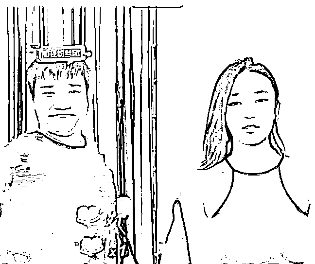
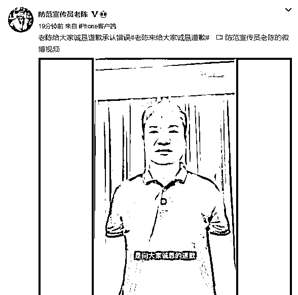
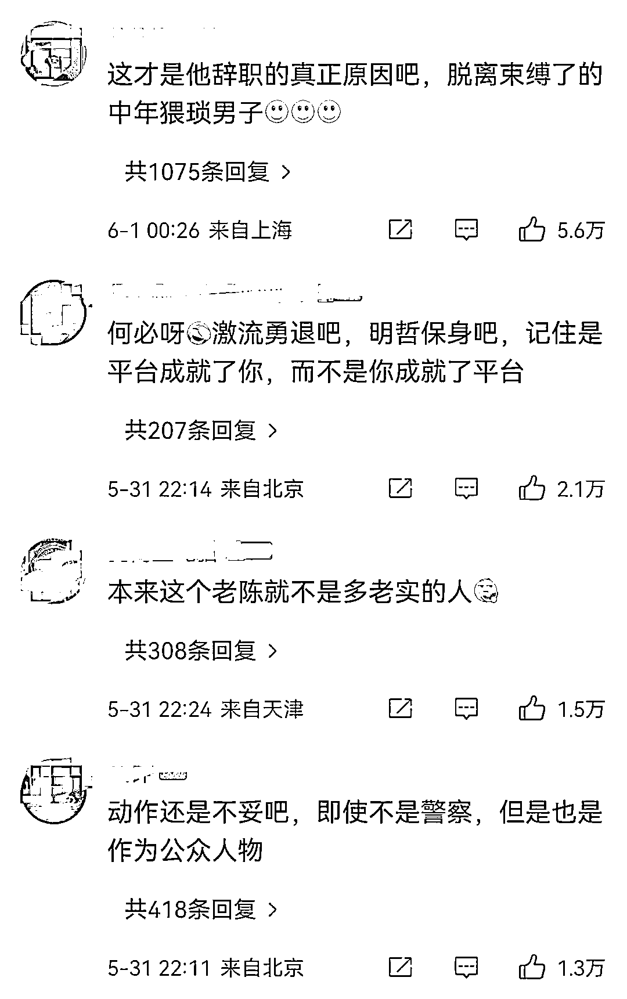

# 反诈老陈道歉

> 原文：[`mp.weixin.qq.com/s?__biz=MzIyMDYwMTk0Mw==&mid=2247537020&idx=4&sn=648a072871dbe98af37a2ddc278eb6d8&chksm=97cb9a44a0bc1352358ac8ce28480ab1e1d0e434cece4ecc4131492ae38793e8b261a3f79f69&scene=27#wechat_redirect`](http://mp.weixin.qq.com/s?__biz=MzIyMDYwMTk0Mw==&mid=2247537020&idx=4&sn=648a072871dbe98af37a2ddc278eb6d8&chksm=97cb9a44a0bc1352358ac8ce28480ab1e1d0e434cece4ecc4131492ae38793e8b261a3f79f69&scene=27#wechat_redirect)

近日，网友爆料称原“反诈民警老陈”陈国平在一场直播中连麦某女主播进行 PK，期间不停做出暗示性动作，被指言行低俗、不尊重女性。话题一度登上微博热搜第一。

<mpvideosnap class="js_uneditable custom_select_card channels_iframe videosnap_video_iframe" data-pluginname="videosnap" data-id="export/UzFfAgtgekIEAQAAAAAAz5gpo1R25AAAAAstQy6ubaLX4KHWvLEZgBPE-aNEDgB6HKKDzNPgMIsZDEY4l1rFeGudook2OHtI" data-url="https://findermp.video.qq.com/251/20304/stodownload?encfilekey=rjD5jyTuFrIpZ2ibE8T7YmwgiahniaXswqzJ5EFdMT5nJSzCERQsrkb9icxHqLgLB5YdY2nCSW3dZmib2m0HbVzTeke0mpfiaiafR8oI22j62xQBZqnlibEn64M7hg&amp;adaptivelytrans=0&amp;bizid=1023&amp;dotrans=0&amp;hy=SH&amp;idx=1&amp;m=&amp;scene=0&amp;token=cztXnd9GyrFiaEjm7s8C8Wwl5bP3038gPgSOra7Y9fibOvJltTQYekJUAHEd77S8Ky5JG8qJYzu58" data-headimgurl="http://wx.qlogo.cn/finderhead/ibq4aVwOt6HNqrr8OD3sCviaytF3B8TqCwHicxsuIanAJo/0" data-username="v2_060000231003b20faec8c6e48a1acbd3ce04ef33b077a1e41d0d3794ed88ea537878dbe65910@finder" data-nickname="灰产圈+" data-desc="【#反诈老陈被指连麦女主播做不雅动作#：反复暗示女性隐私部位 被指不尊重女性】近日，网友爆料称原“反诈民警老陈”在一场直播中连麦某女主播进行 PK，期间不停做出暗示性动作，被网友认为不尊重女性，令人反感。网传视频中，老陈不停用手托在胸部两侧，表示自己 PK 打不过，暗示女主播是靠身材赢得投票，在输掉 PK 后，老陈表示自己的才艺是“吹牛”，暗示女主播的胸是自己“吹出来的”。#反诈老陈#反诈骗#反诈@灰产圈+ " data-nonceid="7298743787553124773" data-type="video" data-width="1080" data-height="1920"></mpvideosnap>

6 月 1 日晚，陈国平在个人账号发视频致歉。老陈表示，前两天在跟一位女主播连麦的过程中，存在不雅动作，造成了很不好的影响，向连麦的女主播和广大网友、社会大众郑重道歉。

他表示，当晚和女主播连通直播后没有仔细辨别，想和对方开开玩笑，活跃直播间气氛，才会做出那些动作。

陈国平在视频中说，自己的初心绝对没有任何侮辱、调戏嘲讽女主播的意思。直播结束后，他也意识到那些动作非常不妥，表示不应该在直播过程中做出不雅动作，更不应该以女性生理特征作为笑点。

据媒体报道，在一段长约 10 分钟的不完整直播录像中，女主播问“你为什么以为我是男的？”老陈并不回答，而是双手握住拳头放在身侧，一边挺胸一边转动身体，然后问对方是否明白。面对女主播 pk 邀请，老陈表示：“我不打 pk，你打不过我呀，你别开玩笑行吗，我直播间四万人。”

当女主播回复“你瞧不起谁”后，老陈又挺起胸膛说道：“也对，你一个人就靠这个力量也能打过我，我这不行，我认输。”直播过程中，陈国平提出，pk 结束后自己要给女主播表演一个才艺，“我的才艺就是吹牛。”之后他还做出吹气的动作。

陈国平此举随即在网络引发争议，**许多网友认为其言行油腻，极不尊重女性：**

1 日早些时候，陈国平曾对潇湘晨报记者表示，连麦直播发生在 5 月 27 日，当天他连麦了好几位主播，由于这位女主播的身形比较特别，而在直播间相互调侃、开玩笑很正常，因此他想利用娱乐的方式加入反诈知识，没想到却被人断章取义，引发了争议。

<mpvideosnap class="js_uneditable custom_select_card channels_iframe videosnap_video_iframe" data-pluginname="videosnap" data-id="export/UzFfAgtgekIEAQAAAAAA6AsFtvP1wwAAAAstQy6ubaLX4KHWvLEZgBPEyqNAdkQIMa2DzNPgMItXHKNGbUvBokpgqK0SYdFn" data-url="https://findermp.video.qq.com/251/20304/stodownload?encfilekey=rjD5jyTuFrIpZ2ibE8T7YmwgiahniaXswqzJZ7y1BY6Jn1Sos5d4pn4VLXQPw3kqLEjWGQXrIgQw7DiaD1AlNZ5GJpZsADXkGJTqEM6Zkic7BVqtWy63ib6b0Erw&amp;adaptivelytrans=0&amp;bizid=1023&amp;dotrans=0&amp;hy=SH&amp;idx=1&amp;m=&amp;scene=0&amp;token=AxricY7RBHdXwOJWqibtL7Qy5Ut5bkvt4r6ZQE5NwzyYgAtMLxB4dy7JXEGeiaLV7V5M09DxZNJ63s" data-headimgurl="http://wx.qlogo.cn/finderhead/ibq4aVwOt6HNqrr8OD3sCviaytF3B8TqCwHicxsuIanAJo/0" data-username="v2_060000231003b20faec8c6e48a1acbd3ce04ef33b077a1e41d0d3794ed88ea537878dbe65910@finder" data-nickname="灰产圈+" data-desc="【#反诈老陈就不雅动作道歉#】#反诈老陈道歉# 近日，网友爆料称原“反诈民警老陈”在一场直播中连麦某女主播进行 PK，期间不停做出暗示性动作，被网友认为不尊重女性，令人反感。@防范宣传员老陈 1 日晚发视频称：老陈给大家诚恳道歉承认错误#反诈骗#反诈老陈@灰产圈+ " data-nonceid="18426052373579849445" data-type="video" data-width="1080" data-height="1920"></mpvideosnap>

去年 9 月，因宣传“国家反诈中心”APP，“反诈警官老陈”陈国平走红网络。但与网友的支持同时到来的还有质疑与否定。今年 4 月 8 日，陈国平宣布已辞去民警职务。 

**这事儿你怎么看？**

**此前报道：**

[反诈老陈称被网暴逼着辞职](http://mp.weixin.qq.com/s?__biz=MzIyMDYwMTk0Mw==&mid=2247534387&idx=3&sn=0eeec84498ae359987b979e05498603d&chksm=97cb8c0ba0bc051d01f79813f8e6e2f963ee9748b0f52b60861e54db6db2f01a00ec8ce5cddc&scene=21#wechat_redirect)

[“干什么都被骂！”前反诈民警老陈辞职后拍戏：顺便旅游散心](http://mp.weixin.qq.com/s?__biz=MzIyMDYwMTk0Mw==&mid=2247535926&idx=4&sn=6ed71df1fd6ee064ccfa1c29266b1ac2&chksm=97cb860ea0bc0f182da235c4723cf7d5998130b625820e4b19d864a92be339479ab740a24397&scene=21#wechat_redirect)

[在柬中国网红小 6 被疑电诈分子，与反诈警官老陈连线诉说被网暴。](http://mp.weixin.qq.com/s?__biz=MzIyMDYwMTk0Mw==&mid=2247532139&idx=3&sn=1318ca03d89bfca9f757e0e812562b61&chksm=97cbb553a0bc3c45dee4c526f4d4bdd5c7e434dfbe01e255fdd2f0d293e0e2596720c0ac5def&scene=21#wechat_redirect)

来源：中国新闻网综合潇湘晨报、中国青年报、九派新闻、@防范宣传员老陈，红网

← 向右滑动与灰产圈互动交流 →

