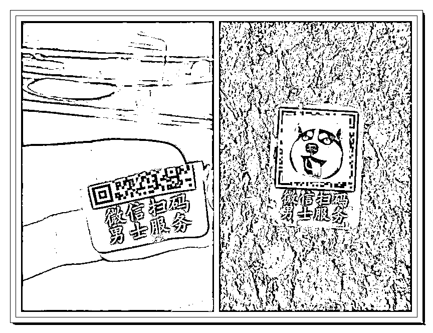
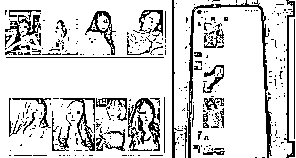

# 微信扫码，男士服务！真好奇什么服务？

> 原文：[`mp.weixin.qq.com/s?__biz=MzIyMDYwMTk0Mw==&mid=2247537020&idx=6&sn=0af348f77d8f6842fb70748bc9de7872&chksm=97cb9a44a0bc135223eb6b82c21908c1fdf45024dd6349fb0bfaf5f04487f87b3072af37a4f3&scene=27#wechat_redirect`](http://mp.weixin.qq.com/s?__biz=MzIyMDYwMTk0Mw==&mid=2247537020&idx=6&sn=0af348f77d8f6842fb70748bc9de7872&chksm=97cb9a44a0bc135223eb6b82c21908c1fdf45024dd6349fb0bfaf5f04487f87b3072af37a4f3&scene=27#wechat_redirect)

好好地停个车 

转悠一圈回来

就在车窗上看到一张

“指甲盖”大小带二维码的小广告

（网友提供）

**“微信扫码 男士服务”**

扫的什么码？服的什么务？

这不由让人浮想联翩

本着“打破砂锅问到底”的劲头

反诈君扫码出现了下图：

二维码所指向的链接失效了 

当然这背后的原因有很多

光从广告语来说

这套路有些像早些年间

频繁出现在酒店门缝里、电线杆上的

特殊服务小广告 

（图片来源网络）

经过城市清理整治之后 

这些“图文并茂”的小广告

渐渐消失在人们的视野中

但这都**2022**年了 

你不会还以为这所谓的“服务”

顶多是“货不对板”的老花样吧

小卡片上印的是千娇百媚

到房里才发现是十级美颜

在一声声“那我走？”的试探中

是多少声“唉”的叹息在挽留

那你可就 OUT 了

要说近些年

众多男同胞遭受到的最“不能言语”的伤 

绝对就是招嫖（约炮）诈骗

实物的、网络的小广告一发 

二维码一扫就加了联络员

漂亮的姑娘选一选

照片用的是网图

位置是虚拟定位

不管你在哪儿想猎艳

都能被精准狩猎

套路升级场景更加文明

再也不是

钱色交易的违法“招嫖”行为

现在是带有自由调调的“约炮”场景

（图片来源网络）

各种来自美丽姑娘要求的 

“人身安全保证金”

“意外伤害保险金”交完

就只剩下怎么也等不着的姑娘了

**后来它升级了**

扫码后是一个 APP 下载链接

下载后就有专门业务员找上门

提出了让人无法拒绝的理由

只要完成任务就能免费哦！

接下来等着你的就是 

没完没了的“刷单”任务

没完没了地投钱注资

以及依然怎么也等不来的姑娘

其实二维码从技术角度来说 

并不危险

真正危险的是

利用二维码引入的空间 

现如今 

越来越多的二维码

被冠之

“兼职刷单、低价购物、色情服务”

出现在大众视野里

扫码后会在点击不明链接时

下载包含病毒、木马或其他恶意软件

可能泄露账号信息

导致用户账号被盗、隐私泄露

甚至是上文提及的遭遇诈骗 

**反诈君想说**

**这类扫码 这类服务**

**可别再好奇了** 

**至于日常的其余陌生二维码**

**如何识别其中风险？**

*   **扫码后要求授权登录与当前场景不符的其他平台，请谨慎操作；**

*   **扫码后需要输入支付密码、账号密码、身份信息等个人隐私的页面，请勿填写和提交；**

*   **如二维码上覆盖有复杂凌乱的线条，大概率是黑产为躲避打击而为，请勿轻信；**

*   **扫码后，如发现需要下载不明文件、视频、软件安装包等，请先核实是否有安全隐患；**

*   **扫码后如跳转到新页面，可以长按并下滑页面，查看域名是否为官方，可以此作为判断依据。**

    **拟稿/小薛 黄萧潇  策划/葛波 审核/周洲 来源：南通反诈** 

********

**← 向右滑动与灰产圈互动交流 →**

****