# 对，我要替这套“色情教材”洗白

> 原文：[`mp.weixin.qq.com/s?__biz=MzIyMDYwMTk0Mw==&mid=2247537099&idx=1&sn=4b128d775c65c012b8220adb6152731d&chksm=97cb9af3a0bc13e5ea55e48b142573187839785923965c40fee7ac41fb2806b023de48f3a80b&scene=27#wechat_redirect`](http://mp.weixin.qq.com/s?__biz=MzIyMDYwMTk0Mw==&mid=2247537099&idx=1&sn=4b128d775c65c012b8220adb6152731d&chksm=97cb9af3a0bc13e5ea55e48b142573187839785923965c40fee7ac41fb2806b023de48f3a80b&scene=27#wechat_redirect)

“毒教科书”，可能是近期最多人关注的话题之一。 

我也一样，没事就搜搜后续。

看到热心网友扒出其它有擦边球嫌疑的绘本，也跟着声讨，气得不轻。

但是，我慢慢发现画风有点不对了。

很多人开始吹毛求疵，把很正常的内容揪出来，大加批判。

听说有名家的书都被迫下架了。

有几本是很优秀的，滋养过一代人的作品。

我心里很不是滋味。

教材确实应该非常谨慎，但如果断章取义、鸡蛋里挑骨头，肯定会错杀很多好东西。

最近有人扒出了这张图片。

**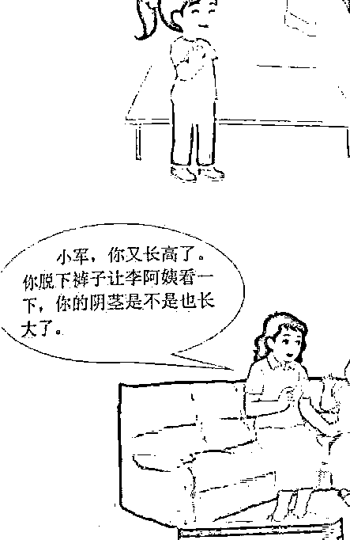**

**你可能会觉得有点儿眼熟。**

**它截自一本叫作《珍爱生命》的性教育教材，几年前就掀起过一波讨论。**

**先是家长喊打。**

**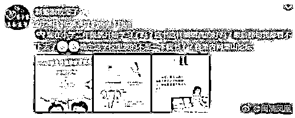**

**营销号的调侃又把它推上风口浪尖。**

****

**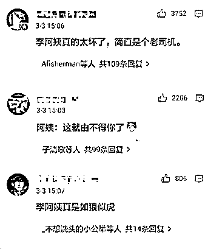**

**一时间，“李阿姨你怎么了”成了网络热梗。**

**这套教材，也在舆论的压力下被迫回收，到今天都没能重见天日。**

****01****

**光看图片中的内容，你可能会以为，这是一本不正规的“野鸡教材”，忍不住想骂它一顿。** 

**先别急。**

**它其实是北师大的研究团队，花费 9 年时间做的一套性教育教材，根正苗红。**

**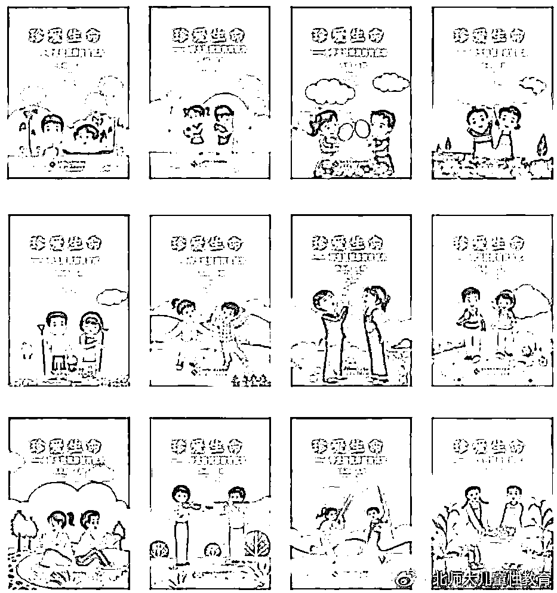**

**如果不是“李阿姨事件”，它曾有机会推广到全国，纳入小学课程体系。**

**但冤就冤在，这张图片，其实是一个大乌龙。**

**截图的人断章取义，故意只放出了李阿姨的“口出狂言”。**

**让看到的人误以为，是教材在传播色情信息。**

**它的原图是这样的。**

****

**本意是教孩子们如何避免熟人性侵，保护自己。**

**但辟谣的时候已经晚了，这套教材已经成了众矢之的。**

**教材中提到的婚姻自由、丁克家庭和性倾向的内容，也受到了争议。**

**当时主要分成了两派。**

**一派人觉得，让小学生了解这类内容，可能会使他们误入歧途。**

**另一派人觉得，这类内容并非“有毒”，孩子们了解后，会对他人更包容，从而避免校园暴力。**

**双方打得不可开交。**

**最后，很多学校承受不住被举报的压力，收回了这套教材。**

**它从此消失在市面上，一套难求。**

****

 **克莱因瓶是一个不可定向的二维紧流形，而球面或轮胎面是可 克莱因瓶 克莱因瓶 定向的二维紧流形。如果观察克莱因瓶，有一点似乎令人困惑－－克莱因瓶的瓶颈和瓶身是相交的，换句话说，瓶颈上的某些点和瓶壁上的某些点占据了三维空间中的同一个位置。我们可以把克莱因瓶放在四维空间中理解：克莱因瓶是一个在四维空间中才可能真正表现出来的曲面。如果我们一定要把它表现在我们生活的三维空间中，我们只好将就点，把它表现得似乎是自己和自己相交一样。克莱因瓶的瓶颈是穿过了第四维空间再和瓶底圈连起来的，并不穿过瓶壁。用扭结来打比方，如果把它看作平面上的曲线的话，那么它似乎自身相交，再一看似乎又断成了三截。但其实很容易明白，这个图形其实是三维空间中的曲线。它并不和自己相交，而是连续不断的一条曲线。在平面上一条曲线自然做不到这样，但是如果有第三维的话，它就可以穿过第三维来避开和自己相交。只是因为我们要把它画在二维平面上时，只好将就一点，把它画成相交或者断裂了的样子。克莱因瓶也一样，我们可以把它理解成处于四维空间中的曲面。在我们这个三维空间中，即使是最高明的能工巧匠，也不得不把它做成自身相交的模样；就好像最高明的画家，在纸上画扭结的时候也不得不把它们画成自身相交的模样。有趣的是，如果把克莱因瓶沿着它的对称线切下去，竟会得到两个莫比乌斯环。在二维看似穿过自身的绳子 在二维看似穿过自身的绳子 如果莫比乌斯带能够完美的展现一个“二维空间中一维可无限扩展之空间模型”的话，克莱因瓶只能作为展现一个“三维空间中二维可无限扩展之空间模型”的参考。因为在制作莫比乌斯带的过程中，我们要对纸带进行 180°翻转再首尾相连，这就是一个三维空间下的操作。理想的“三维空间中二维可无限扩展之空间模型”应该是在二维面中，朝任意方向前进都可以回到原点的模型，而克莱因瓶虽然在二维面上可以向任意方向无限前进。但是只有在两个特定的方向上才会回到原点，并且只有在其中一个方向上，回到原点之前会经过一个“逆向原点”，真正理想的“三维空间中二维可无限扩展之空间模型”也应该是在二维面上朝任何方向前进，都会先经过一次“逆向原点”，再回到原点。而制作这个模型，则需要在四维空间上对三维模型进行扭曲。数学中有一个重要分支叫“拓扑学”，主要是研究几何图形连续改变形状时的一些特征和规律的，克莱因瓶和莫比乌斯带变成了拓扑学中最有趣的问题之一。莫比乌斯带的概念被广泛地应用到了建筑，艺术，工业生产中。三维空间里的克莱因瓶 拓扑学的定义编辑 克莱因瓶定义为正方形区域 [0,1]×[0,1] 模掉等价关系(0,y)~(1,y), 0≤y≤1 和 (x,0)~(1-x,1), 0≤x≤1。类似于 Mobius Band, 克莱因瓶不可定向。但 Mobius 带可嵌入   ，而克莱因瓶只能嵌入四维（或更高维）空间。莫比乌斯带编辑 把一条纸带的一段扭 180°，再和另一端粘起来就得到一条莫比乌斯带的模型。这也是一个只有莫比乌斯带、一个面的曲面，但是和球面、轮胎面和克莱因瓶不同的是，它有边（注意，它只有一条边）。如果我们把两条莫比乌斯带沿着它们唯一的边粘合起来，你就得到了一个克莱因瓶 莫比乌斯带 莫比乌斯带 （当然不要忘了，我们必须在四维空间中才能真正有可能完成这个粘合，否则的话就不得不把纸撕破一点）。同样地，如果把一个克莱因瓶适当地剪开来，我们就能得到两条莫比乌斯带。除了我们上面看到的克莱因瓶的模样，还有一种不太为人所知的“8 字形”克莱因瓶。它看起来和上面的曲面完全不同，但是在四维空间中它们其实就是同一个曲面－－克莱因瓶。实际上，可以说克莱因瓶是一个 3°的莫比乌斯带。我们知道，在平面上画一个圆，再在圆内放一样东西，假如在二度空间中将它拿出来，就不得不越过圆周。但在三度空间中，很容易不越过圆周就将其拿出来，放到圆外。将物体的轨迹连同原来的圆投影到二度空间中，就是一个“二维克莱因瓶”，即莫比乌斯带（这里的莫比乌斯带是指拓扑意义上的莫比乌斯带）。再设想一下，在我们的 3°空间中，不可能在不打破蛋壳的前提下从鸡蛋中取出蛋黄，但在四度空间里却可以。将蛋黄的轨迹连同蛋壳投影在三度空间中，必然可以看到一个克莱因瓶。制造经历编辑 过去，德国数学家克莱因就曾提出了“不可能”设想，即拓扑学的大怪物－－克莱因瓶。这种瓶子根本没有内、外之分，无论从什么地方穿透曲面，到达之处依然在瓶的外面，所以，它本质上就是一个“有外无内”的古怪东西。尽管现代玻璃工业已经发展得非常先进，但是，所谓的“克莱因瓶”却始终是大数学家克莱因先生脑子里头的“虚构物”，根本制造不出来。许多国家的数学家老是想造它一个出来，作为献给国际数学家大会的礼物。然而，等待他们的是一个失败接着一个失败。也有人认为，即使造不出玻璃制品，能造出一个纸模型也不错。如果真的解决了这个问题，那可是个大收获！直径和年龄 最新的研究认为宇宙的直径可 920 亿光年，甚至更大。[28] 目前可观测的宇宙年龄大约为 138.2 亿年。[29] 形状 宇宙微波背景的温度一端高，暗示呈弯曲状 宇宙微波背景的温度一端高，暗示呈弯曲状 [30] 目前的宇宙理论认为宇宙可能是类似马鞍状的负弯曲形状，该理论源于宇宙大爆炸理论，整个宇宙的外形如同一个吹起的气球，我们则生活在宇宙的“表面”。[31] 同时，科学家也认为宇宙是平坦的，根据美国宇航局的调查，宇宙可能是平坦的，2013 年的调查发现如果宇宙是平坦的，那么误差只有 0.4%。[32] 斯蒂芬·霍金表示，我们宇宙的形状可能是一种难以置信的几何图形，更接近于超现实主义的艺术，如同荷兰艺术家摩里茨·科奈里斯·埃舍尔创 银河系 银河系 [33] 作的图形一样。霍金的想法以弦理论为依据，而该理论目前仍然还处于假设之中，并未被验证。如果用语言来形容宇宙的形状，应该是整体呈现多重镶嵌模式，具有无限重复出现的扭曲面，曲面间环环相扣，如同科奈里斯·埃舍尔创作的“圆形极限 IV”图案，也与美国工程师 P.H. Smith 创作的“史密斯圆图”类似，体现出双曲空间的概念，是一种非欧几何的空间形态。[34] 层次结构 当代天文学研究成果表明，宇宙是有层次结构的、 即将发生碰撞的两个星系 NGC 470 和 NGC 474 即将发生碰撞的两个星系 NGC 470 和 NGC 474 [35] 不断膨胀、物质形态多样的、不断运动发展的天体系统。行星、小行星、彗星和流星体都围绕中心天体太阳运转，构成太阳系。太阳系外也存在其他行星系统。约 2500 亿颗类似太阳的恒星和星际物质构成更巨大的天体系统——银河系。银河系的直径约 10 万光年，太阳位于银河系的一个旋臂中，距银心约 2.6 万光年。银河系外还有许多类似的天体系统，称为河外星系，常简称星系。目前观测到 1000 亿个星系，科学家估计宇宙中至少有 2 万亿个星系。星系聚集成大大小小的集团，叫星系团。平均而言，每个星系团约有百余个星系，直径达上千万光年。现已发现上万个星系团。包括银河系在内约 40 个星系构成的一个小星系团叫本星系群。椭圆星系 Hercules A 中心超大黑洞引发的喷流 椭圆星系 Hercules A 中心超大黑洞引发的喷流 [36] 若干星系团集聚在一起构成的更高一层次的天体系统叫超星系团。超星系团往往具有扁长的外形，其长径可达数亿光年。通常超星系团内只含有几个星系团，只有少数超星系团拥有几十个星系团。本星系群和其附近的约 50 个星系团构成的超星系团叫做本超星系团。星系分类 根据可反映星系发展状态的序列号对星系进行了分类，可以粗略地将星系划分出椭圆星系、透镜星系、漩涡星系、棒旋星系和不规则星系等五种。[37] 太阳系天体 太阳质量占太阳系总质量的 99.86%，它以自己强大的引力将 NASA 公布的太阳风暴的照片 NASA 公布的太阳风暴的照片 [38] 太阳系里的所有天体牢牢地吸引在它的周围，使它们不离不散、井然有序地绕自己旋转。同时，太阳又作为一颗普通恒星，带领它的成员，万古不息地绕银河系的中心运动。[39]  太阳的半径为 696000 千米，质量为 1.989×10³⁰kg，中心温度约 15000000 ℃，。[40]  如果一个人站在太阳表面，那么他的体重将会是在地球上的 20 倍。[41]  现代星云假说根据观测资料和理论计算，提出：太阳系原始星云是巨大的星际云瓦解的一个小云，一开始就在自转，并在自身引力作用下收缩，中心部分形成太阳，外部演化成星云盘，星云盘以后形成行星。目前，现代星云说又存在不同学派，这些学派之间还存在着许多差别，有待进一步研究和证实。[42] 金星是离太阳的第二颗行星，夜空中亮度仅次于月球。[43]  金星上没有水，大气中严重缺氧，二氧化碳占 97%以上，空气中有一层厚达 20 千米至 30 千米的浓硫酸云，地面温度从不低于 400℃，是个名副其实的“炼狱”般世界。金星地面的大气压强为地球的 90 倍，相当于地球海洋中 900 米深度时的压强。金星大气主要由二氧化碳等温室气体组成，失控的温室效应，是导致金星极端气候的主要原因。由于金星没有内禀磁层保护，诱发磁层中磁场重联释放的巨大能量，使得金星大气被加热后加速逃逸。科学界认为，金星上大气的逃逸，是造成金星上缺水而被富含二氧化碳的稠密大气所笼罩，从而导致严重的温室效应的原因。[44] 木星是离太阳第五颗行星，而且是最大的一颗，比所有其他的行星 木星及其卫星欧罗巴（木卫二） 木星及其卫星欧罗巴（木卫二） [45] 的合质量大 2 倍（地球的 318 倍），直径 142987km。它是气态行星没有实体表面，由 90%的氢和 10%的氦（原子数之比, 75/25%的质量比）及微量的甲烷、水、氨水和“石头”组成。这与形成整个太阳系的原始的太阳系星云的组成十分相似。木星可能有一个石质的内核，相当于 10－15 个地球的质量。内核上则是大部分的行星物质集结地，以液态氢的形式存在。液态金属氢由离子化的质子与电子组成（类似于太阳的内部，不过温度低多了）。木星共有 67 颗木卫。按距离木星中心由近及远的次序为：木卫十六、木卫十四、木卫五、木卫十五、木卫一、木卫二、木卫三、木卫四、木卫十三、木卫六、木卫十、木卫七、木卫十二、木卫十一、木卫八和木卫九。[46] 水星是最接近太阳的行星。水星的半径约为 2440 公里，在八大行星中是最小的。水星昼夜温差极大，白天摄氏 430 度，晚上约可达零下 170 度，是太阳系八大行星中温差最大的一个行星。[47]  水星的外大气层非常稀薄，是由水星表面和太阳风中的原子和离子构成。[48]  科学家确认水星表面含有丰富的碳，认为碳是水星表面呈黑色的原因，水星表面的岩石是由低重量百分比的石墨碳构成。[49] “好奇号”火星探测器在火星表面采集样本 “好奇号”火星探测器在火星表面采集样本 [50] 火星是地球的近邻，是太阳系由内往外数第四颗行星。直径 6794km，体积为地球的 15%，质量为地球的 11%。火星表面是一个荒凉的世界，空气中二氧化碳占了 95%。火星大气十分稀薄，密度还不到地球大气的 1%，因而根本无法保存热量。这导致火星表面温度极低，很少超过 0℃，在夜晚，最低温度则可达到-123℃。火星被称为红色的行星，这是因为它表面布满了氧化物，因而呈现出铁锈红色。其表面的大部分地区都是含有大量的红色氧化物的大沙漠，还有赭色的砾石地和凝固的熔岩流。火星上常常有猛烈的大风，大风扬起沙尘能形成可以覆盖火星全球的特大型沙尘暴。每次沙尘暴可持续数个星期。火星两极的冰冠和火星大气中含有水份。从火星表面获得的探测数据证明，在远古时期，火星曾经有过液态的水，而且水量特别大。[51] 土星是离太阳第六颗行星，直径 120536㎞，体积仅次于木星。主要由氢组成，还有少量的氦与微量元素，内部的核心包括岩石和冰，外围由数层金属氢和气体包裹着。地球距离土星 13 亿公里。土星的引力比地球强 2.5 倍，能够牵引太阳系内其它行星，使地球处于一个椭圆轨道中运行，并且与太阳保持适当距离，适宜生命繁衍。当土星轨道倾斜 20 度将使地球轨道比金星轨道更接近太阳，同时，这将导致火星完全离开太阳系。[52]  土星是已知唯一密度小于水的行星，假如能够将土星放入一个巨大的浴池之中，它将可以漂浮起来。土星有一个巨大的磁气圈和一个狂风肆虐的大气层，赤道附近的风速可达 1800 千米/时。在环绕土星运行的 31 颗卫星中间，土卫六是最大的一颗，比水星和月球还大，也是太阳系中唯一拥有浓厚大气层的卫星。[53] 天王星是离太阳第七颗行星，51118km。体积约为地球的 65 倍，在九大行星中仅次于木星和土星。天王星的大气层中 83%是氢，15%为氦，2%为甲烷以及少量的乙炔和碳氢化合物。上层大气层的甲烷吸收红光，使天王星呈现蓝绿色。大气在固定纬度集结成云层，类似于木星和土星在纬线上鲜艳的条状色带。天王星云层的平均温度为零下 193 摄氏度。质量为 8.6810±13×10²⁵kg，相当于地球质量的 14.63 倍。密度较小，只有 1.24 克/立方厘米，为海王星密度值的 74.7%。[54] 恒星 恒星 海王星是离太阳的第八颗行星，直径 49532 千米。海王星绕太阳运转的轨道半径为 45 亿千米，公转一周需要 165 年。海王星的直径和天王星类似，质量比天王星略大一些。海王星和天王星的主要大气成分都是氢和氦，内部结构也极为相近，所以说海王星与天王星是一对孪生兄弟。[55]  海王星有太阳系最强烈的风，测量到的时速高达 2100 公里。海王星云顶的温度是－218 °C，是太阳系最冷的地区之一。海王星核心的温度约为 7000 °C，可以和太阳的表面比较。海王星在 1846 年 9 月 23 日被发现，是唯一利用数学预测而非有计划的观测发现的行星。[56] 冥王星，位于海王星以外的柯伊伯带内侧，是柯伊伯带中已知的最大天体。[57]  直径约为 2370±20km，是地球直径的 18.5%。[58] 2006 年 8 月 24 日，国际天文学联合会大会 24 日投票决定，不再将传统九大行星之一的冥王星视为行星，而将其列入“矮行星”。大会通过的决议规定，“行星”指的是围绕太阳运转、自身引力足以克服其刚体力而使天体呈圆球状、能够清除其轨道附近其他物体的天体。在太阳系传统的“九大行星”中，只有水星、金星、地球、火星、木星、土星、天王星和海王星符合这些要求。冥王星由于其轨道与海王星的轨道相交，不符合新的行星定义，因此被自动降级为“矮行星”。[59]  冥王星的表面温度大概在-238 到-228℃之间。冥王星的成份由 70%岩石和 30%冰水混合而成的。地表上光亮的部分可能覆盖着一些固体氮以及少量 卫星拍月球经过地球，可见清晰月球背面 卫星拍月球经过地球，可见清晰月球背面 [60] 的固体甲烷和一氧化碳，冥王星表面的黑暗部分可能是一些基本的有机物质或是由宇宙射线引发的光化学反应。冥王星的大气层主要由氮和少量的一氧化碳及甲烷组成。大气极其稀薄，地面压强只有少量微帕。[61] 地球是离太阳第三颗行星，是我们人类的家乡，尽管地球是太阳系中一颗普通的行星，但它在许多方面都是独一无二的。比如，它是太阳系中唯一一颗面积大部分被水覆盖的行星，也是目前所知唯一一颗有生命存在的星球。质量 M=5.9742 ×10²⁴ 公斤，表面温度：t = - 30 ～ +45。[62]  英国科研人员在《天体生物学》杂志上报告说，如果没有小行星撞击等可能剧烈改变环境的事件发生，地球适宜人类居住的时间还剩约 17.5 亿年，不过人为造成的气候变化可能缩短这一时间。[63] 彗星是由灰尘和冰块组成的太阳系中的一类小天体，绕日运动。[64]  科学家使用探测器对彗星的化学遗留物进行分析，发现其主要成份为氨、甲烷、硫化氢、氰化氢和甲醛。科学家得出结论称，彗星的气味闻起来像是臭鸡蛋、马尿、酒精和苦杏仁的气味综合。[65-66] “67P/楚留莫夫-格拉希门克”彗星 “67P/楚留莫夫-格拉希门克”彗星 [67] 在太阳系的周围还包裹着一个庞大的“奥尔特云”。星云内分布着不计其数的冰块、雪团和碎石。其中的某些会受太阳引力影响飞入内太阳系，这就是彗星。这些冰块、雪团和碎石进入太阳系内部，其表面因受太阳风的吹拂而开始挥发。所以彗星都拖着一条长长的尾巴，而且越靠近太阳尾巴越长、越明显。太阳系内的星际空间并不是真空的，而是充满了各种粒子、射线、气体和尘埃。[68] 柯伊伯带，是一种理论推测认为短周期彗星是来自离太阳 50—500 天文单位的一个环带，位于太阳系的尽头。柯伊伯带是冰质残片组成的巨环，位于海王星轨道之外，环绕着太阳系的外边缘。[69] 物质多样性 红巨星，当一颗恒星度过它漫长的青壮年期——主序星阶段，步入老年期时，它将首先变为一颗红巨星。称它为“巨星”，是突出它的体积巨大。在巨星阶段，恒星的体积将膨胀到十亿倍之多。称它为“红”巨星，是因为在这恒星迅速膨胀的同时，它的外表面离中心越来越远，所以温度将随之而降低，发出的光也就越来越偏红。不过，虽然温度降低了一些，可红巨星的体积是如此之大，它的光度也变得很大，极为明亮。红巨星一旦形成，就朝恒星的下一阶段白矮星进发。[70] 白矮星，是一种低光度、高密度、高温度的恒星。因为颜色呈白色、体积比较矮小，因此被命名为白矮星。哈勃望远镜观测到白矮星死亡过程 哈勃望远镜观测到白矮星死亡过程 [71] 白矮星是一种很特殊的天体，它的体积小、亮度低，但质量大、密度极高。白矮星是中低质量的恒星的演化路线的终点。在红巨星阶段的末期，恒星的中心会因为温度、压力不足或者核聚变达到铁阶段而停止产生能量。恒星外壳的重力会压缩恒星产生一个高密度的天体。一个典型的稳定独立白矮星具有大约半个太阳质量，比地球略大。这种密度仅次于中子星和夸克星。如果白矮星的质量超过 1.4 倍太阳质量，那么原子核之间的电荷斥力不足以对抗重力，电子会被压入原子核而形成中子星。原子是由原子核和电子组成的，原子的质量绝大部分集中在原子核上，在巨大的压力之下，电子将脱离原子核，成自由电子。这种自由电子气体将尽可能地占据原子核之间的空隙，从而使单位空间内包含的物质也将大大增多，密度大大提高了。形象地说，这时原子核是“沉浸于”电子中，常称之为“简并态”。[72]  大多数的恒星内核通过氢核聚变进行燃烧，将质量转变为能量，并产生光和热量，当恒星内部氢燃料完成消耗完后就开始进行氦融合反应，并形成更重的碳和氧，这一过程对于类似太阳这样的恒星而言，就显得较为短暂，并形成碳氧组成的白矮星，如果其质量大于 1.4 倍太阳质量，就会发生 Ia 型超新星爆发。[73] 类星体,20 世纪 60 年代以来，天文学家还找到一种在银河系以外像恒星一样表现为一个光点的天体，但实际上它的光度和质量又和星系一样，我们叫它类星体，现在已发现了数千个这种天体。[74] 超新星，是恒星演化过程中的一个阶段。超新星爆发是某些恒星在演化接近末期时经历的一种剧烈爆炸。一般认为质量小于 9 倍太阳质量左右的恒星，在经历引力坍缩的过程后是无法形成超新星的。[75]  在大质量恒星演化到晚期，内部不能产生新的能量，巨大的引力将整个星体迅速向中心坍缩，将中心物质都压成中子状态，形成中子星，而外层下坍的物质遇到这坚硬的“中子核”反弹引起爆炸。这就成为超新星爆发，质量更大时，中心更可形成黑洞。[76]  在超新星爆发的过程中所释放的能量，需要我们的太阳燃烧 900 亿年才能与之相当。[77]  超新星研究有着关乎人类自身命运的深层意义。如果一颗超新星爆发的位置非常接近地球，目前国际天文学界普遍认为此距离在 100 光年以内，它就能够对地球的生物圈产生明显的影响，这样的超新星被称为近地超新星。有研究认为，在地球历史上的奥陶纪大灭绝，就是一颗近地超新星引起的，这次灭绝导致当时地球近 60%的海洋生物消失。[78]** 

**克莱因瓶是一个不可定向的二维紧流形，而球面或轮胎面是**

 **克莱因瓶是一个不可定向的二维紧流形，而球面或轮胎面是可 克莱因瓶 克莱因瓶 定向的二维紧流形。如果观察克莱因瓶，有一点似乎令人困惑－－克莱因瓶的瓶颈和瓶身是相交的，换句话说，瓶颈上的某些点和瓶壁上的某些点占据了三维空间中的同一个位置。我们可以把克莱因瓶放在四维空间中理解：克莱因瓶是一个在四维空间中才可能真正表现出来的曲面。如果我们一定要把它表现在我们生活的三维空间中，我们只好将就点，把它表现得似乎是自己和自己相交一样。克莱因瓶的瓶颈是穿过了第四维空间再和瓶底圈连起来的，并不穿过瓶壁。用扭结来打比方，如果把它看作平面上的曲线的话，那么它似乎自身相交，再一看似乎又断成了三截。但其实很容易明白，这个图形其实是三维空间中的曲线。它并不和自己相交，而是连续不断的一条曲线。在平面上一条曲线自然做不到这样，但是如果有第三维的话，它就可以穿过第三维来避开和自己相交。只是因为我们要把它画在二维平面上时，只好将就一点，把它画成相交或者断裂了的样子。克莱因瓶也一样，我们可以把它理解成处于四维空间中的曲面。在我们这个三维空间中，即使是最高明的能工巧匠，也不得不把它做成自身相交的模样；就好像最高明的画家，在纸上画扭结的时候也不得不把它们画成自身相交的模样。有趣的是，如果把克莱因瓶沿着它的对称线切下去，竟会得到两个莫比乌斯环。在二维看似穿过自身的绳子 在二维看似穿过自身的绳子 如果莫比乌斯带能够完美的展现一个“二维空间中一维可无限扩展之空间模型”的话，克莱因瓶只能作为展现一个“三维空间中二维可无限扩展之空间模型”的参考。因为在制作莫比乌斯带的过程中，我们要对纸带进行 180°翻转再首尾相连，这就是一个三维空间下的操作。理想的“三维空间中二维可无限扩展之空间模型”应该是在二维面中，朝任意方向前进都可以回到原点的模型，而克莱因瓶虽然在二维面上可以向任意方向无限前进。但是只有在两个特定的方向上才会回到原点，并且只有在其中一个方向上，回到原点之前会经过一个“逆向原点”，真正理想的“三维空间中二维可无限扩展之空间模型”也应该是在二维面上朝任何方向前进，都会先经过一次“逆向原点”，再回到原点。而制作这个模型，则需要在四维空间上对三维模型进行扭曲。数学中有一个重要分支叫“拓扑学”，主要是研究几何图形连续改变形状时的一些特征和规律的，克莱因瓶和莫比乌斯带变成了拓扑学中最有趣的问题之一。莫比乌斯带的概念被广泛地应用到了建筑，艺术，工业生产中。三维空间里的克莱因瓶 拓扑学的定义编辑 克莱因瓶定义为正方形区域 [0,1]×[0,1] 模掉等价关系(0,y)~(1,y), 0≤y≤1 和 (x,0)~(1-x,1), 0≤x≤1。类似于 Mobius Band, 克莱因瓶不可定向。但 Mobius 带可嵌入   ，而克莱因瓶只能嵌入四维（或更高维）空间。莫比乌斯带编辑 把一条纸带的一段扭 180°，再和另一端粘起来就得到一条莫比乌斯带的模型。这也是一个只有莫比乌斯带、一个面的曲面，但是和球面、轮胎面和克莱因瓶不同的是，它有边（注意，它只有一条边）。如果我们把两条莫比乌斯带沿着它们唯一的边粘合起来，你就得到了一个克莱因瓶 莫比乌斯带 莫比乌斯带 （当然不要忘了，我们必须在四维空间中才能真正有可能完成这个粘合，否则的话就不得不把纸撕破一点）。同样地，如果把一个克莱因瓶适当地剪开来，我们就能得到两条莫比乌斯带。除了我们上面看到的克莱因瓶的模样，还有一种不太为人所知的“8 字形”克莱因瓶。它看起来和上面的曲面完全不同，但是在四维空间中它们其实就是同一个曲面－－克莱因瓶。实际上，可以说克莱因瓶是一个 3°的莫比乌斯带。我们知道，在平面上画一个圆，再在圆内放一样东西，假如在二度空间中将它拿出来，就不得不越过圆周。但在三度空间中，很容易不越过圆周就将其拿出来，放到圆外。将物体的轨迹连同原来的圆投影到二度空间中，就是一个“二维克莱因瓶”，即莫比乌斯带（这里的莫比乌斯带是指拓扑意义上的莫比乌斯带）。再设想一下，在我们的 3°空间中，不可能在不打破蛋壳的前提下从鸡蛋中取出蛋黄，但在四度空间里却可以。将蛋黄的轨迹连同蛋壳投影在三度空间中，必然可以看到一个克莱因瓶。制造经历编辑 过去，德国数学家克莱因就曾提出了“不可能”设想，即拓扑学的大怪物－－克莱因瓶。这种瓶子根本没有内、外之分，无论从什么地方穿透曲面，到达之处依然在瓶的外面，所以，它本质上就是一个“有外无内”的古怪东西。尽管现代玻璃工业已经发展得非常先进，但是，所谓的“克莱因瓶”却始终是大数学家克莱因先生脑子里头的“虚构物”，根本制造不出来。许多国家的数学家老是想造它一个出来，作为献给国际数学家大会的礼物。然而，等待他们的是一个失败接着一个失败。也有人认为，即使造不出玻璃制品，能造出一个纸模型也不错。如果真的解决了这个问题，那可是个大收获！直径和年龄 最新的研究认为宇宙的直径可 920 亿光年，甚至更大。[28] 目前可观测的宇宙年龄大约为 138.2 亿年。[29] 形状 宇宙微波背景的温度一端高，暗示呈弯曲状 宇宙微波背景的温度一端高，暗示呈弯曲状 [30] 目前的宇宙理论认为宇宙可能是类似马鞍状的负弯曲形状，该理论源于宇宙大爆炸理论，整个宇宙的外形如同一个吹起的气球，我们则生活在宇宙的“表面”。[31] 同时，科学家也认为宇宙是平坦的，根据美国宇航局的调查，宇宙可能是平坦的，2013 年的调查发现如果宇宙是平坦的，那么误差只有 0.4%。[32] 斯蒂芬·霍金表示，我们宇宙的形状可能是一种难以置信的几何图形，更接近于超现实主义的艺术，如同荷兰艺术家摩里茨·科奈里斯·埃舍尔创 银河系 银河系 [33] 作的图形一样。霍金的想法以弦理论为依据，而该理论目前仍然还处于假设之中，并未被验证。如果用语言来形容宇宙的形状，应该是整体呈现多重镶嵌模式，具有无限重复出现的扭曲面，曲面间环环相扣，如同科奈里斯·埃舍尔创作的“圆形极限 IV”图案，也与美国工程师 P.H. Smith 创作的“史密斯圆图”类似，体现出双曲空间的概念，是一种非欧几何的空间形态。[34] 层次结构 当代天文学研究成果表明，宇宙是有层次结构的、 即将发生碰撞的两个星系 NGC 470 和 NGC 474 即将发生碰撞的两个星系 NGC 470 和 NGC 474 [35] 不断膨胀、物质形态多样的、不断运动发展的天体系统。行星、小行星、彗星和流星体都围绕中心天体太阳运转，构成太阳系。太阳系外也存在其他行星系统。约 2500 亿颗类似太阳的恒星和星际物质构成更巨大的天体系统——银河系。银河系的直径约 10 万光年，太阳位于银河系的一个旋臂中，距银心约 2.6 万光年。银河系外还有许多类似的天体系统，称为河外星系，常简称星系。目前观测到 1000 亿个星系，科学家估计宇宙中至少有 2 万亿个星系。星系聚集成大大小小的集团，叫星系团。平均而言，每个星系团约有百余个星系，直径达上千万光年。现已发现上万个星系团。包括银河系在内约 40 个星系构成的一个小星系团叫本星系群。椭圆星系 Hercules A 中心超大黑洞引发的喷流 椭圆星系 Hercules A 中心超大黑洞引发的喷流 [36] 若干星系团集聚在一起构成的更高一层次的天体系统叫超星系团。超星系团往往具有扁长的外形，其长径可达数亿光年。通常超星系团内只含有几个星系团，只有少数超星系团拥有几十个星系团。本星系群和其附近的约 50 个星系团构成的超星系团叫做本超星系团。星系分类 根据可反映星系发展状态的序列号对星系进行了分类，可以粗略地将星系划分出椭圆星系、透镜星系、漩涡星系、棒旋星系和不规则星系等五种。[37] 太阳系天体 太阳质量占太阳系总质量的 99.86%，它以自己强大的引力将 NASA 公布的太阳风暴的照片 NASA 公布的太阳风暴的照片 [38] 太阳系里的所有天体牢牢地吸引在它的周围，使它们不离不散、井然有序地绕自己旋转。同时，太阳又作为一颗普通恒星，带领它的成员，万古不息地绕银河系的中心运动。[39]  太阳的半径为 696000 千米，质量为 1.989×10³⁰kg，中心温度约 15000000 ℃，。[40]  如果一个人站在太阳表面，那么他的体重将会是在地球上的 20 倍。[41]  现代星云假说根据观测资料和理论计算，提出：太阳系原始星云是巨大的星际云瓦解的一个小云，一开始就在自转，并在自身引力作用下收缩，中心部分形成太阳，外部演化成星云盘，星云盘以后形成行星。目前，现代星云说又存在不同学派，这些学派之间还存在着许多差别，有待进一步研究和证实。[42] 金星是离太阳的第二颗行星，夜空中亮度仅次于月球。[43]  金星上没有水，大气中严重缺氧，二氧化碳占 97%以上，空气中有一层厚达 20 千米至 30 千米的浓硫酸云，地面温度从不低于 400℃，是个名副其实的“炼狱”般世界。金星地面的大气压强为地球的 90 倍，相当于地球海洋中 900 米深度时的压强。金星大气主要由二氧化碳等温室气体组成，失控的温室效应，是导致金星极端气候的主要原因。由于金星没有内禀磁层保护，诱发磁层中磁场重联释放的巨大能量，使得金星大气被加热后加速逃逸。科学界认为，金星上大气的逃逸，是造成金星上缺水而被富含二氧化碳的稠密大气所笼罩，从而导致严重的温室效应的原因。[44] 木星是离太阳第五颗行星，而且是最大的一颗，比所有其他的行星 木星及其卫星欧罗巴（木卫二） 木星及其卫星欧罗巴（木卫二） [45] 的合质量大 2 倍（地球的 318 倍），直径 142987km。它是气态行星没有实体表面，由 90%的氢和 10%的氦（原子数之比, 75/25%的质量比）及微量的甲烷、水、氨水和“石头”组成。这与形成整个太阳系的原始的太阳系星云的组成十分相似。木星可能有一个石质的内核，相当于 10－15 个地球的质量。内核上则是大部分的行星物质集结地，以液态氢的形式存在。液态金属氢由离子化的质子与电子组成（类似于太阳的内部，不过温度低多了）。木星共有 67 颗木卫。按距离木星中心由近及远的次序为：木卫十六、木卫十四、木卫五、木卫十五、木卫一、木卫二、木卫三、木卫四、木卫十三、木卫六、木卫十、木卫七、木卫十二、木卫十一、木卫八和木卫九。[46] 水星是最接近太阳的行星。水星的半径约为 2440 公里，在八大行星中是最小的。水星昼夜温差极大，白天摄氏 430 度，晚上约可达零下 170 度，是太阳系八大行星中温差最大的一个行星。[47]  水星的外大气层非常稀薄，是由水星表面和太阳风中的原子和离子构成。[48]  科学家确认水星表面含有丰富的碳，认为碳是水星表面呈黑色的原因，水星表面的岩石是由低重量百分比的石墨碳构成。[49] “好奇号”火星探测器在火星表面采集样本 “好奇号”火星探测器在火星表面采集样本 [50] 火星是地球的近邻，是太阳系由内往外数第四颗行星。直径 6794km，体积为地球的 15%，质量为地球的 11%。火星表面是一个荒凉的世界，空气中二氧化碳占了 95%。火星大气十分稀薄，密度还不到地球大气的 1%，因而根本无法保存热量。这导致火星表面温度极低，很少超过 0℃，在夜晚，最低温度则可达到-123℃。火星被称为红色的行星，这是因为它表面布满了氧化物，因而呈现出铁锈红色。其表面的大部分地区都是含有大量的红色氧化物的大沙漠，还有赭色的砾石地和凝固的熔岩流。火星上常常有猛烈的大风，大风扬起沙尘能形成可以覆盖火星全球的特大型沙尘暴。每次沙尘暴可持续数个星期。火星两极的冰冠和火星大气中含有水份。从火星表面获得的探测数据证明，在远古时期，火星曾经有过液态的水，而且水量特别大。[51] 土星是离太阳第六颗行星，直径 120536㎞，体积仅次于木星。主要由氢组成，还有少量的氦与微量元素，内部的核心包括岩石和冰，外围由数层金属氢和气体包裹着。地球距离土星 13 亿公里。土星的引力比地球强 2.5 倍，能够牵引太阳系内其它行星，使地球处于一个椭圆轨道中运行，并且与太阳保持适当距离，适宜生命繁衍。当土星轨道倾斜 20 度将使地球轨道比金星轨道更接近太阳，同时，这将导致火星完全离开太阳系。[52]  土星是已知唯一密度小于水的行星，假如能够将土星放入一个巨大的浴池之中，它将可以漂浮起来。土星有一个巨大的磁气圈和一个狂风肆虐的大气层，赤道附近的风速可达 1800 千米/时。在环绕土星运行的 31 颗卫星中间，土卫六是最大的一颗，比水星和月球还大，也是太阳系中唯一拥有浓厚大气层的卫星。[53] 天王星是离太阳第七颗行星，51118km。体积约为地球的 65 倍，在九大行星中仅次于木星和土星。天王星的大气层中 83%是氢，15%为氦，2%为甲烷以及少量的乙炔和碳氢化合物。上层大气层的甲烷吸收红光，使天王星呈现蓝绿色。大气在固定纬度集结成云层，类似于木星和土星在纬线上鲜艳的条状色带。天王星云层的平均温度为零下 193 摄氏度。质量为 8.6810±13×10²⁵kg，相当于地球质量的 14.63 倍。密度较小，只有 1.24 克/立方厘米，为海王星密度值的 74.7%。[54] 恒星 恒星 海王星是离太阳的第八颗行星，直径 49532 千米。海王星绕太阳运转的轨道半径为 45 亿千米，公转一周需要 165 年。海王星的直径和天王星类似，质量比天王星略大一些。海王星和天王星的主要大气成分都是氢和氦，内部结构也极为相近，所以说海王星与天王星是一对孪生兄弟。[55]  海王星有太阳系最强烈的风，测量到的时速高达 2100 公里。海王星云顶的温度是－218 °C，是太阳系最冷的地区之一。海王星核心的温度约为 7000 °C，可以和太阳的表面比较。海王星在 1846 年 9 月 23 日被发现，是唯一利用数学预测而非有计划的观测发现的行星。[56] 冥王星，位于海王星以外的柯伊伯带内侧，是柯伊伯带中已知的最大天体。[57]  直径约为 2370±20km，是地球直径的 18.5%。[58] 2006 年 8 月 24 日，国际天文学联合会大会 24 日投票决定，不再将传统九大行星之一的冥王星视为行星，而将其列入“矮行星”。大会通过的决议规定，“行星”指的是围绕太阳运转、自身引力足以克服其刚体力而使天体呈圆球状、能够清除其轨道附近其他物体的天体。在太阳系传统的“九大行星”中，只有水星、金星、地球、火星、木星、土星、天王星和海王星符合这些要求。冥王星由于其轨道与海王星的轨道相交，不符合新的行星定义，因此被自动降级为“矮行星”。[59]  冥王星的表面温度大概在-238 到-228℃之间。冥王星的成份由 70%岩石和 30%冰水混合而成的。地表上光亮的部分可能覆盖着一些固体氮以及少量 卫星拍月球经过地球，可见清晰月球背面 卫星拍月球经过地球，可见清晰月球背面 [60] 的固体甲烷和一氧化碳，冥王星表面的黑暗部分可能是一些基本的有机物质或是由宇宙射线引发的光化学反应。冥王星的大气层主要由氮和少量的一氧化碳及甲烷组成。大气极其稀薄，地面压强只有少量微帕。[61] 地球是离太阳第三颗行星，是我们人类的家乡，尽管地球是太阳系中一颗普通的行星，但它在许多方面都是独一无二的。比如，它是太阳系中唯一一颗面积大部分被水覆盖的行星，也是目前所知唯一一颗有生命存在的星球。质量 M=5.9742 ×10²⁴ 公斤，表面温度：t = - 30 ～ +45。[62]  英国科研人员在《天体生物学》杂志上报告说，如果没有小行星撞击等可能剧烈改变环境的事件发生，地球适宜人类居住的时间还剩约 17.5 亿年，不过人为造成的气候变化可能缩短这一时间。[63] 彗星是由灰尘和冰块组成的太阳系中的一类小天体，绕日运动。[64]  科学家使用探测器对彗星的化学遗留物进行分析，发现其主要成份为氨、甲烷、硫化氢、氰化氢和甲醛。科学家得出结论称，彗星的气味闻起来像是臭鸡蛋、马尿、酒精和苦杏仁的气味综合。[65-66] “67P/楚留莫夫-格拉希门克”彗星 “67P/楚留莫夫-格拉希门克”彗星 [67] 在太阳系的周围还包裹着一个庞大的“奥尔特云”。星云内分布着不计其数的冰块、雪团和碎石。其中的某些会受太阳引力影响飞入内太阳系，这就是彗星。这些冰块、雪团和碎石进入太阳系内部，其表面因受太阳风的吹拂而开始挥发。所以彗星都拖着一条长长的尾巴，而且越靠近太阳尾巴越长、越明显。太阳系内的星际空间并不是真空的，而是充满了各种粒子、射线、气体和尘埃。[68] 柯伊伯带，是一种理论推测认为短周期彗星是来自离太阳 50—500 天文单位的一个环带，位于太阳系的尽头。柯伊伯带是冰质残片组成的巨环，位于海王星轨道之外，环绕着太阳系的外边缘。[69] 物质多样性 红巨星，当一颗恒星度过它漫长的青壮年期——主序星阶段，步入老年期时，它将首先变为一颗红巨星。称它为“巨星”，是突出它的体积巨大。在巨星阶段，恒星的体积将膨胀到十亿倍之多。称它为“红”巨星，是因为在这恒星迅速膨胀的同时，它的外表面离中心越来越远，所以温度将随之而降低，发出的光也就越来越偏红。不过，虽然温度降低了一些，可红巨星的体积是如此之大，它的光度也变得很大，极为明亮。红巨星一旦形成，就朝恒星的下一阶段白矮星进发。[70] 白矮星，是一种低光度、高密度、高温度的恒星。因为颜色呈白色、体积比较矮小，因此被命名为白矮星。哈勃望远镜观测到白矮星死亡过程 哈勃望远镜观测到白矮星死亡过程 [71] 白矮星是一种很特殊的天体，它的体积小、亮度低，但质量大、密度极高。白矮星是中低质量的恒星的演化路线的终点。在红巨星阶段的末期，恒星的中心会因为温度、压力不足或者核聚变达到铁阶段而停止产生能量。恒星外壳的重力会压缩恒星产生一个高密度的天体。一个典型的稳定独立白矮星具有大约半个太阳质量，比地球略大。这种密度仅次于中子星和夸克星。如果白矮星的质量超过 1.4 倍太阳质量，那么原子核之间的电荷斥力不足以对抗重力，电子会被压入原子核而形成中子星。原子是由原子核和电子组成的，原子的质量绝大部分集中在原子核上，在巨大的压力之下，电子将脱离原子核，成自由电子。这种自由电子气体将尽可能地占据原子核之间的空隙，从而使单位空间内包含的物质也将大大增多，密度大大提高了。形象地说，这时原子核是“沉浸于”电子中，常称之为“简并态”。[72]  大多数的恒星内核通过氢核聚变进行燃烧，将质量转变为能量，并产生光和热量，当恒星内部氢燃料完成消耗完后就开始进行氦融合反应，并形成更重的碳和氧，这一过程对于类似太阳这样的恒星而言，就显得较为短暂，并形成碳氧组成的白矮星，如果其质量大于 1.4 倍太阳质量，就会发生 Ia 型超新星爆发。[73] 类星体,20 世纪 60 年代以来，天文学家还找到一种在银河系以外像恒星一样表现为一个光点的天体，但实际上它的光度和质量又和星系一样，我们叫它类星体，现在已发现了数千个这种天体。[74] 超新星，是恒星演化过程中的一个阶段。超新星爆发是某些恒星在演化接近末期时经历的一种剧烈爆炸。一般认为质量小于 9 倍太阳质量左右的恒星，在经历引力坍缩的过程后是无法形成超新星的。[75]  在大质量恒星演化到晚期，内部不能产生新的能量，巨大的引力将整个星体迅速向中心坍缩，将中心物质都压成中子状态，形成中子星，而外层下坍的物质遇到这坚硬的“中子核”反弹引起爆炸。这就成为超新星爆发，质量更大时，中心更可形成黑洞。[76]  在超新星爆发的过程中所释放的能量，需要我们的太阳燃烧 900 亿年才能与之相当。[77]  超新星研究有着关乎人类自身命运的深层意义。如果一颗超新星爆发的位置非常接近地球，目前国际天文学界普遍认为此距离在 100 光年以内，它就能够对地球的生物圈产生明显的影响，这样的超新星被称为近地超新星。有研究认为，在地球历史上的奥陶纪大灭绝，就是一颗近地超新星引起的，这次灭绝导致当时地球近 60%的海洋生物消失。[78]** 

**克莱因瓶是一个不可定向的二维紧流形，而球面或轮胎面是**

 **克莱因瓶是一个不可定向的二维紧流形，而球面或轮胎面是可 克莱因瓶 克莱因瓶 定向的二维紧流形。如果观察克莱因瓶，有一点似乎令人困惑－－克莱因瓶的瓶颈和瓶身是相交的，换句话说，瓶颈上的某些点和瓶壁上的某些点占据了三维空间中的同一个位置。我们可以把克莱因瓶放在四维空间中理解：克莱因瓶是一个在四维空间中才可能真正表现出来的曲面。如果我们一定要把它表现在我们生活的三维空间中，我们只好将就点，把它表现得似乎是自己和自己相交一样。克莱因瓶的瓶颈是穿过了第四维空间再和瓶底圈连起来的，并不穿过瓶壁。用扭结来打比方，如果把它看作平面上的曲线的话，那么它似乎自身相交，再一看似乎又断成了三截。但其实很容易明白，这个图形其实是三维空间中的曲线。它并不和自己相交，而是连续不断的一条曲线。在平面上一条曲线自然做不到这样，但是如果有第三维的话，它就可以穿过第三维来避开和自己相交。只是因为我们要把它画在二维平面上时，只好将就一点，把它画成相交或者断裂了的样子。克莱因瓶也一样，我们可以把它理解成处于四维空间中的曲面。在我们这个三维空间中，即使是最高明的能工巧匠，也不得不把它做成自身相交的模样；就好像最高明的画家，在纸上画扭结的时候也不得不把它们画成自身相交的模样。有趣的是，如果把克莱因瓶沿着它的对称线切下去，竟会得到两个莫比乌斯环。在二维看似穿过自身的绳子 在二维看似穿过自身的绳子 如果莫比乌斯带能够完美的展现一个“二维空间中一维可无限扩展之空间模型”的话，克莱因瓶只能作为展现一个“三维空间中二维可无限扩展之空间模型”的参考。因为在制作莫比乌斯带的过程中，我们要对纸带进行 180°翻转再首尾相连，这就是一个三维空间下的操作。理想的“三维空间中二维可无限扩展之空间模型”应该是在二维面中，朝任意方向前进都可以回到原点的模型，而克莱因瓶虽然在二维面上可以向任意方向无限前进。但是只有在两个特定的方向上才会回到原点，并且只有在其中一个方向上，回到原点之前会经过一个“逆向原点”，真正理想的“三维空间中二维可无限扩展之空间模型”也应该是在二维面上朝任何方向前进，都会先经过一次“逆向原点”，再回到原点。而制作这个模型，则需要在四维空间上对三维模型进行扭曲。数学中有一个重要分支叫“拓扑学”，主要是研究几何图形连续改变形状时的一些特征和规律的，克莱因瓶和莫比乌斯带变成了拓扑学中最有趣的问题之一。莫比乌斯带的概念被广泛地应用到了建筑，艺术，工业生产中。三维空间里的克莱因瓶 拓扑学的定义编辑 克莱因瓶定义为正方形区域 [0,1]×[0,1] 模掉等价关系(0,y)~(1,y), 0≤y≤1 和 (x,0)~(1-x,1), 0≤x≤1。类似于 Mobius Band, 克莱因瓶不可定向。但 Mobius 带可嵌入   ，而克莱因瓶只能嵌入四维（或更高维）空间。莫比乌斯带编辑 把一条纸带的一段扭 180°，再和另一端粘起来就得到一条莫比乌斯带的模型。这也是一个只有莫比乌斯带、一个面的曲面，但是和球面、轮胎面和克莱因瓶不同的是，它有边（注意，它只有一条边）。如果我们把两条莫比乌斯带沿着它们唯一的边粘合起来，你就得到了一个克莱因瓶 莫比乌斯带 莫比乌斯带 （当然不要忘了，我们必须在四维空间中才能真正有可能完成这个粘合，否则的话就不得不把纸撕破一点）。同样地，如果把一个克莱因瓶适当地剪开来，我们就能得到两条莫比乌斯带。除了我们上面看到的克莱因瓶的模样，还有一种不太为人所知的“8 字形”克莱因瓶。它看起来和上面的曲面完全不同，但是在四维空间中它们其实就是同一个曲面－－克莱因瓶。实际上，可以说克莱因瓶是一个 3°的莫比乌斯带。我们知道，在平面上画一个圆，再在圆内放一样东西，假如在二度空间中将它拿出来，就不得不越过圆周。但在三度空间中，很容易不越过圆周就将其拿出来，放到圆外。将物体的轨迹连同原来的圆投影到二度空间中，就是一个“二维克莱因瓶”，即莫比乌斯带（这里的莫比乌斯带是指拓扑意义上的莫比乌斯带）。再设想一下，在我们的 3°空间中，不可能在不打破蛋壳的前提下从鸡蛋中取出蛋黄，但在四度空间里却可以。将蛋黄的轨迹连同蛋壳投影在三度空间中，必然可以看到一个克莱因瓶。制造经历编辑 过去，德国数学家克莱因就曾提出了“不可能”设想，即拓扑学的大怪物－－克莱因瓶。这种瓶子根本没有内、外之分，无论从什么地方穿透曲面，到达之处依然在瓶的外面，所以，它本质上就是一个“有外无内”的古怪东西。尽管现代玻璃工业已经发展得非常先进，但是，所谓的“克莱因瓶”却始终是大数学家克莱因先生脑子里头的“虚构物”，根本制造不出来。许多国家的数学家老是想造它一个出来，作为献给国际数学家大会的礼物。然而，等待他们的是一个失败接着一个失败。也有人认为，即使造不出玻璃制品，能造出一个纸模型也不错。如果真的解决了这个问题，那可是个大收获！直径和年龄 最新的研究认为宇宙的直径可 920 亿光年，甚至更大。[28] 目前可观测的宇宙年龄大约为 138.2 亿年。[29] 形状 宇宙微波背景的温度一端高，暗示呈弯曲状 宇宙微波背景的温度一端高，暗示呈弯曲状 [30] 目前的宇宙理论认为宇宙可能是类似马鞍状的负弯曲形状，该理论源于宇宙大爆炸理论，整个宇宙的外形如同一个吹起的气球，我们则生活在宇宙的“表面”。[31] 同时，科学家也认为宇宙是平坦的，根据美国宇航局的调查，宇宙可能是平坦的，2013 年的调查发现如果宇宙是平坦的，那么误差只有 0.4%。[32] 斯蒂芬·霍金表示，我们宇宙的形状可能是一种难以置信的几何图形，更接近于超现实主义的艺术，如同荷兰艺术家摩里茨·科奈里斯·埃舍尔创 银河系 银河系 [33] 作的图形一样。霍金的想法以弦理论为依据，而该理论目前仍然还处于假设之中，并未被验证。如果用语言来形容宇宙的形状，应该是整体呈现多重镶嵌模式，具有无限重复出现的扭曲面，曲面间环环相扣，如同科奈里斯·埃舍尔创作的“圆形极限 IV”图案，也与美国工程师 P.H. Smith 创作的“史密斯圆图”类似，体现出双曲空间的概念，是一种非欧几何的空间形态。[34] 层次结构 当代天文学研究成果表明，宇宙是有层次结构的、 即将发生碰撞的两个星系 NGC 470 和 NGC 474 即将发生碰撞的两个星系 NGC 470 和 NGC 474 [35] 不断膨胀、物质形态多样的、不断运动发展的天体系统。行星、小行星、彗星和流星体都围绕中心天体太阳运转，构成太阳系。太阳系外也存在其他行星系统。约 2500 亿颗类似太阳的恒星和星际物质构成更巨大的天体系统——银河系。银河系的直径约 10 万光年，太阳位于银河系的一个旋臂中，距银心约 2.6 万光年。银河系外还有许多类似的天体系统，称为河外星系，常简称星系。目前观测到 1000 亿个星系，科学家估计宇宙中至少有 2 万亿个星系。星系聚集成大大小小的集团，叫星系团。平均而言，每个星系团约有百余个星系，直径达上千万光年。现已发现上万个星系团。包括银河系在内约 40 个星系构成的一个小星系团叫本星系群。椭圆星系 Hercules A 中心超大黑洞引发的喷流 椭圆星系 Hercules A 中心超大黑洞引发的喷流 [36] 若干星系团集聚在一起构成的更高一层次的天体系统叫超星系团。超星系团往往具有扁长的外形，其长径可达数亿光年。通常超星系团内只含有几个星系团，只有少数超星系团拥有几十个星系团。本星系群和其附近的约 50 个星系团构成的超星系团叫做本超星系团。星系分类 根据可反映星系发展状态的序列号对星系进行了分类，可以粗略地将星系划分出椭圆星系、透镜星系、漩涡星系、棒旋星系和不规则星系等五种。[37] 太阳系天体 太阳质量占太阳系总质量的 99.86%，它以自己强大的引力将 NASA 公布的太阳风暴的照片 NASA 公布的太阳风暴的照片 [38] 太阳系里的所有天体牢牢地吸引在它的周围，使它们不离不散、井然有序地绕自己旋转。同时，太阳又作为一颗普通恒星，带领它的成员，万古不息地绕银河系的中心运动。[39]  太阳的半径为 696000 千米，质量为 1.989×10³⁰kg，中心温度约 15000000 ℃，。[40]  如果一个人站在太阳表面，那么他的体重将会是在地球上的 20 倍。[41]  现代星云假说根据观测资料和理论计算，提出：太阳系原始星云是巨大的星际云瓦解的一个小云，一开始就在自转，并在自身引力作用下收缩，中心部分形成太阳，外部演化成星云盘，星云盘以后形成行星。目前，现代星云说又存在不同学派，这些学派之间还存在着许多差别，有待进一步研究和证实。[42] 金星是离太阳的第二颗行星，夜空中亮度仅次于月球。[43]  金星上没有水，大气中严重缺氧，二氧化碳占 97%以上，空气中有一层厚达 20 千米至 30 千米的浓硫酸云，地面温度从不低于 400℃，是个名副其实的“炼狱”般世界。金星地面的大气压强为地球的 90 倍，相当于地球海洋中 900 米深度时的压强。金星大气主要由二氧化碳等温室气体组成，失控的温室效应，是导致金星极端气候的主要原因。由于金星没有内禀磁层保护，诱发磁层中磁场重联释放的巨大能量，使得金星大气被加热后加速逃逸。科学界认为，金星上大气的逃逸，是造成金星上缺水而被富含二氧化碳的稠密大气所笼罩，从而导致严重的温室效应的原因。[44] 木星是离太阳第五颗行星，而且是最大的一颗，比所有其他的行星 木星及其卫星欧罗巴（木卫二） 木星及其卫星欧罗巴（木卫二） [45] 的合质量大 2 倍（地球的 318 倍），直径 142987km。它是气态行星没有实体表面，由 90%的氢和 10%的氦（原子数之比, 75/25%的质量比）及微量的甲烷、水、氨水和“石头”组成。这与形成整个太阳系的原始的太阳系星云的组成十分相似。木星可能有一个石质的内核，相当于 10－15 个地球的质量。内核上则是大部分的行星物质集结地，以液态氢的形式存在。液态金属氢由离子化的质子与电子组成（类似于太阳的内部，不过温度低多了）。木星共有 67 颗木卫。按距离木星中心由近及远的次序为：木卫十六、木卫十四、木卫五、木卫十五、木卫一、木卫二、木卫三、木卫四、木卫十三、木卫六、木卫十、木卫七、木卫十二、木卫十一、木卫八和木卫九。[46] 水星是最接近太阳的行星。水星的半径约为 2440 公里，在八大行星中是最小的。水星昼夜温差极大，白天摄氏 430 度，晚上约可达零下 170 度，是太阳系八大行星中温差最大的一个行星。[47]  水星的外大气层非常稀薄，是由水星表面和太阳风中的原子和离子构成。[48]  科学家确认水星表面含有丰富的碳，认为碳是水星表面呈黑色的原因，水星表面的岩石是由低重量百分比的石墨碳构成。[49] “好奇号”火星探测器在火星表面采集样本 “好奇号”火星探测器在火星表面采集样本 [50] 火星是地球的近邻，是太阳系由内往外数第四颗行星。直径 6794km，体积为地球的 15%，质量为地球的 11%。火星表面是一个荒凉的世界，空气中二氧化碳占了 95%。火星大气十分稀薄，密度还不到地球大气的 1%，因而根本无法保存热量。这导致火星表面温度极低，很少超过 0℃，在夜晚，最低温度则可达到-123℃。火星被称为红色的行星，这是因为它表面布满了氧化物，因而呈现出铁锈红色。其表面的大部分地区都是含有大量的红色氧化物的大沙漠，还有赭色的砾石地和凝固的熔岩流。火星上常常有猛烈的大风，大风扬起沙尘能形成可以覆盖火星全球的特大型沙尘暴。每次沙尘暴可持续数个星期。火星两极的冰冠和火星大气中含有水份。从火星表面获得的探测数据证明，在远古时期，火星曾经有过液态的水，而且水量特别大。[51] 土星是离太阳第六颗行星，直径 120536㎞，体积仅次于木星。主要由氢组成，还有少量的氦与微量元素，内部的核心包括岩石和冰，外围由数层金属氢和气体包裹着。地球距离土星 13 亿公里。土星的引力比地球强 2.5 倍，能够牵引太阳系内其它行星，使地球处于一个椭圆轨道中运行，并且与太阳保持适当距离，适宜生命繁衍。当土星轨道倾斜 20 度将使地球轨道比金星轨道更接近太阳，同时，这将导致火星完全离开太阳系。[52]  土星是已知唯一密度小于水的行星，假如能够将土星放入一个巨大的浴池之中，它将可以漂浮起来。土星有一个巨大的磁气圈和一个狂风肆虐的大气层，赤道附近的风速可达 1800 千米/时。在环绕土星运行的 31 颗卫星中间，土卫六是最大的一颗，比水星和月球还大，也是太阳系中唯一拥有浓厚大气层的卫星。[53] 天王星是离太阳第七颗行星，51118km。体积约为地球的 65 倍，在九大行星中仅次于木星和土星。天王星的大气层中 83%是氢，15%为氦，2%为甲烷以及少量的乙炔和碳氢化合物。上层大气层的甲烷吸收红光，使天王星呈现蓝绿色。大气在固定纬度集结成云层，类似于木星和土星在纬线上鲜艳的条状色带。天王星云层的平均温度为零下 193 摄氏度。质量为 8.6810±13×10²⁵kg，相当于地球质量的 14.63 倍。密度较小，只有 1.24 克/立方厘米，为海王星密度值的 74.7%。[54] 恒星 恒星 海王星是离太阳的第八颗行星，直径 49532 千米。海王星绕太阳运转的轨道半径为 45 亿千米，公转一周需要 165 年。海王星的直径和天王星类似，质量比天王星略大一些。海王星和天王星的主要大气成分都是氢和氦，内部结构也极为相近，所以说海王星与天王星是一对孪生兄弟。[55]  海王星有太阳系最强烈的风，测量到的时速高达 2100 公里。海王星云顶的温度是－218 °C，是太阳系最冷的地区之一。海王星核心的温度约为 7000 °C，可以和太阳的表面比较。海王星在 1846 年 9 月 23 日被发现，是唯一利用数学预测而非有计划的观测发现的行星。[56] 冥王星，位于海王星以外的柯伊伯带内侧，是柯伊伯带中已知的最大天体。[57]  直径约为 2370±20km，是地球直径的 18.5%。[58] 2006 年 8 月 24 日，国际天文学联合会大会 24 日投票决定，不再将传统九大行星之一的冥王星视为行星，而将其列入“矮行星”。大会通过的决议规定，“行星”指的是围绕太阳运转、自身引力足以克服其刚体力而使天体呈圆球状、能够清除其轨道附近其他物体的天体。在太阳系传统的“九大行星”中，只有水星、金星、地球、火星、木星、土星、天王星和海王星符合这些要求。冥王星由于其轨道与海王星的轨道相交，不符合新的行星定义，因此被自动降级为“矮行星”。[59]  冥王星的表面温度大概在-238 到-228℃之间。冥王星的成份由 70%岩石和 30%冰水混合而成的。地表上光亮的部分可能覆盖着一些固体氮以及少量 卫星拍月球经过地球，可见清晰月球背面 卫星拍月球经过地球，可见清晰月球背面 [60] 的固体甲烷和一氧化碳，冥王星表面的黑暗部分可能是一些基本的有机物质或是由宇宙射线引发的光化学反应。冥王星的大气层主要由氮和少量的一氧化碳及甲烷组成。大气极其稀薄，地面压强只有少量微帕。[61] 地球是离太阳第三颗行星，是我们人类的家乡，尽管地球是太阳系中一颗普通的行星，但它在许多方面都是独一无二的。比如，它是太阳系中唯一一颗面积大部分被水覆盖的行星，也是目前所知唯一一颗有生命存在的星球。质量 M=5.9742 ×10²⁴ 公斤，表面温度：t = - 30 ～ +45。[62]  英国科研人员在《天体生物学》杂志上报告说，如果没有小行星撞击等可能剧烈改变环境的事件发生，地球适宜人类居住的时间还剩约 17.5 亿年，不过人为造成的气候变化可能缩短这一时间。[63] 彗星是由灰尘和冰块组成的太阳系中的一类小天体，绕日运动。[64]  科学家使用探测器对彗星的化学遗留物进行分析，发现其主要成份为氨、甲烷、硫化氢、氰化氢和甲醛。科学家得出结论称，彗星的气味闻起来像是臭鸡蛋、马尿、酒精和苦杏仁的气味综合。[65-66] “67P/楚留莫夫-格拉希门克”彗星 “67P/楚留莫夫-格拉希门克”彗星 [67] 在太阳系的周围还包裹着一个庞大的“奥尔特云”。星云内分布着不计其数的冰块、雪团和碎石。其中的某些会受太阳引力影响飞入内太阳系，这就是彗星。这些冰块、雪团和碎石进入太阳系内部，其表面因受太阳风的吹拂而开始挥发。所以彗星都拖着一条长长的尾巴，而且越靠近太阳尾巴越长、越明显。太阳系内的星际空间并不是真空的，而是充满了各种粒子、射线、气体和尘埃。[68] 柯伊伯带，是一种理论推测认为短周期彗星是来自离太阳 50—500 天文单位的一个环带，位于太阳系的尽头。柯伊伯带是冰质残片组成的巨环，位于海王星轨道之外，环绕着太阳系的外边缘。[69] 物质多样性 红巨星，当一颗恒星度过它漫长的青壮年期——主序星阶段，步入老年期时，它将首先变为一颗红巨星。称它为“巨星”，是突出它的体积巨大。在巨星阶段，恒星的体积将膨胀到十亿倍之多。称它为“红”巨星，是因为在这恒星迅速膨胀的同时，它的外表面离中心越来越远，所以温度将随之而降低，发出的光也就越来越偏红。不过，虽然温度降低了一些，可红巨星的体积是如此之大，它的光度也变得很大，极为明亮。红巨星一旦形成，就朝恒星的下一阶段白矮星进发。[70] 白矮星，是一种低光度、高密度、高温度的恒星。因为颜色呈白色、体积比较矮小，因此被命名为白矮星。哈勃望远镜观测到白矮星死亡过程 哈勃望远镜观测到白矮星死亡过程 [71] 白矮星是一种很特殊的天体，它的体积小、亮度低，但质量大、密度极高。白矮星是中低质量的恒星的演化路线的终点。在红巨星阶段的末期，恒星的中心会因为温度、压力不足或者核聚变达到铁阶段而停止产生能量。恒星外壳的重力会压缩恒星产生一个高密度的天体。一个典型的稳定独立白矮星具有大约半个太阳质量，比地球略大。这种密度仅次于中子星和夸克星。如果白矮星的质量超过 1.4 倍太阳质量，那么原子核之间的电荷斥力不足以对抗重力，电子会被压入原子核而形成中子星。原子是由原子核和电子组成的，原子的质量绝大部分集中在原子核上，在巨大的压力之下，电子将脱离原子核，成自由电子。这种自由电子气体将尽可能地占据原子核之间的空隙，从而使单位空间内包含的物质也将大大增多，密度大大提高了。形象地说，这时原子核是“沉浸于”电子中，常称之为“简并态”。[72]  大多数的恒星内核通过氢核聚变进行燃烧，将质量转变为能量，并产生光和热量，当恒星内部氢燃料完成消耗完后就开始进行氦融合反应，并形成更重的碳和氧，这一过程对于类似太阳这样的恒星而言，就显得较为短暂，并形成碳氧组成的白矮星，如果其质量大于 1.4 倍太阳质量，就会发生 Ia 型超新星爆发。[73] 类星体,20 世纪 60 年代以来，天文学家还找到一种在银河系以外像恒星一样表现为一个光点的天体，但实际上它的光度和质量又和星系一样，我们叫它类星体，现在已发现了数千个这种天体。[74] 超新星，是恒星演化过程中的一个阶段。超新星爆发是某些恒星在演化接近末期时经历的一种剧烈爆炸。一般认为质量小于 9 倍太阳质量左右的恒星，在经历引力坍缩的过程后是无法形成超新星的。[75]  在大质量恒星演化到晚期，内部不能产生新的能量，巨大的引力将整个星体迅速向中心坍缩，将中心物质都压成中子状态，形成中子星，而外层下坍的物质遇到这坚硬的“中子核”反弹引起爆炸。这就成为超新星爆发，质量更大时，中心更可形成黑洞。[76]  在超新星爆发的过程中所释放的能量，需要我们的太阳燃烧 900 亿年才能与之相当。[77]  超新星研究有着关乎人类自身命运的深层意义。如果一颗超新星爆发的位置非常接近地球，目前国际天文学界普遍认为此距离在 100 光年以内，它就能够对地球的生物圈产生明显的影响，这样的超新星被称为近地超新星。有研究认为，在地球历史上的奥陶纪大灭绝，就是一颗近地超新星引起的，这次灭绝导致当时地球近 60%的海洋生物消失。[78]** 

**克莱因瓶是一个不可定向的二维紧流形，而球面或轮胎面是**

**胎面是**

****02****

**《珍爱生命》受到争议，根本问题是“它到底算不算黄色出版物”。**

**所以，我们通过现有的资料，来掰扯掰扯这个问题。**

**先谈理论。**

**这套教材，是北师大的刘文利教授团队，根据《国际性教育技术指导纲要》创作的。**

**书里多是有关生命、家庭、交友的话题。**

**比如，谈及性别平等，会写道“男性女性都可以参与社会发展”。**

**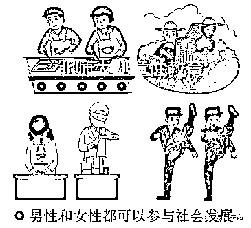**

**教孩子们“学会交流”时，也会在对话中加入本土化的知识。**

**比如 12 月 13 日的南京大屠杀死难者国家公祭日。**

****

**我们可以根据“划清性教育教材与黄色出版物界限的七条标准”来系统化地评判，它到底算不算黄色出版物。**

> **编制目的——是不是为了传播科学知识。**
> 
> **内容——是否严肃科学。**
> 
> **编撰者——作者是不是行业专家。**
> 
> **质量——文字和印刷质量有无保证。**
> 
> **出版方式——能否公开销售。**
> 
> **针对性——是否对不同年龄的孩子有针对性。**
> 
> **产生的影响——能否促进孩子健康成长。**

**这套标准有点长，但很明显，《珍爱生命》从理论上不属于黄色出版物的范畴。**

**再来看实践层面。**

**《珍爱生命》被封杀之前，曾经历过 9 年的教学实验。**

**在此期间，发生了一些小故事。**

**有位低年级的小男孩，以前总喜欢当众暴露生殖器官。**

**上了性教育课后，他明白了这是隐私部位，改掉了之前的习惯。**

**有位单亲家庭女生，独自跟着爸爸生活。**

**她很长时间都在记恨妈妈，心情消沉。**

**但在学了“结婚与离婚”的主题后，她第一次主动给妈妈打了电话，对她说了“我爱你”。**

**还有一位小朋友，在看完被大人批评“露骨”的图片后，根本没有感到奇怪。**

**她在作业栏写下了给爸爸妈妈的话：谢谢你们，没有你们，我就不能来到这个美丽的世界。**

****

**@历历是块小甜饼**

**感受到差距了吗？**

**人教版数学书被曝打擦边球时，很多孩子对它的评价是“好丑”、“吓人”。**

**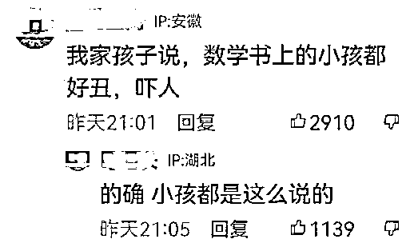**

**但对于这本有更多“敏感内容”的教材，孩子们的反应，反而正向了很多。**

**孩子们的态度，其实也是评判一本教材好坏的重要标准。**

**但现实是，科学的性教育读本被踢出学校，存在问题的教材却明晃晃地打了十年擦边球。**

**我不太支持这些家长的做法。**

**首先，举报这套性教育教材的家长们，可能没有意识到，它有多么来之不易。**

**它是国内顶尖学者耗费九年时间做出的教材，一度被寄予厚望。**

**专家称它是“中国科学性教育的一大步”，给予高度评价。**

****

**但这好不容易才迈出的一大步，因为家长的举报，一夜回到解放前。**

**国内顶尖团队 9 年的心血被辜负，很多孩子也被关上了性教育的窗。**

****

**到现在为止，很多教师提到性教育，还苦于“没有教材可用”。**

****

****

**《珍爱生命》创作团队的目的，明显不是想毁了孩子。**

**它的内容不是完美的，可罪不至死。**

**只因为一张谣传的图片，就去喊打喊杀，是不是有点太“草木皆兵”了？**

****03****

**性教育教材受到质疑批判，已经是一种常态。** 

**这与很多家长愚昧的想法有关。**

**他们总觉得性教育不重要，只要孩子什么都不知道，就安全了。**

**事实真的是这样吗？**

**我来讲几个真实的故事。**

**云南省鲁甸县水磨镇的杨学艳，是个 14 岁的姑娘。**

****

**她被家里的老人带大，从没接受过性教育。**

**第一次来月经时，她极度害怕。**

**衣服裤子上都是血，以为自己得了大病。**

****

**她对这方面的知识，完全是空白，也无法依靠更缺乏常识的家里人。**

**家里只有一个大塑料盆，她和妹妹的内衣外衣，都泡在盆里。** 

**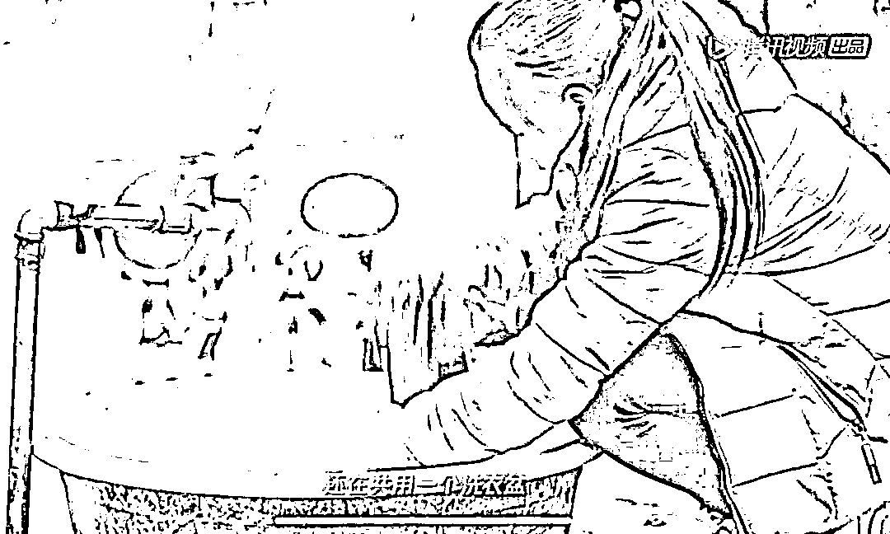**

**鸡鸭鹅在盆边乱窜，盆子很久没有认真清洗过。** 

**从来没有人告诉她，这样不卫生，可能会得病。**

**记者问妈妈知不知道生理期要注意什么，妈妈急得哭了起来：你们说啥我都不懂。**

****

**杨学艳并不是个例。**

**很多贫困地区的儿童，性知识极度匮乏。**

**她们可能从没穿过内衣裤，来月经时，就把棉袜洗干净当卫生巾。**

**再困难一点的，用报纸和作业本。**

**与生理知识匮乏并存的，是扭曲的生理知识带来的心理负担。**

**很多跟着老一辈长大的女孩，会被灌输“月经羞耻”的概念。**

**来月经时，她们不被允许进厨房，不被允许祭祖，被骂是“脏”的。**

**女孩们会因为错误知识的灌输，讨厌原本正常的自己。**

**而且，性教育缺失，会直接导致堕胎、性病、性犯罪的概率大大增加。**

**“女童保护”统计，2021 年公开报道的被性侵儿童（18 岁以下），有 569 人。**

**施害者最小 12 岁，最大 89 岁。**

**而受害者，最小的只有 2 岁。**

**2 岁的孩子被性侵，是什么概念？**

**如果我是孩子的妈妈，可能会无比崩溃。**

**被侵犯者的数据，是一个个鲜活的案例堆积而成的。**

**比如，陕西一个小学女生被 4 名男生拽到厕所侵害。**

**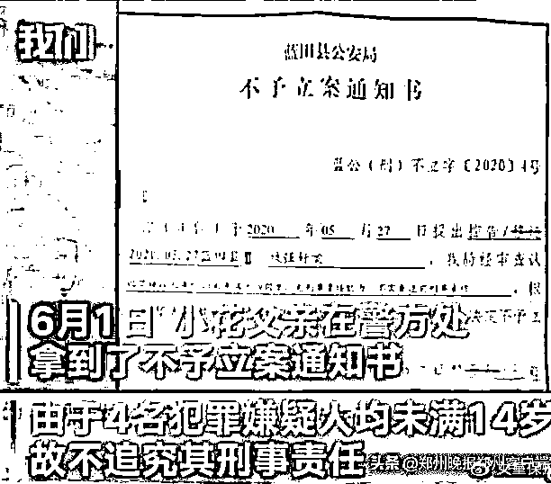**

**10 岁男孩书店内侵犯 5 岁女孩，父母拒不道歉。**

**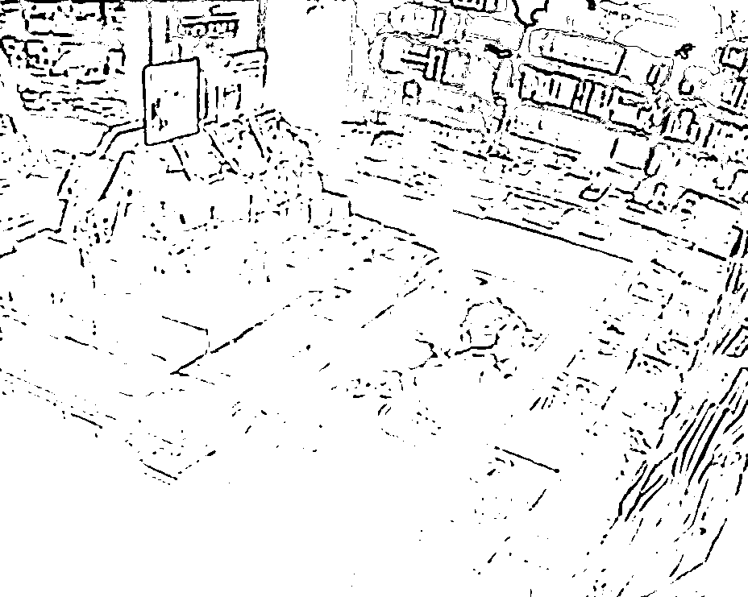**

**还有很多案件，短短几个字，就能让人毛骨悚然。**

**#村民循哭声从土里挖出活婴#**

**#中年男公交搂抱 5 年级女孩#**

**#16 岁女生校舍诞下男婴#**

**这其中的很多案件，都与性教育缺失有极大关系。**

**但有些家长并不觉得。**

**他们认为“反正我的孩子不会这样”、“他知道如何保护自己”。**

**真的是这样吗？**

**之前，有专家做过一个实验，测试孩子会不会在陌生人前脱掉所有衣服。**

**一开始，所有家长都自信满满地表示：我家孩子肯定不会。**

**结果很讽刺。**

**没接受过性教育的孩子，在糖果和新衣服的诱导之下，都不假思索地脱掉了衣服。**

**而接受过性教育的孩子，不管对方怎么哄骗，都执意拒绝了脱衣服的要求。**

**把这个实验和另一个调查结果放在一起，细思极恐——**

**全国大概有 7 成的家长，从来没有对孩子进行过系统的性教育。**

**也就是说，10 个面临性侵的孩子，可能有 7 个都不知道发生了什么。**

**简直令人害怕。**

****04****

**《珍爱生命》的主编刘教授，已经在 3 年前退休了。** 

**经历了被误解、被抹黑的她，依然没有放弃儿童性教育。**

**她用工资给编辑付稿费，高额的开支让她几乎坚持不下去。**

**但她还是对这份事业充满热爱：为了做好性教育，我还可以再辛勤工作 30 年。**

****

**这让我觉得很心酸，很可悲。**

**更可悲的，是部分家长的态度。**

**调查显示，有 93%的家长，认为学校和社区对他的孩子有性教育义务。**

**但只要提到让家长对孩子进行性教育，他们之中的很多人，会露出抗拒的表情。**

**拒绝承担自己应付的责任，却把责任都推给陌生人。**

**这让我想起了《房思琪的初恋乐园》中的一句话：**

**“在性教育这堂课中，父母永远缺席，他们旷课了，却自以为是还没开学。”**

**真的有点又当又立。**

**所以，我非常支持举报那些打擦边球、图谋不轨的儿童绘本。**

**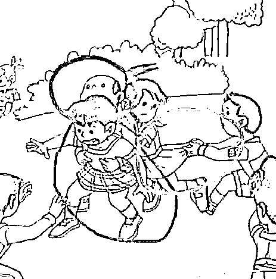**

**创作这些作品的人，怕是有什么大病。**

**但与此同时，我也非常担心。**

**在人教数学教材事件后，某些认知匮乏的家长，会不会以保护孩子为名，把性教育推向更加寸步难行的极端。**

**不分黑白的“喊打喊杀”已经有苗头了。**

**被下架的沈石溪的《狼王梦》。**

**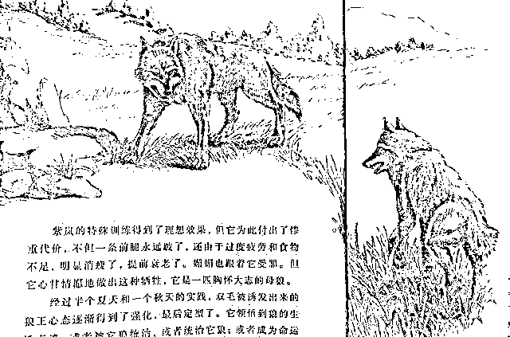**

**被批判的《淘气包马小跳》。**

**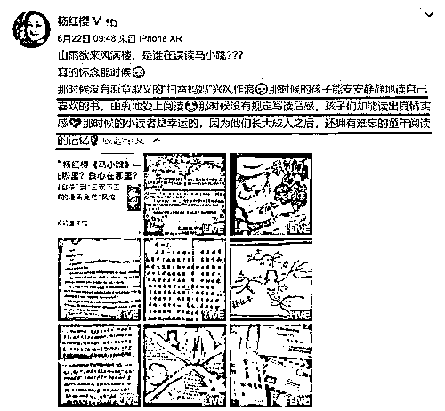**

**被举报的《伊索寓言》。**

**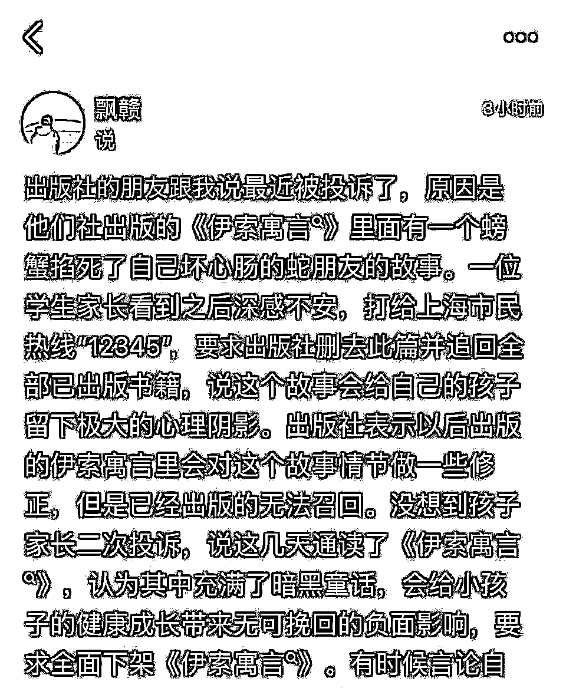**

**久而久之，孩子们将接受完全低幼化的教育，后果不堪设想。**

**我希望，每位家长在举报一本性教育教材之前，请至少先想明白两个问题：**

**第一，你认为，性教育是可有可无的吗？**

**很多人会觉得，性教育可以“无师自通”。**

**但我在文献中看到了一个概念，叫作“消极性教育”。**

**它指的是，正规的性教育渠道闭塞，孩子们被迫从其他渠道获取知识。**

**约等于让一个人每天都吃三无辣条，但从来不给他吃大米饭。**

**非正规渠道的性知识是很危险的，经常掺杂着暴力、乱伦等很多不堪入目的内容。**

**孩子们是一张白纸，很难分辨这些内容的好坏。**

**一旦走偏，就会对性认知产生危害，甚至引发犯罪。**

**另外，性教育不会教坏孩子。**

**请家长们明白：引发性行为的恰恰不是性教育，而是缺乏性教育。**

**瑞典自开展学校性教育以来，人工流产、性传播感染和性犯罪发生率逐步下降。**

**全面推广性教育的荷兰，也是世界上人工流产率最低的国家之一。**

**而在性教育不太发达的国家，这些数据都高得吓人。**

**我国每年约 1000 万例人工流产，有 400 万是未婚青少年。**

****

**这个数字，与我们的“性沉默”文化有关。加小编微信：lszyh9966 看更多好文**

**孩子们在真空的环境中长大，反而容易被“感染”。**

**毕竟，坏人从来都不会嫌孩子太单纯。**

**第二个问题，你认为，性教育是肮脏的吗？**

**《夏山学校》里曾写道：如果一个孩子一直对性方面抱有“它是肮脏的”看法，那么长大后很有可能会对性有不健康的观念。**

**刘文利教授也反击过那些认为性教育教材露骨的人：**

**如果一个身体器官的科学名称都不能从大家嘴里说出来，当一个孩子遭受性侵害，他连什么地方被触摸都描述不清楚。**

**谈何保护自己？**

**如果认识一朵花、认识一张桌子是正大光明的。**

**那么人认识自己的身体器官，就不该是一件难为情的事。**

**只可惜，性教育的概念，一直在被很多人“污名化”。**

**他们认为性教育等同于性行为，只会教坏孩子。**

**这实在太肤浅。**

**当一个人以为他的孩子在性教育教材中学到的只有性知识时。**

**孩子学到的，实则是身体权利、性别平等、人际关系、健康、尊严……很多很多方面。**

**接受过性教育的孩子，会明白：**

**单亲家庭的孩子没有心理问题；**

**女孩子也可以玩小汽车，男孩子也可以穿粉红色的衣服；**

**女孩子可以当消防员，男孩子可以当幼儿园老师；**

**女孩子和男孩子都要保护自己……**

****

**这些宝贵的知识可能会使孩子们受益终身，甚至让社会更加和谐美好。**

**但它们都被与“性”有关的偏见抹杀。**

**很多人卡在性教育的第一关，以为它只是个不堪的游戏，不愿继续。**

**性教育专家王龙玺说过这样一段话，我觉得有必要和大家分享：** 

**性教育走到终极，一定会汇入教育。**

**我们最终会发现我们讨论的，其实并不是性。**

**而是人与人之间如何相处、如何理解尊重、如何爱与被爱。**

**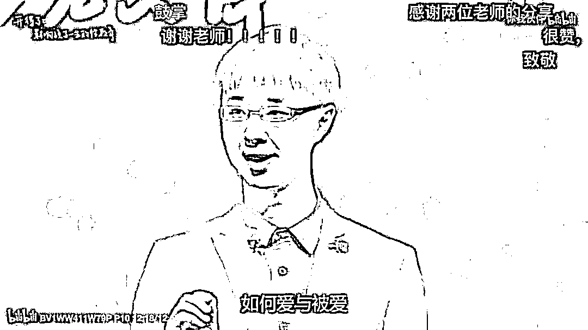**

**所以，与其一边抵制科学教育，一边看着孩子们被猥琐阴暗侵害。**

**一边努力遮掩世界的真实，一边给孩子构建乌托邦的世界。**

**不如正大光明地，展现这个完整的世界，并加以正确的引导。**

**我想，这才是教育的大道所在。**

**<mpvideosnap class="js_uneditable custom_select_card channels_iframe videosnap_video_iframe" data-pluginname="videosnap" data-id="export/UzFfAgtgekIEAQAAAAAATogG3n2GwgAAAAstQy6ubaLX4KHWvLEZgBPEoaNQegMVNq2DzNPgMIvwZEOHq3gX4g57_uslhQmR" data-url="https://findermp.video.qq.com/251/20304/stodownload?encfilekey=rjD5jyTuFrIpZ2ibE8T7YmwgiahniaXswqzlia97zTmnrzYgjD78BQw4ibultZmhYDJTjnVcosDiaDoFFribybdjjEvaciahySC3mzLBzia4YW6bqlqZCaicCjbOrrvQ&amp;adaptivelytrans=0&amp;bizid=1023&amp;dotrans=0&amp;hy=SH&amp;idx=1&amp;m=&amp;scene=0&amp;token=6xykWLEnztJfcgXXStKDwiapmRiccCJ8ChG5IrbAGu0Q6eaU4dByRDHaek1KSMDh4X2Na6qcwS7MQ" data-headimgurl="http://wx.qlogo.cn/finderhead/ibq4aVwOt6HNqrr8OD3sCviaytF3B8TqCwHicxsuIanAJo/0" data-username="v2_060000231003b20faec8c6e48a1acbd3ce04ef33b077a1e41d0d3794ed88ea537878dbe65910@finder" data-nickname="灰产圈+" data-desc="【#温儒敏否认语文教材课文夹带私货#】6 月 1 日，针对近日网上有关“人教版教材某主编夹带私货将自己的文章塞进语文课本”传言，教育部统编中小学语文教科书总主编、北京大学中文系教授@温儒敏 通过其个人微博进行了澄清并回应称，为教材选课文经过层层把关，二三十轮审查，不可能一个人说了算，无所谓“夹带私货”。#人教#人教插画#小学教材@灰产圈+  " data-nonceid="12898452806515957131" data-type="video" data-width="1080" data-height="1920"></mpvideosnap>**

**作 者：七野 来 源 七野说**

********

**← 向右滑动与灰产圈互动交流 →**

****