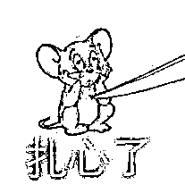

# 当有人开始“核酸焦虑”，3 千元的上门核酸服务海报传开... 美年大健康：未推出

> 原文：[`mp.weixin.qq.com/s?__biz=MzIyMDYwMTk0Mw==&mid=2247537099&idx=2&sn=4f380079f918f14d90584f5a9ad0b174&chksm=97cb9af3a0bc13e5caa357b01c8b69904e9de001cbe5a5c02d52b386b110a6271c4648149501&scene=27#wechat_redirect`](http://mp.weixin.qq.com/s?__biz=MzIyMDYwMTk0Mw==&mid=2247537099&idx=2&sn=4f380079f918f14d90584f5a9ad0b174&chksm=97cb9af3a0bc13e5caa357b01c8b69904e9de001cbe5a5c02d52b386b110a6271c4648149501&scene=27#wechat_redirect)

本文部分素材来自：一点资讯沸点视频

6 月 1 日开始

上海居民的“保质期”只有 72h

所以已经有了全新的问候语：

**“你过期了吗？”**

为了给 72h 核酸阴性证明“续命”

该死的 还不是为了要上班

大家都蛮努力的

6 月份的头 2 天

很多核酸采样点都是“盛况”

排队两三个小时做个核酸的都不少

在脊梁昨天推文里的投票

倒是排 30 分钟以内，和排 1~2 小时的

人数最多

‍‍‍‍

连团长都嗅到商机

开始搞上门核酸团购了...

团长不知道是什么操作么

起码下面这张

在各大微信群里传的

**美年大健康的 VIP 快速核酸检测服务海报** 

**是虚假信息**

海报上写，上海美年大健康

联合上海中科润达医学检验实验室

（对就是大家都知道的那家中科润达）

推出了快速核酸检测上门服务

还可以在 2 小时或者 4 小时之内

就出具报告

收费分别为 3000 元、2000 元每人

看到各处核酸大排长队的同时

看到这样的服务海报

虽然觉得贵极了

又会让人觉得，有钱真好啊 

不过很快

美年健康方面就表示：

**公司内部曾探讨过上述方案，但最终并未推出**

且海报并非美年大健康所制作

上海中科润达医学检验实验室客服则表示

**公司没有推出上述服务**

目前有加急服务

但需要到检测点进行检测

2 小时出报告费用为 400 元 

嗐，要做核酸

还得是生活圈子里的核酸采样点！

不过

在常态化核酸刚开始的 2 天里发现问题之后

感觉情况是有所改善了

不少网友做核酸花不了几分钟

还有很多网友

因为看到有些地方做核酸大排长队

路过人不多的核酸采样点

就忍不住地要去“续一续命” 

核酸目前还得做，就是希望

大家都别再为了核酸排队而烦心

也别再为了核酸报告还没出而焦虑 

脊梁昨天中午在公司楼下的核酸采样点

排队 45 分钟做上核酸之后

今早出门前报告出来了，效率算还可以吧

又是新鲜的 72h 了

<mpvideosnap class="js_uneditable custom_select_card channels_iframe videosnap_video_iframe" data-pluginname="videosnap" data-id="export/UzFfAgtgekIEAQAAAAAASJkquL34WQAAAAstQy6ubaLX4KHWvLEZgBPEvqNQByF7Sa-DzNPgMIth7BX5xTmAPnEIgANQxXs7" data-url="https://findermp.video.qq.com/251/20304/stodownload?encfilekey=rjD5jyTuFrIpZ2ibE8T7YmwgiahniaXswqzSblbibEXGDQxqsf7eHbwFTia0VgLXhpCUzoB6fSjrjzeiaZ8Y9NK9mc9RRbyhmBjN482UngzEzzNKPsV8Ob1icgE9g&amp;adaptivelytrans=0&amp;bizid=1023&amp;dotrans=0&amp;hy=SH&amp;idx=1&amp;m=&amp;scene=0&amp;token=AxricY7RBHdVnkibxZBjwPOhntmflAibaINr7qUyZwibl5icCB4qxdGRIADXueBgZkyvicibpOQNcDBqJ0" data-headimgurl="http://wx.qlogo.cn/finderhead/ibq4aVwOt6HNqrr8OD3sCviaytF3B8TqCwHicxsuIanAJo/0" data-username="v2_060000231003b20faec8c6e48a1acbd3ce04ef33b077a1e41d0d3794ed88ea537878dbe65910@finder" data-nickname="灰产圈+" data-desc="五万块的核酸小屋可还行？#核酸检测@灰产圈+ " data-nonceid="7290127528565414951" data-type="video" data-width="1920" data-height="1080"></mpvideosnap>

来源：脊梁 in 上海 SH

← 向右滑动与灰产圈互动交流 →

