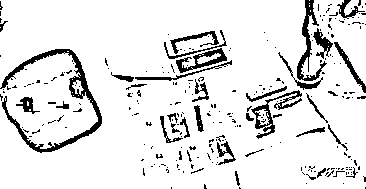
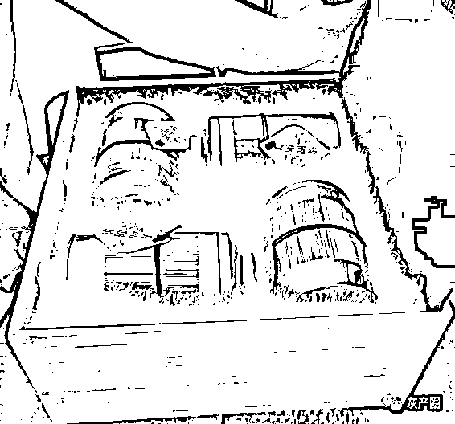
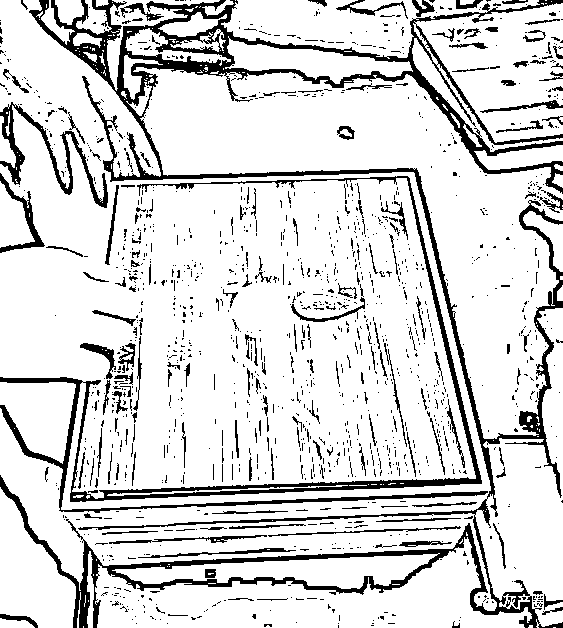
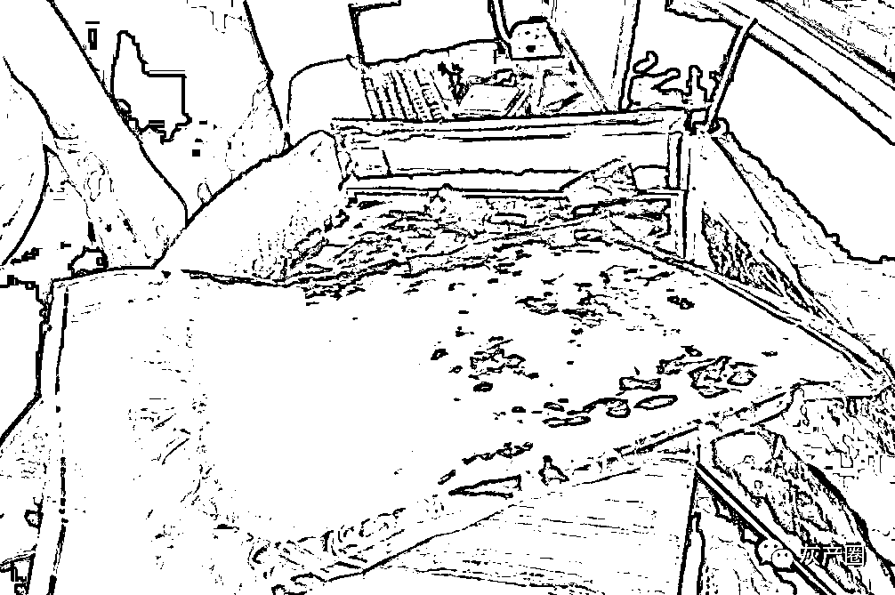

# 2019 年，女毒枭从缅甸被押回国后自述：在那里混得，都是人渣

> 原文：[`mp.weixin.qq.com/s?__biz=MzIyMDYwMTk0Mw==&mid=2247537099&idx=3&sn=429d2d23a71586875db5db5f5e26bf6f&chksm=97cb9af3a0bc13e593489d1c2f342544bc55d1def745637b5a429d0ff4e61498333d609c7545&scene=27#wechat_redirect`](http://mp.weixin.qq.com/s?__biz=MzIyMDYwMTk0Mw==&mid=2247537099&idx=3&sn=429d2d23a71586875db5db5f5e26bf6f&chksm=97cb9af3a0bc13e593489d1c2f342544bc55d1def745637b5a429d0ff4e61498333d609c7545&scene=27#wechat_redirect)

“在这里混的中国人，都是人渣。”阿萍坐在宁海看守所的铁栏杆后面，说起在缅北醉生梦死的日子，幽幽地说了一句。

从缅甸被抓回国，在宁海十几天了，她一出来身上还是一股浓浓的麻古味儿。

民警说，一闻就知道是吸毒的，洗澡都洗不掉。

阿萍在缅北混了也十几年了，什么叫混呢，每天睡到下午起床，然后去赌场，一屁股坐在捕鱼机前面。

赌赢了，就拿着钱出门左拐买一包毒品。赌输了，就把出门右拐，把毒品卖掉，换成钱接着赌。

01  阿萍

据说阿萍原来也是正经人家的老婆，20 多年前离婚后，不知咋搞的，就成了混社会的女人。

“大概是因为空虚吧。”

她碰了赌以后，就从安徽淮南的老家浪到了缅甸。

在那里四五年后，遇到了一个河南籍的中国男人，对她不错。

她就跟着这个男人回了河南，过了一段安稳的日子。

但是，婆媳关系可能是天下最难处的关系，阿萍受不了这个气，就又独自回到了缅北。

在佤邦的赌场里，她结识了两个好闺蜜，一个是阿涵，一个叫岩丽。

她们都一样，左手是赌，右手是毒。

阿涵是浙江宁海人，一开始是岩丽的老公的下线，经常从宁海“叫货”，后来也问阿萍拿货。

阿萍每次接到要货的电话，就拿赌赢的钱买了毒品，找“马帮”给弄到边境，进入中国云南，然后塞在快递里寄到全国各地。

岩丽的老公也是一样的，虽然出生在缅甸，但是在国内有很多下线，一层一层，全国都有。

他们说，这就是他们的生活方式。怪不得阿萍会觉得，在这里混的中国人都是人渣。

02  有枪

阿涵是 2018 年 12 月底被宁海的缉毒民警盯上的。

2018 年 12 月，宁海公安最早发现这张网络上的一个点，是一个毒贩阿林，他是宁海力洋镇人。

可能大家不知道，现在娱乐场所管得严，敢在包厢里吸毒的不多了；酒店也管得严，敢去开房间狂欢、搞吸毒加性派对的人也不多了。

在公安严厉打击犯罪下，要搞毒品也挺困难，所以瘾君子也舍不得跟人分享了，都是悄不做声偷偷吸掉的。不敢在家吸的，还得夜半人静时分溜到旷野之处，找个没人的角落。

这样子，真的是惶惶如丧家之犬。

当时，宁海缉毒民警就从吸毒的人这里摸到了毒贩阿林，摸着摸着发现了一张初级的贩毒网，这些底层的毒贩有的在宁海前童镇，有的在力洋镇，有的在长街镇，可以算是割据一方。

2018 年 12 月 29 日凌晨，宁海公安搞了第一次冬季扫毒的收网行动，凌晨 5 点动的手。

专案组民警戴永杰代号“D 狼”，他告诉我们，当时已经摸到了一个毒贩，东北大汉，人高马壮的，还知道他有枪。

冬季扫毒那天，派出所民警、缉毒警、特警等等，组成一支支突击小队，埋伏在各个窝点外面，等着喜欢熬夜的吸毒者们纷纷入睡，一直熬到黎明前最黑暗的 5 点多，破门进去，干脆利落端掉了好几个窝点。

那个东北大汉“阿东”，果然有枪，有子弹。

只是枪没来得及摸出来，人就被警察死死按在床上铐起来了。

03  茶叶和鲜花饼

初战告捷，缴获冰毒 470 克、大麻 3 克、麻黄素 111 颗。

“阿东”就算不交代，物证也是明摆着的。他的上家在云南那儿，因为警察们缴获的快递盒子上，清清楚楚写着是从云南景洪来的。

虽然收件人姓名电话是假的，发件人姓名电话也是假的，但是物流信息是真的啊。

然后缴获的毒品呢，包装成啥样子的都有。

藏在茶叶袋子里的，藏在茶叶礼盒里面的，塞在云南特产鲜花饼里面的……

他们还摸索了独特的技巧，用来逃避邮包检测。

这不光是云南有人在做这个把毒品改头换面重新包装的事儿，这是很专业的“马帮”在干活啊。

专案组分析，继续顺藤摸瓜的话，摸下去极有可能摸到国外去，摸到缅甸的跨国贩毒网络上。

搞大了，搞大了，这事情大件！

专案组当然最好能继续挖下去，经过谨慎分析，严谨上报，一直报到公安部，被确定为“2019-7 号”目标案件。

宁海公安成立了由副县长、公安局长李铭胜任组长的专案组，抽调了禁毒、刑侦、网警和跃龙派出所、桃源派出所等多个单位的精干警力合成作战。

04  瘦了

我国警察并不能进入缅甸抓毒贩，事情难就难在这里。

宁海公安在云南景洪、普洱等地暗中调查了很久，必须想办法把人抓回来，把贩毒网络打掉。

宁海在海边，云南在内陆，宁海警察在云南吃不到海鲜，憋屈极了。

禁毒大队的葛大队长说，在云南他都不用穿外出的鞋，因为天天在宾馆里穿拖鞋啊。

作为外地人，出现在那里实在是太惹眼了。只能躲在宾馆里出谋划策，分析情报，请云南景洪的公安帮忙一起侦查。他们有百分之百的把握时才敢出击。

就这么天天吃外卖，葛大队长居然瘦了几十斤！

最要命的是，小心经营几个月了，2019 年 4 月，宁海缉毒警察跟着的毒贩突然人间蒸发了！

他们几经打听才知道，就是他们追踪的这批在景洪对毒品进行优化包装，利用快递运输至浙江宁波、河北、重庆，或运输至湖北天门等地作为中转站，再将毒品运至浙江宁波等地的毒贩，原来不止被宁海警方盯着，还有其他地方的警察也在关注呢。

就这么突然，湖北警方把他们给抓了，连人带货都截走了，然后他们的上家也立刻消失了，电话号码也一夜之间变成了空号。

宁海缉毒警察在差点成功的时候，差点断了线索，差点丢了这个案子！真是一万点暴击。

葛大队长本来就失眠，又轻了十多斤！怪不得我们采访的时候，他看上去总是极为疲惫的样子。

05 重连

放弃是不可能的，这辈子都不可能。

危机危机，危中有机。

因为公安缉毒警的打击，毒贩的路子断掉了。宁海的阿涵着急了，她原先是问岩丽的老公进货的，货没了，岩丽的老公联系不上了，她就决定亲自到云南和缅甸来找货源。

她在这个时候找上了阿萍。

原来岩丽的老公很严厉，每次都要款到发货。

阿涵发现阿萍对她要好得多，可以货到付款。

她们从缅北到浙江宁波宁海的贩毒之路重新连接上了，殊不知已经被警方全部查清楚了。

接下来的抓捕过程因为很多环节都没法公开讲解，我们只能用新闻联播的官宣口吻讲两句：

2019 年 6 月 3 日第二次抓捕行动，宁海公安出动 150 余名警力，在当地公安机关的全力配合下，于宁海、奉化、鄞州、象山以及缅甸小勐拉地区开展抓捕，当场抓获犯罪嫌疑人 17 名，缴获冰毒 1.6 公斤、麻古 600 余粒。

2019 年 6 月 5 日，在缅甸小勐拉警局和云南景洪公安的大力支持下，在缅甸抓获主要犯罪嫌疑人阿萍并押解回国。

来源：大 R 说安全，中国反诈骗联盟

← 向右滑动与灰产圈互动交流 →

