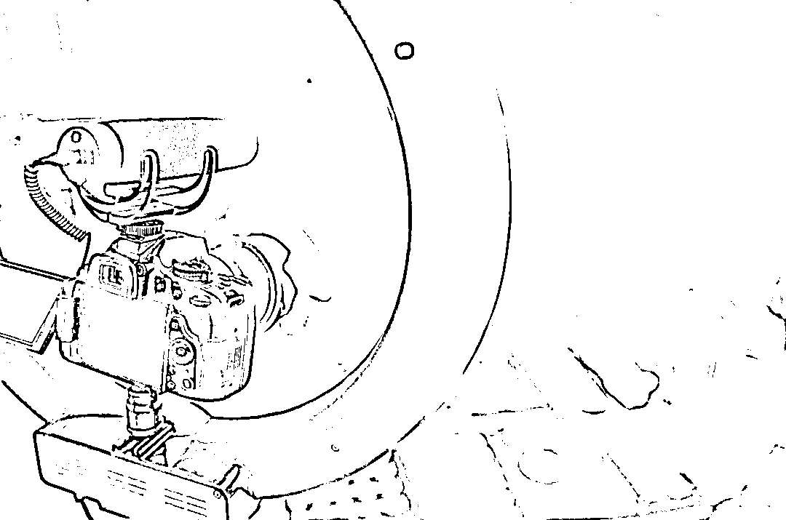

# 劣迹主播换皮复活、一夜捞金百万，网络岂是法外之地

> 原文：[`mp.weixin.qq.com/s?__biz=MzIyMDYwMTk0Mw==&mid=2247537099&idx=4&sn=2ad30c822ae7c7bcd5d8eea0e219c878&chksm=97cb9af3a0bc13e52220bed9958a3f2b72f94d29d2a0dc4710ad663c5cb3a88158fc73b58a67&scene=27#wechat_redirect`](http://mp.weixin.qq.com/s?__biz=MzIyMDYwMTk0Mw==&mid=2247537099&idx=4&sn=2ad30c822ae7c7bcd5d8eea0e219c878&chksm=97cb9af3a0bc13e52220bed9958a3f2b72f94d29d2a0dc4710ad663c5cb3a88158fc73b58a67&scene=27#wechat_redirect)

5 月 18 日，名为凡达的主播在视频号直播 5 小时，收获 1410w 的热度，按照视频号现有的热度换算，这场直播里主播获得了 200 万人民币的打赏。蜂拥而至的粉丝在评论区呼喊：E 先生回归。 

E 先生，这一名字曾出现在 2015 年的央视普法新闻里。此前央视播出的新闻视频中，身穿囚服的 E 先生面部被打了码，他因组织、容留、介绍妇女卖淫罪被追究刑事责任。
在一些民间查证的贴子中，凡达和 E 先生的声音、外形极其相似，因此被怀疑是臭名昭著海天盛筵（大型卖淫事件）中的 E 先生。这也引发了公众的愤懑。一个因组织卖淫罪锒铛入狱的刑满释放人员，出狱后却华丽转身再次成为各大直播平台上的座上宾，并在抖音直播狂揽 4200 万。**清朗行动持续进行中，尽管有不少劣迹主播逃避平台规则复活，但互联网不是法外之地。**针对直播行业的乱象，监管部门加强了网络平台常态化联动治理机制，并加大打击力度，以低俗内容博眼球的主播们无处可藏。

**劣迹主播转身“复活”**

根据公开资料显示，凡达，真名樊达，从 2019 年 3 月 4 号开播直到因涉黄被抖音于 2019 年 8 月 20 日停播，短短 5 个月时间从抖音博主中脱颖而出成为抖音直播届一哥。在被疑组织卖淫、以及臭名昭著“海天盛筵”案件后，凡达遭大量网友举报，随后被抖音等官方平台封杀。然而，他又转去快手平台重操旧业，在无尽的 PK 和喊麦中日进斗金。在快手，他靠 PK 娱乐主播 30 天涨粉 95 万。**这种低俗的直播 pk 被监管部门严令禁止。**5 月初，四部委联合发布《关于规范网络直播打赏加强未成年人保护的意见》，其中规定，网络平台应在本意见发布 1 个月内全部取消打赏榜单，禁止以打赏额度为唯一依据对网络主播排名、引流、推荐，禁止以打赏额度为标准对用户进行排名。直播 PK、打赏，这类形式容易刺激土豪大哥打赏，因而榜一大哥也成为主播们背后力量。此前有传言称，凡达在快手、抖音等平台混迹多年，身后有不少实力雄厚的大哥支持，培养成了一支所谓“训练有素”的“凡家军”，所过之处，霸榜霸屏。**直播打赏滋生的腐败更是触目惊心。**媒体曾报道，有知情人士透露，凡达直播间内 ID“卓玛”女士短短半年内共打赏了 3200 万元给凡达，但这些钱财并非私人财产，而是挪用了云南某惠泽民生的高速公路项目的相关款项。为了获得高额打赏和在线下索要钱物，先是和女儿谈恋爱，后来又和母亲谈恋爱。违背公序良俗、欺骗等行为也引起了许多网友反感。**有诈骗和组织卖淫的犯罪前科，涉嫌欺骗女性感情、搅乱直播平台规则，这类主播本不应该作为公众人物再次出现在镜头前。**然而，凡达却一次次地神奇“复活”。
在被抖音快手封杀后，凡达又一次进入视频号，召集凡家军。公开资料显示，2021 年 2 月，凡达开启微信视频号。2021 年底被视频号封禁，后复出。2022 年 5 月 1 日凡达在微信视频号发公告宣称暂停直播，退网 3 个月。但在 5 月 17 日，他又一次出现在屏幕前。

**多名劣迹换马甲，**

**直播乱象何时休？**

**事实上，像凡达这类劣迹主播换马甲“复工复产”，仅是冰山一角。**知名带货主播雪梨因逃税被全网封，但是雪梨老公却换了个马甲“姑姑来了”继续直播，涨粉百万，带货赚钱两不误。另一位因为调侃成都地震而被封杀的斗鱼主播“小米粥”也在风声过后悄悄直播，并搭上头部游戏主播 PDD 的直播间，直播事业丝毫没有受到影响。除了不当言论、犯罪前科、偷税漏税的劣迹主播外，有网友发现，明目张胆打“擦边球的女主播也在直播间复活了。梦蝶是一位斗鱼女主播，因未成年打赏、公开和榜一大哥交易等行为被斗鱼封禁。可没过多久，她就出现在了抖音平台上，作为“福利女主播”重操旧业。这类劣迹主播复活背后，是对直播平台收入的依赖。根据第三方机构调研数据，2021 年，净收入排行过亿元的国内网络主播就有 10 位。其中，李佳琦位居榜首收入达 18.553 亿元，快手辛巴、冯提莫、罗永浩分别以 12.98 亿元、8.55 亿元、2.45 亿元位列二、三、四名，排名 100 百位的快手主播二驴收入也高达 3190 万。 **金钱的诱惑下，劣迹主播以各种手段在直播间复活。**有专家认为，这类主播的复出不仅扰乱社会风气，还传递不正确的价值观，给屏幕前的青少年作了不良示范，甚至滋生私下交易黑产、灰产，涉嫌刑事犯罪。5 月 27 日，北京互联网法院发布的《未成年人网络司法保护报告》显示，受理的 76 个案件中，年龄最小的受侵害者仅 5 岁，当事人 8 至 16 岁的案件最多，占比 86.8%。其中，充值打赏类案件占比超七成，包括游戏充值案件 20 件，直播打赏案件 22 件，其他充值类案件 15 件。数据显示，直播打赏案件的平均标的额为 69712 元，涉案金额最高的为 61 万元。案件原告多主张未成年人充值行为不发生效力，并要求返还充值款。然而，早在 2020 年 11 月，国家广播电视总局就发布通知，明确网络秀场直播平台要对网络主播和“打赏”用户实行实名制管理，封禁未成年用户的打赏功能并限制最高打赏金额。中国青少年研究中心少年儿童研究所所长孙宏艳团队曾对全国 8 个省份 10000 多名未成年人使用短视频的行为进行调查。**调查结果显示，7.5%的未成年人使用过打赏功能，经常使用打赏功能的占比 1.6%。**浙江大学国际联合商学院数字经济与金融创新研究中心联席主任、研究员盘和林表示，青少年是祖国的未来，随着互联网科技的发展，青少年成长过程中面临的诱惑也越来越多。一方面青少年缺乏抵御诱惑的能力，而互联网娱乐多是以“成瘾性”娱乐方式为卖点。未成年人容易被各类在线娱乐方式抓住注意力，占据未成年人宝贵的学习、成长、体验的时间。另一方面互联网娱乐内容缺乏区分，往往提供超出未成年人心智承受力的娱乐产品，对青少年的成长产生不利影响。

**清朗行动进行时，**

**网络直播不是法外之地 **

尽管有不少劣迹主播逃避平台规则复活，但互联网不是法外之地。**近两年来，针对直播行业的乱象，监管部门加强了网络平台常态化联动治理机制，并加大打击力度。**从 2021 年开始，国家互联网信息办公室部署就开展“清朗”系列专项行动。以年为单位，对互联网乱象进行专项整治；2021 年清朗系列专项行动处置账号 13.4 亿个、封禁主播 7200 余名。下架应用程序、小程序 2160 余款，关闭网站 3200 余家。其中，被封禁的主播违反的规定有 7 大类：色、丑、怪、假、俗、赌，以及高额打赏。**今年以来，清朗行动更聚焦于“网络暴力、 “饭圈”乱象、炫富拜金、封建迷信、 “网红儿童””等问题，在直播领域，更是重拳出击勒令抖音、快手等直播平台对主播进行打赏功能、限制 PK 规则的完善。**2022 年 3 月 30 日，国家互联网信息办公室、国家税务总局、国家市场监督管理总局联合发布了《关于进一步规范网络直播营利行为促进行业健康发展的意见》（以下简称《意见》），旨在进一步规范网络直播营利行为。《意见》中提出，网络直播平台和网络直播发布者要维护网络直播公平竞争环境，不得通过虚假营销、自我打赏等方式吸引流量，诱导消费者打赏和购买商品。艾媒咨询集团首席分析师张毅对记者说，“这条规定，可以有效地约束和规范网络直播，以及直播电商中存在虚假营销和刷单的乱象，对于行业有着正向的促进作用。只有营造出公平的市场竞争环境，才能让那些真材实料的主播、机构脱颖而出。”4 月 6 日，抖音直播上线礼物消费提醒功能，倡导用户在观看直播时理性消费。“在观看直播时，用户可以从右下角进入礼物消费管理，设置自己的单日消费提醒额度。一旦用户当天礼物打赏金额达到所设置的额度，系统就会对用户进行弹窗，提示其理性消费。此外，如果用户未主动使用该功能，系统也会在其消费超过一定数额时弹出提示，引导前往设置。”此外，YY、斗鱼等直播平台也相应的出台了措施。一位业内人士向凤凰网科技表示，最近出台的新规对主播们的 PK 次数进行了限制，网站平台每日高峰时段，单个账号连麦 PK 次数不得超过 2 次，不得设置 PK 惩罚，也不得提供技术实现惩罚。中国社会科学院财经战略研究院研究员李勇坚指出，虚假的繁荣会破坏直播行业长久的发展。如果取消 PK 直播打榜的排名，有利于挤出打赏的水分，让直播回归到内容本身，直播生态会更为健康。**他认为，对直播打榜的的限制政策将会长期存在，劣迹主播、过度娱乐化主播需要让位给有价值的内容主播，直播行业才会迎来良好的发展。**保障未成年人安全、正确健康的使用互联网，是一项系统工程，需要全社会共同努力。**相关专家指出，除了抖音、快手等平台要切实担负主体责任，经纪机构应加强行业自律，网络主播也要提升自己的综合素质。**此外，家长要积极引导未成年人提高懂网用网能力，提升网络素养。

本内容为作者独立观点，不代表凤凰网科技立场。

← 向右滑动与灰产圈互动交流 →

