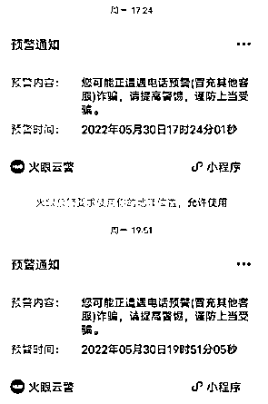

# 大连小伙这段视频火了！"人都没了，我还在乎啥快递？"

> 原文：[`mp.weixin.qq.com/s?__biz=MzIyMDYwMTk0Mw==&mid=2247537099&idx=5&sn=9655c02a5df1bdad2f5c9987bc68af11&chksm=97cb9af3a0bc13e53b2b29268dde841dfdce8dd8abe34d6001a5aa0c938b8a7809e55a84bf21&scene=27#wechat_redirect`](http://mp.weixin.qq.com/s?__biz=MzIyMDYwMTk0Mw==&mid=2247537099&idx=5&sn=9655c02a5df1bdad2f5c9987bc68af11&chksm=97cb9af3a0bc13e53b2b29268dde841dfdce8dd8abe34d6001a5aa0c938b8a7809e55a84bf21&scene=27#wechat_redirect)

“别在国外混了，快回来自首，

天天打诈骗电话不累么，多遭罪！”

“一天给你定多少任务量？”

6 月 1 日以来，一段内容为“大连小伙爆笑反诈”的视频火爆网络，播放量已逾 20 万次。视频显示，当事人接到诈骗电话后，以幽默言辞拆穿对方伎俩，就连骗子都被逗乐了……这名小伙姓姜，在大连湾经营一家手机店，发布视频的目的是为了宣传反诈。对此，有网友表示， “这嘴上功夫，哪是手机店主，分明是德云班主（郭德纲）啊！”

[`v.qq.com/iframe/preview.html?width=500&height=375&auto=0&vid=l3341o5b9ju`](https://v.qq.com/iframe/preview.html?width=500&height=375&auto=0&vid=l3341o5b9ju)

**视频**

****小伙用爆笑言辞拆穿骗子伎俩****

**视频显示，小伙接到诈骗电话后，与骗子进行了 200 多秒的通话，期间进行了三个回合的“交锋”。对此，记者进行了整理。**

****回合 1****

**女子：快递小哥出了点意外，不小心把你的快递弄丢了。
小伙：人要不要紧，出没出人命？
女子：你怎么能说出这种话呢？
小伙：你不是说快递小哥出事了吗，我表示衷心慰问，不行吗？
女子：他出了点意外，把你快递弄丢了……
小伙：我知道，快递丢了无所谓，他人身安全怎么样？你老是说意外，人到底咋样了，严不严重？
女子：人死了，你满意了吧。
小伙：既然死了，为啥给我打电话？
女子：那你的快递丢了，肯定给你打电话的呀。
小伙：人都没了，我还在乎啥快递？
女子：（无语）那挂电话吧。 **回合 2****

**小伙：你也在境外某国吗？要不怎么总打诈骗电话？
女子：我在浙江啊。
小伙：没事回国吧，别在国外混了，天天打诈骗电话到处问，不累么，多遭罪！一天给你定多少任务量？
女子：我又不是中国人，怎么回国呢。
小伙：你普通话说得比我还标准呢，怎么不是中国人？
女子：先生，标准吗？
小伙：现在国家反诈 APP 特别厉害，你一打电话我这边就显示诈骗，你知道吧？
女子：对，对，我就是诈骗呀。
小伙：现在国内科技很发达，你们这种方式已经落伍了，没有意义。
女子： 嗯嗯，好好好。 **回合 3****

**小伙：你普通话说得真的比我标准，感觉像是达到了四六级才毕业的。
女子：好了好了（急着挂电话）。
小伙：我这边的人说话，比如说胳膊肘儿疼，或者波棱盖疼啊，卡秃噜皮啥的，别的地方的人听不懂。
女子：先生，我听不懂你说的方言。
小伙：对呀，所以说你的普通话比我标准，你比我厉害在这儿嘛。
女子；哦，那谢谢你的夸奖啊！（又急着挂电话）**

****核实****

******他是大连湾一手机店主******

****6 月 2 日，记者联系了发布视频的小伙，他姓姜，在甘井子区大连湾经营一家手机店。小姜告诉记者，这段通话录音的内容是真实的，并不是搞笑段子。事情发生在 5 月 30 日下午，他的手机突然接到了境外来电，对方声称快递小哥因为出意外，导致小姜的快递丢了。****

****小姜一听，就知道对方是骗子。接下来，她就会以各种理由，套取个人信息，然后伺机提出转账要求。就在此时，小姜收到了微信发来的“火眼预警”，“您可能正在遭遇电话诈骗，请提高警惕，谨防上当受骗。”这更加让小姜确信，对方就是骗子。于是，他打开了录音功能，把自己和骗子的通话记录下来。****

********

 ****原来，小姜在日常经营中，经常能接到老年顾客的反映，手机总是弹出各种广告，有时也能接到诈骗电话。“现在反诈宣传力度那么大，可偶尔还是能看到有人被骗的新闻，提升全民反诈意识，应该持续发力。”于是，这次小姜接到骗子来电后，特意录音并制作视频，发布到了抖音账号上，以此进行反诈宣传。**** 

******高效******

********警方发现异常立即提醒********

******让小姜没有想到的是，这段视频突然就在网上火了，截至目前播放量已逾 20 万次，点赞量接近 2000 次。“笑得眼泪都快出来了，骗子有多么‘不幸’，遇到了他……”“录音里，骗子都被逗乐了！这嘴上功夫，哪是手机店主，分明是德云班主（郭德纲）啊！”“爆笑！这让我想起了当年大连的‘倒鸭子’事件！”对此，小姜表示，能通过这种方式，为反诈防骗宣传出一点力，他很乐意这样做。******

******同时，警方的高效介入，也让小姜称赞不已。当天，他刚刚挂断诈骗电话，不到两分钟就接到了民警的来电。当时，民警在工作中发现小姜接到境外来电，通话时长有 200 多秒，疑似为诈骗电话，便立即采取措施，特意打来电话提醒，并询问是否透露过个人信息、有无转账汇款行为。得知小姜反诈防骗意识较强，并没有上当，民警悬着的心也放了下来。******

******来源：半岛晨报、39 度视频首席记者满文飞图片、视频、音频由姜先生提供编辑：刘晓霞责任编辑：张一蕾  值班编委：王健******

************************

******← 向右滑动与灰产圈互动交流 →******

************