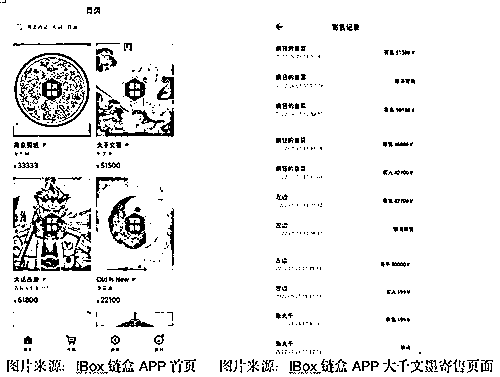
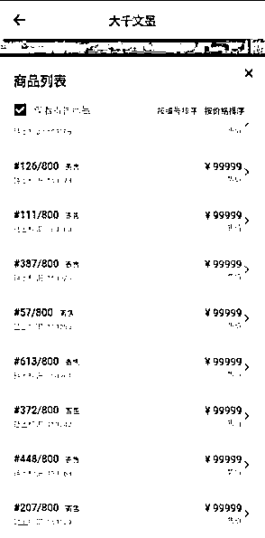

# IBox 链盒等数藏平台炒作凶猛，“用 19.9 赚到 19998 元！”，谁是背后操盘者？

> 原文：[`mp.weixin.qq.com/s?__biz=MzIyMDYwMTk0Mw==&mid=2247537099&idx=6&sn=82771fd097d6a28760b5e58c9f5ed3e7&chksm=97cb9af3a0bc13e51036f970c6b0720740e02eb8285e835449f8a39f48b0f5c2d5caa077ecb1&scene=27#wechat_redirect`](http://mp.weixin.qq.com/s?__biz=MzIyMDYwMTk0Mw==&mid=2247537099&idx=6&sn=82771fd097d6a28760b5e58c9f5ed3e7&chksm=97cb9af3a0bc13e51036f970c6b0720740e02eb8285e835449f8a39f48b0f5c2d5caa077ecb1&scene=27#wechat_redirect)

近日，iBox 链盒、链玩数藏、一点数藏、数藏等平台的数字藏品暴涨暴跌频频成为热门话题，开通寄售二级市场的数字藏品平台成为炒作者的天堂。发售价格十元、百元价位的数字藏品，在寄售二级市场中交易瞬间飙升至数万元。

“用 19.9 元赚到 19998 元，只要能在 IBox 链盒平台抢到首发的数字藏品，在二级市场寄售转卖就可以了。”数字藏品爱好者林萌向本报记者介绍。在“日入过万”的诱惑下，越来越多的玩家入场，深陷其中。

**抢到首发日入过万**

5 月 16 晚间，iBox 链盒因数字藏品出现大幅下跌一度冲上微博热搜前十。受到巨大波动影响，5 月 17 日，TT 数藏公众号还发布公告称，由于近期市场波动较大，我司老板经不住诱惑，将平台启动资金 100W 挪用，进行 iBox 的投资，目前持仓已缩水至 10W，平台已无法继续运营，已遣散技术团队。

iBox 链盒、链玩数藏、一点数藏、幻藏等平台的数字藏品暴涨暴跌成为热门话题，开通寄售二级市场的数字藏品平台成为炒作的天堂。发售价格十元百元价位的数字藏品，在寄售二级市场中交易瞬间飙升至数万元。

“要是能抢到热门数字藏品的首发，日入过万动动手指就实现了。不过在寄售市场中，能赚到钱的一般为抢到首发的消费者，经过多次寄售，尤其是以数万元高价买入的消费者大部分都会赔钱。”林萌向本报记者表示。

打开 IBox 链盒 APP 首页，几乎都是上万元的数字藏品，这些数字藏品的首发价格大多为百元，但是一转手就成为了上万元的价格。

以 IBox 链盒发售的数字藏品“大千文墨”为例，该作品为张大千书院旗下北京千之堂文化有限公司认证，5 月 25 日铸造发售，发售价格为 199 元，ID 为“左边”的消费者购入后，先后多次寄售，价格从第一次寄售价格 8 万元多次调整后，以 42700 元卖给 ID 为“疯狂的韭菜”的消费者，目前“疯狂的韭菜”正在多次调整寄售价格。截至 6 月 1 日 11 点 31 分，报价为 51588 元，暂未售出。

大千文墨数字藏品发售 800 份，目前正在寄售的作品有 100 幅，价格从 51000 元到 99999 元不等。

图片来源：IBox 链盒 APP“大千文墨”数字藏品寄售市场

IBox 链盒提供的寄售服务中，所报价格均为已购消费者报出，IBox 链盒充当的角色为“提供集中交易服务”平台。

而在 4 月 13 日，中国互联网金融协会、中国银行业协会、中国证券业协会发布关于防范 NFT 相关金融风险的倡议，指出坚决遏制 NFT 金融化证券化倾向，并强调“不为 NFT 交易提供集中交易（集中竞价、电子撮合、匿名交易、做市商等）、持续挂牌交易、标准化合约交易等服务，变相违规设立交易场所”。

多位数字藏品爱好者还向记者反映，找客服难、提现难等问题。对此，本报记者向 IBox 链盒方面咨询，并未得到回复。

据 iBox 链盒官方介绍，利用区块链、物联网、人工智能等多项技术，坚持定价发行、盲盒发行、多形式拍卖、藏品的 AMM 机制发行等多种发行方式，以及通过自营及对外合作等多种模式，为数字 IP 提供运营及资产管理服务，包括内容策划、IP 授权管理、市场营销、应用场景对接等多种服务。

北京京师律师事务所律师孟博向《华夏时报》记者表示：“今年以来，中国银行保险监督管理委员会、最高人民检察院、中国互联网金融协会、中国银行业协会、中国证券业协会等单位陆续发布了关于防范元宇宙、NFT 相关风险的提示。作为一种新型商业模式，NFT 还在探索中发展。对数字藏品交易平台而言，不管想要以何种方式突围，坚持合规经营，方可行稳致远。”

除了数字藏品平台开通的寄售场内交易，场外交易也相当活跃。在微信、QQ 群中，倒卖数字藏品的“黄牛”也越来越多。当前多个国有大行、股份制银行、地方性银行发布数字藏品，因没有二级交易市场，成为场外炒作的重灾区。

“金融市场从来都不缺少各种各样的骗局，玩着击鼓传花的游戏，炒作茶叶，炒作收藏品，炒虚拟货币，炒鞋，想要完全禁止投机炒作太难了。”业内人士向记者感慨道：“对于绝大多数打着投资名义的投机者来说，往往最终会得不偿失，投机者相较于做局者，存在很大的信息不对称。所谓的庞氏骗局总会披着各种不同的外衣进行敛财，投机者即便知道是骗局，但认为自己不会是最后一个，不论劝告多少次要保持理性也没用。”

**炒作背后的“操盘者”**

在 IBox 链盒成为知名二级市场交易数字藏品平台的背景下，平台背后的“操盘者”也引发关注。

通过天眼查 app 查询显示，IBox 链盒是海南链盒科技有限公司旗下产品，从工商信息看，实缴资本未披露。海南链盒科技有限公司的大股东为超级星链数字科技有限公司。超级星链数字科技有限公司主要领导也是西安纸贵互联网科技有限公司（下称“西安纸贵科技”）的主要领导。不过西安纸贵科技方面曾回应区块链日报表示，两者是独立的，与 iBox 链盒只是股东存在个别交叉。

5 月中旬，一个名为“知音数藏”的数字藏品平台的发布引起业内关注，其发行方为湖北纸贵科技有限公司（下称“湖北纸贵科技”），湖北纸贵科技的大股东为西安纸贵科技，持股比例为 70%。

据其公众号介绍，“知音数藏”是华中地区首家，基于国家区块链新型基础设施“星火·链网”构建的数字藏品服务平台，目前暂未开通二级市场，一共发行了两个系列数字藏品。“知音数藏”与“IBox 链盒”的股东与管理者高度重合，炒作情绪高涨的“IBox 链盒”数字藏品能否持续运营？另起炉灶的“知音数藏”又会将会采用何种方式运营？也引发了业内多种猜想。

（应受访者要求林萌为化名）

来源：华夏时报

← 向右滑动与灰产圈互动交流 →

