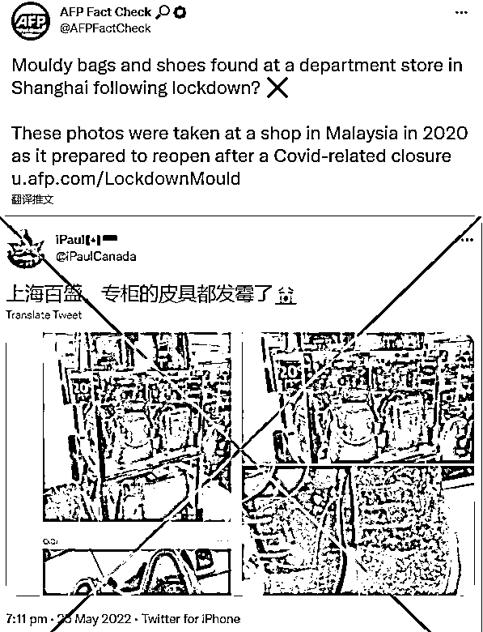
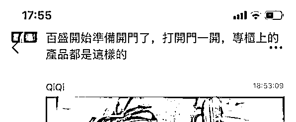
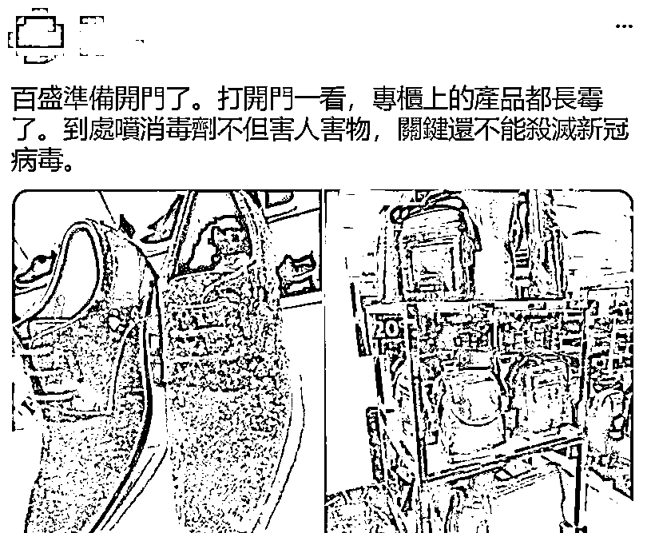
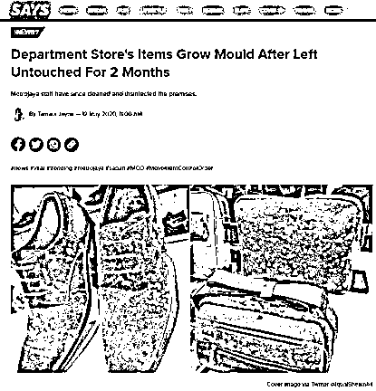
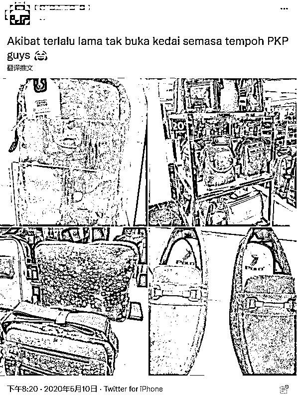
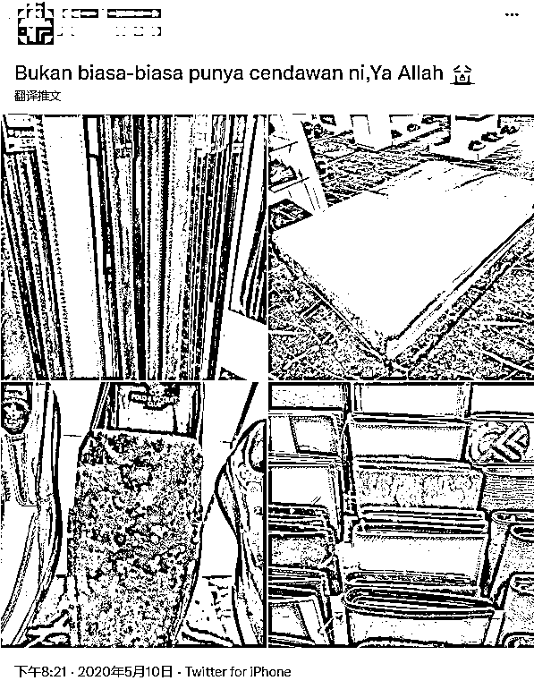
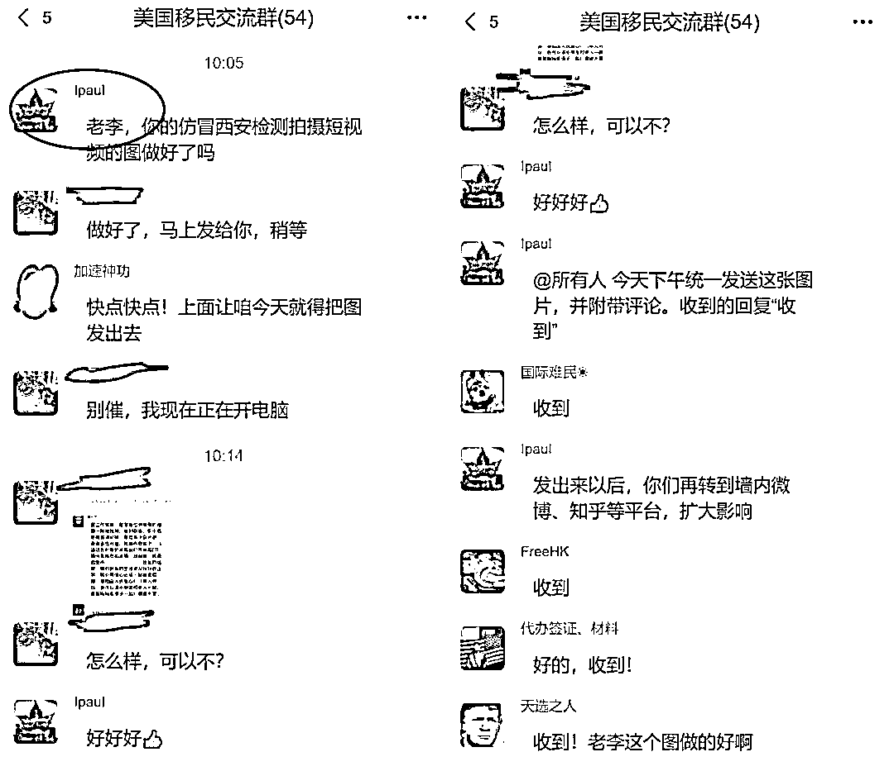

# 反华账号造谣上海疫情，low 到外媒看不下去

> 原文：[`mp.weixin.qq.com/s?__biz=MzIyMDYwMTk0Mw==&mid=2247537099&idx=7&sn=7defe227c7ecaa788cbb317009455752&chksm=97cb9af3a0bc13e5a6c103ac0e71691ef156ec7845566542e4327fddcec837984f2f3d019f7a&scene=27#wechat_redirect`](http://mp.weixin.qq.com/s?__biz=MzIyMDYwMTk0Mw==&mid=2247537099&idx=7&sn=7defe227c7ecaa788cbb317009455752&chksm=97cb9af3a0bc13e5a6c103ac0e71691ef156ec7845566542e4327fddcec837984f2f3d019f7a&scene=27#wechat_redirect)

在全国上下为打好疫情防控阻击战团结一致之时，一些“恨国党”和反华分子却在境外社交媒体上如跳梁小丑一般上蹿下跳，炮制各类谣言哗众取宠，以期煽动对中国防疫政策的不满情绪。但奈何这伙人实在是智商“感人”，造谣水平低级到连一贯对中国持负面观点的西方媒体都不忍直视，甚至罕见为中国发文辟谣。 

6 月 1 日，对于海外中文圈中恨国、反华账号近日热传“上海专柜的皮具商品因疫情封控太久而发霉”的谣言，法媒法新社发文辟谣，指出网传照片实际是 2 年前马来西亚一商场在结束 2 个月疫情封控后出现的画面。

6 月 1 日起，上海全面恢复全市正常生产生活秩序阶段，在逐步复工复产的节奏中，该市各大商圈各大商场也迎来全面重启。

就在这个节骨眼上，5 月 25 日，在“恨国党”和反华分子云集的境外社交媒体推特上，一个名为“iPaulCanada”的中文账号发帖，声称“上海因为疫情封控太久，复工后发现百盛商场里售卖的皮具都发霉了”。

他煞有其事地发布了几张货架上的皮包、皮鞋商品都布满了白色霉斑的照片。其中一张聊天记录的截屏图片中显示，有个繁体字的聊天内容写着“准备复工的百盛员工一开门就看到了此情此景”。

就像苍蝇循着臭味而来，这则推文很快就获得海外中文圈的多个恨国或反华账号“激情”转发，还有繁体中文账号添油加醋称是“政府在消杀过程中到处喷洒消毒剂导致商品发霉”。

他们借此来攻击中国政府以及中国的防疫政策，戏精似的呼天抢地道“这就是封城的后果”、“人心都发霉了”、“商户血亏”云云。

然而有心人只要使用一下图片搜索引擎就能发现这组图片其实与中国无关，这不过又是反华账号故技重施炮制的一出蹩脚谎言，造谣水平低级到连向来对中国持负面态度的外媒都看不过眼。

6 月 1 日，法媒法新社旗下的事实核查账号 AFP Fact Check 就此事发布英文报道辟谣，指出这些网传谣言帖中贴出的“皮具发霉”的图片，其实是 2020 年在马来西亚一家商场里出现的一幕。

根据当时马来西亚媒体的报道，照片中的商场因为疫情原因自 2020 年 3 月 18 日开始实行 PKP“移动限制令”，该令规定仅开放满足基本需求服务。两个月后迎来复工时，店内部分皮具出现了发霉的情况。

涉事商店在 5 月 11 日发布官方声明称“货物处于这种状态的原因有很多，仍在调查过程中”。当地媒体还怀疑，这些商品之所以会发霉可能是因为商场的空调在疫情期间一直没有运作，而当地的天气又非常潮湿。

当时还有马来西亚网民公布了更多商品发霉的照片。

目前账号“iPaulCanada”发布的造谣推文已经搜索不到，但他仍在持续发布其他抹黑、诋毁中国防疫政策等反华、辱华信息。

另据环球时报报道，“iPaulCanada”去年曾被一些中国网民指控在中国境内社交平台上开设了个名叫“美国移民交流”的群组，专门征集各种用来攻击中国防疫政策的谣言信息。当时被曝光的部分聊天记录显示，该账号正在制作攻击中国西安防疫政策的谣言内容，并准备通过中国境内社交网络上的组群分发给境内的网络账号，再由这些账号扩散到国内的各种公开网络平台上。

来源：观察者网

← 向右滑动与灰产圈互动交流 →

