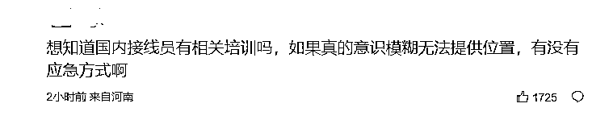

# 愤怒！8 分钟，一个鲜活的生命就这样错过了

> 原文：[`mp.weixin.qq.com/s?__biz=MzIyMDYwMTk0Mw==&mid=2247537200&idx=1&sn=ace4b87b993b0446e256b28b63dce990&chksm=97cb9908a0bc101eeb404b35f8bc77438783658abe6d84420a3bb07fb5a8e5739080dd7c66cd&scene=27#wechat_redirect`](http://mp.weixin.qq.com/s?__biz=MzIyMDYwMTk0Mw==&mid=2247537200&idx=1&sn=ace4b87b993b0446e256b28b63dce990&chksm=97cb9908a0bc101eeb404b35f8bc77438783658abe6d84420a3bb07fb5a8e5739080dd7c66cd&scene=27#wechat_redirect)

6 月 3 日晚 

就**郑州 120 延误救治大学生**一事

郑州市卫生健康委员会做出回应

↓↓↓

6 月 3 日，网络反映郑州 120 延误救治大学生一事，郑州市高度重视，郑州市卫健委**已成立专项调查组，**正对该情况进行调查，调查结果将予以公布。

郑州市卫生健康委员会

2022 年 6 月 3 日

**此前消息**

河南大学一学生

突发疾病离世 

生前拨打 120 急救电话录音曝光 

录音内容引发众怒

↓↓↓

**<mpvideosnap class="js_uneditable custom_select_card channels_iframe videosnap_video_iframe" data-pluginname="videosnap" data-id="export/UzFfAgtgekIEAQAAAAAAc5sp_GvglAAAAAstQy6ubaLX4KHWvLEZgBPEu6MwMmJ6Za6DzNPgMIsGJxSKYyJm-Uu9PWAVw-1I" data-url="https://findermp.video.qq.com/251/20304/stodownload?encfilekey=rjD5jyTuFrIpZ2ibE8T7YmwgiahniaXswqz4MNbrxzIibwPbNrrHF159IufYXRPSsib5K207sibnTysWkofoS1ZTr5micbKaHtHNDktCqgLMAq3QU69Otdjj0iac5g&amp;adaptivelytrans=0&amp;bizid=1023&amp;dotrans=0&amp;hy=SH&amp;idx=1&amp;m=&amp;scene=0&amp;token=x5Y29zUxcibDq7ia8lFbFRjvz92xP7gicnfsY1X24UEz51OQNrHy4wWc0yHNKzULODVfzoeosvdKr8" data-headimgurl="http://wx.qlogo.cn/finderhead/ibq4aVwOt6HNqrr8OD3sCviaytF3B8TqCwHicxsuIanAJo/0" data-username="v2_060000231003b20faec8c6e48a1acbd3ce04ef33b077a1e41d0d3794ed88ea537878dbe65910@finder" data-nickname="灰产圈+" data-desc="【#河南大学回应一学生在宿舍打 120 求救#：知晓此事，一直在积极处理[话筒]】#河大彭同学最后八分钟的求助#6 月 3 日，河南郑州。网传河南大学一学生 5 月时身体不适，因独自在宿舍就拨打 120 求救。校长办公室工作人员回应称，学校目前知晓此事，一直在积极处理。@灰产圈+ " data-nonceid="11985329363316030462" data-type="video" data-width="1080" data-height="1920"></mpvideosnap>**

****曾拨打 120 求救 接线员迟迟不派车****

**5 月 30 日，河南大学大三女生彭美（化名）去世，去世前，她因脑出血已昏迷 14 天，一直靠呼吸机维持生命。**

**彭美的父亲彭先生告诉记者，女儿 5 月 17 日上午在宿舍出现不舒服的情况，曾拨打 120 求救，**但长达近 8 分钟的通话后，接线员并未派车。**当日中午，舍友发现彭美情况不对后再次拨打 120 才派车，而**120 抵达学校时，距离彭美第一次求救已过去了 2 个多小时。****

****女学生突发脑溢血 年仅 20 岁**** 

**家住平顶山的彭先生是 5 月 17 日中午 13 时左右接到女儿同学电话，对方说彭美昏迷送到医院了。“我赶紧开车往郑州赶，到了已经是下午四点了，当时说把孩子送去做检查了。”彭先生向记者出示的郑州大学附属第一医院诊断证明书显示：“患者以‘（代）突发意识障碍 3 消失余’为主诉入院。初步诊断为：意识丧失查因：急性脑出血破入脑室、脑室铸形；I 型呼吸衰竭；高热查因：中枢性高热？神经源性休克？**

****

**彭先生说，他见到女儿时孩子已经陷入昏迷，虽然也进行了手术，但此后女儿一直靠呼吸机维持生命，直到 5 月 30 日因脑出血去世，年仅 20 岁。**

**彭先生表示，孩子没有心脑血管相关病史，以前也没听孩子提起有头疼等症状，为了解孩子死因，彭先生向辖区龙子湖派出所报警，并在派出所听到了那段令他心痛的录音。**

****多方还原事发当日情形**** 

**彭美的同学告诉记者，17 日上午学校组织核酸检测，两位室友离开后，彭美一个人在宿舍。当日上午 10 点 27 分，感到不适的彭美拨打了郑州市 120 急救中心电话。**

**通话录音显示，彭美呼吸沉重，说话声音较小，接线员问她是要救护车吗？彭美“嗯”了一声，说“河南大学”。随后接线员询问河南大学在哪？彭美回答：“郑州”，后再次强调“河南大学郑州校区”。接线员又再次询问在什么路上？这时彭美回答：“明伦校区，我头好疼啊。”接线员听闻后再次询问：“明伦校区在哪？我只知道有个龙子湖校区。”这时，彭美再次重复了一句“郑州”。**

**记者注意到，这段录音中彭美不断大声喘息，接线员则告知她不要用嘴巴呼气，用鼻子呼吸。随后接线员多次与彭美确认位置，请她向室友确认位置或加微信将位置发给接线员。彭美回复说没有室友，并再次说了“郑州河南大学”。通话后半段，彭美疑似病情更为严重，难以直接回复接线员问题，并带有哭腔，接线员则表示不说清楚位置无法派车。**

**彭先生告诉记者，他后来了解到，**女儿拨打 120 求救后并未派车，**当日中午 12 点左右，女儿室友回来时发现女儿情况不对后再次拨打 120，对方才派车。**

**彭美同学告诉记者，第二次拨打 120 的是彭美的班长，在这位班长报出准确位置后，接线员反复确认上午是否有同学已经拨打过 120。班长当时不清楚彭美已经打过 120，担心被当作重复拨打，便多次强调是第一次打 120，请赶快派车。**

**彭美的室友则表示，她 12 点多回宿舍时，彭美发出痛苦的呻吟，会抽搐意识不清醒，叫也叫不醒。这位室友在陪同彭美去医院的路上时，120 接线员给彭美的手机回了个电话，室友接听后对方表示彭美一直说不清自己在哪，说自己是明伦的。**

**彭先生告诉记者，通话录音的前半段，女儿多次明确说自己在河南大学郑州校区，且河南大学在郑州只有龙子湖一个校区，“孩子后面已经意识模糊了说错话了，他们可以报警或者联系学校定位，但他们却一直说孩子说不清楚位置。”**

**6 月 3 日，郑州市 120 急救指挥中心工作人员告诉记者，已将此事汇报给郑州市卫健委。**

**郑州市卫健委工作人员表示，目前相关部门已介入核实此事。**

**河南大学郑州校区综合管理办公室工作人员表示，校方已了解彭美同学去世情况，并配合家属进行善后，但校方对此事具体处理意见尚未出来。**

**看到这个信息我是震惊的，也是第一次知道 120 人工接线员是这样的，如果这个 8 分钟的通话处理得当，或许可以挽救她的生命，事情发生在 5 月 17 日上午 10 点 27 分，出事的女孩第一反应是打给 120，没有打给父母，通话录音中 120 的接线员可能也没想到这件事是这样的结局。惋惜，愤怒，这件事情本不应该发生！** 

**<mpvideosnap class="js_uneditable custom_select_card channels_iframe videosnap_video_iframe" data-pluginname="videosnap" data-id="export/UzFfAgtgekIEAQAAAAAAbIkZaHzJJQAAAAstQy6ubaLX4KHWvLEZgBPE9aNYQBEQZa6DzNPgMIt4nWPn_f9KhJnkz-YlThqK" data-url="https://findermp.video.qq.com/251/20304/stodownload?encfilekey=S7s6ianIic0ia4PicKJSfB8EjyjpQibPUAXol9wVV7kEFqa3aK0iaeYpibzgfe74ROwMtbgGQzgOUChnTGdt08s1hibnCDZOfUSgNfzcxVUQVERXEscdZvRbELlWFA&amp;adaptivelytrans=0&amp;bizid=1023&amp;dotrans=0&amp;hy=SH&amp;idx=1&amp;m=&amp;scene=0&amp;token=AxricY7RBHdWVgtX5T3EGv1v11nzib8Ricx5g7J84ZT4cCia9tdDaaT7dPkHrpLeyibGVvP4Z6Ew4tyU" data-headimgurl="http://wx.qlogo.cn/finderhead/ibq4aVwOt6HNqrr8OD3sCviaytF3B8TqCwHicxsuIanAJo/0" data-username="v2_060000231003b20faec8c6e48a1acbd3ce04ef33b077a1e41d0d3794ed88ea537878dbe65910@finder" data-nickname="灰产圈+" data-desc="我的孩子叫彭新君，就读于河南大学郑州龙子湖校区，今年 21 岁，大三准在校学生，2022 年 5 月 17 号上午 10 点 27 分拨打郑州市 120 急救中心电话，期间通话时长 8 分钟左右，意识清晰，且表达清楚，准确的告知了 120 自己头疼不舒服，和自己所在位置，最后是室友回寝室后发现孩子没有意识，深度昏迷才打的急救电话，120 才到。迟到了近两个半小时才派出救护车，到医院抢救时已经没有呼吸，瞳孔放大，最终孩子离开了这个世界。120 接线员在得知是河南大学郑州校区后依旧不断询问地址，导致我女儿在意识不清醒状态下被诱导说出不准确地址。并在收到求救电话后未安排救援车辆，直到再次接到我女儿室友的电话后才来救援。此时，距我女儿求救已过去两个半小时。她才 21 岁啊，她的人生才刚刚开始，她明明可以活下，却错过了宝贵的救治时间。下面是孩子求救电话的录音，希望更多人能看到这条消息，不要让悲剧再次重演。#郑州急救#" data-nonceid="2758963300619215997" data-type="video" data-width="896" data-height="1920"></mpvideosnap>**

**这的确是绝望的 8 分钟，我其实一直没明白为什么要看微信位置，为什么反复问有没有室友，这个时候是不是让患者回答是或者否而不是让她思考会更快一些。**

**事情已经十分紧急了，如果接线员能问她更简单的问题，因为 120 一般拨打的是本市的急救电话，显然患者那个时候已经神志不清醒，河南大学+郑州的关键词就很快能确定位置，联系学校或者，假如。。。没有假如。。**

****

****

****

****

****

**120 接线确实有一个标准流程，但是患者自己打电话有时候是无法提供更多信息的，而且显然 120 的接线员严重失职。**

****

****

**这个也是我想知道的，是不是以后遇到危险先找自己的紧急联系人？**

****

****

****

****

****

**我听到最后，真的是十分的气愤，一个鲜活的生命就这样没有了，错过了最佳的救护时间。**

****

**这个姑娘 21 岁的青春年纪，就永远停留在这个端午节了。**

**阅读原文是女孩父亲的微博地址。** 

**来源：健康郑州、北京青年报、生活家老杨、 iitm** **

更多精华好文，请点击关注** ****

**← 向右滑动与灰产圈互动交流 →**

****