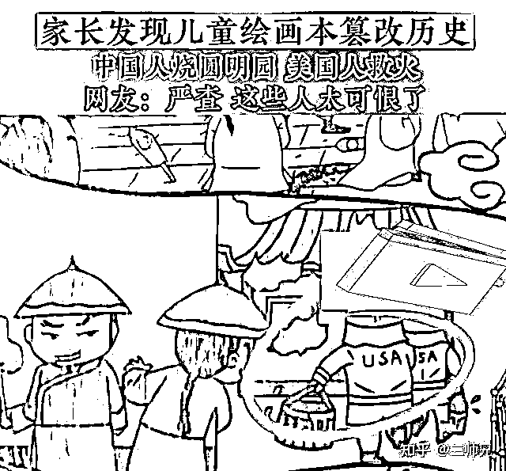
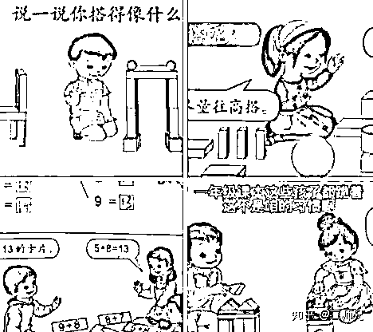
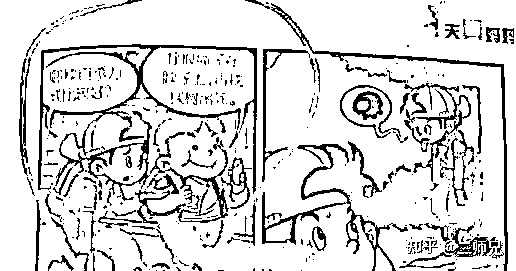
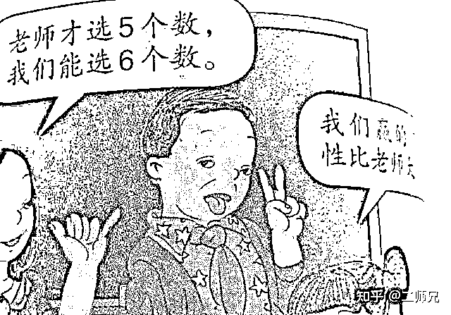
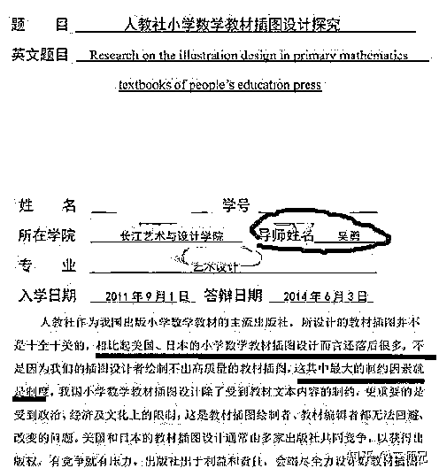
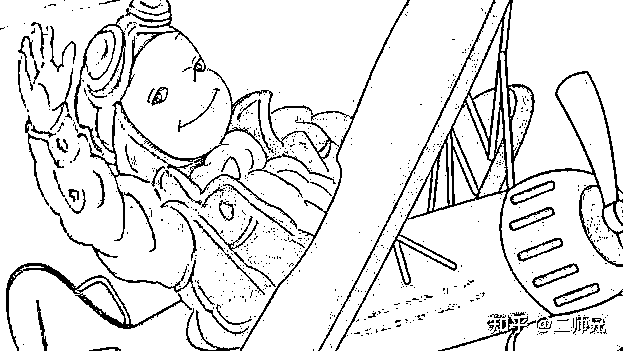

# 想要试图洗白？吴勇设计的中小学生造型形象，居然是这样的用途

> 原文：[`mp.weixin.qq.com/s?__biz=MzIyMDYwMTk0Mw==&mid=2247537200&idx=3&sn=3b76489c1d11246e32f8b4ce98506d6f&chksm=97cb9908a0bc101eb5df986ead1711248c0385cda520884d9eff680012827c250904974e4172&scene=27#wechat_redirect`](http://mp.weixin.qq.com/s?__biz=MzIyMDYwMTk0Mw==&mid=2247537200&idx=3&sn=3b76489c1d11246e32f8b4ce98506d6f&chksm=97cb9908a0bc101eb5df986ead1711248c0385cda520884d9eff680012827c250904974e4172&scene=27#wechat_redirect)

这段时间，人教版数学教材插画时间在社会各界闹的是沸沸扬扬，几乎人人皆知。也是因为这件事情的存在已经渗透了很多无知的小孩子，所以格外的令人愤怒。并且，在广大网友的奋力检查和曝光之下，很多这样“教育渗透”的事情都被公之于众。

对于很多网友和家长来说，这件事情的发生已经不是简单的“阴谋论”的问题了。在这背后利益的牵扯之下，社会各界的各行各业所谓的“人物”“大佬”“大神”都被炸了出来，令人胆战心惊。

这件事情的发生前所未有的令人愤怒，也是因为涉世未深的孩子们代表着祖国未来的希望，没有人能够接受自己的孩子或者是任何一代在这样的环境中成长，这不仅是对自己孩子的负责，也是为我国的发展和社会的进步担负起相应的责任。

谁也没有料想到，看似简单的一件事情，居然可以发酵到这样的地步。也是因为这件事情牵扯的人物非常广泛。这些“毒教材”深深影响着孩子们。尤其是这一版的数学教材沿用到至今也已经有将近十年的光景了。

家长们一直都本着信任的理念，认为这样正规的教学教材是不会出现问题的。所以以前也一直没有留意，乃至有家长进行爆料的时候，网友们刚开始都是单纯的以为只是配图有点丑，不是很精致，也没有什么关系。

直到有家长开始细细观察时，才发现问题所在。在人教版数学教材中，有很多插图的小孩呈现出一种大脑门，低眉毛，一双小而无神的眼睛，总是咧嘴但是笑意却很深人，这样的人物形象不仅孩子们不能接受，很多家长都感到非常的诡异。

就在所有人都专注于教材课本中的问题时，《新华字典》还有一些小孩子的课外读物，都纷纷被爆内容有所不雅之处，这也让很多家长们成为了惊弓之鸟，从这件事情发生以后，所有的课外书都要家长们自己阅读之后，确定没有问题，才敢给孩子阅读。

而导致这一切的始作俑者，就是设计了人教版教材书插图的吴勇设计师。在知道了这一个人物之后，网友们都开启了“地毯式搜索”模式，关于这个设计师的很多“东西”也被挖掘了出来。

其中当仁不让的一个内容就是，曾经作为导师的吴勇，在学生的一篇《人教社小学数学教材插图设计探究》的论文中公开表示“人教社作为我国出版小学数学教材的主流出版社，所涉及的教学插图并不是十全十美的，

相比起美国，日本的小学数学和教材插图设计而言还是落后很多，不是因为我们的插图设计者绘制不出高质量的教材插图，这其中最大的制约因素就是制度“。从这点来看，好像吴勇是为了教材做出质的飞跃的努力。

但是在看过了这一版的教材插图以后才发现，原来这只不过是一种变相的自我洗白的方式而已。正常来说，虽然文化和艺术无国界，但是我们应该取其精华，去其糟粕，不能照单全收，崇洋媚外。

甚至在这件事情发酵后的两三天的时间里，还是有不少插画届的“大神”替代其说话，还有甚者试图转移话题，试图寻找别的突破口进行狡辩和解释，但无论是何种理由，都比不过国人的爱国之心和为了孩子健康成长的心。

**想说的话：**

无论这样的“阴谋论”是如何想要洗白，广大群众和网友都是和明镜似的清楚，我国相关部门也发布了将要全面彻查的通知，希望可以给予学生和家长们一个合理的解决方式，并且也要对相关责任人作出合理的处罚。

来源：知乎@二师兄，飞半掩生活 ，iitm

更多精华好文，请点击关注

← 向右滑动与灰产圈互动交流 →

