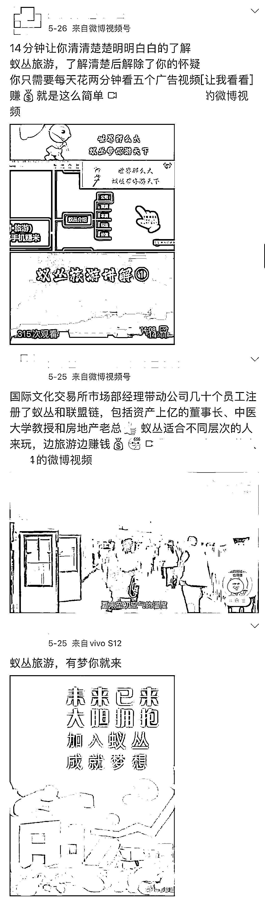

# 警惕！“蚁丛旅游”，看视频就赚钱、0 撸数千元…还能拉人头分收益？

> 原文：[`mp.weixin.qq.com/s?__biz=MzIyMDYwMTk0Mw==&mid=2247537200&idx=6&sn=45bf1354efe57ad622e57823300b2dc6&chksm=97cb9908a0bc101e20dbb064065c6e5ef03261ed6f1f3d12be7f0bab41f58c9b02bbef867f7d&scene=27#wechat_redirect`](http://mp.weixin.qq.com/s?__biz=MzIyMDYwMTk0Mw==&mid=2247537200&idx=6&sn=45bf1354efe57ad622e57823300b2dc6&chksm=97cb9908a0bc101e20dbb064065c6e5ef03261ed6f1f3d12be7f0bab41f58c9b02bbef867f7d&scene=27#wechat_redirect)

“0 撸，每天 3 分钟看 5 个视频，一年赚 8000+，6 个账号可赚超过 4 万元。”北京商报记者注意到，在部分公开社交平台上，有不少用户正在推广一家名为“蚁丛旅游”的平台，以 0 撸、高回报等吸引用户参与。

记者进一步调查发现，蚁丛旅游所谓的 0 撸收益与宣传中存在明显差异，其后更多的是需要用户进行相应投资或拉新，换取“门票”后进行变现。

值得一提的是，平台还打着区块链旗号，声称开展联盟链相关业务，“门票”也曾一度被平台包装成虚拟货币进行交易。

在分析人士看来，蚁丛旅游运营模式具备非法金融活动特征，投资者要心生警惕。

**拉人头、分收益**

****涉嫌“擦边”金融业务****

****“绝对的 0 撸，点点广告就能挣钱。通过拉新或者投资，就能获得不同级别的收益。”5 月 30 日，一名蚁丛旅游平台的参与者王萍（化名），向北京商报记者介绍了蚁丛旅游的运营模式。****

****据王萍介绍，新用户下载蚁丛旅游 App，通过完成看广告视频等任务获得门票奖励，只需正确使用平台赠送的门票，就可以做到 0 撸数千元。同时还可以通过邀请新用户参与，获得两级分红奖励。另行投资购买任务包，则可以兑换更多任务。****

****随后，记者下载了蚁丛旅游 App，对其模式进行了体验。新用户完成下载、注册和实名认证等相关流程后，可以获得平台方赠送的 10 张门票。这 10 张门票也是平台方宣传“0 撸”的开始，用户可用 10 张门票兑换一项游戏产品推广的基础任务，连续 30 天，每日返还 0.4 张门票，任务结束后，用户共计可获得 12 张门票。****

********

****图片来源：蚁丛旅游 App****

****“每积累 10 张门票，便可以开启新一轮的任务。反复操作下，在一年内至少可以赚取 300 张门票，按照现有市价计算可以赚至少 5000 元。如果你邀请到新用户，还可以额外获得新用户 5%的收益，二级用户收益率为 0.25%。”王萍介绍称。****

****“0 撸”就可获得高额收益，听起来似乎是“零本万利”，但实际上却是重重门槛。****

****经北京商报记者实际体验，用户想将持有的门票变现，主要是按照约定价格、通过平台转赠功能，将持有的门票转赠至其他用户账户。但完成转赠还需要满足平台至少拥有 100 活跃度的要求，而活跃度越高，进行转赠操作收取的手续费越低。****

****而获得用户活跃度的主要途径，在于邀请活跃新用户和领取高阶任务。除了 10 张门票的基础任务外，平台方还设置了 100-30000 张门票不等的其他任务，返还周期多在 70 天或 75 天，例如，1000 张门票领取的任务为“广告产品推广”，任务返还周期是 70 天，共计可获得 1240 张门票。而领取更高级的任务，需要新用户先行出资购买对应数量的门票。****

********

****在介绍过程中，王萍也屡次提到，“想要在蚁丛旅游获得更多收益，最好是不断邀请新用户，可以从中获得分级奖励。如果资金充足，还可以选择先购买门票，兑换任务包。”****

****零壹研究院院长于百程分析指出，一般情况下，不少 App 为了活跃用户，促进消费，都会推出一些营销活动，比如用户完成任务后赠送积分，换取相应福利或者收益。但如果用户需要投入资金，才能换取任务，甚至可以通过交易来获取高额回报，这与常规 App 营销活客行为性质已经不一样了。****

****于百程坦言，通过投入资金，以及积分或门票的交易，来获取高回报，均具有了金融业务的属性，需要受到相应监管，否则具有违法违规的嫌疑。****

******用户自行交易门票******

********打着区块链旗号推广新业务********

********蚁丛旅游门票变现的情况引起了记者的注意。据王萍介绍，按照当前平台计价规则，1 个门票折合人民币约 18 元，用户可以通过官方交流平台，自行约定门票交易数量和价格，由此实现门票变现。********

********对于 18 元的“标价”是如何产生的，王萍仅表示，由市场的供需关系确认，投资的人越多，每天出产的门票少，门票价格就会上升，反之价格就会降低。********

********5 月 31 日，北京商报记者在蚁丛旅游官方交流平台“蚁聊”App 内注意到，不时有用户发布自身买、卖门票需求，同时标明价格和联系方式。“收门票 1000，加蚁聊好友备注数量”“收门票 500，在线秒付”等消息层出不穷。********

****************

********图片来源：蚁聊 App********

********此前，还有消息称，蚁丛旅游方面曾就门票实时价格设有蚁丛集市交易所，门票一度被包装成虚拟货币，用户可通过该平台进行炒作交易。在 2021 年 9 月央行进一步规范虚拟货币炒作后，蚁丛旅游相关交易平台下线。********

********对于这一消息的真实性、平台门票具体的定价机制、如何看待用户自行交易门票等问题，5 月 31 日，北京商报记者多次拨打蚁丛旅游电话进行采访，电话均无人接听。而平台人工客服在北京商报记者表明采访需求后，仅指出公司没有交易平台，门票主要作用于赠送好友、领取奖励任务、兑换景区门票等，此后便不再回复。********

********另一方面，除了门票挂钩虚拟货币外，蚁丛旅游还在 2022 年 3 月推出了“旅游联盟链”App，主打区块链+旅游新生态。但平台内整体设置与蚁丛旅游如出一辙，相较蚁丛旅游，旅游联盟链 App 返还周期更短、收益更高。例如需要 1000 张门票的商城任务，返还周期为 30 天，用户可获得 1250 张门票。********

****************

********图片来源：旅游联盟链 App********

********收益更高的“旅游联盟链”App 同样获得了相关用户的大力推荐。而对于区块链、联盟链等概念是如何体现的，北京商报记者也向蚁丛旅游进行了解，但截至发稿，未获得对方回复。********

********在易观分析金融行业高级分析师苏筱芮看来，平台上述运作都是利用了部分用户对此类新型概念一知半解但不了解其运作原理，同时又希望通过投机获取高额回报的心理，实际上存在多重风险隐患。********

********苏筱芮指出，一方面，此类资金盘骗局无正规资金通道保障，运营方随时可能断网、下架 App 后卷款跑路；另一方面，平台方设置的所谓“门票”定价不明，可能存在价格虚高、泡沫等问题，一旦后续无人接手或暴跌，前序用户投入的资金便很难拿回。********

**********警惕非法金融活动骗局**********

**********切忌盲目参与**********

********公开信息显示，蚁丛旅游隶属于重庆市蚁丛科技有限公司，平台上线于 2020 年 9 月。蚁丛旅游对外介绍称基于互联网开展旅游业务，用户可以通过平台门票任务，进一步兑换平台消费积分，可在平台内兑换景区门票和出行机票等。********

****************

********图片来源：蚁丛旅游官网 PPT 截图******** 

********但在与王萍的沟通中和在多个蚁丛旅游用户的交流群内，北京商报记者注意到，通过领取任务、获得高额收益回报仍是用户参与蚁丛旅游项目的主要目的，也是蚁丛旅游在各类线下宣讲会中重点介绍的内容之一。********

********事实上，近年来此类“投资返利”的模式时有出现，涉及形式还包括购买投资理财产品、消费返利等多种，通过层层发展下线，以新用户的资金向老投资者支付短期收益，直至资金链断裂后，运营方便无迹可寻。********

********此前备受关注的“趣步”项目便是如此，对外号称以区块链技术为支撑，用“0 投资”的噱头吸引用户，然后再诱惑用户花钱购买“糖果”，发展下线。“糖果”可以用来兑换商品，也可以兑换所谓的 GHT 币进而转换为现金。2019 年 10 月，“趣步”却因涉嫌传销、非法集资、金融诈骗等违法行为被长沙市工商部门立案调查。********

********苏筱芮分析称，这类平台的运营模式具有典型的非法金融活动的特征：一是涉及投资、回报等资金类活动；二是擅长以回报、0 撸等话术为诱饵；三是运营主体没有经过金融部门批准，甚至没有明确的经营主体。********

****************

********“需要在加大对此类非法金融活动打击力度的同时，持续加大对此类非法活动的宣传科普，将其与当下较为成熟的反诈工作进行融合，提高人民群众的警惕性。”苏筱芮补充道。********

********于百程则进一步强调，投资者要心生警惕，特别是对于需要资金投入而获取高额收益的项目，切忌盲目参与，如果拿不准可以向相关金融监管机构或者反诈机构等进行咨询。********

********来源：北京商报，巴蜀反诈********

********更多精华好文，请点击关注************************

********← 向右滑动与灰产圈互动交流 →********

****************