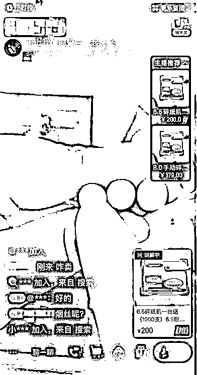

# 各种打暗号！竟然在直播间里卖......胆子太大

> 原文：[`mp.weixin.qq.com/s?__biz=MzIyMDYwMTk0Mw==&mid=2247537200&idx=7&sn=db114887d11eaf2397628e661fcf72dd&chksm=97cb9908a0bc101e6f4d06e68bf1adfd1133cf7d1392c7968f3fd2ef22ad7b5051c47bb617a4&scene=27#wechat_redirect`](http://mp.weixin.qq.com/s?__biz=MzIyMDYwMTk0Mw==&mid=2247537200&idx=7&sn=db114887d11eaf2397628e661fcf72dd&chksm=97cb9908a0bc101e6f4d06e68bf1adfd1133cf7d1392c7968f3fd2ef22ad7b5051c47bb617a4&scene=27#wechat_redirect)

近日有媒体报道称，在一些网络平台上，**有网络主播以各种暗号为掩饰，自以为可以逃避监管，直播贩卖烟丝和卷烟器等烟草专卖品。**

**烟丝叫“钢丝球”，滤嘴叫“粉笔”
网络主播直播间里打暗号售烟**

记者在网络直播平台上搜索“烟丝”等关键词，却出现了销售“钢丝球”的直播间，点击进入发现，**为了规避关键词，卖家往往会改名后再进行销售。**

**在直播间里，主播说的**“钢丝球”是烟丝、“笔管”或“粉笔”是卷烟纸滤嘴、“机器”是卷烟器**，其在现场演示如何自己卷烟，而全套设备都可以从平台购买。这名主播也承认是为了规避监管而换的词：“咱写的是粉笔，因为不让写（烟）知道吗？属于敏感词。”**

****

**这些直播间里往往只摆放着一些标有数字的粉笔、钢丝球等，乍一看不知道什么意思，一旦开始咨询，主播就会推荐直接购买“钢丝球”和“粉笔”或者转微信私聊，而发货的自然是烟管和烟丝。**

**也有的主播以在烟丝原产地为“卖点”，直接将烟丝的介绍拍摄成带货视频，下方就是销售链接。**

****平台：已下架多件烟丝商品
专家：如此售烟涉嫌违法违规****

**对于相关问题，一家直播电商的平台治理负责人表示，**在直播中以各种暗号打掩护售卖违禁商品，是整个行业长期以来面临的治理难题。**按照规定，严禁通过互联网销售烟草专卖品和烟草专用器械，但现实中仍有不法商家通过黑话、暗语或者故意“挂甲卖乙”的手段，绕开平台审核和日常管控。**

**由于不法商家的各种黑话、暗语一直在变种迭代，电商平台的治理团队也要不断应对新的变化。根据消费者的举报和平台的日常巡查，**近期下架了 5000 多件通过暗语售卖的烟丝商品并对相关商家进行了处罚。****

**除了直播平台，记者在某电商平台搜索“烟丝”，发现居然有不少卖家公然出售，很多评论都在千条以上。**

****

****中国控制吸烟协会副会长许桂华**告诉记者，**如此通过网络直播或短视频线上销售香烟已经涉嫌违法违规。**我国烟草专卖法规定，卷烟、烟丝、卷烟纸、烟草专用机械都属于烟草专卖品。**《烟草专卖许可证管理办法》第四十条规定，除了取得烟草专卖生产企业许可证或者烟草专卖批发企业许可证的企业依法销售烟草专卖品外，任何公民、法人或者其他组织不得通过信息网络销售烟草专卖品。****

**此外，即便不销售，**直播介绍烟草也涉嫌违反广告法禁止在大众传播媒介发布烟草广告的规定。**很多所谓“带货博主”“烟草博主”目的就是扩大营销推销烟草制品，对观看该平台的未成年人也会造成不良影响。**

**许桂华说：“任何烟草的直播带货，不是擦边球，是明目张胆地违犯广告法里规定的禁止一切形式的烟草广告和变相烟草广告。”**

## 

## 

## 

## 

## 

## 

## 

## 

## 

## 

**来源：中央广电总台中国之声，潇湘晨报**

**更多精华好文，请点击关注******

**← 向右滑动与灰产圈互动交流 →**

****