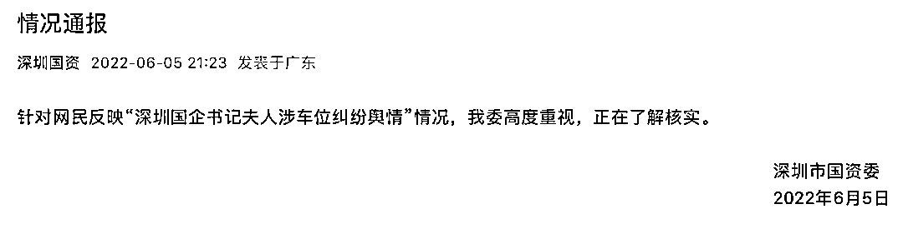
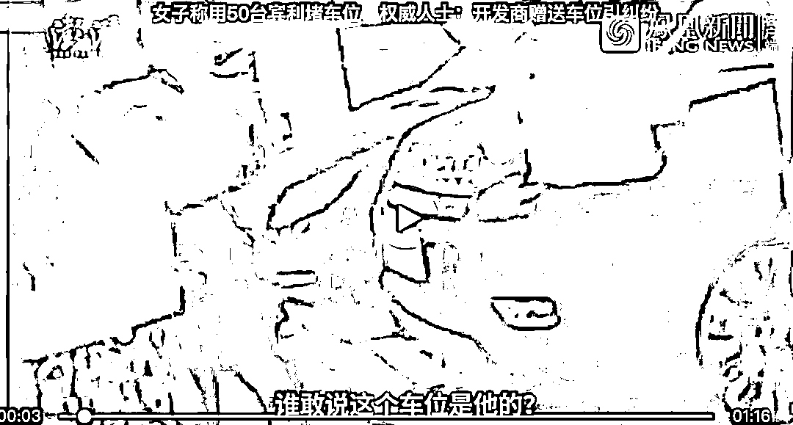
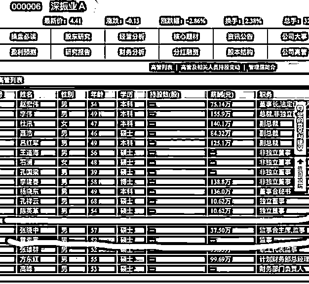

# "把我家 50 台宾利开过来堵上它"，深圳回应

> 原文：[`mp.weixin.qq.com/s?__biz=MzIyMDYwMTk0Mw==&mid=2247537275&idx=1&sn=3248814065a65375ed6a5c502bc7f92b&chksm=97cb9943a0bc105537fc5de00a090ec2a757ef5039936ea5a0899f7491a75db9cce47fdcd27a&scene=27#wechat_redirect`](http://mp.weixin.qq.com/s?__biz=MzIyMDYwMTk0Mw==&mid=2247537275&idx=1&sn=3248814065a65375ed6a5c502bc7f92b&chksm=97cb9943a0bc105537fc5de00a090ec2a757ef5039936ea5a0899f7491a75db9cce47fdcd27a&scene=27#wechat_redirect)

深圳市国资委官微刚刚发布声明，针对网民反映“深圳国企书记夫人涉车位纠纷舆情”情况，我委高度重视，正在了解核实。 

“把我的宾利开过来，都堵上它。”

“堵在这，我一个月宾利不用，我家有 50 台宾利不用。”

端午节假期，一则“宾利与劳斯莱斯车主打架”的视频在网上引起热议，同时也将深圳国资委旗下上市公司深振业 A（000006.SZ)高管送上了风口浪尖。

视频中，一位宾利女司机在生气地控诉其车位被占一月之久，并称自己的车位有买卖合同。从多段视频中可看出，现场还发生了肢体冲突，宾利女司机生气地推搡身边陪同人员说，开自家宾利来堵占车位的车辆。

 [`mp.weixin.qq.com/mp/readtemplate?t=pages/video_player_tmpl&action=mpvideo&auto=0&vid=wxv_2429810592644628482`](https://mp.weixin.qq.com/mp/readtemplate?t=pages/video_player_tmpl&action=mpvideo&auto=0&vid=wxv_2429810592644628482) 

随后女子与业主争吵愈演愈烈，产生冲突——

[`mp.weixin.qq.com/mp/readtemplate?t=pages/video_player_tmpl&action=mpvideo&auto=0&vid=wxv_2429812023992811520`](https://mp.weixin.qq.com/mp/readtemplate?t=pages/video_player_tmpl&action=mpvideo&auto=0&vid=wxv_2429812023992811520)

[`mp.weixin.qq.com/mp/readtemplate?t=pages/video_player_tmpl&action=mpvideo&auto=0&vid=wxv_2429828430717550593`](https://mp.weixin.qq.com/mp/readtemplate?t=pages/video_player_tmpl&action=mpvideo&auto=0&vid=wxv_2429828430717550593)

据物业工作人员称：**该车位使用权确为该女子所有。**

 [`mp.weixin.qq.com/mp/readtemplate?t=pages/video_player_tmpl&action=mpvideo&auto=0&vid=wxv_2429962706897371137`](https://mp.weixin.qq.com/mp/readtemplate?t=pages/video_player_tmpl&action=mpvideo&auto=0&vid=wxv_2429962706897371137) 

一位知情人士事情发生后在某微信群内发表言论称，该项目的公寓不好销售，开发商把这些停车位送给了公寓的业主，而纠纷的停车位在住宅楼下，上面没有挂私人牌，住宅的业主停在上面，因此就发生了纠纷。 

对于纠纷原因和事情进展，6 月 5 日，《每日经济新闻》记者致电了该项目物业工作人员，对方表示并不清楚该事件具体情况。

一位不愿具名的资深地产人士 6 月 5 日在接受记者微信采访时表示，深圳和其他城市不一样，车位基本上都没有单独的独立产权证，也就是依法属于业主共同共有，开发商不存在出卖的说法。

随后事情发酵，现场一位被宾利女车主推搡去开豪车的人员也被网友传出是深振业 A 高管张晓中。据上市公司公开资料，张晓中现任深振业 A 监事会主席和纪委书记，任期起始日期为 2021 年 5 月 12 日，终止日期为 2024 年 5 月 11 日。

据悉，张晓中为高级政工师。历任西藏军区边防第六团排长、副连长、司令部军务参谋、连长，西藏军区政治部正连职干事、副营职干事，西安政治学院政治部保卫处正营职干事，副团职干事，西安政治学院政治部组织处副处长(主持工作)，西安政治学院军事安全保卫系学员队政委、队长，深圳市国资委办公室(信访室)主任科员，深圳市国资委党委办公室副主任、主任，深圳市国有免税商品(集团)有限公司董事、党委副书记、纪委书记、监事会主席，2021 年 3 月起任深振业党委委员、纪委书记，5 月起任监事会主席。

同时 6 月 5 日晚间，网上又传出了一份情况说明，其中提到，“振业公司纪委高度重视，迅速组织工作组查清相关事实，现通报如下：张晓忠同志名下没有车辆，网传车辆为张晓忠同志爱人从朋友处借得临时使用。张晓忠同志平时工作较忙，忽视了家风建设，致使其配偶情绪激动之下发表不当言论，造成不良影响。公司党委已责令其本人作出深刻检讨。感谢广大网友对我司工作的支持和监督，下一步，我司将以此为契机，加大对党员领导干部的家庭家教家风建设。”

不过在这份网传说明中，张晓忠的姓名与振业集团公告和深圳国资委任免通知中的“张晓中”有出入。

针对该情况说明，《每日经济新闻》记者 6 月 5 日晚间电话、微信采访了振业集团董秘办工作人员，对方表示，这个回复并非发自公司，名字都写错了。而对于视频中人物是否为公司高管等问题，工作人员未再有直接继续回应。

深振业 A 投资平台上的贴吧也空前热闹起来，不少网友前往围观并发表言论。有网友评论称，“万万没想到，贵公司这样出名了，监事会主席的老婆要开 50 台宾利堵车库”、“明天会不会把 50 台宾利跌完”。

来源：每日经济新闻 甄素静

更多精华好文，请点击关注

← 向右滑动与灰产圈互动交流 →

