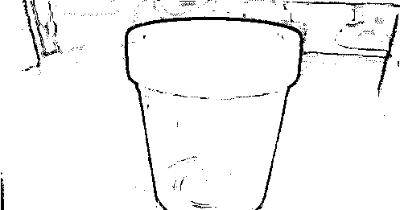

# “真身上阵，2 万一次”！可直接发生关系！地下捐精不堪入目真相曝光

> 原文：[`mp.weixin.qq.com/s?__biz=MzIyMDYwMTk0Mw==&mid=2247537275&idx=3&sn=93bda8a67ddfdffff8950c069b5e57bb&chksm=97cb9943a0bc1055a2dfd08b12896b53997447388396fd1aac71b8bc277b9e927a0dfe30df40&scene=27#wechat_redirect`](http://mp.weixin.qq.com/s?__biz=MzIyMDYwMTk0Mw==&mid=2247537275&idx=3&sn=93bda8a67ddfdffff8950c069b5e57bb&chksm=97cb9943a0bc1055a2dfd08b12896b53997447388396fd1aac71b8bc277b9e927a0dfe30df40&scene=27#wechat_redirect)

每个行业都有着灰色地带，如果不加以整治，那么就会变得乌烟瘴气，甚至是让很多不法分子有利可图。 

小时候，在大街小巷中经常能看到粘贴小广告的！其中出现频率最多的当属“重金求子”。

在当年这样的骗局非常流行，也确实有很多愣头青被钱蒙蔽了双眼，最终被骗的倾家荡产！

时隔多年，这招也已经老掉牙了，但随之而来的是一种全新的套路——地下捐精！

“地下捐精”这四个字，其实在我们生活中并不罕见。正规精子库不够用的情况下，就有不少上不得台面的地下捐精方式层出不穷。

打开社交软件， 关于捐精的社群多达几百个。

翻开贴吧，也能找到求助者发布的信息。在很多地方的男性公厕里，有不少捐精的小广告。一般这类广告中会写上高额的报酬，吸引了不少对金钱有渴望的年轻人前往。

杭州日报曾报道，一名记者为了了解地下捐精的内幕，暗访其中。

了解到基本捐精价格在 20000 一次，甚至可以通过直接“发生关系”的方法来进行交易......

中介称“去医院捐精太麻烦”，一般的捐精库需要对捐精者的身份进行保密处理，也就是说接受精子的女性对捐精人的形象一无所知。

所谓“地下捐精”，就是直接将精子送进对方的身体中，更加方便快捷。还说医院的成功率比较低，这种方式成功率高。

看到这各位应该大概明白了。这种所谓“地下捐精”，其实就是以非法的方式进行变相“卖 Y”。只不过是女性付费，男性提供服务而已。

事情曝光之后，被许多网友调侃，简直是花样百出，进行非法性交易还来这一套。

以“捐精”为名，却心怀鬼胎的大有人在。但事实上，在这条灰色产业里，还有更多不堪入目的内幕。

中介会抓住女买主想要迫切怀孕的心理。一开始的告诉她是正常的流程，并且会去医院，但一旦对方上钩，就会通过各种手段诱惑她“真身”上阵。这些女买家求子心切，确实很容易被骗。

其实不止是女性，很多男的对“捐精”这件事情，都有巨大的误解。比如之前有谣言说会有人帮你弄出来：只要用小脚指头想想，都知道这绝对是不存在的。

另外，还有说去“撸一管就行了”。其实也绝对没有那么简单。正规的捐精，其实手续非常复杂。

首先，他们对身高会有要求。

其次，会检查你的学历证明，大专以上的学历且智商正常。这两个要求之后，会有一系列的常规体检，比如遗传病，比如色盲、高度近视都是不行的。

不同地方的要求不同。标准更严格的甚至还有不少附加条件，比如严重秃头、严重肥胖的，这些也都不合格。

最后，通过层层筛选后，医生会给你一个小容器去排队取精。在取精室内自己解决，数量也是有一定要求的......

一切结束后，医生还会进行一些医学检测，看看活性符不符合要求。

之前曾经有，精子合格率不到 10%的说法。不过确实，现代人因为空气污染、熬夜、酗酒、蹦迪、抽烟、压力大等等原因。

大部分精子活性都不达标，尤其上班族，据说没有几个能达标的.....

总的来说，地下非法捐精就是一场巨大的骗局。所谓的”真身上阵“，不但可能不会提高成功率，反而会面临无数的风险。

一个连身体健康情况都无法保证的人，又怎么可能带你一个健康的孩子。何况，这种行为本身就是违法的，如果真的有这方面的需求，一定要去找一家正规的医院。

医院虽然价格比较昂贵，但是都是捐精者都是经过各种检查的，千瓦不要贪图小便宜，相信网上的虚假宣传，而那些听信了小广告的“捐赠者”，也不要以为自己能赚到。想要赚快钱，最后的下场就是人财两空。

如果你真的想通过“捐精”给自己补贴补贴生活，也请去正规的医院，但你别想着以此发家致富。

按照中国对精子库和生殖中心的相关法律法规，一个捐精者一生只能在一家精子库进行精液捐赠，并且当一个捐精者的精液让 5 名妇女受孕，或者精液在精子库的储存量超过 40 支的时候，就会被叫停。

这也意味着，“捐精致富”纯属痴人说梦，所以相信科学，也相信正规的医院。有些路，一旦走歪了，可就再难回头了。

来源：中国反诈骗联盟，大 R 科普，大 R 说安全，网络等

更多精华好文，请点击关注

← 向右滑动与灰产圈互动交流 →

