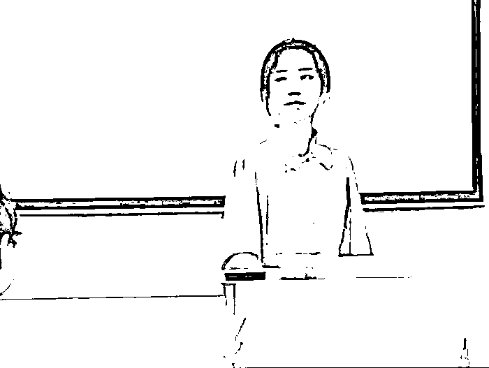
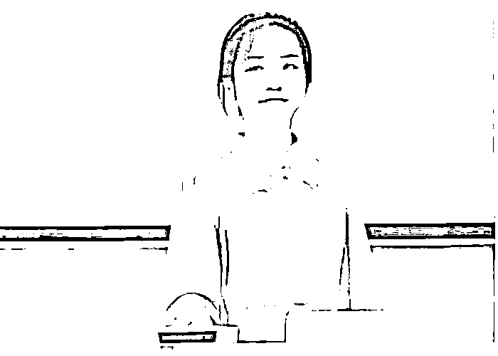

# “师媛”再惹争议！某地女老师上课时座无虚席，本应是好事，可网上却骂声一片！

> 原文：[`mp.weixin.qq.com/s?__biz=MzIyMDYwMTk0Mw==&mid=2247537275&idx=4&sn=b7858991f0814e54b87f2b1e1966dd56&chksm=97cb9943a0bc105550228821a6c8ec5e3906a7048330537a47d97e75e24c8976ca075228bee2&scene=27#wechat_redirect`](http://mp.weixin.qq.com/s?__biz=MzIyMDYwMTk0Mw==&mid=2247537275&idx=4&sn=b7858991f0814e54b87f2b1e1966dd56&chksm=97cb9943a0bc105550228821a6c8ec5e3906a7048330537a47d97e75e24c8976ca075228bee2&scene=27#wechat_redirect)

**如今，教师的队伍融入了新鲜的血液，年轻教师让教师团队气氛活跃起来，八零后，教师已经成为教师团队的中坚力量，九零后就是逐渐加入，让学生们的课堂焕然一新，起到积极作用。** 

我们常常说人不可貌相，却又说先敬罗衫后敬人，往往给人留下的印象的还是外貌，**颜值高的人总是更加受到关注，不管是在什么行业里。**教师团队更是如此，老师在讲台上侃侃而谈，几十名学生的目光聚集在一个人身上。

**这名老师的颜值也会成为学生茶余饭后的话题，如果有哪名老师颜值高，会受到学生们热情的喜欢。**尤其是在大学校园里，学生们思想开放，有想法，颜值高的教师不仅能让班级的学生准时上课，**有时候还能吸引其他班级的学生旁听。**

**上海一美女大学老师，穿着酷似“港风女神”，学生上课座无虚席。**

高颜值的教师总被学生们关注，像我们之前提到过的酷似“司藤”的女老师，穿着打扮非常的有个人风格，还有一名有异域风情的西班牙语老师，她整个人的气质都与众不同。近日，上海一所高校女教师走红，不仅颜值高，举手投足间的气质，更让人心动。

这名教师在上课的时候，被学生无意间拍到而走红网络。我们能看见证明教师的外表很优越，颜值高，气质佳，一头乌黑亮丽的卷发，是很多女生都想拥有的，她的穿搭也很有特色，酷似港风电视剧的女主角。

这样的课堂谁不爱？学生们座无虚席，**还有很多其他专业的学生来蹭课，同学们问她问题也会耐心解答。**

随着网友的仔细观看，有的人说在她的脸上看见了高科技的成分，这名老师打扮得过分精致，**难道这就是传说中的“师媛”吗？**

不得不说，教师的打扮非常的有讲究，大学老师往往是一种学者的形象，不仅仅是大学老师，他在行业里面也有一定的地位，能在这个专业成为大学生的教师，说的他的专业能力是有一定高度的。

**所以大学老师的穿衣打扮要求，并不像中小学教师那样死板，中小学阶段学生学习压力非常大，为了能让学生集中精神，在讲课的时候，老师的穿着不能写学生的目光，所以在我们眼中，中小学教师的形象总是非常朴素，甚至有的教师看着有点寒酸。**

但是大学老师就不同了，他们对学生的上课方式跟中小学有所区别，要更加灵活更加深奥，所以大学老师的形象要求相对复杂，不同专业的教师要求不同。比如说，艺术类相关专业的教师，打扮得要更加有特点，色彩要丰富时尚，能体现出教师的品味。

而金融经济相关专业，他的川大往往会更加偏向于职场一些，因为这些专业与数字打交道，要求学生们有思维逻辑缜密，严谨。

**作为一名教师，尽量不要蓬头垢面地出现在学生的面前，因为一个教师的形象和气场，会影响学生的听课效率。**

**大家应该更加关注教师的学术成果**

作为一名教师的最基本要求，是品德高尚，德业课水平突出。一般大学教师至少是研究生学历，而老师给学生带来的更多是知识成果，以及学生在获取知识后的深度思考，这期间不仅需要教师的知识传输，还需要引导。

所以学生的学习效率，和成绩，跟教师有着不可分割的关系。所以大家在上课的时候，应该更加关注教师课堂上所讲的内容，在课后要关注教师的研究成果，而一些外在的东西都是次要的，学生们终究是要用个人实力来实现自我价值。

**我们所看到的就是外在形象好，气质好，其实不仅仅是穿衣打扮，更是内在的修炼。**他们脸上的从容和平和，是一种看透了荣誉，了解了知识，读了很多书之后，进行深度思考，最终返璞归真的一种表现。其实我们在老教授的面容上，更能看出这一点。

**所以学生在关注老师的外表同时，更要关注这名老师平时良好的生活习惯和自律的学习习惯，**正是因为有了这些努力，才能达到经济独立，给自己一个精致的外表，也正是这些努力，让他们能有气质上的提升，**在说话的时候非常有水平，在讲课的时候有耐心，在刻上解答问题的时候愿意倾听。**

至于网友所说的该大学教师是否是“师媛”，个人认为不应该仅凭自己的固有印象就随意通过穿着对一个人做出恶意中伤的评价。

来源：大 R 说安全，中国反诈骗联盟，大 R 科普

更多精华好文，请点击关注

← 向右滑动与灰产圈互动交流 →

