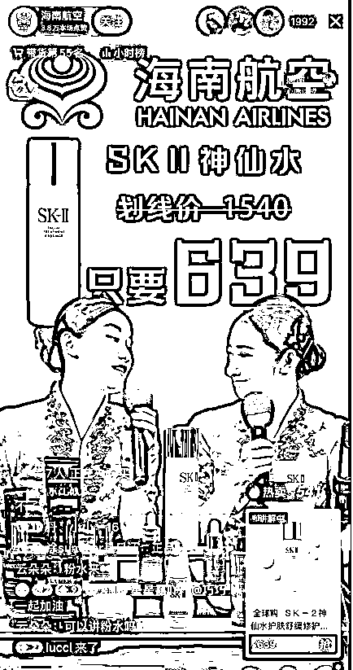
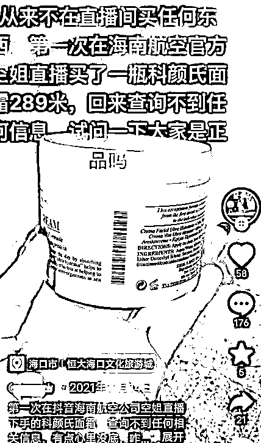
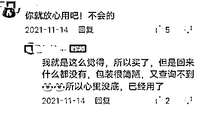
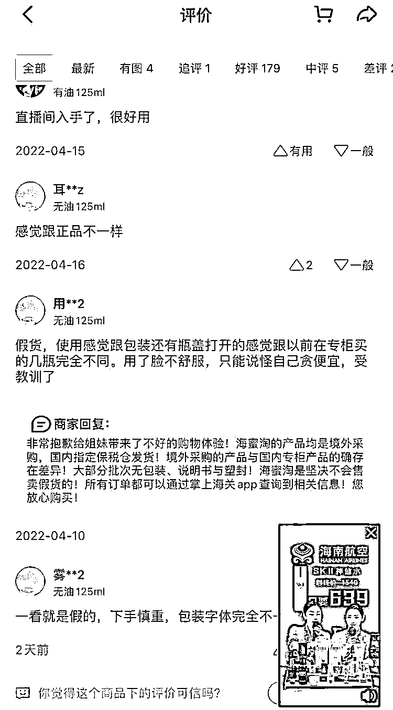
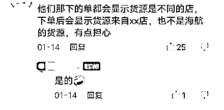
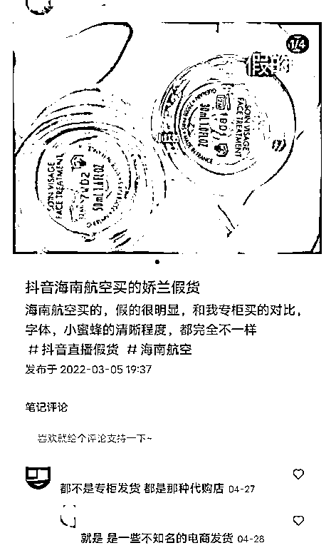
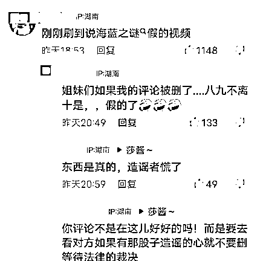
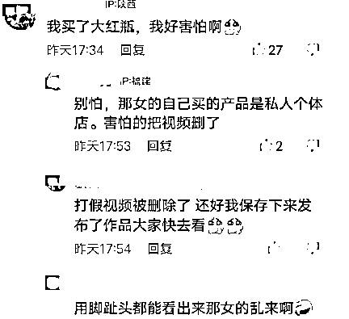

# 海航空姐转行直播带货，网友举报：曝假货传闻？

> 原文：[`mp.weixin.qq.com/s?__biz=MzIyMDYwMTk0Mw==&mid=2247537275&idx=5&sn=c1e12398ea2c65686d6039d2aaed9ac0&chksm=97cb9943a0bc1055394e5eb1e6290b79182871837f539bb1b2cca2e0ce546f1f2df8ec8e602a&scene=27#wechat_redirect`](http://mp.weixin.qq.com/s?__biz=MzIyMDYwMTk0Mw==&mid=2247537275&idx=5&sn=c1e12398ea2c65686d6039d2aaed9ac0&chksm=97cb9943a0bc1055394e5eb1e6290b79182871837f539bb1b2cca2e0ce546f1f2df8ec8e602a&scene=27#wechat_redirect)

疫情对航空公司的影响是巨大的，航班大幅度停飞让多家航空公司亏损连连。

最新数据显示： 

2020 年，民航行业亏了 974 亿元；

2021 年，亏了 842 亿元；

2022 年前两个月，亏了 222 亿。

疫情后加起来已经亏损 2111 亿，其中航空公司亏了 1706 亿。

在疫情前五年，2015-2019 年，航空公司赚了 1604 亿元。

一场疫情，让中国民航业亏掉了前 5 年的利润。

为了寻求出路，多家航空公司开启副业，空姐变身带货主播，打响直播之战。

**疫情改变其实不仅是行业生态，更改变了大家的思维模式。**

自从直播带货开始兴起以后，无数网红和明星等知名人物纷纷开始转型，都想从直播带货的红利中分一杯羹，因此也有不少网友表示：“流量的终点就是直播带货。” 

**很多事，不是有了希望才做，而是做了才有希望。**

到后来疫情爆发，更是把直播带货所涉及的领域不断抬高，也吸引了更多的人加入到直播大军，甚至就连海南航空和中国邮政等官号也开始了直播带货。

正因为是官号，所以即便没有怎么宣传，直播间的人气也能保持了不小的数量，也有很多网友的第一次直播购物体验给到了这些官号。 

关于航空公司带货的争议也有很多，例如这些直播间里，很多外资美妆品牌价格低过免税店，比如，某天海南航空直播间 SK-II 小灯泡售价为 639 元，而同款产品在中免日上 APP 活动价则为 959 元；南方航空环球购橱窗迪奥 999 哑光唇膏售价为 199 元，日上优选却是 270 元。

价格差异如此大，消费者对此也对产品是否为“假货”产生了质疑。

对于这些质疑，南航直播人员称他们所有的产品都是跨境商品，因为是南方航空跨境电商与保税仓的合作，全部都已经免过税，才会有这样低的价格。

而在海南航空已售产品评论区，假货、没有条码贴和塑膜封装、使用感和专柜不一样等评论不在少数。

对此，海南航空回复产品均是境外采购，国内指定保税仓发货。境外采购的产品与国内专柜产品的确存在差异，大部分批次无包装、说明书与塑封，坚决不会售卖假货。

出于对官方的信任，一般不会怀疑官号直播带的货有假，然而从今年开始，不断有网友表示海南航空直播间买的化妆品是假货。

最近，抖音上有位网友投诉海南航空售卖的“海澜之家”化妆品是假货，导致大批网友到海南航空的评论区质问。 

随后，该网友又将视频删除，**疑似是在私营店买了假货故意嫁祸给海南航空。** 

第二天，海南航空官号针对“假货”质疑发布了回应视频，表示“直播间所售商品均为保税仓直发，购买的全球购跨境商品可通过掌上海关 app 查询产品出库的清关记录。” 

按理来说，作为海南航空官方，确实不会跨专业带货还要砸自己的招牌。 

同时也有网友反映，很多官号直播间里的带货主播业务能力较为低下，希望作为官方，在保证产品质量的同时，也能提高带货主播的业务能力，这样才能在带货领域取得越来越好的成绩。

两年多过去了，反正我是不害怕新冠，我反而有点怕这种无休无止不断升级的抗疫。

很多人的想法会不会也和我一样，希望一切早点过去，让所有的人回到正常的生活，这才是我们要追求的生活。

来源：中国反诈骗联盟，大 R 说安全

更多精华好文，请点击关注

← 向右滑动与灰产圈互动交流 →

