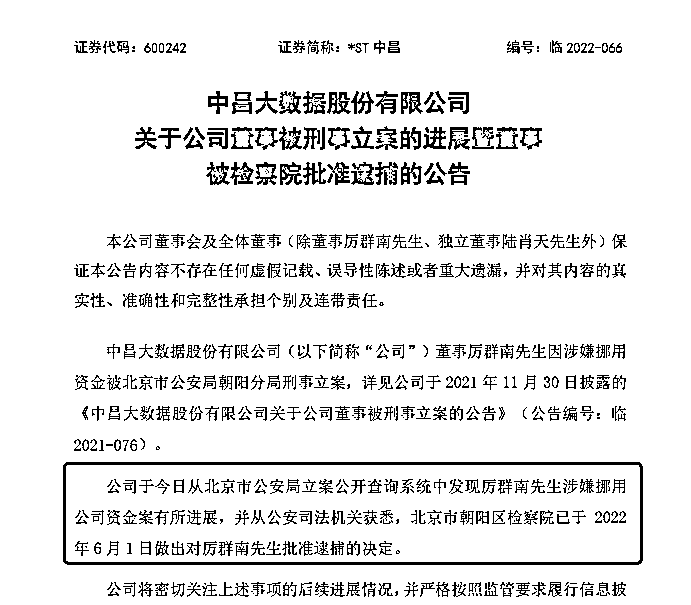
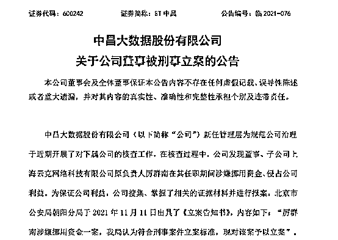
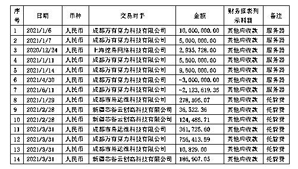
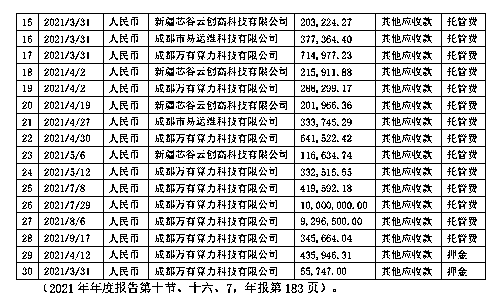
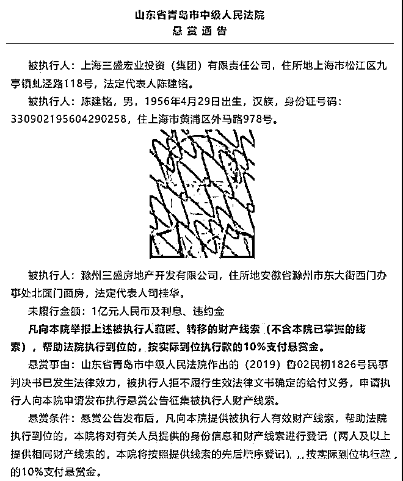
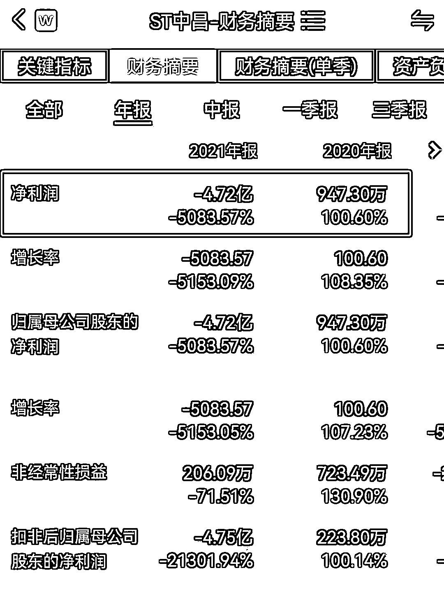
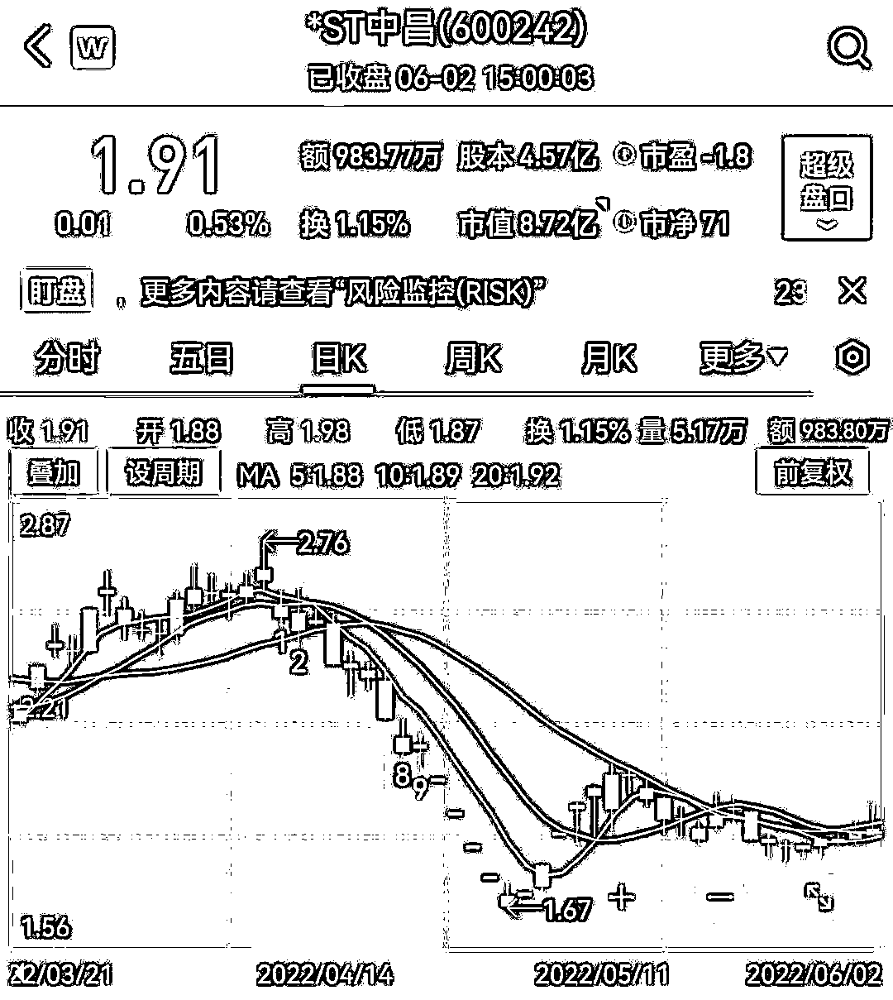

# 某“董事长”挪用 5000 多万，全部买比特币矿机！已被捕！

> 原文：[`mp.weixin.qq.com/s?__biz=MzIyMDYwMTk0Mw==&mid=2247537275&idx=6&sn=f9757c4169fa50d6ca7e585b32e08eca&chksm=97cb9943a0bc1055c2b3ed6742483e6dc6e646f4e86a28d2825b5ca764f7e5761b706a3f0801&scene=27#wechat_redirect`](http://mp.weixin.qq.com/s?__biz=MzIyMDYwMTk0Mw==&mid=2247537275&idx=6&sn=f9757c4169fa50d6ca7e585b32e08eca&chksm=97cb9943a0bc1055c2b3ed6742483e6dc6e646f4e86a28d2825b5ca764f7e5761b706a3f0801&scene=27#wechat_redirect)

天网恢恢，疏而不漏……

前段时间，大家关心的“上市公司董事挪用公司资金购买比特币矿机”的最新进展来了。

6 月 2 日晚间，*ST 中昌公告称，公司董事厉群南因涉嫌挪用资金被北京市公安局朝阳分局刑事立案后，公司从公安司法机关获悉，北京市朝阳区检察院于 2022 年 6 月 1 日做出对厉群南批准逮捕的决定。

**“80 后”前董事长私刻公章**

**挪用 5300 多万“挖矿”** 

公开资料显示，*ST 中昌董事厉群南，1982 年出生，本科学历，曾担任比亚迪汽车销售有限公司北方事业部总监;吉利汽车销售有限公司综合部部长;北京点信时代网络科技有限公司 CEO。

此前还曾担任上海云克网络科技有限公司董事，曾担任中昌大数据股份有限公司董事长、总经理。案发前为*ST 中昌董事，2020 年年薪为 76.8 万元，2021 年变为董事之后，年薪仅 32.83 万元。

不知道是不是因为降薪，厉群南挪用公司资金购买矿机，并将收益归为己有的时间段，正好是其担任董事长期间。

更奇葩的是，在其卸任董事长担任董事的时候，他仍然利用手上未交出的公章，继续用公司资金给自己买的矿机付托管费。

到底是怎么回事儿呢？

2020 年 10 月，*ST 中昌大股东，昔日的百亿地产富豪陈建铭曾打算通过定增股份，让时任董事长厉群南成为新的实控人。但这一方案在 2019 年 6 月宣布作罢。不久后厉群南卸任董事长，由凌云接任。

有意思的是，2021 年 9 月，公司却披露，双方交接一个多月，厉群南却未移交公章，"赖章"事件一时闹得沸沸扬扬。接着去年 11 月，公司又公告称，董事厉群南涉嫌挪用资金、侵占公司利益，公司搜集、掌握了相关的证据材料并进行报案，公安机关已予以立案。

11 月 29 日晚间，*ST 中昌发布公告称，公司新任管理层为规范公司治理于近期开展了对下属公司的核查工作，在核查过程中，公司发现董事、子公司上海云克网络科技有限公司原负责人厉群南在其任职期间涉嫌挪用资金、侵占公司利益。

嫌疑人被公安机关刑事拘留 5 个月之后，案件的细节才浮出水面。

根据*ST 中昌 5 月 14 日回复上交所问询函公告，董事、子公司上海云克网络科技有限公司（简称“上海云克”）原负责人厉群南在任职期间，本该用于公司经营的资金被挪为他用，例如厉群南涉嫌挪用资金购买矿机及支付托管费、厉群南自行决策并支付资金进行对外投资、未执行审批流程擅自转移公司资金等。

此外，厉群南涉嫌私刻公章，伪造或变造公司文件，以消除前期公司对其以非法侵占目的挪用公司资金的事项。

其中，根据公告披露，公司检查合同发现，2021 年 1-9 月，公司为购买服务器事项而支付的 2781.21 万元款项，并未在公司账面或实质形成资产。

同时核对该类资产采购合同发现，其采购内容为：神马矿机（型号：M31S-76T44W）、超算服务器（型号 S10Pro），均为当下主流的比特币矿机，其用途仅为比特币挖矿，并不能应用于公司经营业务。且公司日常经营无需大规模购置服务器作为业务支撑，仅按需租赁上游行业服务器流量即可。

此外，公司为托管费事项而支付的 2524.34 万元款项，均为托管上述矿机形成的费用，公司为押金事项而支付的 49.17 万元款项，也为上述矿机托管的押金，总额约为 5354.72 万元。

公司表示，截至该公告披露日，公司并未盘点到厉群南涉嫌挪用公司资金擅自购买的矿机相关资产；厉群南涉嫌挪用公司资金擅自支付高额托管费，但公司亦未获取相关收益。

同时，据了解，公司报案后，北京市公安局朝阳分局于 2021 年 11 月 11 日就厉群南涉嫌挪用公司资金案出具立案告知书，并要求厉群南到公安机关现场接受询问配合调查且给予充分时间，但厉群南一直拒不配合。

**大股东已自首**

**市值蒸发近 110 亿**

说到*ST 中昌，股民朋友们除了知道它今年来内斗不断，10 个月换了 3 个董事长之外，还对它的大股东印象格外深刻。 

虽然陈建铭早在 2018 年就以 100 亿元身家登上《2018 年胡润百富榜》，但是真正让陈建铭全国皆知的，却因为一封悬赏通告。

2021 年 8 月 31 日，青岛市中级人民法院就上海三盛宏业投资（集团）有限责任公司、实际控制人陈建铭发布悬赏通告。

青岛市中级人民法院表示，凡举报上述被执行人藏匿、转移的财产线索，帮助法院执行到位的，按实际到位执行款的 10%支付悬赏金，最高达 1000 万元。 

而悬赏通告中的三盛宏业即 ST 中昌的控股股东，陈建铭则为实控人。

2019 年开始，三盛宏业资金链断裂，爆出危机，全国项目大面积停滞、资金被监管等多重问题集中出现。并在 2020 年年初，因业绩不佳及债务压力，三盛宏业向法院申请破产重整，在被法院悬赏“寻人”之前，证监会刚“拉黑”陈建铭。

根据通告，在 2018 年 2 月 9 日至 2019 年 1 月 16 日期间，陈建铭、谢晶、胡侃控制使用“蔡某波”等 101 个证券账户，利用资金优势、持股优势连续集中交易“中昌数据”，同时在自己实际控制的账户之间交易，影响“中昌数据”交易价格，共计获利 1147 万多元。

因此证监会决定罚没其非法所得，并处以 2294.45 万元罚款；对陈建铭采取 10 年证券市场禁入措施，对谢晶采取 5 年证券市场禁入措施。

陈建铭“失踪”后，*ST 中昌陷入混乱中。

原董事长在其位不谋其政，侵占公司利益，这使得*ST 中昌这两年一直处于风雨飘摇中，多位高管离职，净利润由盈转亏。财报显示，*ST 中昌 2019 年巨亏 14 亿之后，2020 年勉强盈利 947 万元；随后 2021 年又曝出净亏损 4.72 亿元。

Wind 数据显示，截至 2022 年 6 月 2 日收盘，8ST 中昌报 1.91 元/股，较 2017 年 3 月股价高点 25.57 元/股缩水超九成，总市值蒸发近 110 亿元。 

根据 2022 年 1 月 8 日，*ST 中昌公告显示，公司近日收到实际控制人陈建铭通知，陈建铭已于 2021 年 12 月 24 日主动前往上海市公安局，配合上海市公安局调查操纵证券市场案，上海市公安局决定对其取保候审，期限从 2021 年 12 月 25 日起算。

大股东自首、原董事长被刑事立案，*ST 中昌又被实施退市风险警示，苦苦留守的 2 万多股东将何去何从？

来源：中国证券时报

更多精华好文，请点击关注

← 向右滑动与灰产圈互动交流 →

