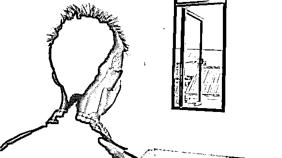
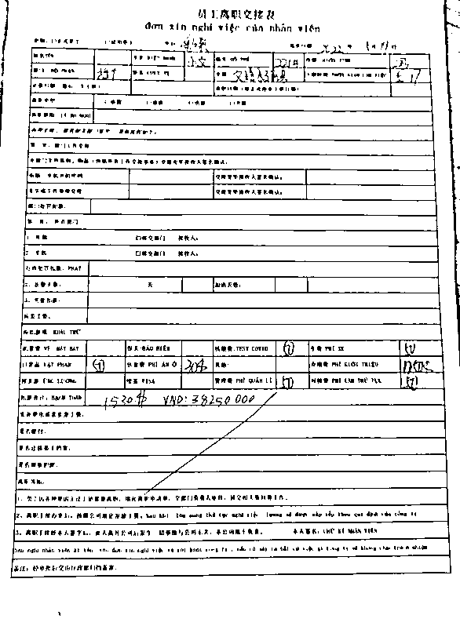
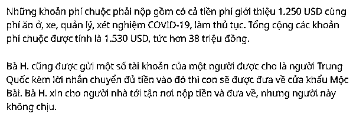
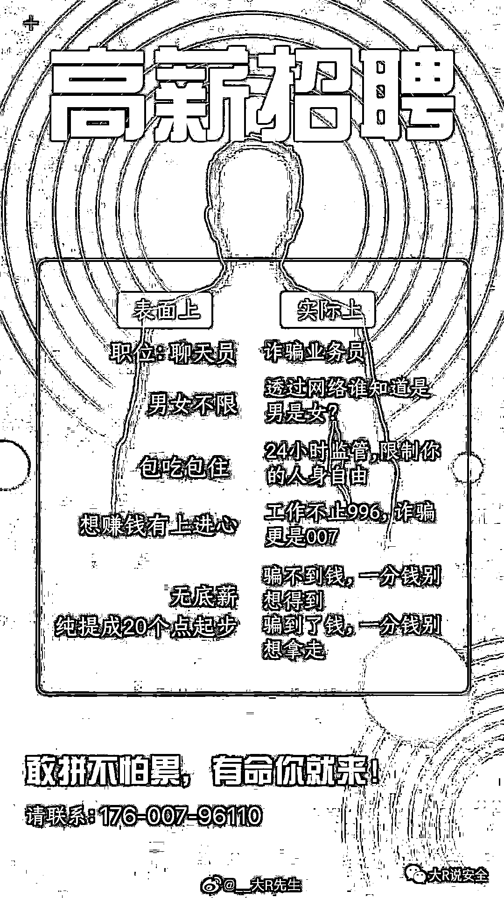

# 越南多人陷入“高薪工作”骗局，被卖到柬埔寨遭囚禁殴打，幕后黑手疑似是中国人？

> 原文：[`mp.weixin.qq.com/s?__biz=MzIyMDYwMTk0Mw==&mid=2247537275&idx=7&sn=84fea89522c53b7fd701394d8410e3b6&chksm=97cb9943a0bc105590e7b534985bcaba8173f278b8fcbc6103396df4af6ea14486666a3cf671&scene=27#wechat_redirect`](http://mp.weixin.qq.com/s?__biz=MzIyMDYwMTk0Mw==&mid=2247537275&idx=7&sn=84fea89522c53b7fd701394d8410e3b6&chksm=97cb9943a0bc105590e7b534985bcaba8173f278b8fcbc6103396df4af6ea14486666a3cf671&scene=27#wechat_redirect)

听邻居说，可以带他到西宁的一家大型电脑公司工作，月薪能达到 2500 万越南盾，越南广治省 17 岁的小男孩 T. 心动了，他表示愿意和邻居一起去西宁，然后他就坠入了“高薪工作”的骗局...

在前往西宁省的车上，T. 表示他还看到了另外 7 个人，和他年龄相仿。

**0****1**

**“高薪工作”骗局**

**“一行人于 5 月 15 日前往西宁省，8 个人在车上相识，但他们只是偷偷的聊了一下天。之后，一行人被带到一间咖啡馆，那个时候，他们根本没有人想到自己被骗了。**

**T. 表示，在那间咖啡馆，他们每个人都分到了一份午餐。他们吃完午餐后，就被喊上车，然后一行人在车上睡着了。**

**“当我醒来时，我发现自己在一个小木屋里，有一群人拿着枪守着我们，我们很害怕，要求回去，其中一个人说这里是柬埔寨的边境，如果一定要回去，我们就会被‘处理掉’。”T.回忆道。**

**最后，他们一行人被带到了一栋 9 层高的宿舍楼内，周围都是高高的栅栏。“最可怕的是，我看到这里有几十个穿着防护服的人，每个人守着一个房间，每个人都有枪和电棍。”T.说道。**

**T.表示，进入这个所谓的公司的第一天，他们一行人被一个年轻的越南语翻译女孩带到了一个有很多电脑的房间里。这个人教他们这群人如何通过网站进行电信诈骗，T.和几个年轻人拒绝学习诈骗技巧，然后一切就暴露了，这份工作根本不是之前承诺的“高薪工作”。**

****

**T.秘密拍摄的照片，照片由 T.家人提供**

****02****

******要求交付赎金******

****“这时候，这家公司的人通过翻译跟我们讲，他们花了 1250 美元买我，我需要在这里工作 6 个月才能还债。如果拒绝工作，就要给家里人打电话，5 天之内把钱寄过来就可以赎回我。否则，我将会被他们卖到菲律宾去。“T 说道，直到那个时候他才反应过来，他是被邻居“卖”掉了而不是带去上班。****

****他们一行人都是贫困山区家庭的孩子，听到赎金高达上千美元时，吓了一跳，于是他们决定想办法逃跑。然而，根据 T. 的说法，他们没能成功逃脱逃，他们被发现并被抓了回去，还被电棍殴打， T. 最终打了电话回家...****

****T. 的母亲 H 女士表示，他们非常爱自己的孩子，所以决定不惜一切代价借钱赎回他。在交流过程中，翻译员发了一张预先打印好的用中文和越南文写下了“员工离职交接表”的文件给他们，表上还附上了他们需要支付的费用。****

********

****文件中有 T. 的母亲想要赎回孩子必须支付的金额，照片由 T. 的家人提供****

****应支付的赎回费包括介绍费（1250 美元）、住宿费、车辆费、管理费、COVID-19 检测费和入住费等，总共计算的赎金为 1530 美元即 3825 万越南盾。****

****H 女士还收到了一个“中国人”的账号，并附带信息称如果向这个账户转入足够的钱，他们就会将她的孩子带到木排（ Mộc Bài）边境口岸。H 女士表示让她的家人到现场一手交钱一手交人，但这个要求被拒绝了。****

********

****5 月 20 日，H 女士将对方要求的金额转入指定账户，当天下午，T.被一名男子带到口岸办理回国手续。与 T.一样愿意交赎金回国的还有另外 2 人，T.表示这 2 个人在他回国之前就已经被送回去了。****

****越南广治省向化县人民委员会主席Đặng Trọng Vân 先生在与越媒交谈时表示，他将指示县警方立即核实这一事件。“我会让当地警方核实是否有与该案件相似的案件。” Vân 先生说。****

******03******

********小心“高薪工作”骗局********

******据木排国际边境口岸边防站负责人 Trần Đăng Dũng 上校称，这段时间有不少非法出入境的人表示，他们是在社交网站上看到了去柬埔寨工作的相关信息，那些招聘信息都显示工作轻松，且薪水诱人，薪资达到了 700 - 1000 美元/月。******

******事实上，这些人前往柬埔寨或其他国家时，却发现工作跟招聘信息上的完全不一样，如果他们想回国，就必须支付赎金。******

******Dũng 上校劝告民众要警惕骗子利用社交网络设立的 “高薪工作”、“高薪境外工作”陷阱。如果有民众已经被引诱到了柬埔寨，请尝试联系越南和柬埔寨当局以及边境口岸的边防警察寻求支持。******

********04********

******许多青少年被骗******

******在柬埔寨金边的柬埔寨越南协会会长 Sym Chi 先生在回应越媒采访时承认，在过去的一段时间里，有越南人在柬埔寨活动，然后将其他越南人带到柬埔寨工作。他们使用社交网站，有些甚至冒充柬埔寨越南协会，以有吸引力的薪资从越南招聘人员。******

******大多数受害者是来自越南北部和中北部省份的青少年，此外还有少数来自南部省份和柬埔寨的越南裔人。******

******被他们诱骗过来的民众多在柬埔寨的西哈努克省（西港）、柴桢省、国公省等地的建筑工地或在线赌博场所工作，这些场所大多由中国人拥有。******

******抵达后，他们就会发现工作条件不如预期，甚至会被监禁、虐待，了解了实际情况之后，有些人会选择逃跑，而有些人则失踪了。前段时间还发生了一起一名来自西哈努克省的越南裔年轻人跳楼身亡的事件，柬埔寨越南协会、越南驻西哈努克领事馆和越南大使馆也收到了大量与上述情况有关的信息。******

******特别是，柬埔寨越南协会还收到了许多来自越南的被骗进入柬埔寨的人的求助电话。“我们已经与越南驻柬埔寨大使馆联系，与柬埔寨当局协调，在西哈努克营救了近 300 名越南工人……但是，被骗、求救的情况仍然存在，我们也还没有完全掌握具体的情况。”Sym Chi 先生说道。******

******不仅越南，“高薪工作”骗局在中国国内也时有发生，官方更是多次提醒大家要注意防范，警惕所谓的“高薪工作”，还有媒体总结了骗子的套路！******

********揭秘骗子的套路********

**********1、虚假招聘 高薪诱饵**********

**********通常，境外诈骗窝点大量发布招募信息：不看学历，不看年龄，不需要工作经验。只要来境外，月入几万不是梦。**********

************2、露出獠牙 逼迫诈骗************

**********诈骗窝点把国人骗到境外后，不法分子就露出了獠牙：他们会没收手机，强迫从事杀猪盘、裸聊、投资理财等电信网络诈骗活动。**********

************3、丧失理智 诈骗亲友************

********部分人员会以虚假高额工资招工为诱饵，先行垫付机票，诱骗亲友进入边境偷渡境外，让亲友陷入泥潭。********

********************************

**********所谓的高薪，背后都会要你的命********** 

**********月薪过万是一种怎样的感觉?**********

**********在北上广深地带，许多人会告诉你，月薪过万只够刚刚维持基本的生活开支。但在国内，刚毕业的大学生，薪资普遍在 3000~4500 一个月。所以，对于还没有获得过高工资的时候，对于月薪过万，往往有一种盲目的执着与期待。**********

**********人性都是这样：**得不到的，永远在骚动！************

**********当有一份月入过万的工作摆在你的面前，是选择安逸地拿着每月 3000 元的工资，还是趁着年轻，搏一把？**********

********************

**********相信，有些人会选择后者。**********

********************

**********最后，不管你在哪里，在哪个国家，遇到所谓的“高薪工作”都一定要警惕，尤其是那种宣称钱多事少还要出国的工作，毕竟天上不会掉陷阱，别为了一时的利益，害了他人害了自己！**********

************警 方 提 示************

********（一）对于“高薪资、低风险”的境外务工招聘信息，一定要提高警惕，切勿轻信！天下没有免费的午餐，缅北并不是想象中的“天堂”，也可能是“炼狱”。轻信高薪境外务工，极可能丢掉健康甚至是生命！********

********（二）根据我国法律规定，偷越国(边)境，开展电信诈骗、进行赌博活动是违法犯罪行为，危害极大，害人又害己，违法犯罪之事不可做！********

********（三）找工作可到当地公共人才服务机构求职，也可登录本地人才网、公共招聘网站以及学校校园招聘网站查询招聘信息，一定要通过正规、合法的劳务中介外出务工。********

********（四）如遇紧急情况，应及时向当地公安机关报警，如在境外遭遇危险应及时联系中国驻当地使领馆寻求帮助！********

************外交部开通了全球领事保护与服务应急呼叫热线，号码是“12308”，大家无论身在何处，遇到紧急情况，都可以拨打这个热线号码求助。在境外可以拨打“0086-10-12308”，在境内北京以外地区可以拨打“010-12308”。************

********来源：越南生活通，中国反诈骗联盟********

********更多精华好文，请点击关注************************

********← 向右滑动与灰产圈互动交流 →********

****************