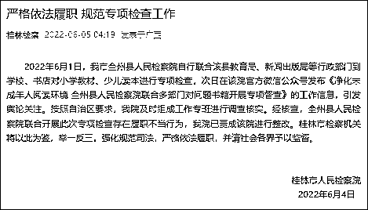
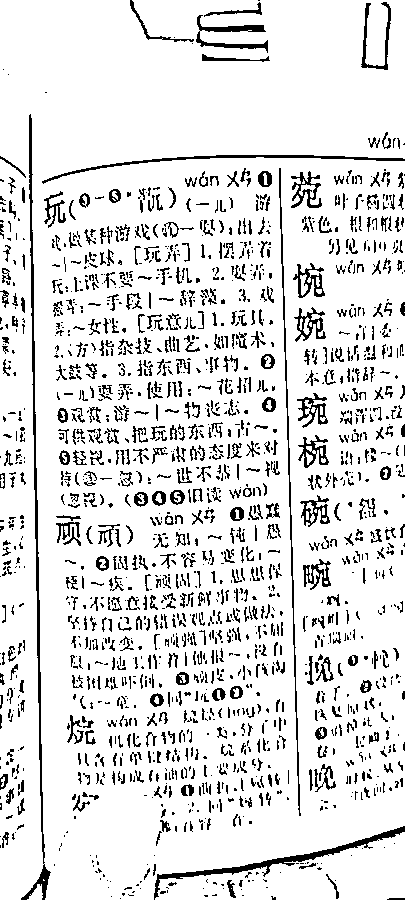

# 全州县检察院被整改：对新华字典等执法不当

> 原文：[`mp.weixin.qq.com/s?__biz=MzIyMDYwMTk0Mw==&mid=2247537275&idx=8&sn=1fc96287b2972fb7c97ccedd83a0bcb0&chksm=97cb9943a0bc10558450be599e7b88b1f07a6f43a1c44d2400016b346d369d13576bdad1e4d2&scene=27#wechat_redirect`](http://mp.weixin.qq.com/s?__biz=MzIyMDYwMTk0Mw==&mid=2247537275&idx=8&sn=1fc96287b2972fb7c97ccedd83a0bcb0&chksm=97cb9943a0bc10558450be599e7b88b1f07a6f43a1c44d2400016b346d369d13576bdad1e4d2&scene=27#wechat_redirect)

广西桂林市人民检察院官方微信公众号“桂林检察”消息，2022 年 6 月 1 日，桂林市全州县人民检察院自行联合该县教育局、新闻出版局等行政部门到学校、书店对小学教材、少儿读本进行专项检查，次日在该院官方微信公众号发布《净化未成年人阅读环境 全州县人民检察院联合多部门对问题书籍开展专项督查》的工作信息，引发舆论关注。 

按照自治区要求，桂林市人民检察院及时组成工作专班进行调查核实。**经核查，全州县人民检察院联合开展此次专项检查存在履职不当行为，桂林市人民检察院已责成该院进行整改。**桂林市检察机关将以此为鉴，举一反三，强化规范司法，严格依法履职，并请社会各界予以监督。

此前，“广西全州县检察院”公众号发文称，6 月 1 日，全州县人民检察院联合县教育局、全州县新闻出版局等部门工作人员，深入全州县 2 所小学、新华书店等城区多家书店对相关小学教材、少儿读本进行专项督查。

检查过程中，检察官和执法人员**发现某些书店售卖的部分新华字典及儿童读物存在出低俗化内容与配图**的情况。执法人员当场责令下架整改，并提出整改意见，要求书店严防小隐患累积成大风险。

据极目新闻此前报道，第 11 版《新华字典》近期引发网友关注甚至争论。该字典在对“玩弄”一词进行释意时，使用了“玩弄女性”的例词。 

对此，有网友认为“玩弄女性”涉嫌歧视女性。也有网友说，当孩子查字典看到这个例子时，都不知道怎么跟孩子解释。还有网友表示，字典作为工具书只是解释了字、词的如何使用而已。

记者实拍

来源：观察者网综合

更多精华好文，请点击关注

← 向右滑动与灰产圈互动交流 →

