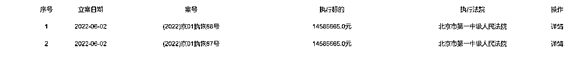

# 罗永浩被恢复执行 2917 万，“真还传”成色几何？

> 原文：[`mp.weixin.qq.com/s?__biz=MzIyMDYwMTk0Mw==&mid=2247537317&idx=1&sn=d6c9944757e1d37c8645b02b9664d820&chksm=97cb999da0bc108ba6c006293893d249b3f3b1ace6f6a2374f75cb2ed928e2bca69df151c075&scene=27#wechat_redirect`](http://mp.weixin.qq.com/s?__biz=MzIyMDYwMTk0Mw==&mid=2247537317&idx=1&sn=d6c9944757e1d37c8645b02b9664d820&chksm=97cb999da0bc108ba6c006293893d249b3f3b1ace6f6a2374f75cb2ed928e2bca69df151c075&scene=27#wechat_redirect)

6 月 6 日，红星资本局注意到，罗永浩又一次因为“新增被执行人信息”引起舆论热议，自今年 3 月以来，这已经是第三次。

对此，“交个朋友直播间”回应称，这是锤子科技经营手机业务期间产生的公司债务，目前该笔债务已经按预定的支付计划处理完毕，法院恢复执行的目的是进行结案程序处理。6 日下午，罗永浩本人也通过微博表示：**“这笔债务已经支付完了，法院恢复执行是为了结案程序。每还一笔钱，都会害得亲友们担心一次。”**

也就是说，“新增被执行人信息”不是罗永浩再次“欠钱”，而是因为“还钱”。

红星资本局注意到，今年 3 月以来，已经屡次传出罗永浩将离开直播界，再次投身科技公司创业的消息。6 月 2 日，“罗永浩”抖音账号正式更名为“交个朋友直播间”，账号头像也从罗永浩单人照更改为团队合照。

**种种信息显示，罗永浩的“真还传”或许离大结局越来越近。**

**罗永浩又引热议** 

**“真还传”大结局何时上演？**

6 月 6 日，一条“恢复执行 2917 万”的消息，将罗永浩再次送上微博热搜。

据中国执行信息公开网与天眼查 APP，近日罗永浩新增两条被执行人信息，一条案由是罗永浩与青岛金石灏汭投资有限公司的合同纠纷案（案号（2022）京 01 执恢 87 号），执行标的约 1458.57 万；另一条案由是罗永浩与浙江海宁嘉慧投资有限合伙企业纠纷案（案号（2022）京 01 执恢 88 号），执行标的约 1458.57 万。

截图自天眼查 APP

随后，“罗永浩被恢复执行 2917 万”的话题引起网友热议，有网友评论称，罗永浩的“真还传”还没迎来大结局吗？

红星资本局注意到，“交个朋友直播间”对此回应称，这两个案子是锤子科技经营手机业务期间产生的公司债务，目前该笔债务已经按预定的支付计划处理完毕。法院恢复执行的目的是进行结案程序处理，**后续还会有类似情况出现。目前罗永浩还在努力工作并按计划替公司偿还剩余债务。**

6 日下午，罗永浩本人也通过微博表示：“这笔债务已经支付完了，法院恢复执行是为了结案程序。每还一笔钱，都会害得亲友们担心一次。”

红星资本局注意到，**这已经不是罗永浩第一次因为“还钱”引发热议。今年 3 月以来，罗永浩先后 3 次因为“恢复执行”而引起舆论关注。**

今年 3 月 21 日，成都野望数码科技有限公司（罗永浩关联公司）新增一则被执行人信息，执行标的约 64.97 万元，执行法院为成都市成华区人民法院，关联案件也属于买卖合同纠纷。彼时，“交个朋友直播间”对外回应与上述说法完全一致，也是因为债务支付完毕，法院进行结案程序处理，才出现了恢复执行。

4 月 26 日，成都野望数码科技有限公司又新增了一则恢复执行信息，执行标的 93 万余元。当时，“交个朋友”相关负责人回应红星资本局称，这与上述 3 月 21 日的情况类似。

值得一提的是，此前有媒体报道称，罗永浩最早于今年 4 月彻底还完债务，他将在“无债一身轻”的时候官宣离开“交个朋友”，并重返科技界，“进军方向与 VR 相关”。**但从 4 月 26 日和 6 月 6 日的新增恢复执行信息来看，罗永浩的相关债务可能仍未还清。**

**罗永浩直播间已更名** 

**真的要重新创业了？**

红星资本局注意到，自今年 3 月以来，屡次传出罗永浩将离开直播界，再次投身科技公司创业的消息。

3 月 18 日，据 36 氪报道，罗永浩将于 5 月份前后淡出“交个朋友”公司的日常管理工作，并启动新一轮的高科技公司创业。

上述报道讲述，在淡出直播领域后，“交个朋友”公司会支付罗永浩一笔巨额费用，获得“罗永浩”账号的多年运营权，包括 1927 万粉丝，抖音“罗永浩”也将改名“交个朋友”。这笔分手费在数亿元左右，而罗永浩将用其尽快了结锤子科技时代的最后债务。

当晚，罗永浩在微博转发了 36 氪的相关报道，并发文称，“创业三部曲之二的《甄嬛传》完结篇还没正式上映，创业三部曲之三就已经建组了，虽然名字都没起。”这或许是在回应自己的债务没有还清，创业项目名字也没决定。

3 月 21 日，《中国企业家》也报道称，内部人士表示，罗永浩最早将在下个月彻底还完债务，“无债一身轻”的时候官宣离开“交个朋友”，并重返科技界，“进军方向与 VR 相关”。

针对上述消息，3 月 21 日，红星资本局向“交个朋友”方面求证，相关人士回应称：“罗老师离开交个朋友的说法并不对。”其表示，“罗永浩还完债务后，确实会把主要精力放在科技创业上，也就是新公司上，但是他也会回来继续做直播，直播的频率或许不会太高。”

**就在 6 月 2 日，“罗永浩”抖音账号正式更名为“交个朋友直播间”，账号头像也从罗永浩单人照更改为团队合照。**

“交个朋友直播间”公告称，“罗永浩”账号开播两年多，罗永浩的直播时长已不到公司总直播时长的 3%。为了公司更加正规化的发展，6 月 2 日起，“罗永浩”账号升级为“交个朋友直播间”，继续由北京交个朋友数码科技有限公司运营。公告同时表示，罗永浩未来仍在主播团队中。

关于罗永浩的去向问题，“交个朋友直播间”于 6 月 2 日回复红星资本局称：“除了和以前一样来‘交个朋友直播间’带货以外，罗永浩会把自己的大部分精力投入到科技创业和公益事业当中。晚些时候，罗永浩还会在抖音再开一个自己的个人账号，分享和工作无关的内容。”

红星资本局搜索发现，截至 6 月 6 日，罗永浩仍未开设个人抖音账号。

**曾被曝“3 年还清 6 亿元”** 

**罗永浩直播带货有多赚钱？**

2020 年 4 月 1 日晚 11 时，自称背负着 6.7 亿元债务的罗永浩，在抖音完成了直播带货首秀。

数据显示，整场直播持续 3 小时，支付交易总额超 1.1 亿元，累计观看人数超 4800 万人，首播业绩让罗永浩成功跻身到主播的顶级俱乐部。自此，这位“中国第一代网红”走上了带货主播之路。

据 21 世纪经济报道，在进入直播界的第一年，罗永浩就跻身“2020 年 6-12 月销售金额排行前 10 大主播”榜单，也是抖音直播中唯一一位进入该榜单的主播。

到如今，罗永浩直播间已经牢牢占据抖音头部直播间的位置。据第三方平台蝉妈妈数据，刚刚过去的 5 月，罗永浩团队一共直播 65 场，平均直播时长超过 9 小时，月累计销量达到 240 万，月带货再度突破 3 亿，销售额排名抖音 5 月直播榜第一。

罗永浩直播带货有多赚钱？或许可以从他的公开发言中窥见一二。

2020 年 9 月 23 日，罗永浩在《脱口秀大会》总决赛中提到，“始于 2018 年年底的 6 个亿债务，到今天我们已经还了快 4 个亿了。等这些债务真的全部还完了之后，可能会拍一个纪录片，来纪念这一段诡异的人生旅程，这个纪录片的名字我都想好了，就叫《真还传》。”

据第一财经报道，罗永浩曾表示，“直播虽然是风口，但也没那么夸张。其实这 4 个亿还了将近两年——包括卖掉手机团队和相关知识产权的 1.8 亿，另外的两个多亿是参与做另一家公司赚的钱，和做直播电商赚的钱两部分构成的。”

2021 年 7 月，进入直播界 1 年零 3 个月的罗永浩，在《我的青铜时代》节目中透露称，其还款速度大于预期，**原本计划五年内还清欠款，但目前预计到 2021 年年底就可以还完。随后，“罗永浩 3 年还清 6 亿元”的话题也冲上热搜。**

截至目前，罗永浩和交个朋友直播间都未正式宣布罗永浩已还清债务，但从其直播间更名，以及不断冒出的新增被执行人信息来看，罗永浩的“真还传”或许离大结局更近了一步。

红星资本局原创 记者|俞瑶 强亚铣 实习生 汤健 编辑|余冬梅

更多精华好文，请点击关注

← 向右滑动与灰产圈互动交流 →

