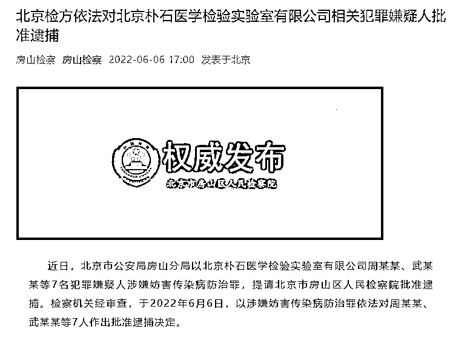
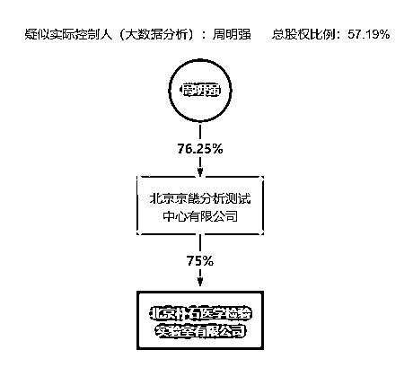

# 朴石医学 7 人被批捕！

> 原文：[`mp.weixin.qq.com/s?__biz=MzIyMDYwMTk0Mw==&mid=2247537317&idx=3&sn=5950c7c8c277015fd9a3a4afb61d9b41&chksm=97cb999da0bc108b7f981e5ce3684ee03f7568cc12c2ae7e297e9e06f7338de310269c510838&scene=27#wechat_redirect`](http://mp.weixin.qq.com/s?__biz=MzIyMDYwMTk0Mw==&mid=2247537317&idx=3&sn=5950c7c8c277015fd9a3a4afb61d9b41&chksm=97cb999da0bc108b7f981e5ce3684ee03f7568cc12c2ae7e297e9e06f7338de310269c510838&scene=27#wechat_redirect)

据房山检察官微 6 月 6 日消息，近日，北京市公安局房山分局以北京朴石医学检验实验室有限公司周某某、武某某等 7 名犯罪嫌疑人涉嫌妨害传染病防治罪，提请北京市房山区人民检察院批准逮捕。检察机关经审查，于 2022 年 6 月 6 日，以涉嫌妨害传染病防治罪依法对周某某、武某某等 7 人作出批准逮捕决定。 

此前，据北京市房山区政府网站的行政处罚公示信息，5 月 14 日，监督员发现位于房山区的朴石医学原始检测数据明显少于样本检测数量。次日，卫健部门根据《突发公共卫生事件应急条例》吊销了该实验室的《医疗机构执业许可证》。

违法事实为：2022 年 5 月 14 日，监督员发现位于北京市房山区广阳大街 9 号 1 幢 3 层 315-323 的北京朴石医学检验实验室有限公司原始检测数据明显少于样本检测数量。

*         华夏时报*

*天眼查显示，“朴石医学”全称为北京朴石医学检验实验室有限公司，于 2020 年成立，注册资本为 1000 万元人民币，是北京京畿分析测试中心有限公司旗下子公司，疑似实控人为周明强。法人为武彦峰。*

**

*2021 年初，涉事实验室被列为医政医管局公布的“第一批合格第三方新冠病毒核酸检测机构名单”，而根据北京卫健委公布的“北京市新冠病毒核酸检测医学检验实验室 2022 年 4 月审核合格机构名单”，该实验室也位列其中。*

*自 5 月北京疫情爆发以来，朴石医学承担了北京市房山区、北京市石景山区等北京市内其他区域的核酸筛查工作，而这些地区或未列入重点筛查区域，居民仅需根据需要自愿参加检测。*

*相关报道*

*[核酸腐败，触目惊心，丧尽天良！](http://mp.weixin.qq.com/s?__biz=MzIyMDYwMTk0Mw==&mid=2247536884&idx=4&sn=4e80d8b388ca5975f781c476919a1eef&chksm=97cb9bcca0bc12daa8b871b42272cbd8c58eb6080554d4da21baab6f6fb4a0e8c61250b4d3dc&scene=21#wechat_redirect)*

*[卫健委主任落马，社会面很快清零了！](http://mp.weixin.qq.com/s?__biz=MzIyMDYwMTk0Mw==&mid=2247536848&idx=1&sn=10277188d53d307e9eaf180c8481c2fa&chksm=97cb9be8a0bc12fe9056b9db880c38130ab5ce73e495f0d75c693d23e54b98be036297234862&scene=21#wechat_redirect)*

*[北京这家核酸检测公司出事了！](http://mp.weixin.qq.com/s?__biz=MzIyMDYwMTk0Mw==&mid=2247536238&idx=2&sn=de39244d83166a1870333a6b66c48b7a&chksm=97cb8556a0bc0c40d2c6caed909fc2d28bcf2335bc3caa300f21941fa4b9a89920d727c38c26&scene=21#wechat_redirect)*

*[核酸检测实验室乱象何时休！前有“假阳”事件真相未明，今有数据“造假” 立案被查](http://mp.weixin.qq.com/s?__biz=MzIyMDYwMTk0Mw==&mid=2247536437&idx=5&sn=3d7973ea5b0ae48090987911dbcbc3b0&chksm=97cb840da0bc0d1beb56ae55e2220e76fa625a849a74630fcab42308ff93f1fb168dc6b7a2af&scene=21#wechat_redirect)*

*[检验业务收入 2 亿多！揭露北京一核酸检测机构违法操作](http://mp.weixin.qq.com/s?__biz=MzIyMDYwMTk0Mw==&mid=2247536947&idx=4&sn=1b7686137b5205a0ca2a135db3867d86&chksm=97cb9a0ba0bc131ded669687efb48d8dcd5de3a3befc23c0b46576ef3a61993e07597ffef998&scene=21#wechat_redirect)*

*来源：华夏时报* 

*更多精华好文，请点击关注***

*← 向右滑动与灰产圈互动交流 →*

**