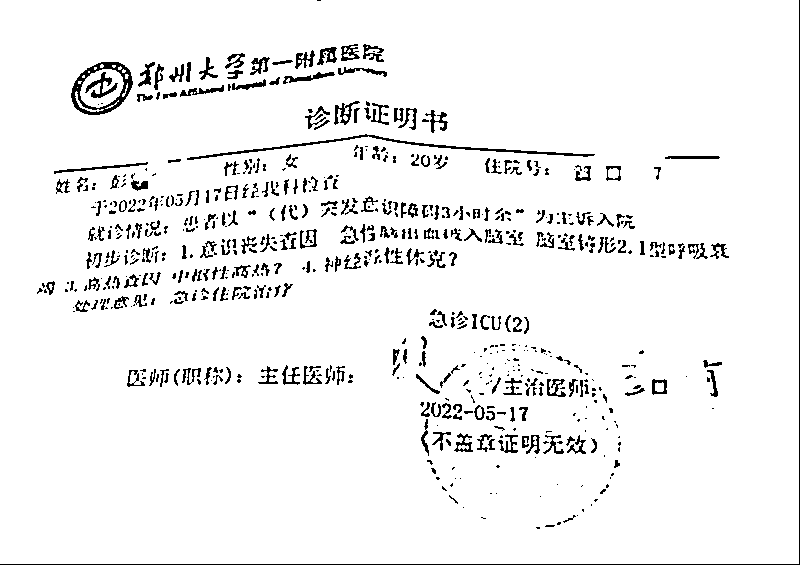

# 河南大学女生疑因 120 延误救治去世，焦点在哪儿？

> 原文：[`mp.weixin.qq.com/s?__biz=MzIyMDYwMTk0Mw==&mid=2247537317&idx=4&sn=85319e69267bf8b691ff04ea5a83d90a&chksm=97cb999da0bc108b3ce9126b574296ec32626242fe99edb79e53ede71d2ba1e2b8030b0b5347&scene=27#wechat_redirect`](http://mp.weixin.qq.com/s?__biz=MzIyMDYwMTk0Mw==&mid=2247537317&idx=4&sn=85319e69267bf8b691ff04ea5a83d90a&chksm=97cb999da0bc108b3ce9126b574296ec32626242fe99edb79e53ede71d2ba1e2b8030b0b5347&scene=27#wechat_redirect)

近日，一名网友自称在河南大学就读的女儿“突发脑出血因 120 延误救治去世”的消息，受到广泛关注。去世女生小彭的父亲彭先生提供的录音显示，小彭曾拨打 120 急救中心电话，但“因地址提供不清，120 未及时派车”，最终小彭不治离世。 

河南大学方面曾向南都记者介绍，学校做核酸检测排查时发现联系不上小彭，迅速让学生干部和小彭室友到宿舍，发现其状况危急，立刻打了 120 急救电话。“12 点半的 120（救护车）是我们打了之后才派过来的”。该工作人员称，打完 120 急救电话后学校立即联系了小彭家长。

此事披露后，引起网友热议。患者从第一次拨打 120 到被送医期间发生了什么？120 为何没有在接到求救电话后马上派出救护车？郑州市急救中心对于救治患者有哪些规范及要求？急救中心若延误救治将承担什么责任？

对此，南都、N 视频采访了小彭的家属、河南大学校方、郑州市卫健委以及相关专业人士。目前，郑州市卫健委已针对此事成立专项调查组。

**120“迟到了近两个半小时才派出救护车” ** 

近日，彭先生在微博发文表示，他的女儿小彭就读于河南大学郑州校区，准大三学生。5 月 17 日突发不适后拨打 120 求助，但 120“迟到了近两个半小时才派出救护车，到医院抢救时已经没有呼吸，瞳孔放大，最终孩子离开了这个世界”。

彭先生向南都记者提供的通话记录显示，小彭曾于 5 月 17 日上午 10 时 27 分拨打急救中心电话，此次通话时长为 8 分 19 秒。彭先生称，此次通话后，120 急救中心并未派车。

对此，河南大学郑州校区综合管理办公室工作人员向南都记者证实，5 月 17 日上午，学校在做核酸检测排查时发现联系不上小彭，迅速让学生干部和小彭室友到宿舍，发现小彭状况危急，立刻打了 120 急救电话。“12 点半的 120（救护车）是我们打了之后才派过来的”。

另据彭先生在微博发布的一张照片显示，小彭的同学拍下了救护车到达时的照片，上面显示时间为“5 月 17 日 12:30”，与河南大学郑州校区综合管理办公室工作人员所说时间一致。

彭先生向南都记者表示，“我们认为是室友发现孩子昏迷后打的 120，没想到从孩子手机上发现孩子自己拨打 120 急救中心的电话记录”，便在 5 月 18 日报警联系警察，第一时间找取通话录音。

从通话记录中可以看出，从小彭 10 时 27 分拨打急救中心电话，到最终救护车达到学校宿舍楼，中间经过了约 2 个小时。

“从通话中我们意识到 120 急救中心一直没有及时派车救治，耽误了最佳救援时间。”彭先生说。

彭先生向南都记者提供的女儿的诊断证明书显示：“患者以‘（代）突发意识障碍 3 小时余’为主诉入院。初步诊断为意识丧失查因急性脑出血破入脑室、脑室铸形，I 型呼吸衰竭等”。

**接线员不确定学校小校区地址？**

家属在获悉通话记录内容后，质疑 120 没有及时派出救护车，贻误了小彭的病情，耽误了治疗，“希望急救中心可以给我们明确的答复，接线员是否经过专业的培训，孩子在拨打急救电话的时候为什么没有及时发车救治”。

彭先生公布了小彭在 5 月 17 日上午拨打 120 的通话录音。其中显示，小彭在电话中向 120 接线员说出了“河南大学郑州校区”及该小区附近的“文苑北路”等地址信息。

随后接线员又再次询问在哪条路上，这时小彭回答：“明伦校区，我头好疼啊。”接线员听闻后再次询问：“明伦校区在哪？我只知道有个龙子湖校区。”此后，接线员反复询问地址，直到小彭疑似病情加重，没有再发出声音。

小彭

据了解，河南大学明伦校区位于开封，龙子湖校区位于郑州。小彭为何会说出“明伦校区”？小彭的堂姐彭女士告诉南都记者，小彭大学一、二年级就读于位于开封的明伦校区，后搬到郑州校区学习。“录音里能听出来我堂妹一开始意识是清晰的，能说出在哪个校区和地铁站，后面可能是被接线员绕晕了，加上头疼不舒服才说出‘明伦校区’。”彭女士说，小彭由于到郑州校区时间不长，加上疫情封校等原因，可能对道路地址不太熟悉。

对此，暨南大学附属第一医院急危重症医学部主任医师汪志刚对南都记者分析表示，小彭可能在病情危重的情况下，将郑州校区和开封校区弄混了。所以，接线员需要进一步确定学校所在的城市和地址。除此以外，接线员如果在确定是郑州校区之后，接下来还得确认具体是哪一栋楼、哪一个房间，这个其实是该案例难以克服的节点。

他指出，明确地点是派车的必须条件，否则即使贸然派车，也无济于事。同时他也提到，“接线员在后面无法继续联系患者的情况下，是不是还可以尝试其他的方法，比如与公安、学校联系等其他的措施？当然，这不一定是接线员的规定职责。”汪志刚强调，“我们无法确定接线员是否进行了类似的努力，如果尝试了，虽然及时找到患者可能性较小，但是也就少了一些遗憾了”。

**郑州市急救中心对于救治患者有哪些规范及要求？**

值得注意的是，南都记者查询发现，对于呼救者无法提供详细地址的情况，郑州市急救中心并非首次遇到。

该中心官网曾于 2017 年发布一则耳聋老人的呼救案例。文中称，呼救老人不能清晰表达自己的症状和所处位置，且电话突然中断。随即调度员通过查询 120 来电记录、114 查号台、通信公司等多种途径锁定了地址，并就近派出救护车。最终老人得到救治。

那么，郑州市急救中心对于救治患者有哪些规范及要求？

南都记者查询该中心官网发现，据 2014 年 1 月 1 日起施行的《郑州市社会急救医疗条例》规定，该条例适用于在郑州市行政区域内的社会急救医疗活动。紧急医疗救援机构受理呼救信息后，应当在一分钟内发出调度指令；急救医疗中心（站）应当在接到紧急医疗救援机构调度指令后四分钟内派出急救医疗车辆和急救人员。

南都记者注意到，郑州市紧急医疗救援中心会不定期对调度员进行培训、考核等。以调度问诊考核为例，会对调度员地址问诊情况、是否报工号、病情判断是否准确、有无必要病情指导、是否询问人数、是否就近派车、服务态度等方面进行评定。

另据该网站 2013 年 12 月公布的一份《120 调度指挥工作流程及规范》的培训课件，调度员的派诊流程包括问诊、判断、派诊、跟踪、监督、反馈六方面。同时，要求调度员具备高度的责任心、快速的反应能力、较强的沟通协调能力，以及丰富的医学、地理及人文知识等。若遇昏迷、心脏病、中毒、溺水等情况，调度员需进行灵活机动急救指导。

该课件还指出，问诊需要注意地址、电话、病情（电话判断）三要素。其中，地址“切记用十字定位法，道路交叉加方位、距离，小区、单位、学校”。值得注意的是，这里的“小区、单位、学校”被标红突出。

此外，熟悉周边路况对院前急救工作至关重要。郑州市急救中心官网有文章指出，“‘病人在心中，地图在脑中’则是我们工作的法宝，对地理位置的熟悉程度，是影响我们接派诊速度的一个重要要素，定期熟悉地理位置和新修道路是我们 120 指挥调度员的必修课”。

**急救中心若延误救治，****将承担什么责任？**

针对小彭不幸去世家属质疑 120 延误救治一事，日前，郑州市卫健委回应，已成立专项调查组，正对该情况进行调查，调查结果将予以公布。

对于后续处理，小彭的堂姐彭女士称，他们已经与律师签订委托书，正在等待郑州市卫健委的调查结果，“如果调查结果判定 120 有责任，我们将追究到底，无条件追责”。

120 急救中心如果因未及时出车延误患者救治，将承担什么责任？广东国鼎律师事务所律师廖建勋向南都记者表示，根据国家卫健委发布的《院前医疗急救管理办法》规定，如果调查结果认定 120 急救中心有责任，那么急救中心和接线员可能面临行政处罚或行政处分。

如若被判定有责任，120 急救中心是否应承担民事赔偿责任？浙江汉鼎律师事务所律师张永辉表示，急救中心与患者之间在民事法律关系上是可以界定为医疗服务合同关系。同时，急救中心还被赋予了救死扶伤的法定义务。患者及其家属可以依据《民法典》的相关规定，追究急救中心的违约或侵权责任，对于接线员的渎职行为，应该有其工作单位来代为承担赔偿责任，事后可再向其追偿。

南都记者查询发现，“清风顺义”5 月 28 日通报，5 月 11 日凌晨 3 时 38 分，租住在北京市顺义区南彩镇后俸伯村平安街 93 号青年公寓（当时因疫情原因处于管控状态）的宋某新因胸痛用手机呼叫 120。顺义 120 急救分中心南彩值班车组接到紧急救治任务单后未及时出车。7 点 24 分，宋某新经抢救无效死亡，初步诊断为猝死。

通报称，顺义区委卫生健康工委书记王新兵对此次事件发生应承担主要领导责任，给予其党内警告处分。顺义区医院党委副书记、院长赵跃华对此次事件发生应承担主要领导责任，给予其党内严重警告处分。顺义 120 急救分中心主任赵雪田对此次事件发生应承担主要领导责任，给予其撤销党内职务、政务撤职处分，鉴于其无党内职务，给予其党内严重警告、政务撤职处分。顺义 120 急救分中心南彩值班车组医生刘晓云对此次事件发生负有直接责任，顺义区卫生健康委给予其开除处理。

针对小彭不治去世一事，郑州市卫健委办公室工作人员曾回应南都记者称，“已经开展调查，这个工作一直在马不停蹄地做，我们领导也很重视。确实是很痛心的一个事”。小彭的堂姐彭女士表示，希望能够引起社会公众的警惕，并加强急救系统的完善。

本文自南都 APP。采写：见习记者 陈燕 南都记者 方诗琪 实习生 肖遥；编辑：张亚莉 向雪妮。

更多精华好文，请点击关注

← 向右滑动与灰产圈互动交流 →

