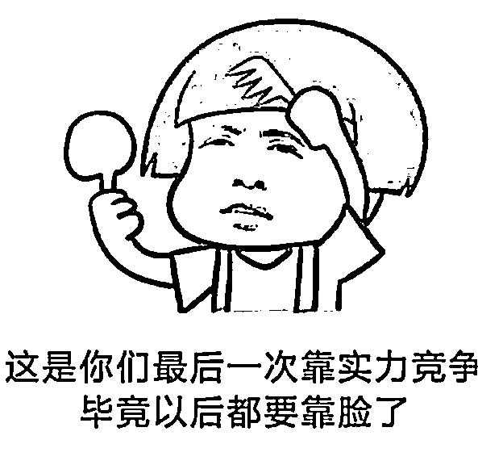
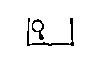

# 明天高考！请警惕教育部发布的这 6 大诈骗类型

> 原文：[`mp.weixin.qq.com/s?__biz=MzIyMDYwMTk0Mw==&mid=2247537317&idx=6&sn=bb35df5511a30dd1ab4b6b7bc98a8b90&chksm=97cb999da0bc108b7a281c71462b554d1f046fd6b1867bfd78479259ec8bcb5ff3a27961804c&scene=27#wechat_redirect`](http://mp.weixin.qq.com/s?__biz=MzIyMDYwMTk0Mw==&mid=2247537317&idx=6&sn=bb35df5511a30dd1ab4b6b7bc98a8b90&chksm=97cb999da0bc108b7a281c71462b554d1f046fd6b1867bfd78479259ec8bcb5ff3a27961804c&scene=27#wechat_redirect)

明天是全国统一高考的日子

你的题库都刷完了吗

单词都记牢了吗 

就在你辛苦备战的时候

骗子们也没闲着

写“诈骗剧本”

排练套路说辞

借着高考之名

散布虚假信息

制造焦虑，实施诈骗

甚至诱导考生考试作弊

为此

**教育部联合中央网信办、公安部等部门**

**结合近年来出现的一些典型案例**

郑重提醒广大考生和家长

务必提高警惕

谨防上当受骗

一起来看↓

**一、组织高考作弊，属于严重违法**

高考期间，常有不法分子在网上发布“助考”信息，宣称能为考生提供考试试题、答案。殊不知，在高考等国家教育考试中组织考生作弊，向考生提供试题、答案，出售、使用无线作弊器材等行为，都是严重违法犯罪行为。

**【案例】**2019 年高考期间，在校大学生何某豪在网上发布“助攻考试”广告，来自广东、山东、贵州等地的 12 名考生向其缴纳“报名费”。何某豪在网上联系大学生聂某武、彭某林(何某豪同学)，三人分工协作，何某豪负责联系传递试题及解题答案，聂某武负责解题，彭某林负责整理试题，在高考期间为 12 名考生实施作弊。6 月 8 日，警方接到线索后立即行动，当场将何某豪、聂某武、彭某林抓获。三人以犯组织考试作弊罪，分别被判处二年至三年六个月有期徒刑。

**【法规】**《中华人民共和国刑法》明确规定，在法律规定的国家考试中，“组织作弊的”“出售、使用无线作弊器材的”“向考生提供试题、答案的”“代替他人或者让他人代替自己参加考试的”，都属于违法行为。《最高人民法院、最高人民检察院关于办理组织考试作弊等刑事案件适用法律若干问题解释》明确，对在高考、研考等国家教育考试中组织作弊的，将直接认定为“情节严重”行为，处三年以上七年以下有期徒刑并处罚金。

**【提醒】**近年来，各地公安机关会同教育部门，对各类涉考违法犯罪活动持续保持高压严打态势，“零容忍”。广大考生一定要增强法律意识，拒绝考试作弊，切勿以身试法。

**二、替考不是捷径，而是一个“绝境”**

为让孩子考上理想的大学，有的家长想尽各种办法，不惜花重金为孩子找“门路”，甚至找“枪手”给孩子替考。结果人财两空，后果非常严重。

**【案例】**为让自己学习成绩较差的外甥小陈考上本科，李某和小陈母亲商议，决定花钱找人为小陈替考，并承诺考上“一本”给 5 万元。最终，某校在读研究生刘某答应为小陈替考。结果在 2019 年高考当天，刘某就被监考人员当场发现。警方立即立案调查，涉案人员相继到案。李某组织考生作弊，构成组织考试作弊罪，被判处有期徒刑三年，并处 30000 元罚金。“枪手”刘某代替他人考试，构成代替考试罪；学生家长让他人代替自己的子女参加考试，同样构成代替考试罪，分别判处拘役五个月，并处罚金 4000 元到 10000 元不等。

**【法规】**《中华人民共和国刑法》明确规定，在法律规定的国家考试中，“组织作弊的”“代替他人或者让他人代替自己参加考试的”，都属于违法行为。而且，代替考试罪是典型的对向犯，刑法同时处罚考生和“枪手”双方行为人，且定罪和法定刑都相同。

**【提醒】**家长帮助孩子作弊不是爱孩子，是在害孩子，到头来鸡飞蛋打一场空，还要承担法律责任。研究生刘某为了几万元的替考费，充当‘枪手’，毁了自己的大好前途。广大考生和家长要充分认识替考行为的危害及法律后果，诚信考试，否则将自食其果。

**三、心存侥幸带手机，考试作弊毁前程**

现在智能手机使用已非常普遍，一些考生平时也经常使用智能手机搜题、翻译等功能来辅助学习、提高效率。但如果在考试中使用手机作弊，却是打错了算盘，聪明反被聪明误。

**【案例】**2021 年高考期间，某考生违规携带手机，避开入场安检，将手机带入考场。考试期间，该生使用手机偷拍试题，发至场外寻求解答，被当场查获。依据《国家教育考试违规处理办法》，该生被处取消考试资格、所有成绩无效的处罚，并被停止参加国家教育考试。

**【法规】**高考是法律规定的国家教育考试。《国家教育考试违规处理办法》明确规定，在考试过程中使用通讯设备的，应当认定为考试作弊，其当次报名参加考试的各科成绩无效。《中华人民共和国教育法》明确规定，考生在国家教育考试中携带或者使用考试作弊器材、资料，情节严重的，由教育行政部门责令停止参加相关国家教育考试一年以上三年以下；构成违反治安管理行为的，由公安机关依法给予治安管理处罚；构成犯罪的，依法追究刑事责任。

**【提醒】**为防范和打击在国家教育考试中利用手机作弊行为，进一步强化考试环境综合治理，2022 年，教育部、公安部、工业和信息化部三部委联合部署各地教育、公安、通信、无线电管理等部门，采取多项措施，开展“打击手机作弊”专项治理。广大考生一定要知法守法，诚信考试，切勿心存侥幸，以免自毁前程。

**四、认准官方标识，勿信“小道消息”**

每年考前，网上都会有大量涉考信息传播，各种信息鱼龙混杂。一些个人或培训机构为吸引眼球，便借机注册“山寨”公众账号，散布传播非官方来源的“小道消息”，并以此谋取利益。

**【案例】**2020 年高考，因疫情影响延期一个月举行。网上不时有自媒体借机散布一些所谓高考安排信息，如有自媒体以“某市 2020 年高考考场安排”为题，在网上散布传播“2020 高考某市考场设置方案”的不实消息，误导社会公众，引发考生和家长焦虑。经该市教育局认定，该消息为虚假信息。

**【法规】**根据中央网信办《互联网用户账号名称管理规定》《互联网用户公众账号信息服务管理规定》，任何机构或个人注册和使用的互联网用户账号名称，不得散布谣言，扰乱社会秩序，破坏社会稳定；公众账号生产运营者不得恶意假冒、仿冒或者盗用组织机构及他人公众账号生产发布信息内容，不得编造虚假信息，歪曲事实真相，误导社会公众。对有违法违规行为的，将依法依约严肃处置。

**【提醒】**2022 年，教育部会同网信、公安部门并联合多家互联网企业，继续开展“点亮权威考试招生机构官网标识”“清理互联网涉考公众账号”专项行动，以便广大考生和家长及时、全面、准确了解权威机构高考信息，避免上当受骗。广大考生和家长在网上搜索查询高考相关信息时，请认准权威机构“官方”标识，谨防山寨账号或网站骗局。

**“官方”标识如下**

**↓↓↓**

**五、勿信虚假宣传，谨防上当受骗**

考试“包过保过”、双倍提升、XX 天速成，或有独家“内部资源”、“命题专家”授课、保证“一次性通过”等等……这样的口号标语和招生广告，经常出现在各种考试培训机构的招生宣传当中，让不少家长信以为真，实则不同程度存在夸大宣传、虚构师资、价格欺诈、虚假广告等违规违法行为。

**【法规】**《中华人民共和国广告法》明确规定，教育、培训广告不得含有下列内容：（一）对升学、通过考试、获得学位学历或者合格证书，或者对教育、培训的效果作出明示或者暗示的保证性承诺；（二）明示或者暗示有相关考试机构或者其工作人员、考试命题人员参与教育、培训；（三）利用科研单位、学术机构、教育机构、行业协会、专业人士、受益者的名义或者形象作推荐、证明。

**【提醒】**广大考生和家长切勿轻信虚假广告宣传，不但造成财产损失，还会贻误宝贵的复习时间。

**六、网络诈骗要辨别，高考答案不可购**

每年都会有不法分子在网络平台或通信群中兜售所谓“高考真题”“绝密答案”等，标榜“准确率极高”“违约退款”等诱惑信息，并以“预付订金”等名义要求用户先付款。还有的借传送“样题试卷”的名义向用户电脑或手机发送病毒，套取用户信息。

**【案例】**2021 年 3 月，黄某通过 QQ 进入多个聊天群，谎称自己有渠道可以买到高考答案，以每科 1.5 万元的价格将所谓的“高考试卷答案”出售给家长及考生，诈骗安徽、山东、湖南等五省 10 余人，骗取钱财 10 万余元。目前，黄某已被警方依法刑事拘留，案件正在进一步侦办中。

**【法规】**《中华人民共和国刑法》明确规定，在法律规定的国家考试中，“为实施考试作弊行为，向他人非法出售或者提供试题、答案的”，属于违法行为。

**【提醒】**高考试题属于国家绝密级材料，其保管和运送都有极其严格的管理措施。广大考生及家长务必擦亮眼睛，明辨真假，谨防诈骗！

来源：云南普法，昆明反电信网络诈骗中心

更多精华好文，请点击关注

← 向右滑动与灰产圈互动交流 →

