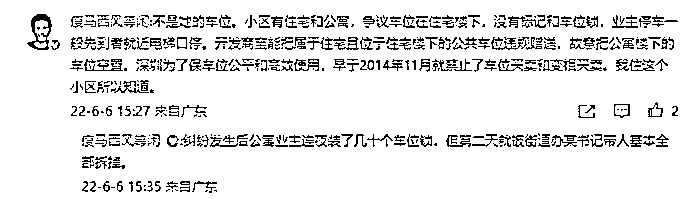

# 宾利车主发声：恶意剪辑！深振业董秘：并非“书记夫人”！

> 原文：[`mp.weixin.qq.com/s?__biz=MzIyMDYwMTk0Mw==&mid=2247537368&idx=1&sn=7d023c1fb7aacaccb6813e2d4b59dad7&chksm=97cb99e0a0bc10f674e77f24901c45af61226202f3dfff2fafaab13aac92dab7251f7c519033&scene=27#wechat_redirect`](http://mp.weixin.qq.com/s?__biz=MzIyMDYwMTk0Mw==&mid=2247537368&idx=1&sn=7d023c1fb7aacaccb6813e2d4b59dad7&chksm=97cb99e0a0bc10f674e77f24901c45af61226202f3dfff2fafaab13aac92dab7251f7c519033&scene=27#wechat_redirect)

近日，广东深圳一小区地下停车场内，一女子因车位问题同他人产生纠纷，并自称老公是深圳某国企书记，表示要“开 50 台宾利”堵占车位，引发关注。

<mpvideosnap class="js_uneditable custom_select_card channels_iframe videosnap_video_iframe" data-pluginname="videosnap" data-id="export/UzFfAgtgekIEAQAAAAAAbFAyrwxEtQAAAAstQy6ubaLX4KHWvLEZgBPEuaNoaj1GLaiDzNPgMItzQSW4Ldx95J7j-ylN-HwV" data-url="https://findermp.video.qq.com/251/20304/stodownload?encfilekey=rjD5jyTuFrIpZ2ibE8T7YmwgiahniaXswqzWhlFnOJRKeicAaP73VMxzeoDo0K19Pyic1vSfp4qa4SkPhiciar5ZB0zA3yzUlsiaeZ0tDKmB6pWvHicibsZ7f3JnHFHw&amp;adaptivelytrans=0&amp;bizid=1023&amp;dotrans=0&amp;hy=SH&amp;idx=1&amp;m=&amp;scene=0&amp;token=AxricY7RBHdUJYdu6HuIEz6SUJIdflmgAOyV36Xsufme0sHd2E3HMlKeVicr2orbx2rrLrmNNJsBY" data-headimgurl="http://wx.qlogo.cn/finderhead/ibq4aVwOt6HNqrr8OD3sCviaytF3B8TqCwHicxsuIanAJo/0" data-username="v2_060000231003b20faec8c6e48a1acbd3ce04ef33b077a1e41d0d3794ed88ea537878dbe65910@finder" data-nickname="灰产圈+" data-desc="#深圳国资委回应国企书记夫人涉车位纠纷#深圳地下停车场今天好热闹，劳斯莱斯车主和宾利车主 @灰产圈+ " data-nonceid="12864328000007480316" data-type="video" data-width="1080" data-height="1920"></mpvideosnap>

6 日，该事件当事人欧阳女士在中新财经电话连线时表示，**网上有的视频是后期配音，相关字幕和内容是恶意剪辑。**

她说，当时长期抢占车位一方挑衅先提起有关“50 辆宾利”的事情，“然后我这边情绪激动，跟着直接就把它说出来。” 

按欧阳女士说法，她其实想表达的意思是从宾利俱乐部调车过来。

**“因为我们宾利车俱乐部**，我们出行也好干嘛也好，我们都是开着同样的车一块出行，一出去就是几十辆上百辆。”她说，“**也不是说我家有，当时说我能(调)，那我调了我就调来 50 辆堵住这儿。**” 

欧阳女士还表示，这件事情已经引起了很多关注，她并不愿意因此事给社会带来不好的现象。现场的情况与网上流传的视频并不相同，稍晚会对此事进行正式回应。 

据澎湃新闻报道，该纠纷源于开发商将住宅区的“公共”停车位使用权赠送给公寓区业主，作为“专用停车位”，引起住宅区业主不满，近半年来纠纷不断，“这件事也是和车位纠纷有关。” 

对于纠纷车位的相关问题，欧阳女士则对中新财经表示，**目前她手中持有的相关合同叫做“车位使用权赠与合同”。** 

澎湃新闻报道称，6 月 5 日，涉事小区宝能公馆物业管理处的工作人员称，宾利女车主确实有该车位使用权，公寓专用车位是开发商售房时承诺的，具体情况不了解，也不方便回应。 

目前，社交媒体上也有声音对涉事车位的归属权存在质疑。

柠檬网 CEO 赵勇在社交媒体上留言称：小区有住宅和公寓，争议车位在住宅楼下，没有标记和车位锁，业主停车一般先到者就近电梯口停。开发商宝能把属于住宅且位于住宅楼下的公共车位违规赠送，故意把公寓楼下的车位空置。**深圳为了保车位公平和高效使用，早于 2014 年 11 月就禁止了车位买卖和变相买卖。**

柠檬网 CEO 赵勇的微博留言截图

赵勇还表示，因为住在这个小区，所以他才了解这些细节。“纠纷发生后，有公寓业主连夜装了几十个车位锁，但第二天就被街道办相关负责人基本全部拆掉。”

6 月 5 日，该小区所属街道工作人员向澎湃新闻称，该纠纷因地产商赠车位引发，目前正在处理中。

[`mp.weixin.qq.com/mp/readtemplate?t=pages/video_player_tmpl&action=mpvideo&auto=0&vid=wxv_2432216077159006209`](https://mp.weixin.qq.com/mp/readtemplate?t=pages/video_player_tmpl&action=mpvideo&auto=0&vid=wxv_2432216077159006209)

另据第一财经报道，6 月 6 日，深振业的董秘表示，**根据公司初步调查，车位纠纷中的国企书记确实是深振业的高管张晓中，不过张晓中目前是离异单身状态**，宾利女车主是张晓中可能在交往的对象，不是家属。

5 日晚，深圳市国资委曾通报称，针对网民反映“深圳国企书记夫人涉车位纠纷舆情”情况，正在了解核实。

来源 ： 中新财经、第一财经、澎湃新闻、晨视频、潇湘晨报

更多精华好文，请点击关注

← 向右滑动与灰产圈互动交流 →

