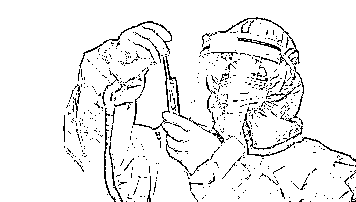
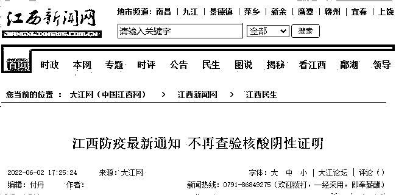
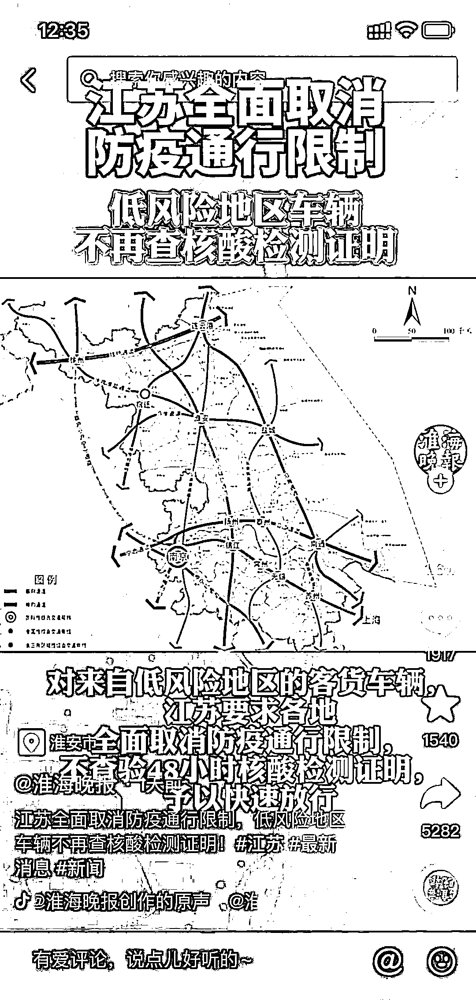
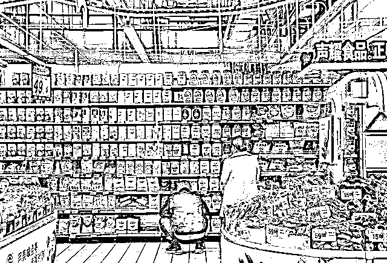
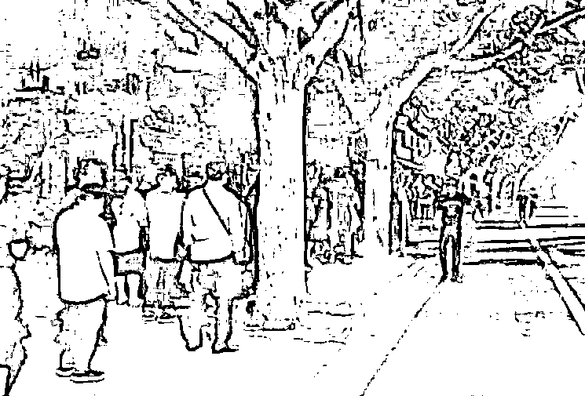
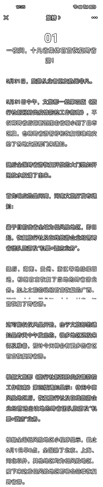

# 重磅！全国多地取消查验核酸证明！

> 原文：[`mp.weixin.qq.com/s?__biz=MzIyMDYwMTk0Mw==&mid=2247537368&idx=6&sn=e3ffcff042b552a2620f090b9f3e32fb&chksm=97cb99e0a0bc10f62e0c219ba4ac062c31a8e4723bcca4f4ce4f3bf928a55f60fb38b75daf92&scene=27#wechat_redirect`](http://mp.weixin.qq.com/s?__biz=MzIyMDYwMTk0Mw==&mid=2247537368&idx=6&sn=e3ffcff042b552a2620f090b9f3e32fb&chksm=97cb99e0a0bc10f62e0c219ba4ac062c31a8e4723bcca4f4ce4f3bf928a55f60fb38b75daf92&scene=27#wechat_redirect)

近期，全国多地取消查验核酸证明。对低风险地区人员流动的防疫要求做出了动态调整，某些情况将不再查验核酸阴性证明。

国家卫生健康委新闻发言人、宣传司副司长米锋在 6 月 2 日国务院联防联控机制新闻发布会上介绍，目前全国疫情防控形势持续向好，近 3 日，日新增本土确诊病例和无症状感染者降至 100 例以下。

米锋强调，“要科学精准落实各项防控措施，不任意增加隔离时间，不擅自对低风险地区人员采取限制措施。坚决防止简单化、一刀切，防止层层加码。”

**江西**

6 月 2 日，江西省委办公厅、省政府办公厅印发《关于疫情防控措施调整的紧急通知》，提到精准落实疫情防控举措，严禁层层加码、过度防疫，努力用最小代价实现最大防控效果。

低风险地区和无本土疫情的县（市、区）之间人员（含各类学生）可以自由有序流动，不再查验核酸检测阴性证明，不再实行核酸落地检，不得赋“灰码”“黄码”，不得实行隔离管控，只需落实扫码、测温常态化防控措施。

对来自中高风险地区和有本土疫情的县（市、区）的流动人员实行“7 天集中隔离＋7 天居家健康监测”。

据@江西发布当日消息，根据上级有关文件要求，即日起在南昌市内乘坐公交不再查验核酸检测阴性证明，仅需扫车辆码和接受体温检测，并在乘车过程中全程规范佩戴口罩。

**江苏**

据@江苏交通 6 月 3 日消息，江苏对于低风险地区的客、货车辆和人员，全省各地已全面取消防疫通行限制，高速公路出口不再查验 48 小时核酸检测证明，予以快速放行。

截至 5 月 30 日 18 时，江苏省全面完成了与中高风险地区接壤之外的普通公路查验点撤除工作，全省本轮疫情期间设置的 337 个普通公路查验点，除苏州保留与上海接壤的 2 个查验点外，其余全部撤销。

对于来自上海等中高风险地区的车辆，目前仍需持有 48 小时内核酸检测阴性证明，并实行提前报备、点对点运输等闭环管理措施，或派人引导、装卸货后立即返回，要求短时间内暂不离开的严格执行当地疫情防控要求。

据看看新闻 5 月 29 日报道，随着江苏省生产生活秩序逐步恢复，高速公路日出口流量已经从 20 多万上升至 120 多万，经预测将很快上升至 180 万。

**安徽**

5 月 27 日，安徽省疫情防控应急综合指挥部办公室发布通知，就全面取消低风险地区货运车辆防疫通行限制做出要求。通知强调，对来自低风险地区货运车辆，不查验 48 小时核酸检测证明；各地要加强督促检查，确保来自低风险地区货运车辆快速便捷通行，严禁出台“土政策”、一刀切。

**广东**

据广州日报 5 月 31 日消息，目前，广东省内广州、湛江等多地出行已不再要求查验核酸检测阴性证明，深圳仍然需要出示 72 小时核酸检测阴性证明。

从广州站、广州东站、广州南站进站乘车旅客，已取消查验 48 小时核酸阴性证明，除进京旅客须持“北京健康宝”绿码和乘车前 48 小时内核酸检测阴性证明外，其他旅客只需提供健康码绿码并且体温正常即可进站乘车。

自 5 月 24 日 12 时起，离湛旅客不需要查验核酸检测阴性证明。离开东莞、佛山已不再查验 48 小时核酸检测阴性证明，凭健康码“绿码”即可出行。

**大连、成都、郑州**

大连、成都、郑州等多地火车站，此前已取消进站查验核酸证明。

成都目前全域为低风险地区，出成都不再需要 48 小时核酸报告，可凭借行程码、行程卡出行。此前，大连已取消离连须提供 24 小时内核酸检测阴性证明的要求。

从 5 月 25 日起，郑州侯寨站、樱桃沟站、西南站、中牟站、柳林站、惠济站、沟赵站、荥阳站、上街站、巩义东站、巩义站、涉村站、巩义南站的离郑(上站)疫情防控措施均调整为只查验健康码绿码，不需要出示核酸检测阴性证明。

不过需要注意的是，尽管部分地区仅进站取消查验核酸证明，出站仍要查验核酸证明。

**打破核酸一刀切的硬性规定**

**中国经济复苏才有希望**

低风险地区也要普遍核酸，一刀切的核酸强制，成为全国人民头上紧箍咒，成为中国经济复苏，人民生活复归正常的极大阻拦。

东北四平，最极端。四平本来零感染，没有新冠疫情却居然要进行核酸普查。居然下令不核酸就要拘留十天，健康人凭什么要服从核酸核酸又核酸？低风险，零感染地区为什么要兴师动众，草木皆兵，扰民伤民害民无故核酸？

四川阆中也是零感染，就下令每个人做核酸。后来医保不出钱了，就叫自费核酸，受到普遍质疑反对，才改成自愿自费核酸。

一刀切，逼迫所有健康人反复 72 小时核酸显然不合理，不合法，不合适，不合民心民意。

我们正处于社会强劲复苏的前夕，经济基本面要恢复，首要条件是恢复人和货物流动的自由，稳物流，才能保住供应链。

然后是全国旅游恢复。

**江西省委办公厅、省政府办公厅印发**

**《关于疫情防控措施调整的紧急通知》**

**《通知》要求**

**低风险地区和无本土疫情的县（市、区）之间**

**人员（含各类学生）可以自由有序流动**

**不再查验核酸检测阴性证明**

**不再实行核酸落地检**

保障人员自由有序流动、持续畅通交通网络、推动公共场所全面开放……

6 月 2 日，为高效统筹好疫情防控工作和经济社会发展，省委办公厅、省政府办公厅印发《关于疫情防控措施调整的紧急通知》，要求各地各部门坚持“外防输入、内防反弹”总策略和“动态清零”总方针，精准落实疫情防控举措，严禁层层加码、过度防疫，努力用最小代价实现最大防控效果。省委、省政府将派出专项督导组进行督导，对贯彻落实不力的严肃问责，并进行通报。

**人员自由有序流动，经济方有活力。《通知》要求，各地各部门要优化跨区流动防控举措，核酸检测结果全国互认通用。低风险地区和无本土疫情的县（市、区）之间人员（含各类学生）可以自由有序流动，不再查验核酸检测阴性证明，不再实行核酸落地检，**不得赋“灰码”“黄码”，不得实行隔离管控，只需落实扫码、测温常态化防控措施。对来自中高风险地区和有本土疫情的县（市、区）的流动人员实行“7 天集中隔离＋7 天居家健康监测”。此外，在落实常态化疫情防控要求基础上，**全面取消对复商复市的不合理限制，**推动全面有序开放各类景区景点、餐饮酒店、公共文化娱乐体育场所。

货畅其流，关系安民心稳经济保安全的大局。各地各部门要坚决落实保通保畅部署要求，充分发挥省市县三级保通保畅工作机制作用，优化公路服务保障，运用信息化手段提高通行效率。科学合理设置防疫检查点，**除由设区市及以上疫情防控指挥部批准设立的外，其他各类防疫检查点一律取消。****对来自低风险地区和无本土疫情的县（市、区）的货车司乘人员，可以自由有序流动，**只需落实扫码、测温常态化防控措施；对来自中高风险地区所在地市和有本土疫情县（市、区）的货车司乘人员，持 48 小时内核酸检测阴性证明、健康码“绿码”以及正常体温的予以放行，实行“点对点”闭环管理措施；对到达目的地时核酸检测结果超过 48 小时的，可采用“核酸检测＋抗原检测”的方式，抗原检测结果为阴性的要立即放行，不得以等待核酸检测结果为由限制通行，同时实行动态追踪机制。

科学精准防疫情，千方百计稳经济。《通知》强调，各地各部门要切实提高政治站位，进一步增强责任感使命感紧迫感，结合本地本部门工作实际，迅速细化配套措施，把稳住经济大盘作为重大政治任务，统筹做好“六稳”“六保”工作，靠前发力、担当作为，以“钉钉子”精神抓好各项措施落地生效。

来源：商业潮流

← 向右滑动与灰产圈互动交流 →

