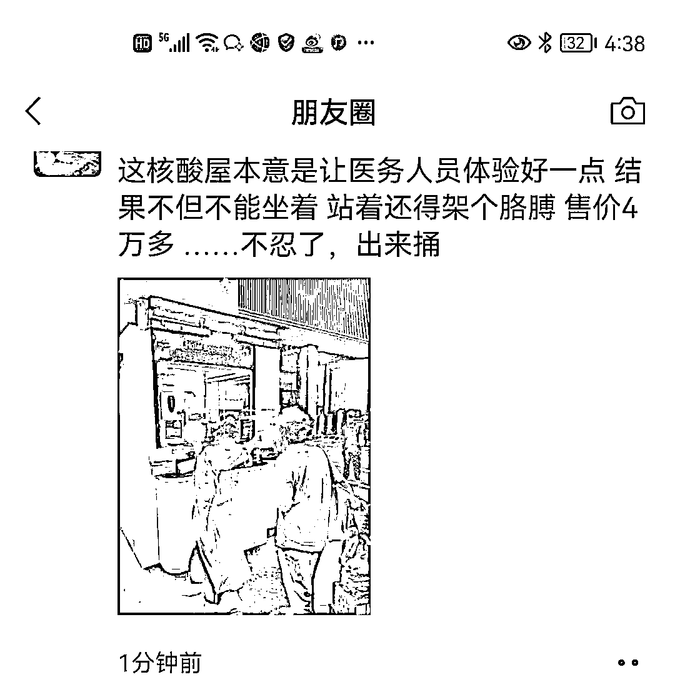

# 谁设计了反人类的核酸检测屋

> 原文：[`mp.weixin.qq.com/s?__biz=MzIyMDYwMTk0Mw==&mid=2247537424&idx=2&sn=bb9c3e5d29ef27d9636a088467c7fe0d&chksm=97cb9828a0bc113e440e444a7df17ed42c13c7aec6a48ae6e5f72fc8b5475a065cc90d2c6033&scene=27#wechat_redirect`](http://mp.weixin.qq.com/s?__biz=MzIyMDYwMTk0Mw==&mid=2247537424&idx=2&sn=bb9c3e5d29ef27d9636a088467c7fe0d&chksm=97cb9828a0bc113e440e444a7df17ed42c13c7aec6a48ae6e5f72fc8b5475a065cc90d2c6033&scene=27#wechat_redirect)

是谁设计了反人类的核酸检测屋？

疫情闹腾 3 年，起初大卖的是口罩，后来大卖的是核酸检测，再后来的就是疫苗。等大家尝到核酸检测甜头的时候，各大公司都在各地扩张，提高市场占有率。 

为了建成 15 分钟的核酸检测采样圈，大街小巷遍地出现了核酸采样的移动小屋，也就是“核酸采样屋”。

采样屋是一个相对外界密闭的空间，里面除了安装有空调，还有对外的语音小喇叭，以便采样人员和被采样人沟通，可以“零接触”为市民进行核酸采样。被采样人的样本，还可以通过一个通道进行传递。

看起来好像真是那么一回事，但实际怎么样，用用就知道了。

6 月 1 日，河南首批多个便民核酸采样屋投入试运行。不料，“便民核酸采样屋”上岗的第一天，该小屋就被“骂”上了热搜。

**采样屋设计遭吐槽，医护蹲椅子上市民扎马步**

最近看来，有些采样屋子完全利用了，但很多地方的核酸采样屋却变成了一个废弃的屋，置之不理。由于使用不便，新式核酸检测屋被大家疯狂吐槽。

核酸检测屋窗口有两个小洞，是留给大白伸手操作使用的，检测人员需要架着胳膊、通过两个“圆筒”为群众做核酸。

但两只手在“圆筒”外面消毒也十分不方便，同时，检测人员还看不见下方的垃圾桶，画面一度显得极其别扭。

它的设计高度也是一言难尽，医护人员坐下有点矮，站着有点高，导致他们坐也不是站也不是，有些检测人员直接蹲在了凳子上才勉强舒服点。

不仅如此，被采样的市民更加难受，大部分人在做核酸时，还需要采用“扎马步”的方式，才能配合医护人员。

小孩子就更加困难了，有的身高完全不够，只能是医护人员调整角度和家长的配合才能采样。

还有更离谱的是，一个坐轮椅的老人来检测，需要几个人把他抬起来，以便他的嘴能凑近检测人员......

电视剧《人民的名义》中那种半蹲式窗口的场景，在各个检测小屋内外，表现得淋漓尽致。

由于种种不便，在有的检测点，检测人员干脆走出小屋，到外面来检测，这样双方都更加方便，而一开始被称作“便民”的小屋也彻底成了摆设。

小屋设计不合理，设计者并没有按照人体工学设计，屋里工作人员全程站着不说，还要一直扬着胳膊，无疑比之前更累，而屋外检测口的高度就更加不用说了。

现场操作难度大，虽然解放了信息登记人员的工作，但自主扫码的设定，对于一些需要现场帮助、指导的老人来说并不友好，以至于再次降低了检测的效率。

说白了，就是一个活动板房，能遮风挡雨罢了。有的网友纷纷吐槽，除了有空调，其他方面可能没有考虑全面，中国的设计师水平难道就是如此不堪吗？

要真想常规化持续做核酸，那些采样屋还需要继续动脑筋重新设计。

不仅如此，还有被网友质疑的不便之处，部分核酸检测屋因未完成调试、机器故障等原因不能正常检测，15 分钟便民核酸检测圈还未完全运转，这是不是偏离了一开始的“便民”？

其次，核酸检测排队较长频次太密，在常态化核酸的第一天就有居民反映，高温之下，老人与小孩在核酸检测屋前排队数十分钟才完成核酸检测，与之前全员核酸检测时比较低。加上三天两检，每 48 小时内进行第二次核酸检测的，费用需要居民自理。

最后就是检测时间，上班族下班，检测人员也下班，导致不少上班族无法方便地做核酸。

部分核酸检测屋的采样时间为早上 8:30 至 11:30，下午 15:00 至 18:00，与市民上班时间高度重合。部分市民反映中午休息出来做核酸，发现核酸检测屋的采样员也下班休息，下午下班后去做核酸，发现核酸检测屋的采样员同样下班。

由于核酸采样屋的不便，据了解，北京呼家楼、朝阳门等地的核酸检测屋已被“弃用”，医护人员直接在屋外搭起了核酸检测棚，采取传统的核酸检测方式。

目前的核酸检测屋存在明显的设计缺陷，医护人员身高不一样，固定尺寸肯定会带来一系列的问题。除了遮风挡雨，目前的核酸检测屋实用性并不强。

在吐槽核酸检测小屋种种不便的同时，不少网友还对这种检测小屋的招标价格提出了严重质疑，甚至呼吁上级纪检监察机关介入调查。

**4.68 万一个，背后公司成立 11 天便中标**

据报道称，这样一个采样屋，中标金额为 4.68 万一个。

据河南省政府采购网 5 月 18 日公示，河南省双人便民核酸采样屋采购项目(一批)供应商为海乐苗(郑州)智能物联有限公司(下称“海乐苗”)，中标单价为 46800 元。采购人为河南省工业和信息化厅，采购代理机构为河南招标采购服务有限公司。

该公司于 2022 年 5 月 7 日成立，时间距上述公示日期仅提前了 11 天。“海乐苗”的法定代表人为何晨杨，注册资本为 1000 万，由海乐苗（青岛）智能物联有限公司 100%控股，而后者公司大股东为青岛海尔生物医疗股份有限公司。

成立仅 11 天就中标河南核酸检测屋，单价近 5 万元，这家公司什么来头？

据河南省政府采购网 5 月 18 日公示，河南省双人便民核酸采样屋采购项目(一批)供应商为海乐苗(郑州)智能物联有限公司(下称“海乐苗”)，中标单价为 46800 元。采购人为河南省工业和信息化厅，采购代理机构为河南招标采购服务有限公司。

网友质疑的焦点是，第一批中标此次“河南省双人便民核酸采样屋”的企业——“海乐苗(郑州)智能物联有限公司”，从公司成立到成功中标，中间只有 10 天时间。

这批核酸小屋，就像是专门为其量身定制的。

而且，这种款式的小屋，某宝上最贵的才 1.3 万多元一个，而这次政府采购的这批小屋，价格竟高达 4.68 万元一个！这样的核酸采样屋，河南全省要采购 1.4 万个，岂不是要花费 6.552 亿元？

网友纷纷对这家神秘的中标企业，以及其中可能存在的猫腻进行吐槽......

网友除了吐槽该小屋“中看不中用”外，更多网友更是对该小屋的招标过程提出了很大的质疑。

有专家表示，公众提出质疑、行使监督权意义重大，有利于政府改进工作，防止政府采购和招标活动中违法乱纪现象的发生。

当然，6 月 1 日仅是郑州开展常态化核酸检测的第一天，问题暴露较多也是正常的。而百姓们更期待的是，有关部门能够及时回应群众诉求，科学调整工作方案，让常态化核酸工作无缝融入百姓生活。

[1]谁设计了愚蠢的核酸检测屋 .  艾小曦之乱弹

[2]“中看不中用”的河南核酸检测屋：单价近 5 万、成立 11 天中标！. 驻马店市卫生计生监督

[3]售价近 5 万，核酸采样屋遭吐槽：医护蹲椅子上，市民扎马步 . 医护多资讯

来源：医学之声

← 向右滑动与灰产圈互动交流 →

