# 这个疫情数据是假的？太离谱了！

> 原文：[`mp.weixin.qq.com/s?__biz=MzIyMDYwMTk0Mw==&mid=2247537424&idx=5&sn=741c868ac215143f5f2afc87aea6d80b&chksm=97cb9828a0bc113e40d453cc10db57c879374d90ffecf2e779ef4f13deeaa561bae5f5887ecc&scene=27#wechat_redirect`](http://mp.weixin.qq.com/s?__biz=MzIyMDYwMTk0Mw==&mid=2247537424&idx=5&sn=741c868ac215143f5f2afc87aea6d80b&chksm=97cb9828a0bc113e40d453cc10db57c879374d90ffecf2e779ef4f13deeaa561bae5f5887ecc&scene=27#wechat_redirect)

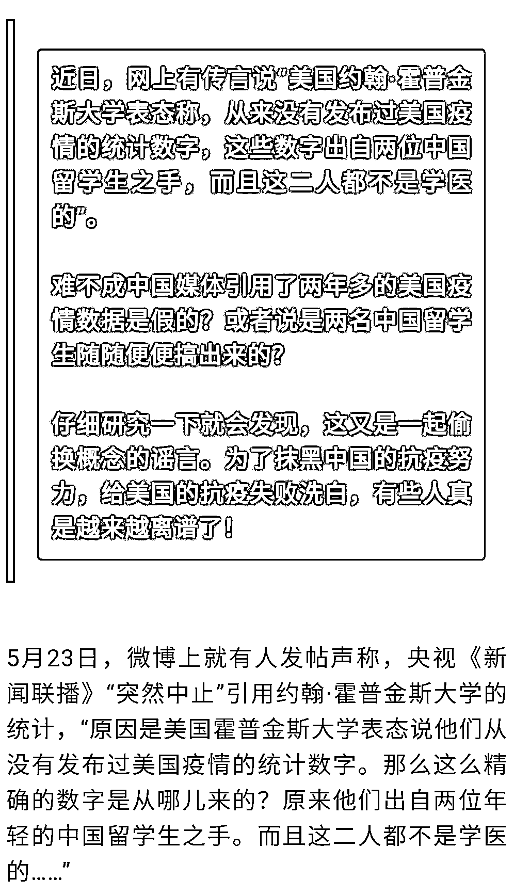

## 

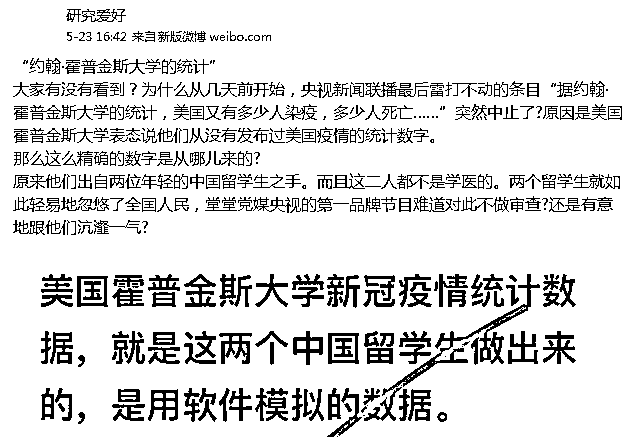

此后，有网络大 V 也发了类似的帖子。

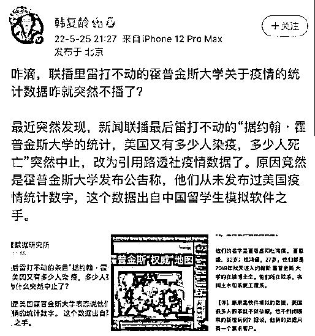

**首先，美国约翰·霍普金斯大学有没有表态称他们“从来没有发布过美国疫情的统计数字”呢？**

从谷歌新闻上搜索，并没有找到这样的消息，倒是在 5 月 17 日和 18 日，包括《商业内幕》《波士顿环球报》在内的多家美国媒体报道了美国疫情死亡人数突破 100 万的消息，而消息源引用的正是约翰·霍普金斯大学的统计数据。

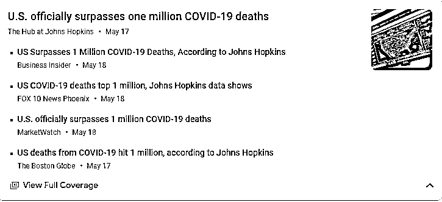

**6 月 6 日，《今日美国报》刊发报道称，在大流行的第三个夏天开始前不久，美国正在经历第六波疫情。尽管病例在上升，但健康专家表示，住院人数仍在控制之中。根据 7 天的平均值，目前美国大约每天报告死亡 350 人，比去年同期减少了 100 多人。这一数据正是援引自约翰·霍普金斯大学。**

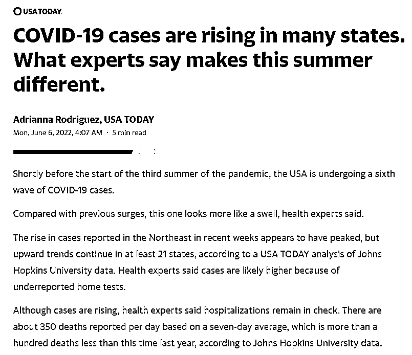

**难以想象，美国主流媒体会在约翰·霍普金斯大学“表态称从来没有发布过美国疫情统计数字”的情况下，继续引用该校的疫情数据。如果真有谣言中的这回事，那早就是美国媒体的“大新闻”了。**

**其次，两位年轻的中国留学生董恩盛和杜鸿儒在制作约翰·霍普金斯大学的疫情数据和相关地图中发挥重要作用，并不是最近才曝光的新鲜事，国内媒体早在 2020 年 4 月就对此详细报道过。**

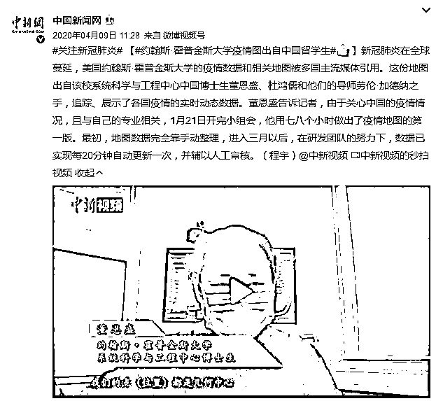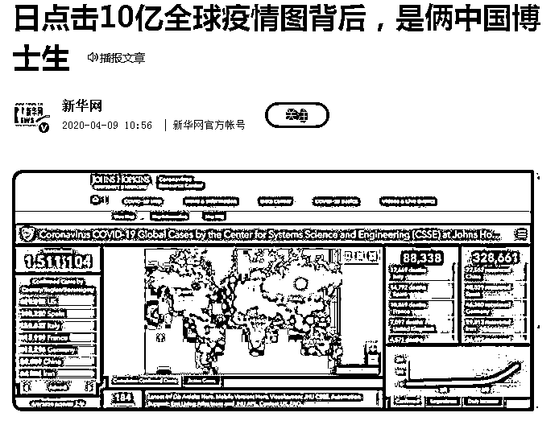

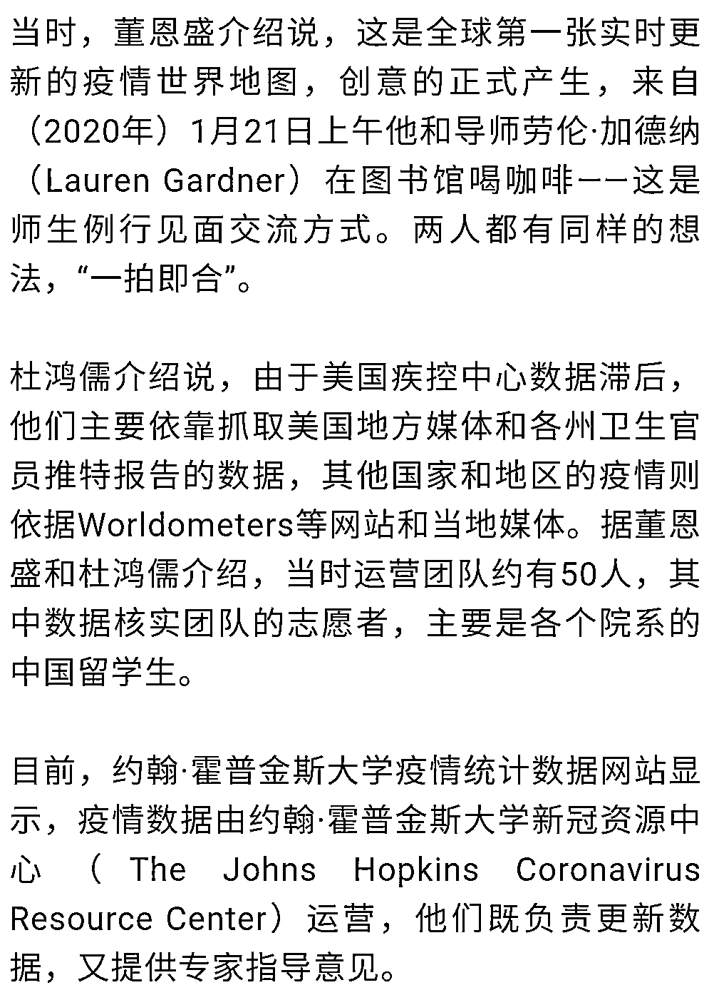

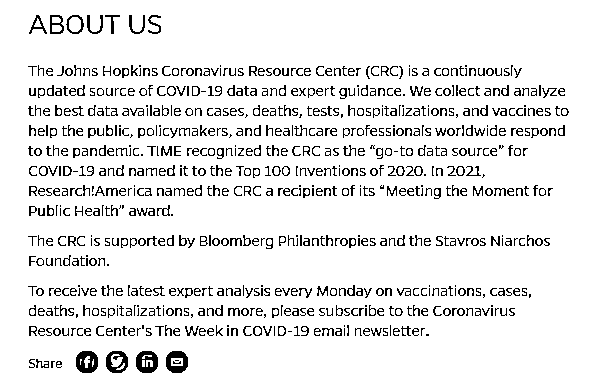

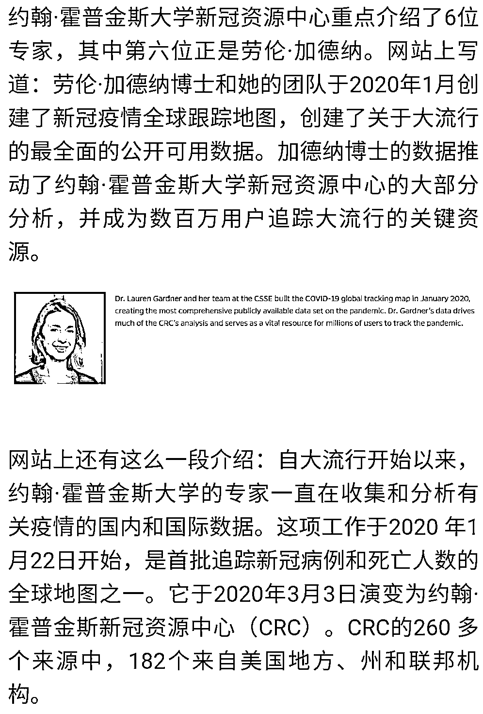

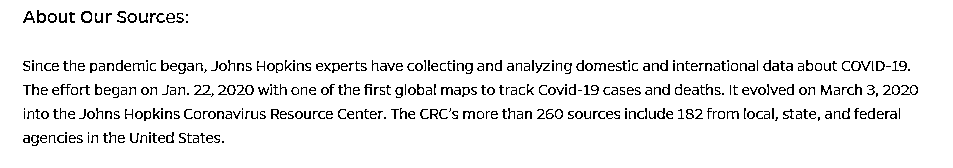

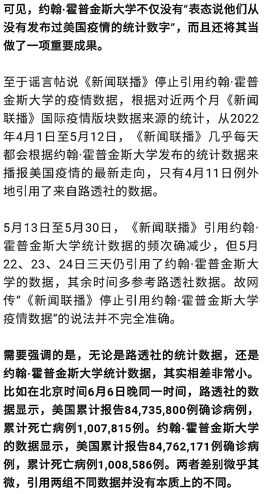

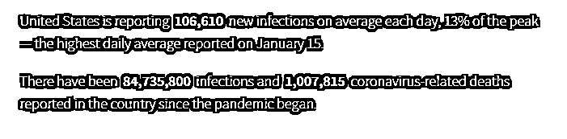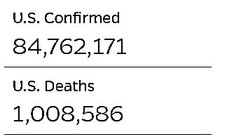

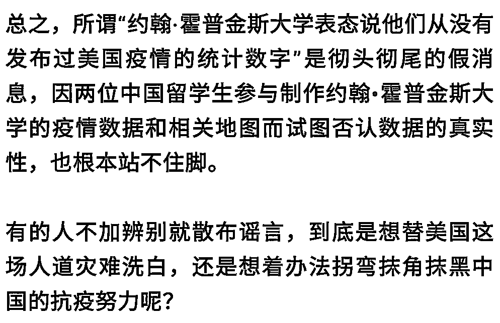

来源：环球时报（卢子）

← 向右滑动与灰产圈互动交流 →

