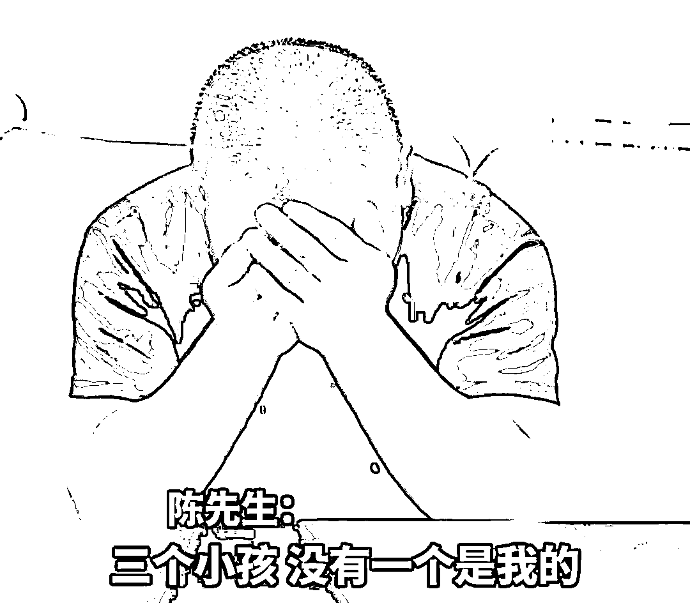
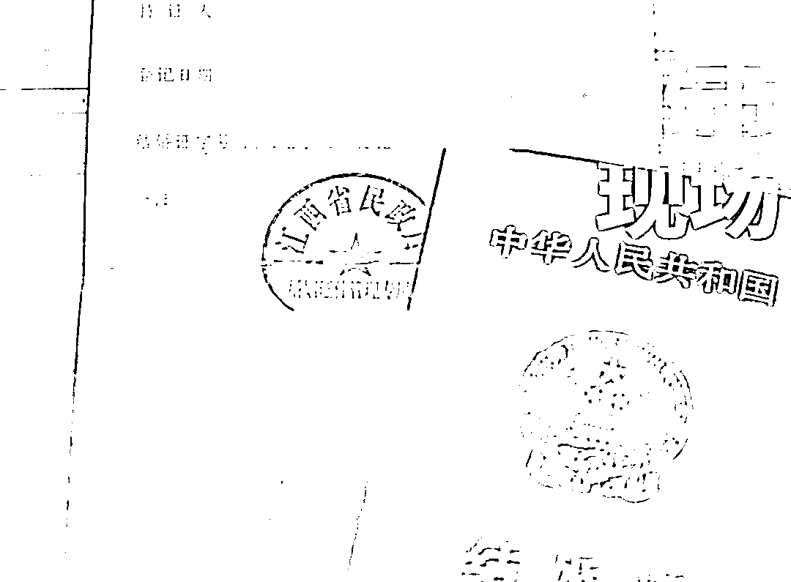
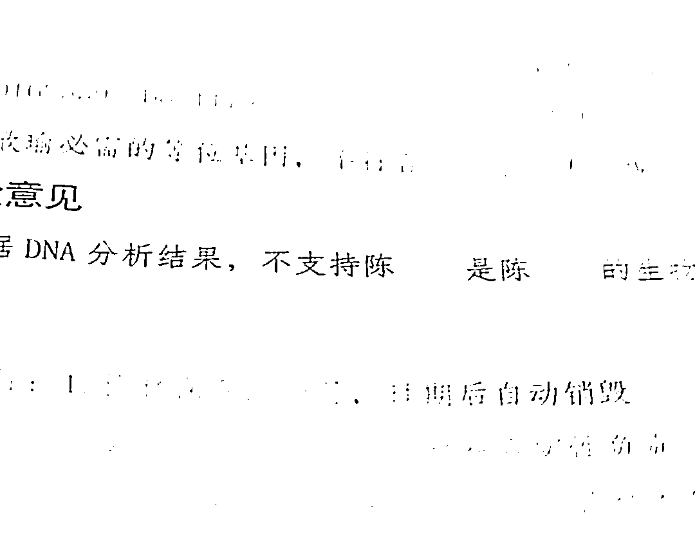
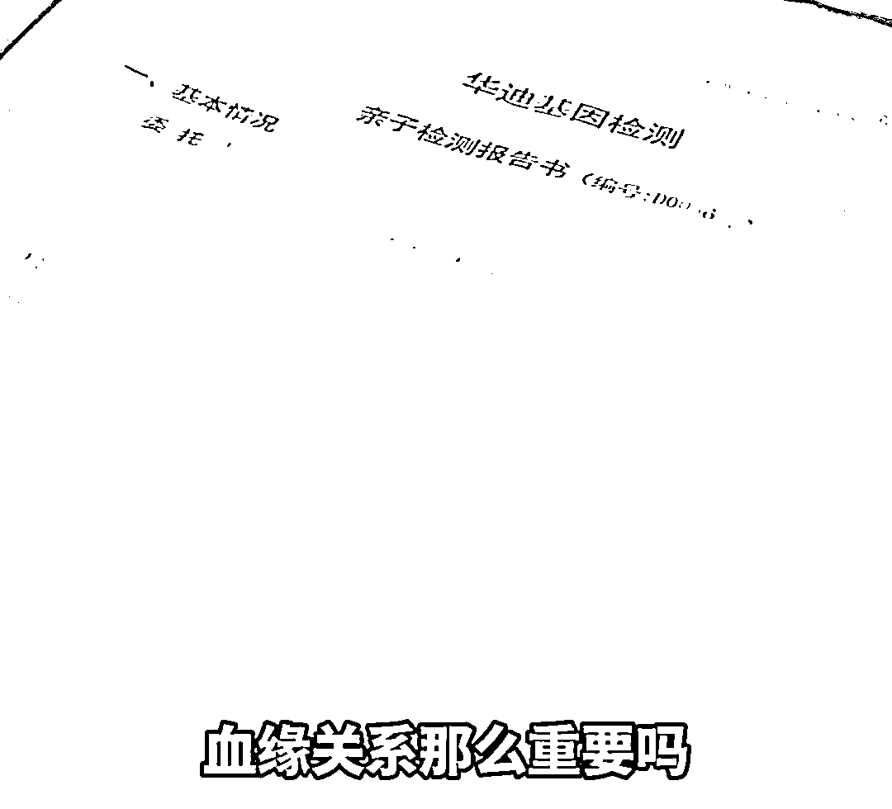

# 男子结婚 16 年后得知 3 个女儿非亲生，妻子：血缘关系很重要？

> 原文：[`mp.weixin.qq.com/s?__biz=MzIyMDYwMTk0Mw==&mid=2247537424&idx=7&sn=181c3d2e3580a5e7ffd5d15b62030db8&chksm=97cb9828a0bc113e43ead2dc8f5b2c8c4ec5753d2147b9ed1a4841774415924c09d4a9b31a2d&scene=27#wechat_redirect`](http://mp.weixin.qq.com/s?__biz=MzIyMDYwMTk0Mw==&mid=2247537424&idx=7&sn=181c3d2e3580a5e7ffd5d15b62030db8&chksm=97cb9828a0bc113e43ead2dc8f5b2c8c4ec5753d2147b9ed1a4841774415924c09d4a9b31a2d&scene=27#wechat_redirect)

<mpvideosnap class="js_uneditable custom_select_card channels_iframe videosnap_video_iframe" data-pluginname="videosnap" data-id="export/UzFfAgtgekIEAQAAAAAA_EkPsiT_KgAAAAstQy6ubaLX4KHWvLEZgBPE9aNkGGJUE7WDzNPgMIvLkTIDDD1cjcRJtizHVeTZ" data-url="https://findermp.video.qq.com/251/20304/stodownload?encfilekey=rjD5jyTuFrIpZ2ibE8T7YmwgiahniaXswqzzXRYxpJaBwHzZ6f5Uv8iahQ6RSEV5Ta37Kic3TKt1Ua6byFQ4wMLdmTdfHSYcfZ5eUPZh0HTiahjbq5YJYib3QueWA&amp;adaptivelytrans=0&amp;bizid=1023&amp;dotrans=0&amp;hy=SH&amp;idx=1&amp;m=&amp;scene=0&amp;token=x5Y29zUxcibD99IlwDTQKC52Q4oibGxqiaeSZ7psotSWZia6JdqBgRdkE2rMmLOzVphvsJaic8wjZrks" data-headimgurl="http://wx.qlogo.cn/finderhead/ibq4aVwOt6HNqrr8OD3sCviaytF3B8TqCwHicxsuIanAJo/0" data-username="v2_060000231003b20faec8c6e48a1acbd3ce04ef33b077a1e41d0d3794ed88ea537878dbe65910@finder" data-nickname="灰产圈+" data-desc="#结婚 16 年 3 个女儿都非亲生#陈先生怀疑老婆出轨，就和三个女儿做了亲子鉴定，结果，三个女儿都不是他亲生的……

出轨妻子竟然反过来大骂他说：小孩叫他叫爸爸叫了十几年，现在去做亲子鉴定这种事情，他跟畜生有什么关系？她没有觉得自己出轨，血缘关系那么重要吗？别人没法生，不照样抱养吗？@灰产圈+ " data-nonceid="684365147827250668" data-type="video" data-width="1080" data-height="2352"></mpvideosnap>

“我结婚 16 年，三个小孩没有一个是我的。”据江西广播电视台都市频道，近日，江西上饶，与妻子结婚 16 年的陈先生发现妻子疑似出轨，先后与 3 个女儿做了亲子鉴定，结果显示女儿全都不是亲生的。

“我们一直做避孕措施，她讲是不小心可能怀孕了，（做了）亲子鉴定，告诉我就非血缘关系。”陈先生说。

亲子鉴定结果出来之后，妻子一直避而不见，并自称没有背叛婚姻。陈先生妻子表示，“你想想看小孩子叫他叫爸爸叫了十几年，他都能做出这种事情来，你说他跟畜生有什么关系（区别），我没觉得我出轨，我不认为我出轨，血缘关系那么重要吗，别人没有能力生的人，不是照样抱养吗？”

目前，陈先生已经向法院起诉离婚。

6 月 7 日，此事在网上引发网友热议，有网友直言，“干错事还振振有词，真是刷新三观”，也有网友表示，“孩子是无辜的，希望孩子能被善待”，还有网友认为，“小说都不敢这么写”。

来源： 潇湘晨报综合江西广播电视台都市频道

← 向右滑动与灰产圈互动交流 →

