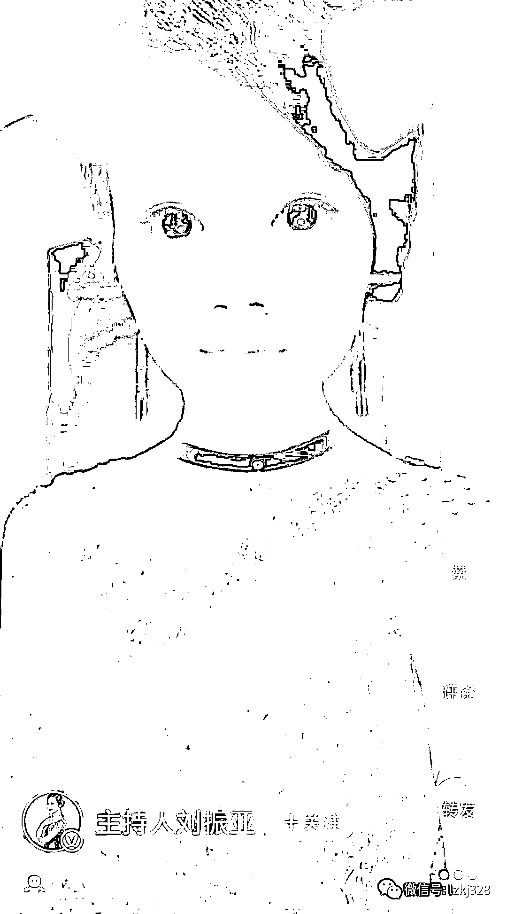

# 27 岁电视女主持人感冒就医后猝死，尸检鉴定意见为使用药物所致。家属质疑院方擅自换药，没做皮试和心电图

> 原文：[`mp.weixin.qq.com/s?__biz=MzIyMDYwMTk0Mw==&mid=2247537484&idx=1&sn=be13de4bcf2de5c2df86f56529c4eb36&chksm=97cb9874a0bc116293d2cadaea630c8f86daedc957bd51b15373a55c174ffa256a089f2d8b5c&scene=27#wechat_redirect`](http://mp.weixin.qq.com/s?__biz=MzIyMDYwMTk0Mw==&mid=2247537484&idx=1&sn=be13de4bcf2de5c2df86f56529c4eb36&chksm=97cb9874a0bc116293d2cadaea630c8f86daedc957bd51b15373a55c174ffa256a089f2d8b5c&scene=27#wechat_redirect)

**导读：服用完新换的药物莫西沙星之后，引发心律失常，最终抢救无效遗憾离世**

近日，安徽合肥 27 岁的电视台女主持人刘振亚，在安徽医科大学第一附属医院治疗期间，疑因用药问题导致其死亡，引发社会关注。

据刘振亚的男友描述，**她是 4 月 14 日因感冒发烧去医院检查，结果发现肺部感染，**医生建议她做进一步检查，在检查支气管时出现口腔鼻腔出血。

家属说，刘振亚住院期间一直积极配合治疗，**直至 4 月 20 日，她在输液的过程中感到胸闷，**护士告诉她这是正常反应，并没有采取特殊措施。

然而刘振亚不适感加强发生抽搐，父母喊医生前来检查，当天还没有值班医生只有实习护士。医生赶到后将刘振亚随送往抢救室，又要求家属签字才进行抢救，最后无力回天。

[`mp.weixin.qq.com/mp/readtemplate?t=pages/video_player_tmpl&action=mpvideo&auto=0&vid=wxv_2433716125458055170`](https://mp.weixin.qq.com/mp/readtemplate?t=pages/video_player_tmpl&action=mpvideo&auto=0&vid=wxv_2433716125458055170)

据悉，刘振亚在 4 月 14 时因为感冒发烧前往医院，诊断结果发现肺部遭到感染，并于 4 月 17 日在主治医生的建议下，进行了支气管镜检查，而插管过程中，刘振亚似乎感到十分不适，口腔与鼻腔出现大量出血的情况，透过她与闺蜜的对话记录可知，刘振亚事后表示：“感觉戳的很深很深，我就忍着，然后医生说鼻孔太小都出血，又换了一个鼻孔，又戳到最深，又出血。”

            

在进入医院治疗后，刘振亚跟医生反应自己感到胸闷和胃痛，4 月 20 日，刘振亚的病情忽然恶化，出现血压升高和抽搐的情况，当时主治医生不在，只有两个实习护士实施抢救，抽搐时间长达 13 分钟后，主治医生才赶到并为其插管治疗，两小时后刘振亚不治身亡，让你悲痛不已。

事发之后，**逝者家属提供了相应的尸检报告，报告明确显示刘振亚本身患有的支原体肺炎并非其致命病症，而其去世的原因是因为生前所服用的药物莫西沙星发生心律失常最终导致患者心源性猝死。**

****

**对此，刘振亚的男友王先生质疑女友的死因要归于院方，因为此前院方在没有对女友进行皮试和心电图等必备程序的情况下，擅自为其换药，而女友**在服用完新换的药物莫西沙星之后，从而引发心律失常，最终抢救无效遗憾离世**。**

****

**6 月 7 日，安徽医科大学第一附属医院宣传部工作人员告诉记者，目前正在和家属沟通，事件还在调查中。**

****

**资料显示，刘振亚曾是合肥电视台的主持人，自 13 年踏入主持届，今年才 27 岁。**

****

**一直以来，刘振亚都是相当优秀，作为家中独女的刘振亚一直被父母视作掌上明珠，如今爱女猝然离世，其父母自然是悲痛交加，6 月 6 日，刘振亚的父母便通过网络发声，详细讲述了女儿在医院治疗就诊并且遭遇意外的过程。**

****

****

**从刘振亚父母的叙述中可以得知，最初刘振亚因为感冒腹部支原体感染，因此来到此医院诊治，在医生诊断下接受常规输液治疗，然后在此过程中，院内医生却擅自更换药物，此前没有对女儿进行任何检查与监护，最终导致爱女无辜丧命。**

****

**在事故发生的详细过程中可以得知，4 月 15 日，刘振亚父母便陪同女儿办理住院手续，两天之后，在名为苏世红医生的要求下，刘振亚接受了相关的支气管镜检查。**

****

**而在这次检查过程中，医生便因为操作不当，导致刘振亚口腔与鼻腔大量出血，当时身体虚弱的刘振亚甚至一时无法行走，最终被其父亲用轮椅推出监察室。而这次检查收取的费用为 3500 元，此外并未出具应该给予患者的收据与发票。**

****

****

**在接受检查后的第二天，刘振亚便被诊断为支原体感染，即肺部出现炎症，需要进行输液治疗，然而在 20 号下午输液期间，刘振亚便出现胸闷与胃疼等不良反应，随即向医护人员进行反应，只是当时医院人员并未做出相应的措施。**

**当天晚上，刘振亚的不适症状加剧，晚间 8 时 24 分一度出现抽搐症状，在此情况下，现场的实习护士却因为缺乏经验导致行为混乱，仅仅对刘振亚进行了简单的心肺按压，连起码的专业抢救设备都没有用上。**

**而后医生赶来之后却勒令家属在知情同意签字后才决定对刘振亚实施器械抢救，此时已经距离刘振亚抽搐过去了 13 分钟，已经错过了 8 分钟抢救黄金期。**

**就这样，晚间 11 点 04 分，刘振亚被院方正式宣告死亡，院方给出的结论更是相当敷衍，仅仅注明死因不明确。**

****

**眼看着女儿无辜送命，最终刘振亚的父母决定让女儿接受尸检为其讨回公道，而尸检报道也显示，刘振亚的死因是因为使用的莫西沙星药物最终导致死亡。**

**因此刘振亚的父母认为女儿的离世完全是医院方错误操作的后果，而且在其女儿离世后的一个月内，院方对其家人不管不问，没有摆出正确的态度。**

**所以，最终刘振亚的父母决定借助网络为女儿伸冤，希望有关部门重视此事，严惩失职医生。**

**在刘振亚离世之后，她生前使用的个人社交账号也受到不少人关注，可以看出，私下的刘振亚善良温暖，富有爱心，长相也是清纯靓丽，楚楚动人。**

****

****

**平日里的她更是爱好广泛，更是练得一手好字，与父母也是关系亲密，去世前，她还曾晒出自己的可爱童年照还有自己的书法作品，只可惜，造化弄人，一场意外事故却夺去了她如此宝贵的生命。**

****

****

**希望刘振亚父母的呼声能被更多人看到，也希望医院方能够正视错误，对受害者家属做出相应的赔偿，最后希望刘振亚一路走好，在另一个没有意外的世界里生活安好。**

 **[`v.qq.com/iframe/preview.html?width=500&height=375&auto=0&vid=m3341z8kjwm`](https://v.qq.com/iframe/preview.html?width=500&height=375&auto=0&vid=m3341z8kjwm)** 

**来源：宾曰语云综合自正观新闻、新闻晨报、新浪微博、科技前沿阵地等**

********

**← 向右滑动与灰产圈互动交流 →**

****