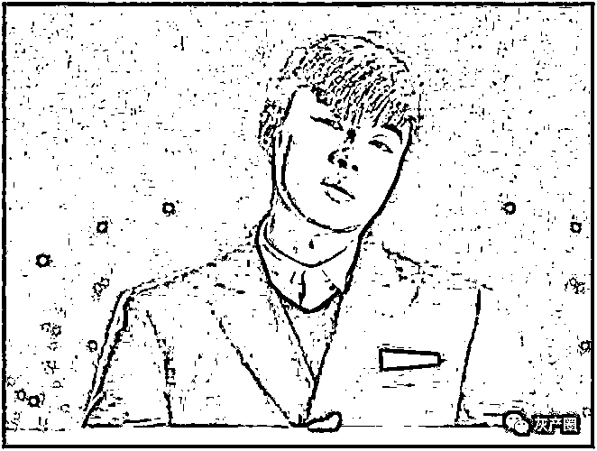
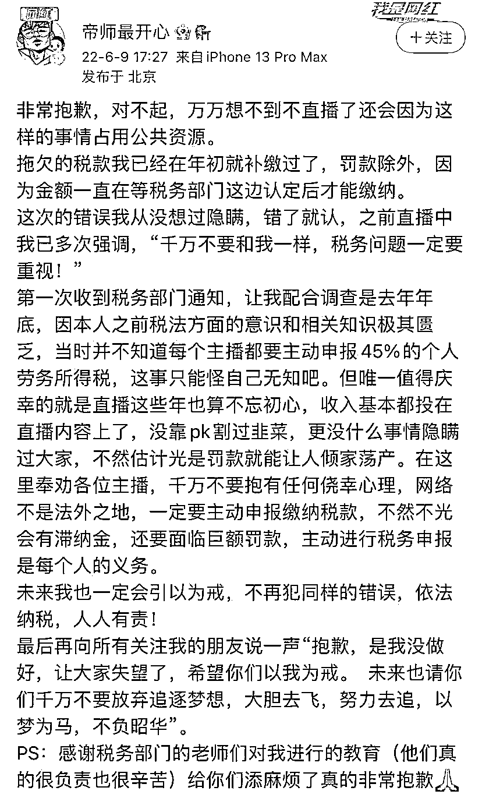
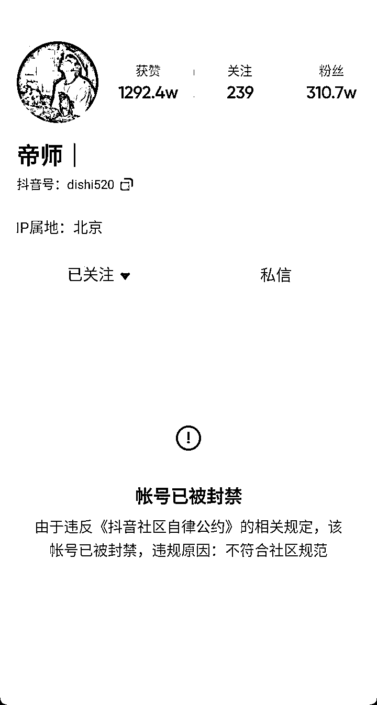

# 网络主播“帝师”偷逃税被罚，账号被封！本人道歉

> 原文：[`mp.weixin.qq.com/s?__biz=MzIyMDYwMTk0Mw==&mid=2247537484&idx=2&sn=a654dec20312b957c0c864d5a9caad76&chksm=97cb9874a0bc116239bf28e2c80716a381903ff5a0adca9e272a7fac0d6446d3e2e2ca8c075f&scene=27#wechat_redirect`](http://mp.weixin.qq.com/s?__biz=MzIyMDYwMTk0Mw==&mid=2247537484&idx=2&sn=a654dec20312b957c0c864d5a9caad76&chksm=97cb9874a0bc116239bf28e2c80716a381903ff5a0adca9e272a7fac0d6446d3e2e2ca8c075f&scene=27#wechat_redirect)

近期，北京市税务局第二稽查局通过税收大数据分析，发现网络主播孙自烜（网名：帝师）涉嫌偷逃税款，在相关税务机关协作配合下，对其开展了全面深入的税务检查。经查，孙自烜在 2019 年至 2020 年期间，未依法办理纳税申报少缴个人所得税 197.86 万元，通过借助中间公司隐匿个人取得的直播打赏收入偷逃个人所得税 220.12 万元，少缴其他税费 34.76 万元。税务部门立案后，孙自烜仍存在侥幸心理，不如实提供有关情况，在税务部门掌握相关证据后，才承认存在的问题并补缴了税款。

综合考虑上述情况，北京市税务局第二稽查局依据《中华人民共和国个人所得税法》《中华人民共和国税收征收管理法》《中华人民共和国行政处罚法》等相关法律法规规定，**对孙自烜追缴税款、加收滞纳金并拟处罚款，共计 1171.45 万元。**其中，对其未依法办理纳税申报少缴的个人所得税 197.86 万元，拟处 1 倍罚款计 197.86 万元；对其借助中间公司隐匿个人收入偷逃的个人所得税 220.12 万元，拟处 2 倍罚款计 440.24 万元。日前，北京市税务局第二稽查局已依法履行税务行政处罚告知程序。

[`v.qq.com/iframe/preview.html?width=500&height=375&auto=0&vid=b3342e45mqy`](https://v.qq.com/iframe/preview.html?width=500&height=375&auto=0&vid=b3342e45mqy)

6 月 9 日傍晚，“帝师”在个人微博（粉丝 203.7 万）发布致歉声明，透露拖欠的税款已经在年初补缴。帝师表示，第一次收到税务部门通知，让其配合调查是去年年底，因之前税法方面的意识和相关知识极其匮乏，当时并不知道每个主播都要主动申报 45%的个人劳务所得税，“这事只能怪自己无知吧”。 

目前，其抖音账号显示已被封禁。

本期高级编辑 周玉华 澎湃新闻 综合报道

](http://mp.weixin.qq.com/s?__biz=Mzg5ODAwNzA5Ng==&mid=2247487973&idx=1&sn=1b62da6f2018402862a5c375e10c355e&chksm=c06878b2f71ff1a4fbe7df4dec626aa7e696154751693bf16f6c6a302ceaa4d1959040c70518&scene=21#wechat_redirect)

← 向右滑动与灰产圈互动交流 →

