# 马斯克怎么成了币圈靳东？

> 原文：[`mp.weixin.qq.com/s?__biz=MzIyMDYwMTk0Mw==&mid=2247537484&idx=3&sn=014872f8c6d05dec07d7dfbcf1e14a9d&chksm=97cb9874a0bc11621a6b928fd5e81aeccce361ec66b4ad31d334825f40d00da9576ab90f54b1&scene=27#wechat_redirect`](http://mp.weixin.qq.com/s?__biz=MzIyMDYwMTk0Mw==&mid=2247537484&idx=3&sn=014872f8c6d05dec07d7dfbcf1e14a9d&chksm=97cb9874a0bc11621a6b928fd5e81aeccce361ec66b4ad31d334825f40d00da9576ab90f54b1&scene=27#wechat_redirect)

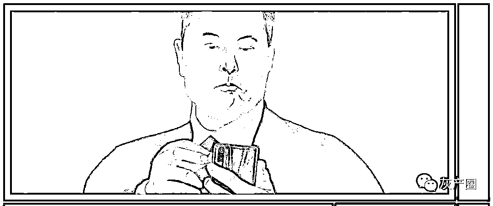**| 堂堂硅谷钢铁侠，可受不了这罪**

热心市民马斯克操心完了推特的假帐号问题，又吐槽起了视频网站 YouTube 的诈骗广告。

“YouTube 上的诈骗广告没完没了。”

6 月 7 日晚，马斯克发布了这条推特和一个恶搞表情包：化身动画角色“派大星”的 YouTube 面对脏话暴怒，却对诈骗广告事不关己、高高挂起，暗讽这家视频网站对创作者用语过度敏感，却任由诈骗广告横行。这两条推特分别收获了 5 万点赞。

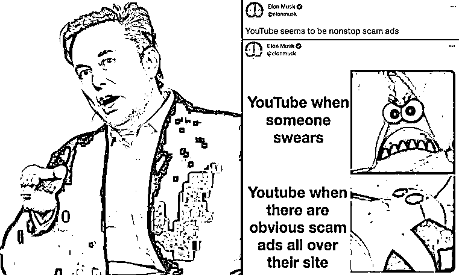

评论区里，网民除了建议马斯克开通去广告的 YouTube 付费服务外，纷纷联想起此前被怼假帐号泛滥的推特，猜测马斯克是不是盯上了 YouTube。

有人贴出了经典“朝三暮四”表情包，“马斯克”望向擦肩而过的 YouTube，一旁的推特投去惊讶与愤怒的眼神……而马斯克翻了这条评论的牌子，一起看热闹。

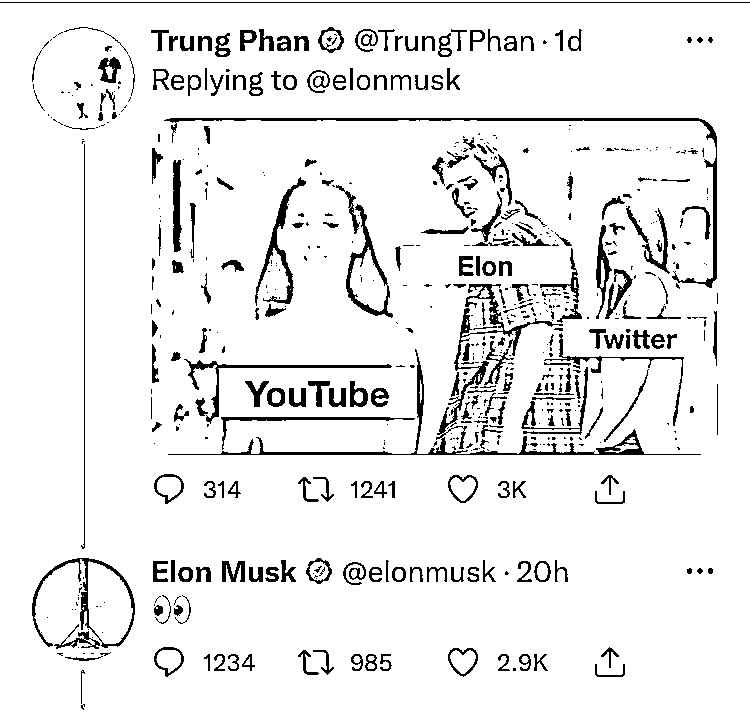

不过玩笑归玩笑，如果你知道马斯克有多受诈骗份子喜爱，就知道他可能并不是要 PUA 这家公司，而是真的想让它支棱起来管管这事儿。

毕竟，一般网民的苦恼只是看到了诈骗广告，轻则闹心，重则被骗钱；但马斯克——世界首富、虚拟货币知名带货主播——则很有可能直接看到自己的脸出现在诈骗视频里。

通过换脸技术合成的女马斯克照片（还挺美） 

依靠先进的人工智能技术，这种诈骗越来越有蛊惑性；再经过社交媒体和短视频平台的散播，飞进寻常百姓家，上当者众多。

**堂堂硅谷钢铁侠，眼瞅着就变成了“靳东”。靳东是动不动被冒充送秋波，马斯克是动不动就要给人送代币，这谁顶得住啊。**

**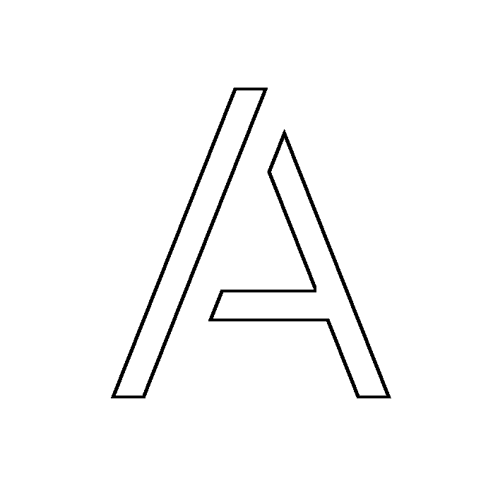**

**五月底，网上突然出现了一种诈骗广告，宣称马斯克创办了加密货币交易平台 BitVex，每天可以带来 30%的基础收益。骗子通过 deepfake 换脸技术，制作了一系列视频。**

**视频中，所谓“BitVex 创始人”马斯克与 TED 主席克里斯·安德森坐在一起，后者上来就问“和我们说说这个项目怎么帮助大家发财”，马斯克答道：“一切都很简单，每个人都能赚到钱。”他还说，自己已经往该平台投资了 5000 万美元。（再次提示，都是假的。）**

****和粗制滥造的“一眼假”换脸可不一样，这个视频的换脸技术已经到了一般人难辨真假的程度，声音也是马斯克的。****

****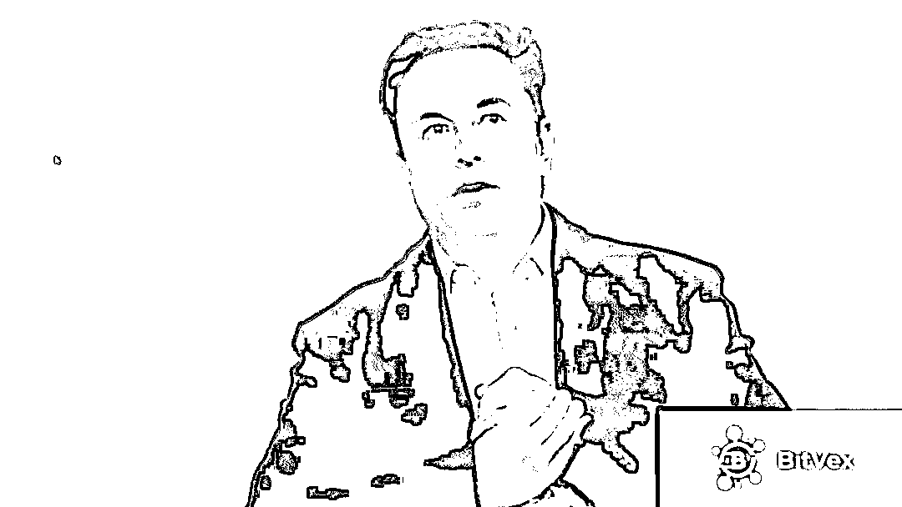****

****骗子伪造的“马斯克力推 BitVex”视频截图**** 

****除此之外，诈骗分子还伪造了方舟投资（Ark Invest）CEO 凯瑟琳·伍德、以太坊联合创始人查尔斯·霍斯金森等多位币圈名人推荐 BitVex 的视频。****

****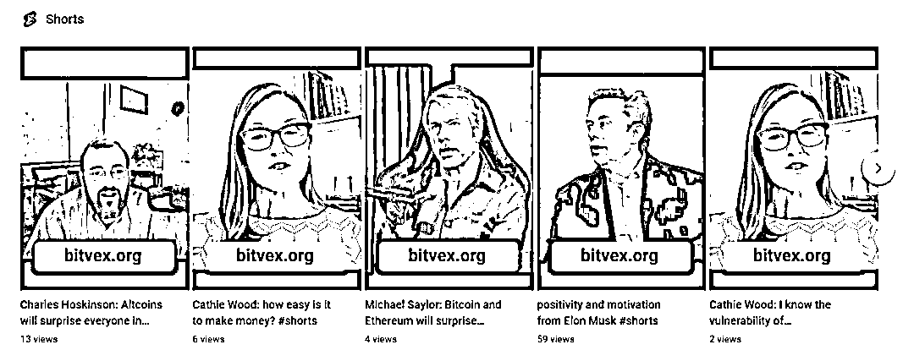****

****随后，诈骗分子黑了很多 YouTube 账号，用来发布这些视频。比如一个本来是介绍阿拉伯语游戏视频的频道，突然上传一系列 BitVex 推介视频。****

****进入 BitVex 的网站，也可以看到马斯克位于 C 位，职务是“首席执行官”，而币安网（Binance）CEO 赵长鹏和方舟投资 CEO 凯瑟琳则分立左右。****

****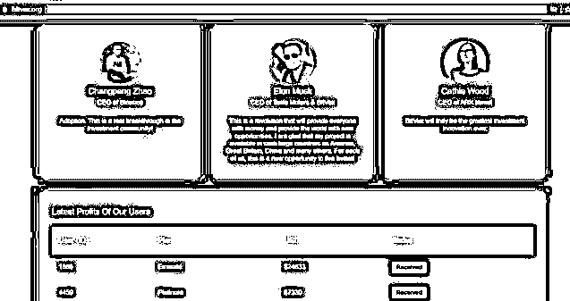****

****这场骗局很快就被戳穿了。马斯克本人也在推特上回应了那段换脸采访视频：“口区，这必然不是我啊。（Yikes. Def not me.）”****

****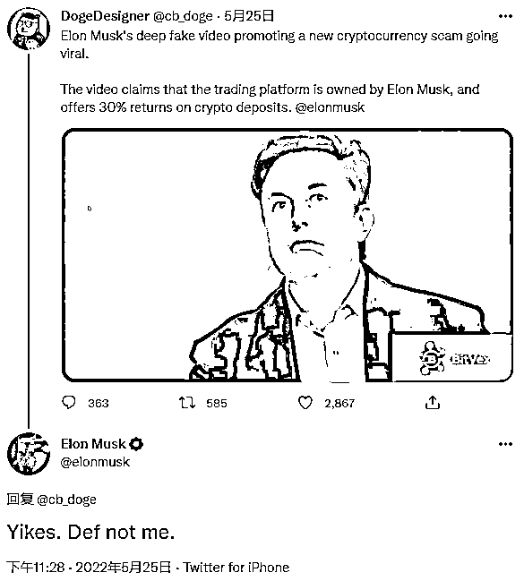****

****据外媒报道，这个骗局目前只骗到了大约 2000 美元。但是这类诈骗网站经常会变换，所以实际收割了多少韭菜仍不清楚。****

****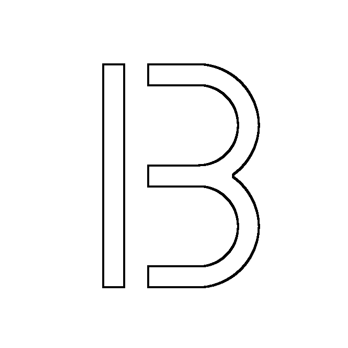****

******这不是马斯克第一次成为币圈骗局的座上宾。在以往的骗局中，有的骗子甚至大赚特赚。******

******今年 1 月，马斯克等知名人士已经被骗子编排过一次，直接骗走了 130 万美元。******

******“事发地”还是 YouTube。骗子抛出一段修改过的视频，原视频是马斯克、推特创始人杰克·多西以及凯瑟琳讨论加密货币，编辑后变成了关于方舟投资的推介。******

******骗局的基本玩法，与超市常用的“送鸡蛋”促销十分类似：你存一个币，还你两个币。诈骗者短短七个小时收割 40 万美元。******

******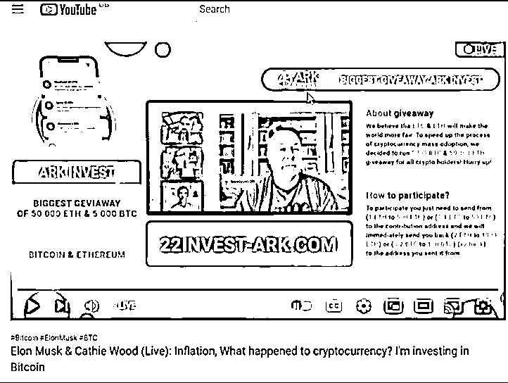******

******最终，这场骗局被知名信息安全公司迈克菲戳破。迈克菲的安全研究人员发布报告，详细说明了这个骗局，并识别了 11 个诈骗网站。根据迈克菲后续发布的信息，截至 5 月 6 日，上述恶意网站的钱包交易总价值已飙升到 130 万美元。******

********目前被戳破的金额最大的假马斯克骗局，是去年的“SpaceX 加密货币”事件。********

******去年 5 月初，骗子利用马斯克的旧视频，配上假的马斯克推文，狂骗超过 1000 万美元，而 YouTube 是重灾区，骗子从这里导流量骗了 900 万美元。******

******这个骗局之所以赚疯了，是因为它布局非常“用心”。******

******首先，骗子制作了一套模板，可以放进一条马斯克的假推文、一个马斯克的既往视频以及特斯拉或 SpaceX 的标志，看起来就不是光秃秃的视频那么简单了，一目了然劝你赶紧买币。******

******其次，骗子黑了很多账号，其中甚至有千万粉丝的 YouTube 大号，所在地包括美国、德国、巴西、印度、沙特阿拉伯、菲律宾等，遍布全球。******

******然后，骗子将头像和名字改掉，伪装成美国著名电视脱口秀《周六夜现场》（SNL），或者该节目出品方美国全国广播公司（NBC）的官方账号。******

******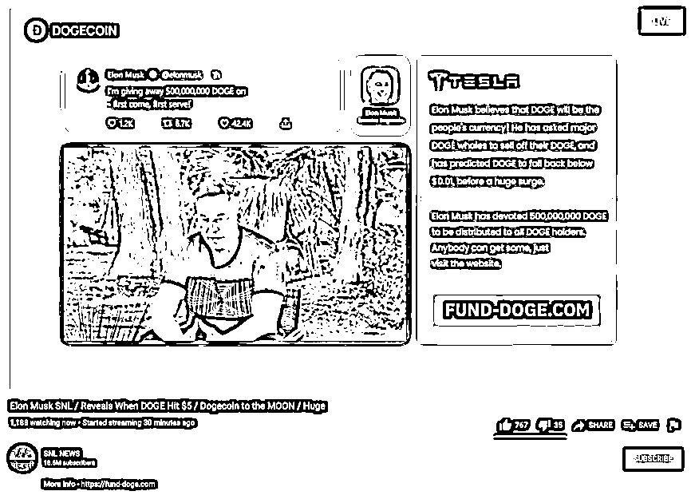******

******为什么是 NBC 和 SNL？因为马斯克当时上了这个节目，骗子借机“蹭热点”，属实是四两拨千斤、乘势而为。******

******有趣的是，马斯克在那期节目中亲口承认了狗狗币是“骗局”。虽说有开玩笑的成分，但结合背后发生的这堆烂事，不得不说讽刺意味满满。******

******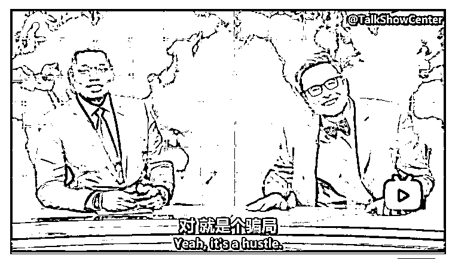******

******马斯克在《周六夜现场》说狗狗币是骗局，不过下一句就是“开玩笑的”****** 

******最后，骗子在推特和 YouTube 铺天盖地发布诈骗广告，直截了当的模板，让你在 3 到 5 分钟就知道是怎么回事，并且引导你参与“加倍奉还”的美事。******

******想象一下，拥有千万粉丝的官方账号，发布马斯克要发虚拟货币的消息，不上当太难了。5 月 8 日马斯克上节目，在那之前骗局的“框架”都搭建妥并且已经开始骗钱了。******

******赠币骗局一个接一个，大家都不陌生。但就是这样一个简单而老套的骗局，在马斯克和社交媒体大 V 的加持下，还是杀疯了。******

******马斯克就这样成了“靳东”。骗得不是寻求人生意义的阿姨，而是生怕错过好机会的炒币人。******

******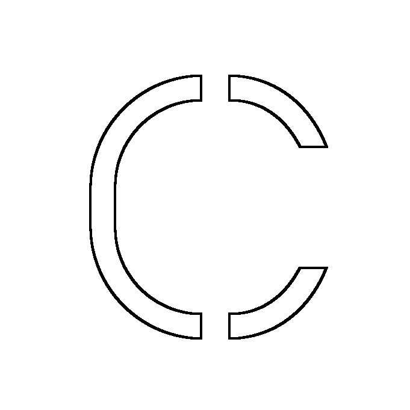******

********虚拟货币骗局横行，马斯克和 YouTube 都是骗局中被利用的棋子。********

******6 月 3 日，美国联邦贸易委员会发布的报告显示，自 2021 年初以来，超过 4.6 万人报告遭遇加密货币骗局，损失总金额超 10 亿美元，相当于 2018 年的 60 倍。******

******除了马斯克，很多名人都曾被骗局利用。******

******2020 年，比尔·盖茨、奥巴马、巴菲特等名人的推特被盗，骗子发布比特币诈骗消息，同样是熟悉的“送鸡蛋”套路，你给我 1000 美元，我还你 2000 美元。******

******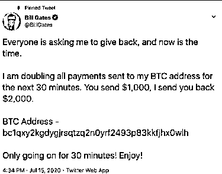******

********YouTube 并不是加密货币骗局的唯一“肥田”，马斯克要买还没买的推特同样是骗子的乐园。********

******早在 2018 年，美国互联网安全公司 Duo Security 就发现了推特“僵尸”网络。该网络由 1.5 万个机器人组成，会复制普通用户的头像和账户名，然后通过评论普通人的推文等方式，传播加密货币骗局链接。******

******同一年，黑客入侵多个推特认证“蓝 V”账号，包括电影制作公司、国会议员甚至哥伦比亚交通部，把名字和头像换成马斯克，并且发布诸如“我将离任特斯拉”并将送出 1 万个比特币的消息。******

******英国广播公司（BBC）也报道了去年发生在一名德国男子身上的“惨案”。******

******关注了马斯克推特的他，那晚收到了马斯克发推的消息提示：“Dojo 4 Doge”，觉得匪夷所思，就点开想看看这是什么意思。******

******打开之后，他看到评论区马斯克“自己”又发布了一个链接，打开链接是一个由“马斯克和特斯拉团队”举办的限时活动，邀请人们发 0.1~20 个比特币，团队将双倍返还。******

******他仔细检查了这个评论的头像、名字都是马斯克，而且名字旁边还有一个耀眼的蓝 V 标识，信以为真，选择发送 10 个比特币到评论链接的比特币钱包。******

******但实际上，虽然发布“Dojo 4 Doge”确实是马斯克本人，但是评论区这位是冒牌货，八成是黑了蓝 V 账号伪装成马斯克的样子，跟着马斯克的推文发评论，让人以为是马斯克本人的跟帖。该男子最终损失了约 40 万英镑（约合人民币 335 万元）。******

******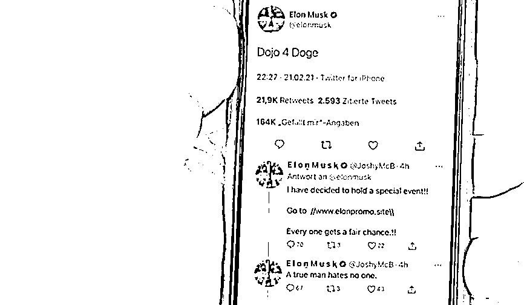******

******BBC 报道中该男子看到的画面，上面是真马斯克，评论区是假马斯克****** 

********骗子难以追踪，平台难逃责难。********

******2020 年，YouTube 面临至少 18 起涉及加密货币诈骗的诉讼。加密货币公司 Ripple 和苹果联合创始人史蒂夫·沃兹尼亚克都曾和 YouTube 打官司。******

******Ripple 公司在博文中写道：“大型科技公司和媒体需要承担起保护消费者的责任。”但 YouTube 的律师则称，根据美国相关犯规，平台不对这些诈骗负责。******

******这些官司大都以平台胜诉告终。比如史蒂夫就败诉了，当地法官认定 YouTube 不需要为用户发布的内容负责。******

********平台并不是对骗局不操心，而是显得有些力不从心。********

******去年，美国一位已故音乐人的 YouTube 账号被盗，用来宣传以马斯克为幌子的虚拟货币骗局。YouTube 彼时回应称，平台“有严格的指导方针，禁止诈骗，包括黑客和仿冒行为”，且已经删除了违反规定的视频。******

******但这类骗局会利用数个账号去铺陈，平台审核的速度往往赶不上骗子开花的速度。如今，骗子越来越精湛的“演技”——包括仿冒账号防不胜防的挂靠玩法，以及以假乱真的 Deepfake 换脸技术——使得一切变得更加糟糕。******

******例如，不久前一名长相酷似马斯克的河北男子在微博上爆火，甚至引来了本尊的注意。马斯克在推特上称，愿意和这人见面，但前提是他真的存在。******

******马斯克同时感叹，“这年头很难辨别 Deepfake 了。”******

******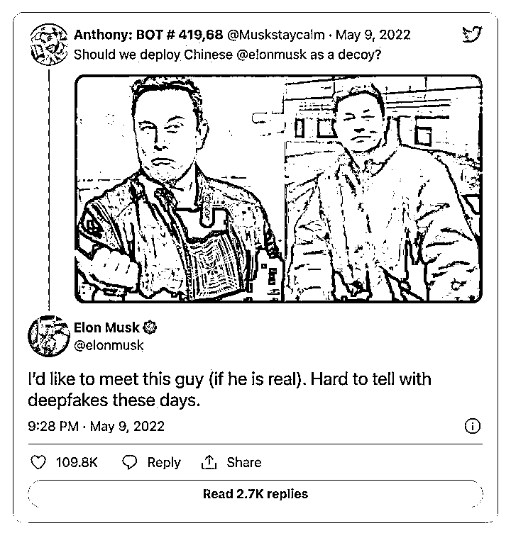******

******这场网民吃瓜热情爆棚的“双向奔赴”，最终走向了一个离谱的结局：“河北马斯克”遭到微博封禁，多条模仿马斯克的视频被删除。这显然又是一场 AI 技术支撑的闹剧。******

******回到“币圈靳东”的话题，马斯克除了可以指望 YouTube 做点什么组织诈骗广告以外，还可以“三省吾身”：******

******是不是我对虚拟货币太有热情了（所以大家觉得我有事没事出来“送鸡蛋”概率很高）？******

******是不是我总是做出人意料的事情（所以用我创办交易平台骗人特好使）？******

******是不是我总是发一些意义不明的推文（所以仿冒账号有机可乘）？******

******但是，马斯克肯定会继续在币圈翻江倒海，骗子也会利用技术整出更多花活，倒霉的只能是普通炒币人了。**还不是怪咱要炒币。********

****************

****← 向右滑动与灰产圈互动交流 →****

********