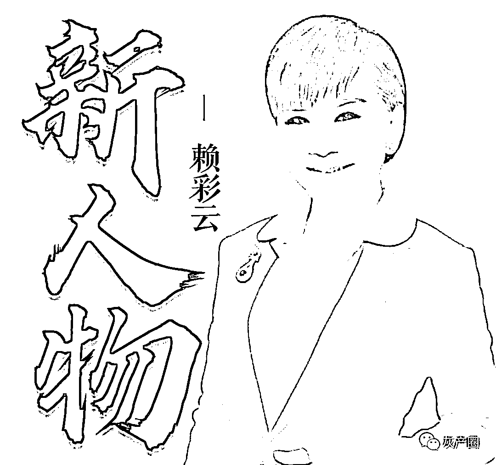
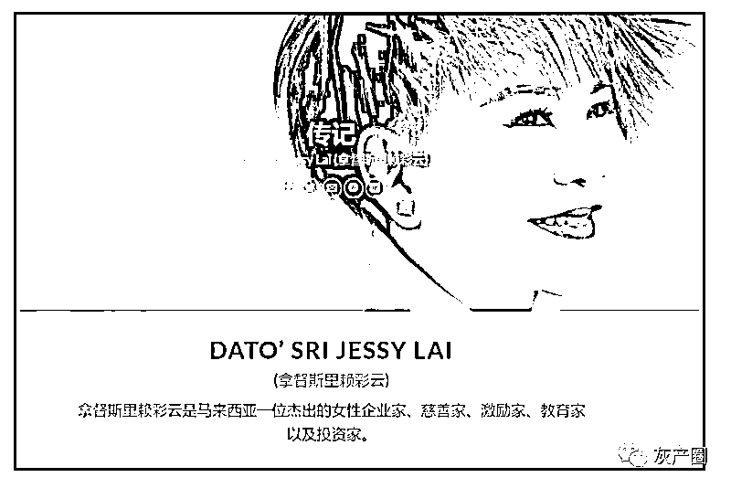
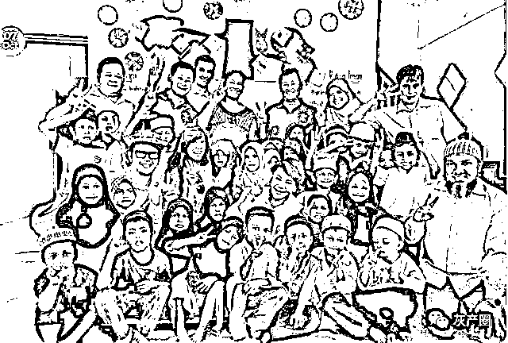
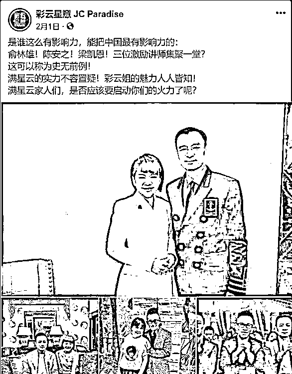
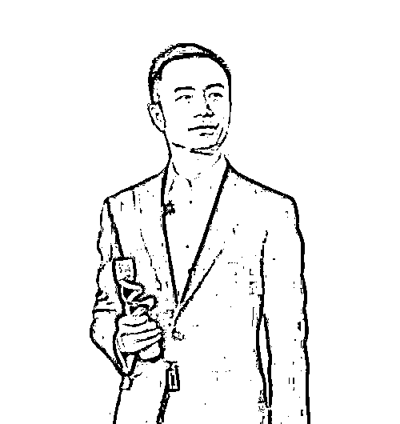
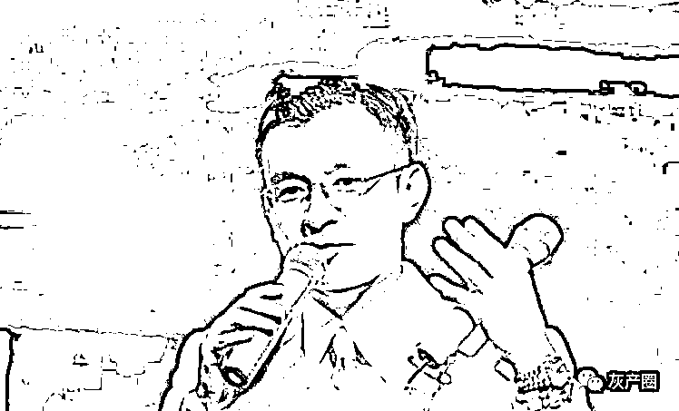
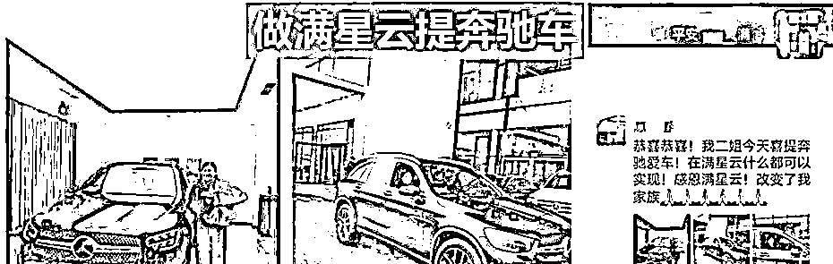
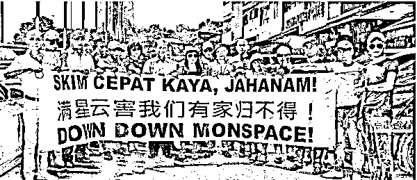
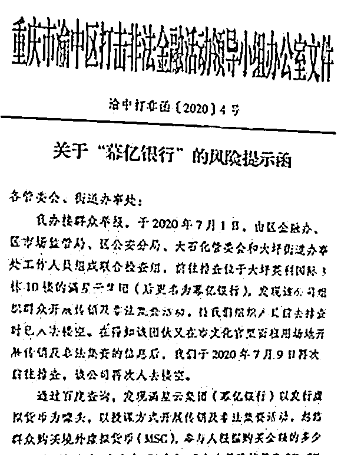

# 赖彩云的“传销帝国”:5 年发展会员 3 千万人！

> 原文：[`mp.weixin.qq.com/s?__biz=MzIyMDYwMTk0Mw==&mid=2247537484&idx=5&sn=030c3923c8359e02449f7d8ed90e0649&chksm=97cb9874a0bc1162db1e02a763c483835700612cbcf15973e22776a0cc3b7813be1411bfaf30&scene=27#wechat_redirect`](http://mp.weixin.qq.com/s?__biz=MzIyMDYwMTk0Mw==&mid=2247537484&idx=5&sn=030c3923c8359e02449f7d8ed90e0649&chksm=97cb9874a0bc1162db1e02a763c483835700612cbcf15973e22776a0cc3b7813be1411bfaf30&scene=27#wechat_redirect)

**新人物**

有人说她是个了不起的人物，也有人说她是个骗子！她曾获得诺贝尔和平奖候选，也是马来西亚拿督斯里！

她就是今天的新人物：赖彩云

5 月份以来，币圈可谓愁云惨淡：市值 400 多亿美金，币圈排名前十虚拟币 LUNA，价格一度跌到 0，直接带崩了整个虚拟货币市场。比特币已经跌了至少 50%，将一众炒币的人坑了个大惨。币圈热门“跑鞋”项目 STEPN，一度暴跌 40%，让很多人避之不及。

说起币圈大佬，有一个名字始终绕不过去，那就是马来西亚拿督赖彩云！

一个有着传奇色彩的人物，有人说她十分了不起，也有人说她是个骗子，赖彩云的身上到底发生了什么，让大家对她的评价如此两极分化呢？

满星云集团创始人赖彩云 

**获得诺贝尔和平奖候选人的企业家**

2020 年 2 月 8 日，满星云集团董事长赖彩云女士被提名为诺贝尔和平奖候选人，她也是首位获此殊荣的马来西亚华侨。 

赖彩云不仅获得诺贝尔和平奖提名，还在亚洲电视担任非执行董事兼联席主席。此外，她还是马来西亚皇室颁发的拿督斯里。

而在 Google 搜索上，对于赖彩云的介绍是说：一位杰出的女性企业家、慈善家、激励家、教育家以及投资家。

获得提名的原因 

**来源于事业和慈善上的贡献**

根据万事通找到的资料显示，赖彩云能够获得诺贝尔和平奖候选人提名，得益于她在事业和慈善上的贡献。

她曾经捐赠物资给逃难的罗兴亚人，还邀请著名影星米雪一起进行探访，帮助他们重拾建造家园的信心，以及向香港再生慈善基金捐款，帮助更多饱受病痛折磨的患者以及残疾朋友重建生命等慈善措施。

她还是大马宗乡青慈善与教育基金会的荣誉顾问，致力于协助该基金会组织以及筹办活动。

就像她曾在微博中与大家分享德蕾莎修女的名言：“你今天做的好事，可能明天就被忘记，但无论如何，做好事。将你所拥有最好的部分给这世界。”

创办满星云 

**5 年就拥有近 3000 万会员** 

**“力压”俞林雄、陈安之、梁凯恩**

2014 年，赖彩云创办了满星云集团，业务横跨电信、房地产、科技、金融、娱乐、餐饮等领域，仅成立 5 年就拥有近 3000 万会员，遍及全球 70 多个地区，活跃用户超 700 万个，被用户们亲切称为“彩云姐”。

在满星云的宣传资料上，印着这么一句让人热血沸腾的话：“如果你有梦想，如果你想创造更大的人生价值，如果你想帮助更多的人，如果你想成为这个时代的代言人，如果你想成为百万富翁、千万富翁......满星云绝对是你最佳的选择！” 

在满星云的宣传中，曾把俞林雄、陈安之、梁凯恩三位齐聚一堂。

这三位都是什么人呢？

俞林雄，曾被称为“币圈蝗虫”，喻指他所过之处，“韮菜”根本就没活路。

从 2000 年开始，19 岁的俞林雄被忽悠进入传销组织，要是一般人肯定避之不及，俞林雄却靠着独特的天分，很快拿下业绩第一，并出来单干。凭借着过人的口才，招收了一批大批弟（jiu）子（cai），用来敛财。 

偶然间结识了柬埔寨首相洪森，摇身一变成为柬埔寨华人，将自己包装成中柬商业协会主席、万象国际荣誉主席、万系资本联合创始人等一系列头衔，发行各种各样的数字货币“割韭菜”，幸孕链、万象币、黄金币等都是他的杰作，很多人深受其害。

说起“成功学大师”，陈安之的名字能浮现在很多人的眼前。有人曾说，陈安之是中国第一成功学大师。曾经，他出版的书和光盘遍布大街小巷，是很多人心中的老师！

凭借着出色的口才，以及包装的成功人设，陈安之在各大城市开办“成功学培训课”，凭借着“你也行”、“相信自己”、“你最棒”，给你打鸡血和洗脑。

近年来，陈安之很少露面，而自称是陈安之“大弟子”的陈志华，因为犯组织、领导传销活动罪，被判刑八年……

梁凯恩，比陈安之还要厉害的演讲家。

以上三人都是传销圈的大佬，也是满星云集团的一份子。其中，俞凌雄负责区块链对接，陈安之负责战略顾问，梁凯恩担任商学院院长，而担任满星云的创始人兼董事长的赖彩云，又是凭什么“力压”他们一头。 

赖彩云起家于“男友”张健 

**继承其传销模式发展满星云**

说起来赖彩云的起家，不得不提起另一个男人——化名张健的宋密秋。

2012 年，张健联合其他人创办了“云数贸”项目，这一国内著名的传销盘，赖彩云就是张健得力的左右手。

2014 年，赖彩云等人创办了“云讯通”传销组织。到 2016 年，湖南省郴州市公安局苏仙分局破获“云讯通”特大传销案，此时“云讯通”已有会员 52 万余人，吸收资金达 93 亿元！ 

为了逃避追责，赖彩云公开撇清与张健的关系，并将“云讯通”更名为“满星云”！

赖彩云沿用云数贸、云讯通的传销模式，瞄准比特币等虚拟货币市场，披上区块链的外衣，无成本向会员发行虚拟货币。

之后才联系上以上 3 位传销圈大佬，合作发展新项目 Munics。 

因涉及传销被告上法庭 

**赖彩云商业帝国梦碎**

早在 2018 年，马来西亚就破获满星云特大传销案，赖彩云被禁止出国，72 个银行账户上的 586 万令吉（约合人民币 1000 万元）资产也被冻结。

2019 年，满星云被马来西亚警方查封，创办人赖彩云 3 人也被压上法庭候审。但 3 人拒不认罪，被保释在外。

网传赖彩云被押上法庭画面

Munics 也在后续发展中崩盘。重庆市渝中区曾下发的打击非法金融活动文件，其中就有“满星云集团”。 

到 2020 年 6 月，满星云 app 已经停止，官网也无法访问。从云数贸到幕亿银行，赖彩云一手打造的满星云传销帝国分崩离析。

至于曾经宣传的诺贝尔奖候选、在事业和慈善上贡献也不知是真是假。

赖彩云也淡出了公开视野，不知道在未来又会掀起怎样的风浪！

  来源：佚名，特此鸣谢！编辑校对：捉销师

← 向右滑动与灰产圈互动交流 →

