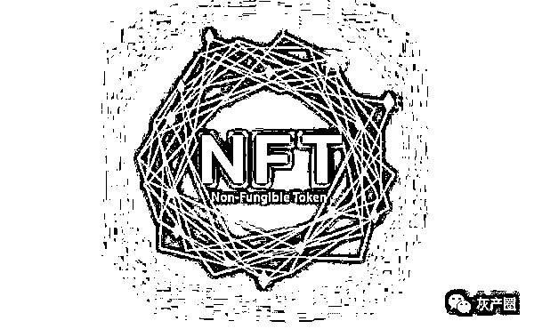

# 数字藏品爆火 NFT 是风口还是泡沫

> 原文：[`mp.weixin.qq.com/s?__biz=MzIyMDYwMTk0Mw==&mid=2247537484&idx=6&sn=4e191bfe7dbad60df6bce6787359372f&chksm=97cb9874a0bc1162632edc5ede43294aba1cb73f9648a34d9c4cd07c230f29a8fb8c5c460561&scene=27#wechat_redirect`](http://mp.weixin.qq.com/s?__biz=MzIyMDYwMTk0Mw==&mid=2247537484&idx=6&sn=4e191bfe7dbad60df6bce6787359372f&chksm=97cb9874a0bc1162632edc5ede43294aba1cb73f9648a34d9c4cd07c230f29a8fb8c5c460561&scene=27#wechat_redirect)

 2022/6 

6 月 6 日，中国探月航天以数字藏品的形式发行我国第一艘数字载人飞船“梦想号”，招募 1 万名“太空数字乘客”上太空。这次，百度携手中国航天推出了全新 NFT 的作品，开启“未来太空”探索之旅。

　　NFT，在很多人还搞不清这几个字母代表什么含义时，已经有人日入过万元，有人甚至可以“漫步太空”了。这个市场在起步之初，就充满了玄幻色彩。

　　NFT，全称 None-Fungible Token，非同质化代币。是指使用区块链技术将艺术品、文字、游戏物品等有价值之物加密编码，重新定义数字资产所有权的一种标记方式。NFT 具备交易属性、可以买卖。进入国内市场后，NFT 弱化了交易和金融属性，对象更多为藏品、艺术品，所以用数字藏品来表述更为恰当。目前，国内互联网大厂、内容公司、传统媒体公司纷纷下场布局 NFT。业内人士表示，NFT 作为一种数字资产，所赋的透明、不可篡改和全网独一无二的性能，是当前其他产品所无法替代的。

　　当然，作为一种新兴事物，对 NFT 的质疑一直存在，规范也在不断跟上。

**一问：NFT+文物、彩妆、电影…… **

****万物皆可 NFT？****

****　　2022 年年初，歌手吉克隽逸等一众女星参加米兰时装周，并在微博上晒出了 NFT 虚拟服装秀。看得见、摸不着的走秀款 NFT 虚拟礼服，恍若高奢版 QQ 秀。但售价有的高达 6 万元，甚至近百万元。****

****　　当然，这是高级玩家，初级玩家也可以加入的赛道有 NFT 头像。记者在电商平台上以 NFT 为关键词进行搜索，就有专业从事 NFT 头像设计的商家，可批量生成 NFT 像素画。店家告诉羊城晚报记者，买家可以提出需求，商家设计好作品后以网盘或邮件形式交付产品。“目前比较火的是平面头像、3D 头像和动图动画，不同产品的定价也不同，200 元、300 元至 1000 元一个头像不等。”买家收到设计作品后可以挂上平台上售卖交易。****

****　　但不要认为头像就只局限于这个价格。愚人节前后，周杰伦就有一款价值 320 万元的无聊猿 NFT 头像被盗。****

****　　而在商业板块，NFT 可玩的花样就更多了。去年 10 月 29 日，湖北省博物馆镇馆之宝“越王勾践剑”数字藏品上线发布，限量 1 万份，3 秒售罄。李宁则是玩起了 NFT 实体联名合作，买下 NFT 版权后进行了二次创作，开快闪店、打造了一系列单品。****

****　　美妆圈自然也不甘于后。欧莱雅、自然堂、雅诗兰黛、纪梵希到 NARS，一夜之间都开始布局 NFT 产业。去年年底，美国欧莱雅在巴黎欧莱雅红色系列口红中创作 NFT 艺术——Reds of Worth NFT，单个起底 1500 美元起拍。记者就此事询问了欧莱雅(中国)彩妆品牌产品经理 Mona，对方表示国内尚未开启这方面业务。“NFT 大家现在都还是追着风口做一做，但目前国内还没有发现哪个品牌在布局它。”****

****　　NFT+文物、彩妆、电影、虚拟服装、游戏……一时间仿佛一切皆可 NFT。****

******二问：魅力何在？******

********资本缘何对 NFT 另眼相待？********

********　　NFT 究竟是什么？是一件衣服、一个头像、一件数字文物，又或是其他？在元宇宙与未来资产研究智库 MetaZ 创始人陈序看来，NFT 是一段代码，这段代码本身是一个智能合约，可以用来确权。当你成功上链后，这个 NFT 就是唯一属于你的。基于区块链特性，这一点几乎是无法被其他人改变的。********

********　　确权，这或许就是 NFT 让人无法抗拒的理由。********

********　　在和电商平台卖家的沟通过程中，对方表示，出售的每一个 NFT 作品都是原创产品。确权后的唯一性，这就是 NFT 的魅力所在。“你是全世界唯一拥有它的人。”商家的话充满魔力。********

********　　在社交软件“即刻”上，用户可以将自己的账号关联 NFT 交易平台 Opensea，在个人页面展示自己拥有的 NFT 作品。拥有 NFT 头像的多寡与价值高低，就像玩家游戏账号里存放的皮肤一样，背后是一条隐性的“鄙视链”。********

********　　深圳云图 photoplus，是一家以区块链为底层技术，专注数字资产保护以及赋能的企业，其中赋能也包括 NFT 领域。在云图 CEO、创始人任潇棠看来，随着 VR 等虚拟世界技术手段越发成熟后，人们在虚拟世界上停留的时间会越来越长。“和现实世界里背包、穿衣服一样，你在虚拟世界里的头像要戴哪些配饰，就是一种身份和资产象征。”就如同当下的 NFT 与营销结合，也是用年轻人喜欢的形式，它未来可能有价值，但当下人们未必在乎产品溢价，拥有就是一种象征。********

********　　上海财经大学电子商务研究所执行所长崔丽丽告诉羊城晚报记者，自去年脸书改名 Meta 之后，元宇宙一词代表了“时髦”，与此同时，这种虚拟世界的资产还能够和实物相关联。“这种彰显了个性、时髦，同时虚实结合等商业要素的产物，非常容易在资本市场上引起关注。”********

********　　2021 年被称为 NFT 元年。据加密数据网站 DappRadar 数据显示，2021 年全年 NFT 的交易额超过 230 亿美元，其中排名前 100 的 NFT 藏品的底价市值就达到 167 亿美元。预计，这一数字会进一步上升。********

********　　纵观国内，截至 2022 年 4 月，我国已有 16 家上市公司推出了自身的数字藏品交易平台，以互联网大厂、内容公司、传统媒体公司为主。大厂有阿里巴巴的鲸探、腾讯的幻核，内容有腾讯音乐、视觉中国等。********

********　　根据新知榜的统计数据，2021 年，阿里通过鲸探累计发行了 40 余套数字藏品，发行总量达到 300 万份左右，销售额超 4000 万元。腾讯的幻核累计上线 13 款数字藏品，发行总量约为 3 万份，销售额约为 200 万元。********

********　　传媒方面，部分传统传媒公司凭借自身优势，与各省文交所展开合作。2022 年，广东网络广播电视台成立“元媒实验室”，孵化自有潮流艺术文化数字藏品设计团队。总的来看，布局战略方向、占据早期市场是当前国内各大平台针对 NFT/数字藏品平台的方案。********

********　　NFT 为何如此受资本青睐？任潇棠对记者提到：“在一个数字生态中，只要你是成员，就可以拥有投票权。人们不再需要去被动接受中心化网络平台制定的规则，而是成为了规则制定的参与者。这是数字生态值钱的很大一个原因。”********

********　　而在博物馆业内人士看来，文物“数字化”，既能抢救保存文物数据，也能拉近与年轻人的距离，是博物馆无法抗拒的浪潮，数字藏品是具体运用之一。********

********　　数字产品的魅力是具备稀缺性、唯一性，但能引来如此疯狂态势，重点还是要看数字藏品是否会提供额外权益，圈子里称之为“赋能”。不过，NFT 的唯一，并不能同样保证作品的唯一性，而一旦涉及权益与收益，侵权和其他风险也都随之涌来。********

**********三问：无法删除的 NFT 作品，**********

**********薛定谔的唯一性？**********

********　　“很多人会拿着别人的作品抢先去 Opensea 上铸造(上链)，也有人在 Opensea 上铸造后，又拿着同一个作品去别的平台上做一个，重复上链，这样就会存在侵犯他人权益、打击 NFT 唯一性的情况。”任潇棠告诉记者，而一旦发生这样的情况，即便投诉机制启动，因为区块链是不可删除不可逆的，平台也只能销毁而不能完全删除。********

********　　随着 NFT 的火爆，与不匹配的知识产权保护意识，发生在 NFT 中的侵权现象开始频发。近日，中国 NFT 侵权第一案判决已出。原告奇策公司发现，某科技公司经营的“元宇宙”平台上，有用户铸造并发布“胖虎打疫苗”NFT，售价 899 元。该 NFT 数字作品与马千里在微博发布的插图作品完全一致。判决被告立即删除涉案平台上发布的“胖虎打疫苗”NFT 作品，同时赔偿原告公司经济损失及合理费用合计 4000 元。********

********　　陈序表示，NFT 只能保证协议唯一，但不能保证作品的独一无二。“作品唯一需要依靠市场法律体系共识的认同和市场参与者的全体尊重来实现。如果参与者不尊重，他们实际可以进行侵权行为，而要追究行为，是需要现实发起诉讼的，区块链不可能跑出数字世界来抓住侵权者。”********

**********提示**********

********当前，NFT 以个性时尚吸引了无数人，但是也要警惕此类炒作：********

********1.**过度包装诈骗。**不法分子会将某些艺术价值不高的作品通过上链包装，编造成最高端的技术或是动人的故事来推高价格，等待受害人上钩，待接盘后再操作断崖式下跌，获取差额利润。********

******2.**非法集资诈骗。**由于 NFT 本身的火热，部分不法分子会以 NFT 为吸引点，推出实质上与 NFT 无关的活动，吸引狂热的投资人注资。此举极易构成缺乏实际经营活动的非法集资行为。******

********3.伪造 NFT 商店（钓鱼网站诈骗）。**不法分子复制当红 NFT 零售网站，这类钓鱼网站会获取用户的账号和银行卡信息，进而开展诈骗活动。一些所谓的 NFT 商店，向用户出售根本不存在的产品，实际上也只是为了套取信息。******

********4.假冒艺术家发售 NFT。**有些项目实际未得到所有者授权，比如名画或者歌曲，而直接伪造成 NFT，用户需要谨慎购买，学会辨别。******

********5.社交媒体骗局。**不法分子在加密社区或社交媒体微信群、QQ 群等假扮客服，获取信任，但是他们的目标都是一致的，就是榨干受害人的钱包。******

********6.赠品/空投陷阱。**由于 NFT 的内容载体是公开的，伪造基本无成本，导致造假者不断。虚假 NFT 就是冒牌，假限量真增发。******

******来源：羊城晚报、长沙打非专线，利箭在行动******

************************

******← 向右滑动与灰产圈互动交流 →******

************