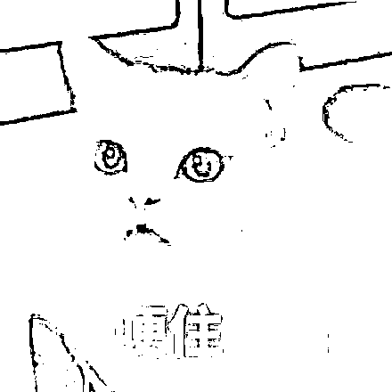
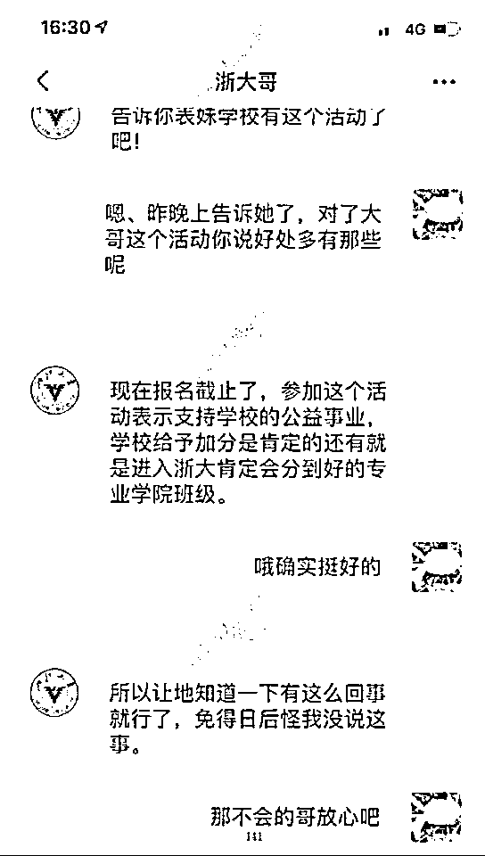
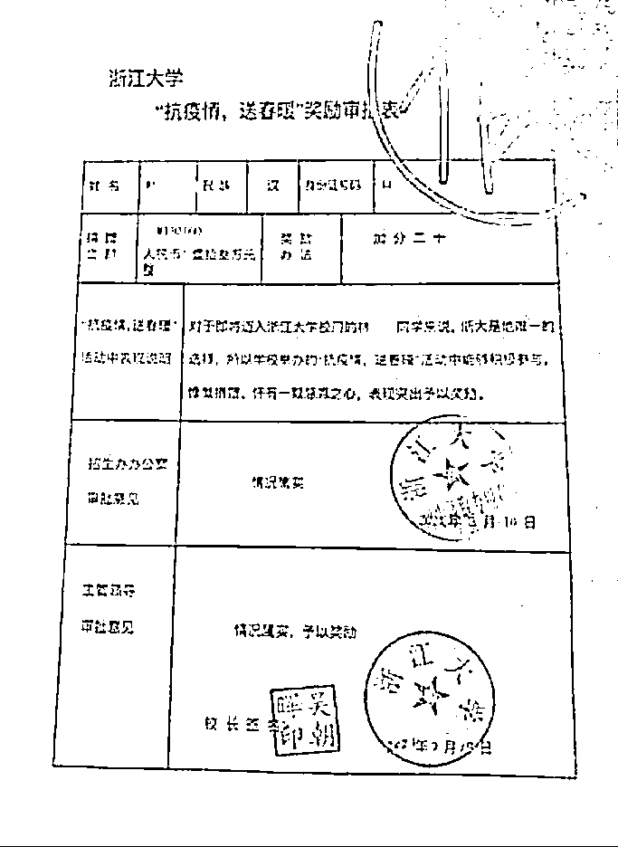

# 有人被骗 134 万！考生和家长请当心 4 类骗局！

> 原文：[`mp.weixin.qq.com/s?__biz=MzIyMDYwMTk0Mw==&mid=2247537484&idx=7&sn=5ee9c94da92852746253408bee81dad5&chksm=97cb9874a0bc116250e9204b503103a9d09947323cb8182ee1817364efe38ded36e92f4f0159&scene=27#wechat_redirect`](http://mp.weixin.qq.com/s?__biz=MzIyMDYwMTk0Mw==&mid=2247537484&idx=7&sn=5ee9c94da92852746253408bee81dad5&chksm=97cb9874a0bc116250e9204b503103a9d09947323cb8182ee1817364efe38ded36e92f4f0159&scene=27#wechat_redirect)

全国大部分地区的高考结束了，考生和家长们终于长舒一口气。但守哥掐指一算，又到骗子开启新一轮收割的时候了：

“给学校捐款可以加分”“花钱可以购买补招名额”“给领导送礼可以进行特招”，这类小广告开始悄悄出现。你可能不信，但真的有人因此被骗。

就比如，上个月尘埃落定的“浙大保送名额”案。浙江温州的林大姐因轻信骗子“捐款能加分保送浙大”的许诺，被骗 134 万元。

***01***

****托关系进名校！最终被骗 134 万****

****2019 年 12 月，经朋友介绍，林大姐认识了“颇有门路”的周某。周某自称自己在浙大有“关系”，**只需 8 万元“联络费”就能为林大姐孩子弄到“保送浙大”的名额**。****

****经过周某一番巧舌如簧的游说，林大姐对其“能力”深信不疑，很快就转账 8 万。周某拿到钱后便挥霍一空。面对林大姐的询问，周某用“再等等”、“别着急”等话语轻易搪塞。看到林大姐如此好骗，周某又起了歹心。他告诉林大姐，“以学生名义向校方捐款 150 万元可以额外加分”。****

********

****图片来源：瑞安市人民法院**** 

****为消除林大姐怀疑，周某申请了一个名为“浙大哥”的微信号，每隔一段时间就将自己伪造的聊天截图发给林大姐。****

********

****图片来源：瑞安市人民法院**** 

****行骗期间，周某还**伪造了浙大奖励审批表、招生资格审批表、教育部批复等文件**，让林大姐误以为“孩子上浙大”这个事情，已经办得差不多了。****

****周某不仅骗了林大姐，同时还在骗其他人。2021 年 9 月，周某因其他诈骗事实被警方控制。林大姐与周某失去了联系，才发现事有蹊跷，向公安机关报案。****

****尽管骗子被抓了，被骗的钱也有了着落，但林大姐一家的正常生活已经全部被搅乱，给家庭带来了不可挽回的损失。****

*******02*******

********高考季来临！多类骗局家长需留心********

******高考季来了，各类升学类的电信网络诈骗逐渐高发，在此守哥将各类升学电信诈骗套路进行归纳，希望大家能转给身边的家长朋友们，帮助他们预防诈骗。******

********套路一********

********提前查分********

******在等待出成绩期间，不法分子会通过“提前查分”的名义向广大考生家庭发送带有“查分链接”的短信。一旦轻信点击链接，手机便会中木马病毒，这时，骗子会对手机绑定的银行卡进行关联，再利用网购消费或者第三方平台转账等方式掏空钱包。******

********守哥提醒：****查分时一定要认准教育部门指定的查询方式及查分网址，**不要轻易点击手机短信里来历不明的链接。******

******套路二******

********教育补贴********

******骗子会伪装成“教育局”“财政局”“学校老师”等工作人员，诱骗家长或者考生申请“教育补贴”，并以“激活补贴账户”的名义要求先大盘 ATM 机转账。在行骗过程中，骗子常会假借“网络波动”、“系统故障”等说辞，要求受害者反复转账。******

********守哥提醒：****任何正规机构都不会要求个人通过 ATM 机转账激活账户，**遇到此类情况，多半是遇到了骗子，请及时报警。******

******套路三******

********补录陷阱********

******这个骗局与林大姐的遭遇类似，骗子会说自己在高校内部有特殊关系，有计划外指标或内部指标，帮助考生进入名校，但需要先缴纳一定的费用。******

********守哥提醒：**目前“补录”的主要渠道是“征集志愿”，指平行志愿录取结束后，省招办向社会公布院校未完成的招生缺额计划、部分院校投放的增招计划。“征集志愿”和第一、第二志愿填报一样，不会产生任何附加费用。**凡是需要收取保证金、录取费、指标费的“招生指标”100%是诈骗，请立即报警。********

******套路四******

********伪造录取通知书********

******骗子会邮寄一封伪造的名校录取通知书给考生，只要考生或家长按照录取通知书上的电话进行咨询，多半会中招。骗子会冒充高校招生办人员，以“破格录取”、“地区补招”等理由说服受害人相信自己已经考入名校。进一步，骗子诱导其将学杂费打入指定的银行账号，进行诈骗。******

********守哥提醒：**考生或家长一定要谨慎，收到没有填报过志愿的院校发来的录取通知书，不要贸然给学校打钱，**应通过官方网站、教育部公布的联系方式与高校招生办取得联系，谨防上当受骗。********

****来源：守护者计划****

****************

****← 向右滑动与灰产圈互动交流 →****

********