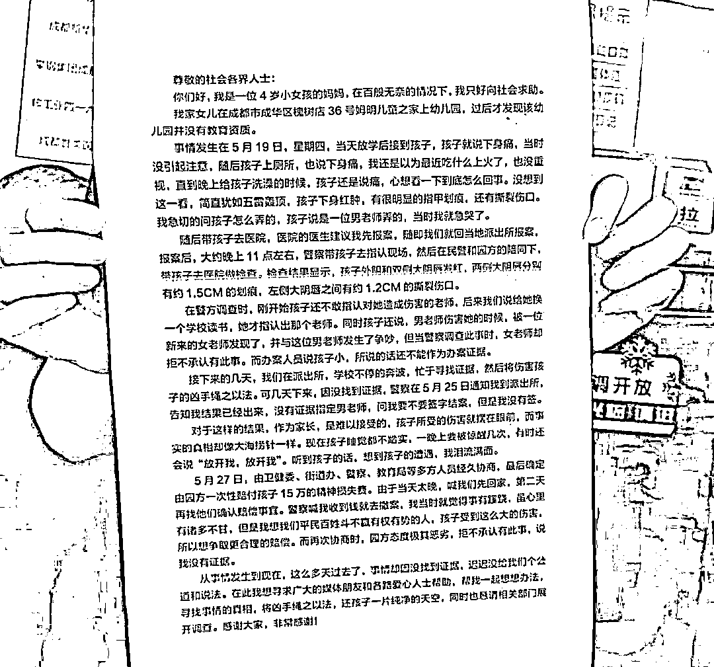
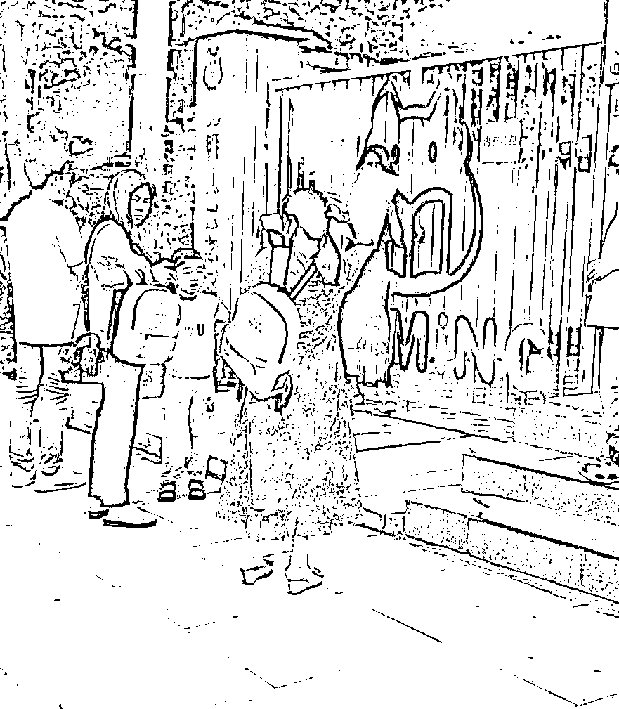
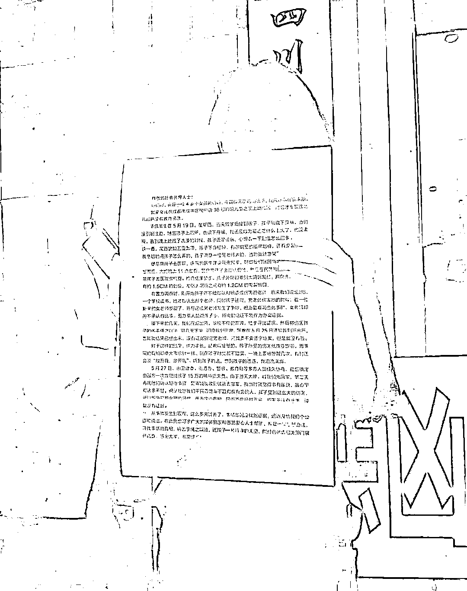
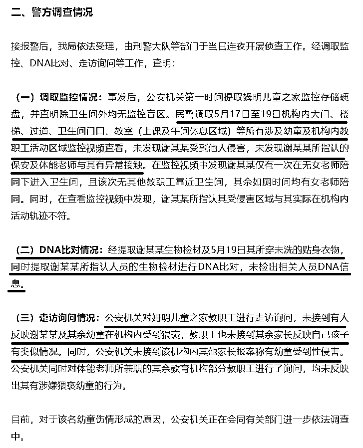

# 成都幼儿园女童被男幼师性侵？警方：未发现该行为

> 原文：[`mp.weixin.qq.com/s?__biz=MzIyMDYwMTk0Mw==&mid=2247537639&idx=2&sn=2c0665c951177865523e5b7fa07c04aa&chksm=97cb98dfa0bc11c9492403db4c4750fffdb5a1d891085314d5dfacb7051cbd14c8252bc89cc8&scene=27#wechat_redirect`](http://mp.weixin.qq.com/s?__biz=MzIyMDYwMTk0Mw==&mid=2247537639&idx=2&sn=2c0665c951177865523e5b7fa07c04aa&chksm=97cb98dfa0bc11c9492403db4c4750fffdb5a1d891085314d5dfacb7051cbd14c8252bc89cc8&scene=27#wechat_redirect)

2022 年 6 月 10 日（星期五）中午，IP 地址显示为“山西”的自媒体“资政殿”发布文章**《成都 4 岁女童疑遭幼儿园男教师性侵，下身红肿撕裂，警方以“无证据”通知家属结案》**，称有成都网友爆料自己 4 岁的女儿**疑似**在幼儿园遭到男教师性侵，虽然文章称医院检查确实有伤口，但是**由于没有证据，警方也无能为力**。家长只得在网络上写下事发经过，寻求帮助。该文内容提到的教师性侵，没但既然警方已调查过了，没有证据，那么肯定监控这些确实没有记录，至于到底是不是在幼儿园造成的，也不得而知；但反映的**涉事幼儿园某“儿童之家”无教育资质**，**是否属实，这个是可以查实或自证的。**

近日，有成都网友爆料自己 4 岁的女儿疑似在幼儿园遭到男教师性侵，警方以“没有证据”要求受害者家属结案。**无奈之下，孩子的妈妈只得在网络上写下事发经过，寻求帮助。**以下为该网友发布在网络上的全文及图片。

尊敬的社会各界人士:

你们好，我是一位 4 岁小女孩的妈妈，在百般无奈的情况下，我只好向社会求助。

我家女儿在**成都市成华区槐树店 36 号姆明儿童之家**上幼儿园，**过后才发现该幼儿园并没有教育资质。**

**事情发生在 5 月 19 日**，星期四，当天放学后接到孩子，孩子就说下身痛，当时没引起注意，随后孩子上厕所，也说下身痛，我还是以为最近吃什么上火了，也没重视，直到晚上给孩子洗澡的时候，孩子还是说痛，心想看一下到底怎么回事。没想到这一看，简直犹如五雷轰顶，孩子下身红肿，有很明显的指甲划痕，还有撕裂伤口。我急切的问孩子怎么弄的，孩子说是一位男老师弄的，当时我就急哭了。

随后带孩子去医院，医院的医生建议我先报案，随即我们就回当地派出所报案。报案后，大约晚上 11 点左右，警察带孩子去指认现场，然后在民警和园方的陪同下带孩子去医院做检查。**检查结果显示，孩子外阴和双侧大阴唇发红，两侧大阴唇分别有约 1.5CM 的划痕，左侧大阴唇之间有约 1.2CM 的撕裂伤口。**

在警方调查时，刚开始孩子还不敢指认对她造成伤害的老师，后来我们说给她换一个学校读书，她才指认出那个老师。同时孩子还说，男老师伤害她的时候，被一位新来的女老师发现了，并与这位男老师发生了争吵，但当警察调查此事时，女老师却拒不承认有此事。而办案人员说孩子小，所说的话还不能作为办案证据。

接下来的几天，我们在派出所，学校不停的奔波，忙于寻找证据，然后将伤害孩子的凶手绳之以法。**可几天下来，因没找到证据****，警察在 5 月 25 日通知我到派出所告知我结果已经出来，没有证据指定男老师**，问我要不要签字结案，但是我没有签。

对于这样的结果，作为家长，是难以接受的，**孩子所受的伤害就摆在眼前，而事实的真相却像大海捞针一样。**现在孩子睡觉都不踏实，一晚上要被惊醒几次，有时还会说“放开我，放开我”。听到孩子的话，想到孩子的遭遇，我泪流满面。

**5 月 27 日，由卫健委、街道办、警察、教育局等多方人员经久协商，最后确定由园方一次性赔付孩子 15 万的精神损失费。**由于当天太晚，喊我们先回家，第二天再找他们确认赔偿事宜。警察喊我收到钱就去撤案，我当时就觉得事有暖跷，虽心里有诸多不甘，但是我想我们平民百姓斗不赢有权有势的人，孩子受到这么大的伤害。所以想争取更合理的赔偿。而再次协商时，园方态度极其恶劣，拒不承认有此事，说我没有证据。

从事情发生到现在，这么多天过去了，事情却因没找到证据，迟迟没给我们个公道和说法。在此我想寻求广大的媒体朋友和各路爱心人士帮助，帮我一起想想办法寻找事情的真相，将凶手绳之以法，还孩子一片纯净的天空，同时也恳请相关部门展开调查。感谢大家，非常感谢!

6 月 10 日下午，成都警方发布了事情调查结果，**在监控内未发现女童遭人侵害，在孩子的贴身衣物上也没检查出相关人员 DNA。**

所以孩子下体的伤痕是怎么来的呢？等待调查结果。

[`mp.weixin.qq.com/mp/readtemplate?t=pages/video_player_tmpl&action=mpvideo&auto=0&vid=wxv_2437062174071144449`](https://mp.weixin.qq.com/mp/readtemplate?t=pages/video_player_tmpl&action=mpvideo&auto=0&vid=wxv_2437062174071144449)

成都市公安局成华区分局万年派出所工作人员表示，该事件目前警方正在处理调查。

[`mp.weixin.qq.com/mp/readtemplate?t=pages/video_player_tmpl&action=mpvideo&auto=0&vid=wxv_2437063265647149056`](https://mp.weixin.qq.com/mp/readtemplate?t=pages/video_player_tmpl&action=mpvideo&auto=0&vid=wxv_2437063265647149056)

来源：资政殿，拆尔摩斯](https://mp.weixin.qq.com/s?__biz=Mzg5ODAwNzA5Ng==&mid=2247487973&idx=1&sn=1b62da6f2018402862a5c375e10c355e&chksm=c06878b2f71ff1a4fbe7df4dec626aa7e696154751693bf16f6c6a302ceaa4d1959040c70518&scene=21#wechat_redirect)

← 向右滑动与灰产圈互动交流 →

