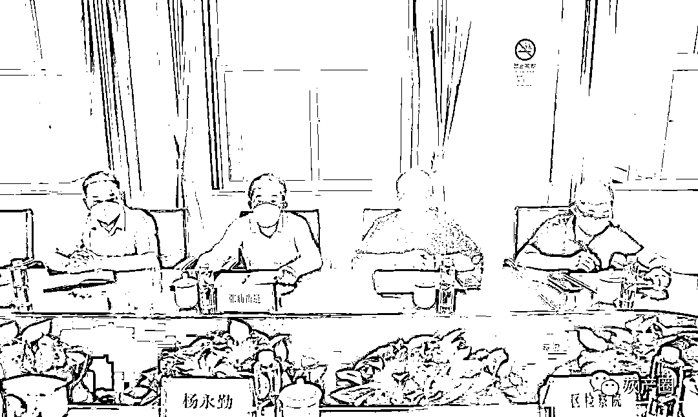
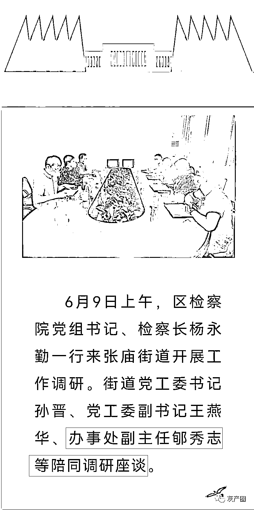
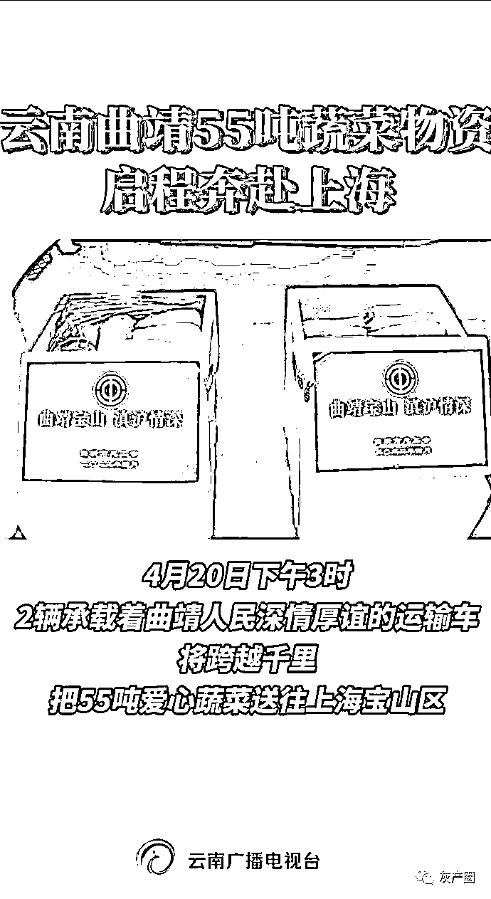
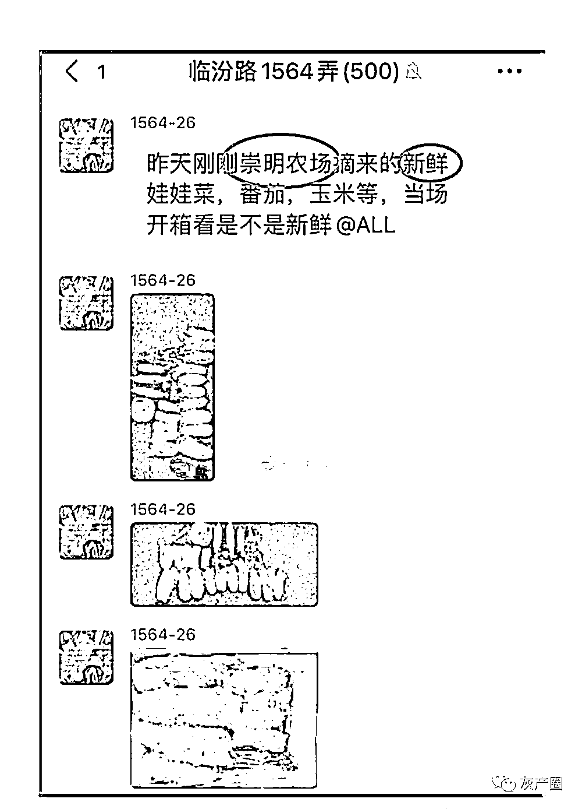
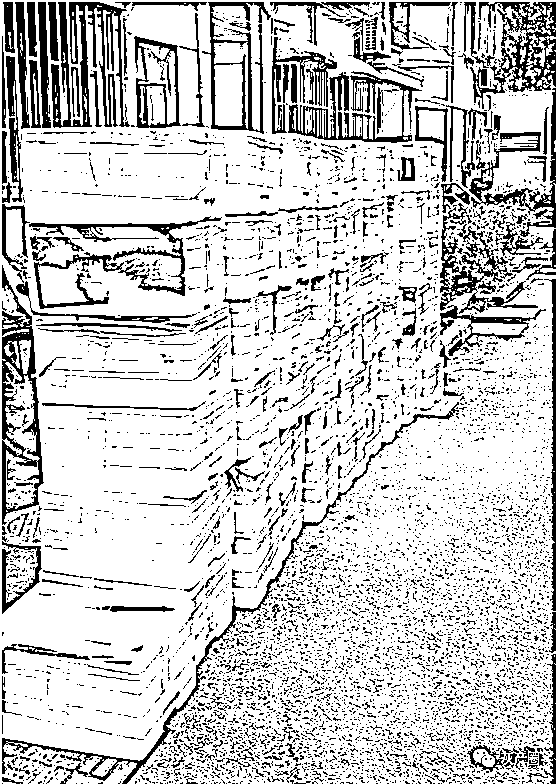
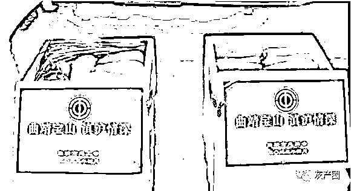
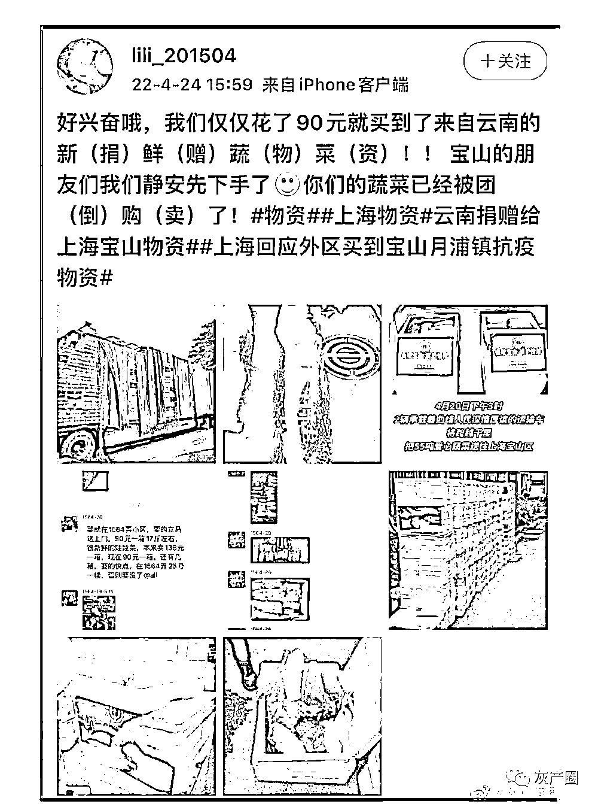
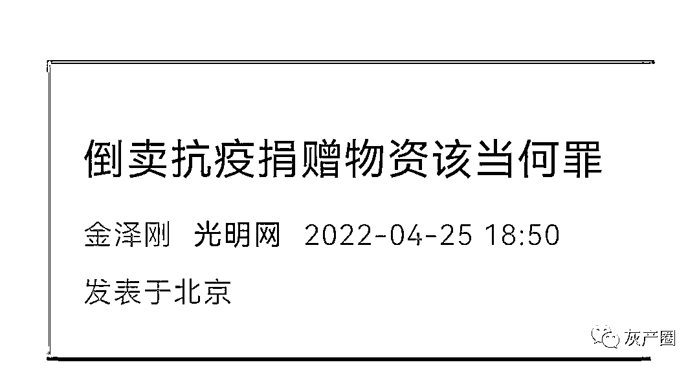
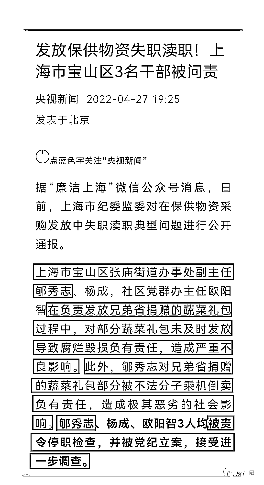

# 深陷倒卖抗疫捐赠物资风波、“接受进一步调查”的张庙街道郇副主任又上位了！

> 原文：[`mp.weixin.qq.com/s?__biz=MzIyMDYwMTk0Mw==&mid=2247537639&idx=3&sn=616838c215998c05fc240d55c3ea9fe5&chksm=97cb98dfa0bc11c9135c3bc0fc5f688dd9c41e8841e55b51e1a85184f48094754ed181e45ba2&scene=27#wechat_redirect`](http://mp.weixin.qq.com/s?__biz=MzIyMDYwMTk0Mw==&mid=2247537639&idx=3&sn=616838c215998c05fc240d55c3ea9fe5&chksm=97cb98dfa0bc11c9135c3bc0fc5f688dd9c41e8841e55b51e1a85184f48094754ed181e45ba2&scene=27#wechat_redirect)

********

****宾语｜文 宾曰语云（ID：Lzkj328）｜出品****

******上海宝山区张庙街道社区党群服务中心微信公众号“异香张庙微社区”昨天晚上发了一篇文章《区检察院党组书记、检察长杨永勤赴张庙街道开展工作调研》。文章说，6 月 9 日上午，区检察院党组书记、检察长杨永勤一行来张庙街道开展工作调研。街道党工委书记孙晋、党工委副书记王燕华、**办事处副主任郇秀志等陪同调研座谈**。******

************

******这意味着，曾经深陷“倒卖捐赠物资风波”的**张庙街道办事处****副主任郇秀志**，已经官复原职，并且已经在履职，如今啥事儿没有，依然有品有味，岗位上过得好好的。******

************

******4 月 24 日，有网友通过微博和抖音平台爆料，云南曲靖无偿捐赠给上海宝山区困难群体的物资，出现在静安区一小区里，一箱卖 90 元，上面贴的“曲靖宝山，滇沪情深”都没撕干净。******

******原来，在静安区彭浦新村街道的一个小区群里，有位群友在“热心”在推销物资，说是从崇明农场新采摘的蔬菜。******

************

******真的好新鲜！尤其是这位“热心”群友还承诺，哪位邻居需要的话，可以立即送菜上门，并且，本来要价 138 元一箱的新鲜菜，现在只要 90 元一箱。******

************

******哪有这样的好事啊，一些居民心动了。******

******但大家很快发现，这些新鲜蔬菜的外包装被人撕掉了。****** 

************

******不是说刚从崇明农场摘来的吗，为什么要把包装给撕掉呢？有细心的居民看出了端倪，原来，有包装上留下有“曲靖保山”、“X 沪情深”的字样。******

************

************

******“X 沪情深”，不就是”滇沪情深“嘛！******

************

******灾情中的上海，居然还有这样的操作。****** 

************

******原来，云南省曲靖市向宝山区捐赠的这批物资，是要免费赠送给外来务工人员和集中居住的长租公寓租户等困难群体用来救命的。哪知道，接受捐赠的新江内燃机公寓（原厂停产改建为公寓）负责人张某在收到 190 箱捐款物资后，胆大包天，见钱眼开，见利忘义，生孩子没屁眼地打起了利用救灾物资发横财的小算盘。“张大胆”没有按要求把救命物资分配给公寓内的租户，而是做起了生意，把救命物资倒卖中饱私囊。******

******这影响够恶劣了吧？光明网当时发了一篇评论，标题就是《倒卖抗疫捐赠物资该当何罪》。******

************

******倒卖抗疫捐赠物资这一重大丑闻发生后，上海市纪委监委对在保供物资采购发放中失职渎职典型问题进行公开通报，认为宝山区张庙街道办事处副主任郇秀志、杨成，社区党群办主任欧阳智在负责发放兄弟省捐赠的蔬菜礼包过程中，对部分蔬菜礼包未及时发放导致腐烂毁损负有责任，造成严重不良影响。此外，郇秀志对兄弟省捐赠的蔬菜礼包部分被不法分子乘机倒卖负有责任，造成极其恶劣的社会影响。郇秀志、杨成、欧阳智 3 人均被责令停职检查，并被党纪立案，接受进一步调查。******

************

******社会公众左等右等，等着被责令停职检查的这几个昏官“接受进一步调查”的消息。******

******如今，不过才过去 40 多天的时间，靴子落地，**张庙街道办事处****副主任郇秀志仍然是****办事处****副主任。********

********就问，你服，还是不服？ ********

********来源 | 宾曰语云  ID 号：lzkj328******** 

************************](https://mp.weixin.qq.com/s?__biz=Mzg5ODAwNzA5Ng==&mid=2247487973&idx=1&sn=1b62da6f2018402862a5c375e10c355e&chksm=c06878b2f71ff1a4fbe7df4dec626aa7e696154751693bf16f6c6a302ceaa4d1959040c70518&scene=21#wechat_redirect)********

********← 向右滑动与灰产圈互动交流 →********

****************