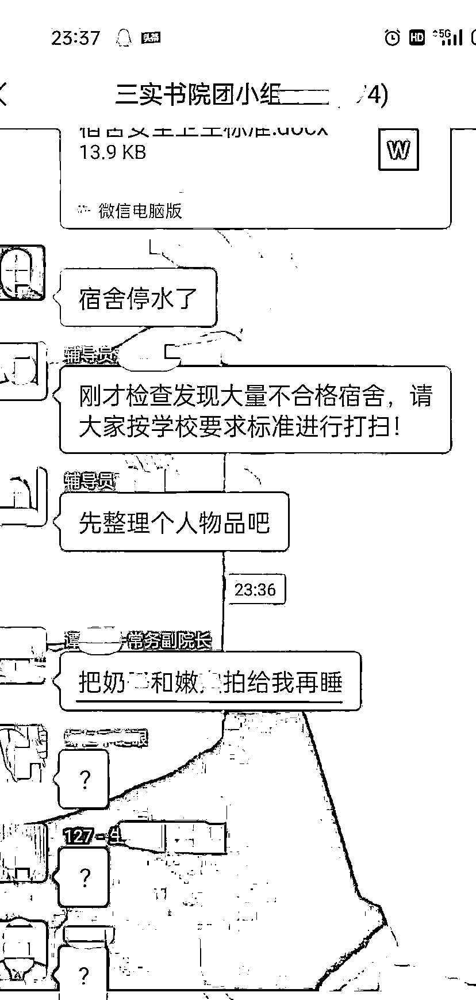
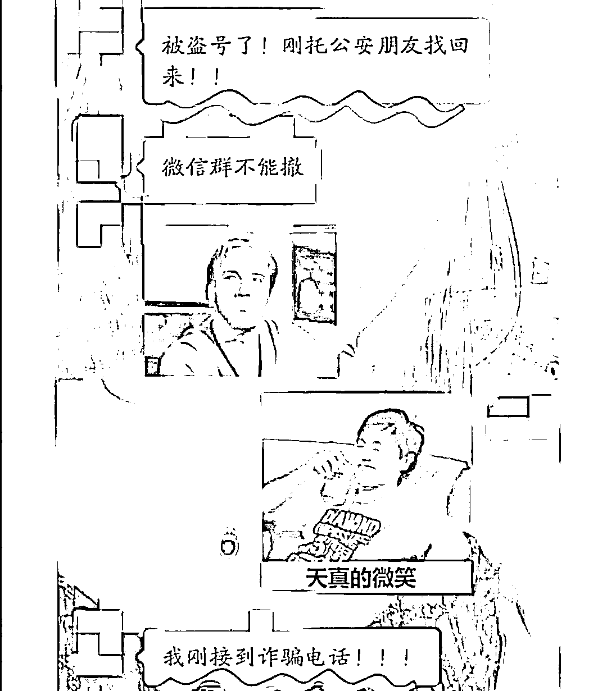
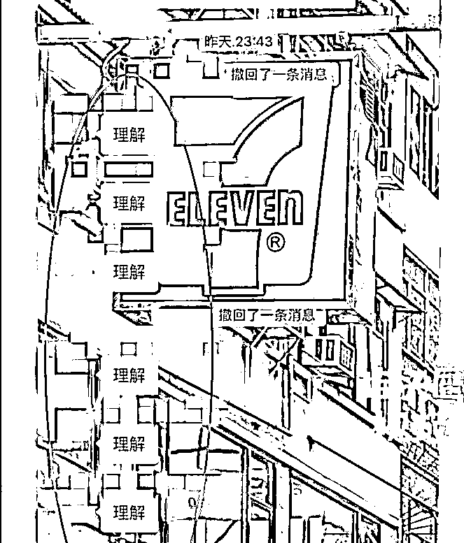
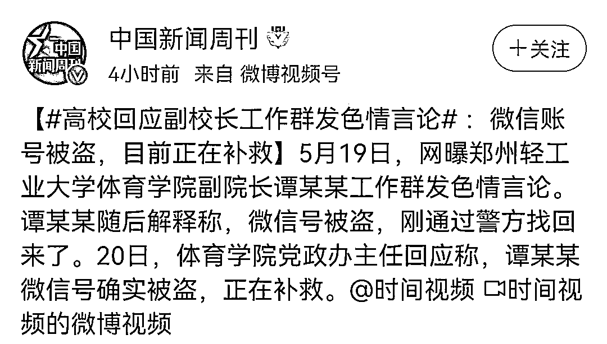
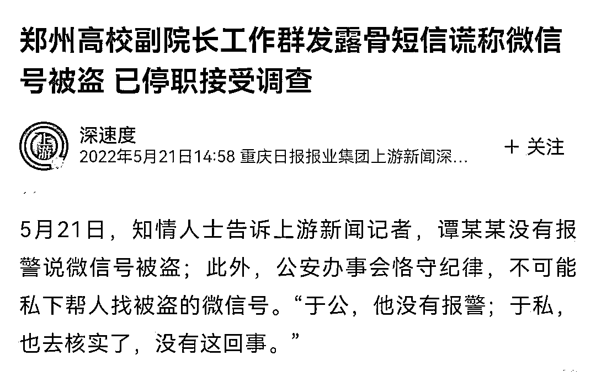
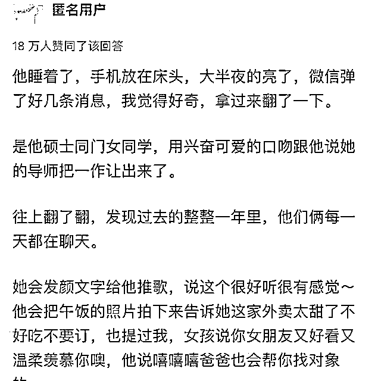
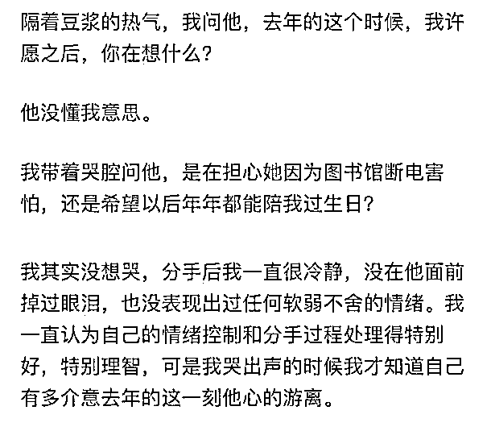

# 郑州副院长直播约炮，网友炸了：禁欲太久的男人，有多可怕

> 原文：[`mp.weixin.qq.com/s?__biz=MzIyMDYwMTk0Mw==&mid=2247537639&idx=4&sn=4b13e751043acf813ef913c27794c68a&chksm=97cb98dfa0bc11c9f8538ce65470d91160bd448eb6b586d601b99867f33a9c69a488d522684f&scene=27#wechat_redirect`](http://mp.weixin.qq.com/s?__biz=MzIyMDYwMTk0Mw==&mid=2247537639&idx=4&sn=4b13e751043acf813ef913c27794c68a&chksm=97cb98dfa0bc11c9f8538ce65470d91160bd448eb6b586d601b99867f33a9c69a488d522684f&scene=27#wechat_redirect)

人是欲望的动物，

而欲望源于社会的发展和人的进化，

因此人永远无法满足自己的欲望。

**郑州某大学的副院长，就像把自己的牙膏管挤烂了，连渣都不剩。**

01

深夜十一点，郑州某大学教师工作群。

上一秒，辅导员还在抓学生宿舍的卫生问题；

下一秒，向来威严的常务副院长竟发出了一则超私密的色情约炮信息。

言辞尺度之大，淫乱得令人咋舌；

调情语气之熟稔，信手拈来得令人震惊。

将近 200 人的工作大群寂静一片，同事颤抖着手，轻轻地敲出一个“？”

两分钟后，副院长紧急发来消息：

**被盗号了！刚托公安朋友找回来！！！**

连发四个感叹号，代表了他颤动不已的内心。

凡事留一线，日后好相见。

怀抱着如此现实的“同事情”，不管内心深处信还是不信，群里齐刷刷地温馨接龙：

**“理解。”**

**“理解。”**

然而，世上没有不透风的墙，事情闹大了。

聊天记录先是在短视频平台传播，然后上了新闻，最后冲上热搜。

高校院办率先回应，称副院长确实被盗号了。

**但是校方也没拿出报案或者协助找回的有力证明材料，只能说“目前正在补救”。**

对此蒋叔持保留态度，因为被盗号的逻辑确实怪异。

通常情况下，被盗号是发一些违法链接，或者诱导下载 App，几乎没有让别人给他发私密照的。

而且半夜十一点，哪位公安朋友如此随叫随到。

不仅能秒回信息，还能在两分钟之内把账号追回，这不得送个“中国版福尔摩斯”、“当代狄仁杰”的鲜红锦旗？

办案效率和破案能力绝对是一等一的！

**有记者采访了知情人士，对方称公安办事有程序，不可能私下帮人找账号。**

通报里说，副院长对此进行了深刻反省。

但是随后有报道说，他在接受调查时，声称那条微信是发给老婆的。

网友对此的态度是：我信你个鬼。

当然，这事咱没啥证据，只能说保持高度怀疑。

我觉得他老婆是真惨。

老公干了这种蠢事，自己还要跟着受辱，冤死了。

不知道副院长还要用多少个谎来圆这件事。

毫无疑问，那一条微信会成为他人生里浓墨重彩的一个坑。

他的余生，不知要用多少努力，来为那一次手抖买单。

所以副院长给我们的警示有两点：

第一，人还是不要干坏事，因为干了就有败露的风险。要想人不知，除非己莫为。（当然，给老婆发羞羞的情话不算）

第二，发微信的时候，手千万不要抖。

目前，副院长涉嫌违纪，已作停职处理 。

02

要说，能坐到副院长这个位置，肯定是有能力的。

再加上高校没有企业那种 35 岁的年龄限制，晋升方向也比较明确，只要谭院长静下心来、脚踏实地地做好本职工作，继续往上走只是时间的问题。

人到中年，家庭和睦，事业顺利，这是多少人梦寐以求的生活。

明明，只要按部就班、奉公守法，就能正常地走向 happy ending 的大结局。

明明已经走在了康庄大道上，有名有望的人却非要找点刺激，自以为无人知晓地拐了个弯，最终绕死在弯道里，落得个名声尽毁、一无所有的下场。

**正如管理学大师史蒂芬·柯维说：“不自律的人就是情欲、欲望、感情的奴隶。”**

**欲望就像弹簧，一旦用力过猛，就会彻底崩坏。**

因为自从有了微信，真的出过太多“惨案”了。

以下来自网友：

*   跟我妈吵架，我一边哭一边在微信里跟朋友疯狂吐槽我妈，很纳闷怎么朋友半天没回应，仔细一看，全发我妈微信上了。

*   大学时，考试结束觉得会挂科，就打了好长一段给老师求情，写得低声下气，什么拜托老师行行好啦啥的，然后手一抖发给初中暗恋的男同学了。他还回了个：啊？

*   朋友圈有一女的晒车钥匙炫富，我准备给一朋友当乐子讲，结果点开通讯录就发给那女的了。我俩还是同班同学。现在见面连话都不说，尴尬死了。

*   我已经两次想要说谁的坏话，就刚好发给那个人了。

*   有次把发给朋友的调侃话发给了练车教练。当时正好教练发短信过来通知我去练车，我手一快发出去说 “你个死胖子” 。正好教练很胖，后来就没有后来了……

*   本人男，有次朋友发给我一张男人下半身露点照，丁丁很小那种，我本想转发给另一哥们儿嘲笑一下，结果手一抖发同学群里了。二十多个女同学啊！跳雅鲁藏布江也洗不清了！！！

03

**古希腊哲学家亚里士多德说过：**

**“所谓奴隶，就是欲望战胜理性的人。”**

知乎有一篇刷爆全网的著名神贴，叫做《图书馆 30 秒》。

深夜里，女生看到男友手机弹出多条信息，全部来自他硕士同门的学妹。

细看才发现，原来相处八年、谈婚论嫁的男友，每天都会和学妹亲密地聊天，每周都会约着单独吃饭，时间长达一年。

去年，他陪她生日，她闭上眼睛许愿，祈祷他们能永远在一起的时候；

他的手机上收到了学妹发来的消息，对方说，“图书馆突然断电了，我好怕。”

**女生问他，“在我许愿的 30 秒，你是在担心她因为图书馆断电害怕，还是希望以后年年都能陪我过生日？”**

女生在帖子里说：

> 他对我一直都很好，即使他和那个女生频繁联系的这一年，他对我依然还是很好。
> 
> 我只是不明白，明明什么都没有发生，我们的感情也没有变质，一切都平稳幸福地向未来推进，我们的未来几乎清清楚楚地印在我们眼前，只要正常往前走就有幸福大结局，他为什么半路突然停下来想去牵别人的手。

因为欲望，人们往往又会不自觉地把自己变成奴隶。

如果说现实中的枷锁束缚的是身体的自由，那么，欲望的枷锁束缚的就是人心灵的自由。

当人的欲望战胜理性，当被欲望所左右的时候，人们就给自己的心灵套上了枷锁，变成了不折不扣的奴隶。

当今社会诱惑很多，人的欲望也变得越来越难以满足，因此，亚里士多德这句话也就更具有现实意义。

它可以随时提醒我们，不要被欲望所控制，更不要把满足各种欲望设定为人生的唯一目标和成功的唯一标准。 

**立身不正，私德不修。**

**有些事情，一旦越界，覆水难收。**

 来源：幸福小酒馆

](https://mp.weixin.qq.com/s?__biz=Mzg5ODAwNzA5Ng==&mid=2247487973&idx=1&sn=1b62da6f2018402862a5c375e10c355e&chksm=c06878b2f71ff1a4fbe7df4dec626aa7e696154751693bf16f6c6a302ceaa4d1959040c70518&scene=21#wechat_redirect)

← 向右滑动与灰产圈互动交流 →

