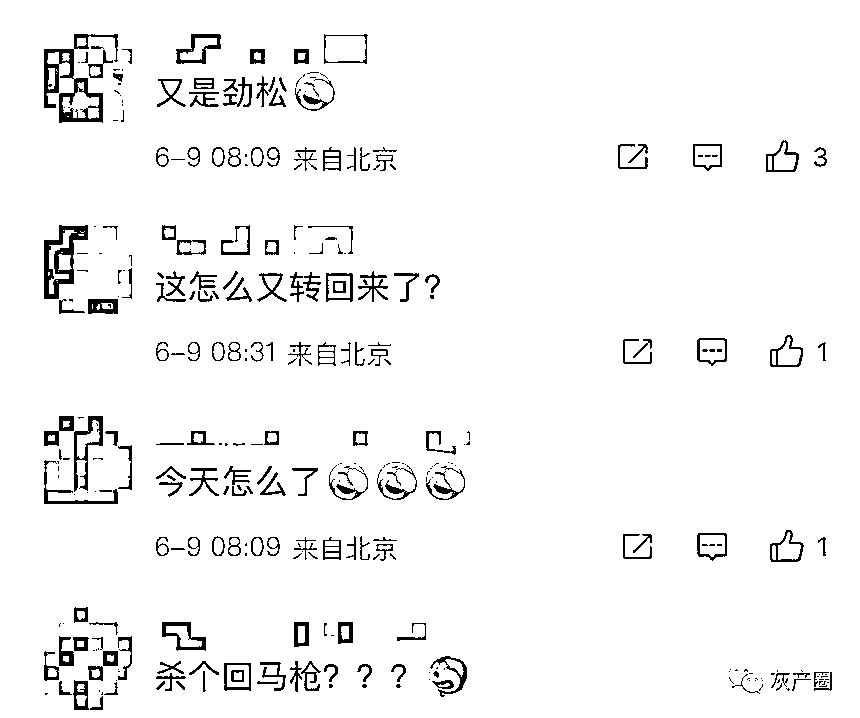
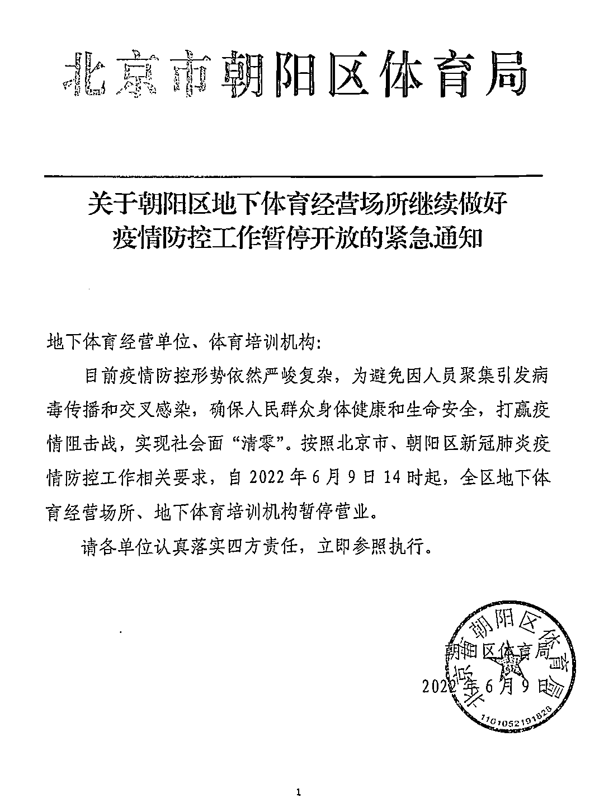

# 北京突发！朝阳、昌平、丰台疫情大反弹！！

> 原文：[`mp.weixin.qq.com/s?__biz=MzIyMDYwMTk0Mw==&mid=2247537639&idx=5&sn=fc2b2bf420e204f57c9e9e2916c411a7&chksm=97cb98dfa0bc11c92422fd9f0fe2dcd7a2057143daaf4c71cfe220bcb4d681ba35f7cd2fb633&scene=27#wechat_redirect`](http://mp.weixin.qq.com/s?__biz=MzIyMDYwMTk0Mw==&mid=2247537639&idx=5&sn=fc2b2bf420e204f57c9e9e2916c411a7&chksm=97cb98dfa0bc11c92422fd9f0fe2dcd7a2057143daaf4c71cfe220bcb4d681ba35f7cd2fb633&scene=27#wechat_redirect)

因出现核酸采样十混一阳性，朝阳劲松六区在今晨临时封闭。

家住劲松六区的一位居民介绍，6 月 9 日清晨 6 时 40 分左右，社区微信群发出通知称，因核酸检测结果异常，小区临时封闭，居民只进不出。

目前，有身穿防护服的工作人员，在小区进行消杀工作。

**北京疫情最新消息**

今天是高考第三天

今天早上，北京疫情状况又有突发！

营长搜索了相关信息后发现

**涉及的区有点多**

以下为网友爆料

一切以官方通报为准 

刚刚

西城区疾病预防控制中心

发布紧急通知：

**北京疫情最新消息，涉及多区**
**紧急排查**

刚刚通报

****昌平冠华苑小区因涉及混检阳性****

**相关楼宇临时封控**

****丰台保利欣苑小区****涉及混检阳性

小区临时封控，居民足不出户

****丰台玉璞检测点混管检出疑似阳性****

紧急排查到访过下列地点的人群👇

****丰台丽泽泰禾西府****

**广播小区临时关闭**

**疑似混检阳性**

****昌平半截塔村早上五点封村****

**涉及十混一阳性**

村里临时只进不出，正在排查

昌平疾控中心通报

有居民在昌平十混一

****安贞四区 6 号楼临时封闭****

****朝阳区劲松六区有十混一阳性****

**目前正在排查**

**社区要求所涉及到的楼栋居民暂不出门**

**有高考生或其他特殊情况请及时联系社区**

网友们开始担心起来

**“怎么一觉醒来，好多地方都有情况”**

昨日北京新增一例

目前还在热搜上挂着

希望没事！

今天高考的同学们要加油 

千万不要受影响

中小学其他年级马上也要复课了

希望不会再有变动

**北京新增 1 例**

**6 月 8 日 0 时至 24 时，北京新增 1 例本土确诊病例（为 6 月 7 日诊断的无症状感染者转确诊病例），**无新增疑似病例和无症状感染者；新增 1 例境外输入确诊病例，无新增疑似病例和无症状感染者。**治愈出院 26 例。**

境外输入确诊病例：中国台湾籍，6 月 7 日从中国台湾到达北京首都机场，海关经健康筛查并进行核酸检测后，经闭环管理送至集中隔离酒店，当日报告核酸检测结果为阳性，6 月 8 日诊断为确诊病例。

上述病例均已转至定点医院，已开展流行病学调查，按要求落实管控措施。

来源：喻言亭阁

](https://mp.weixin.qq.com/s?__biz=Mzg5ODAwNzA5Ng==&mid=2247487973&idx=1&sn=1b62da6f2018402862a5c375e10c355e&chksm=c06878b2f71ff1a4fbe7df4dec626aa7e696154751693bf16f6c6a302ceaa4d1959040c70518&scene=21#wechat_redirect)

← 向右滑动与灰产圈互动交流 →

