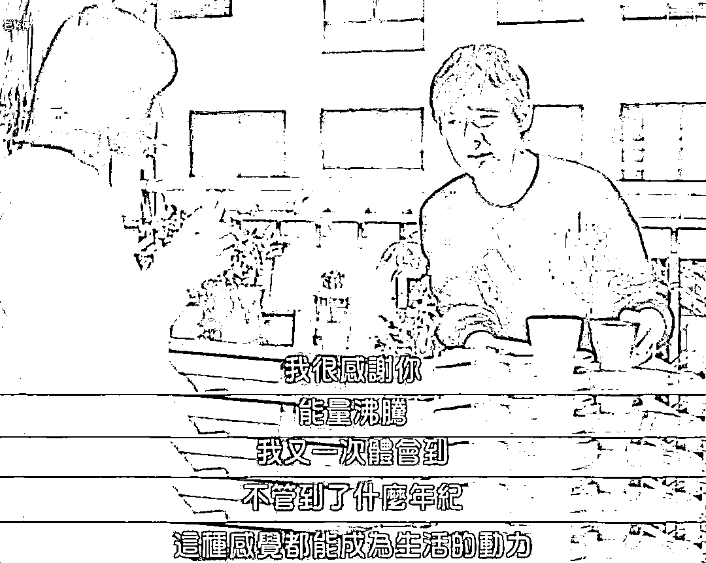
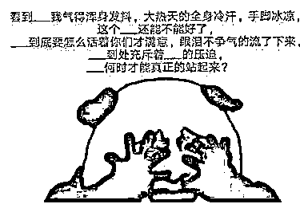
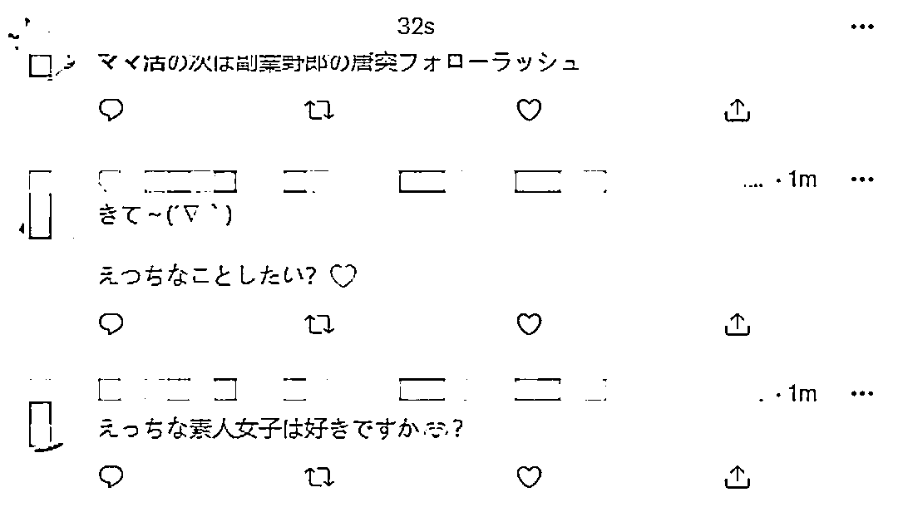
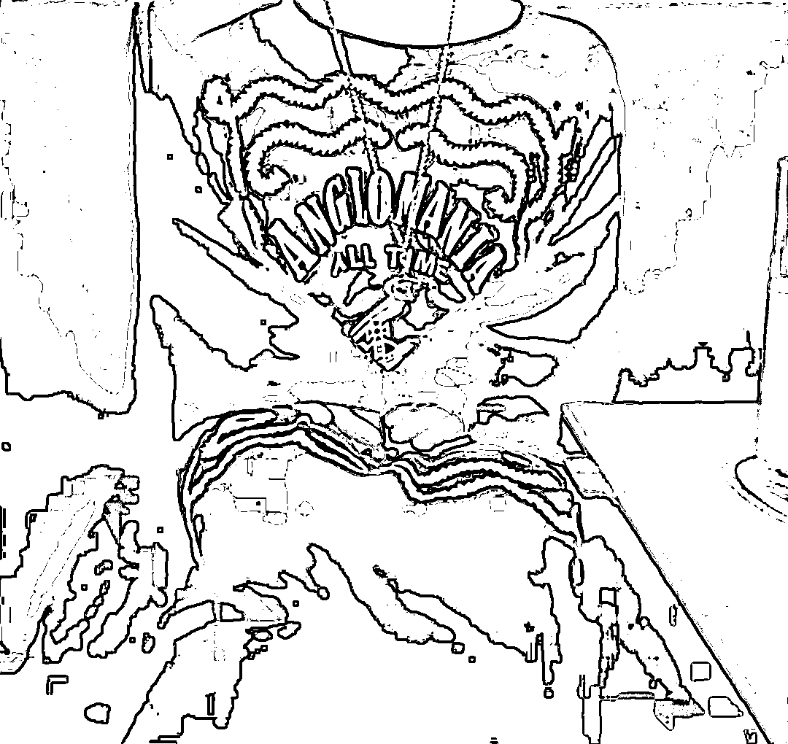
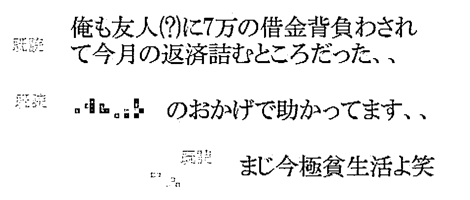
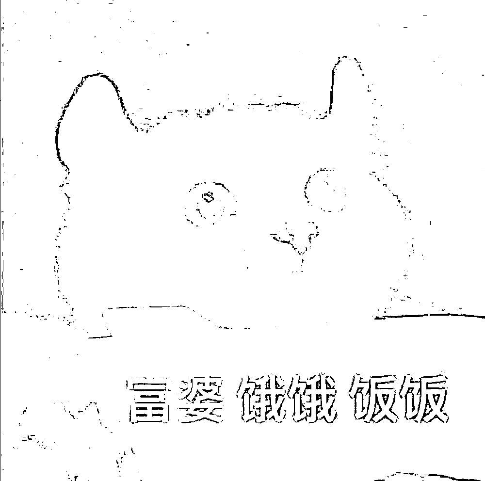
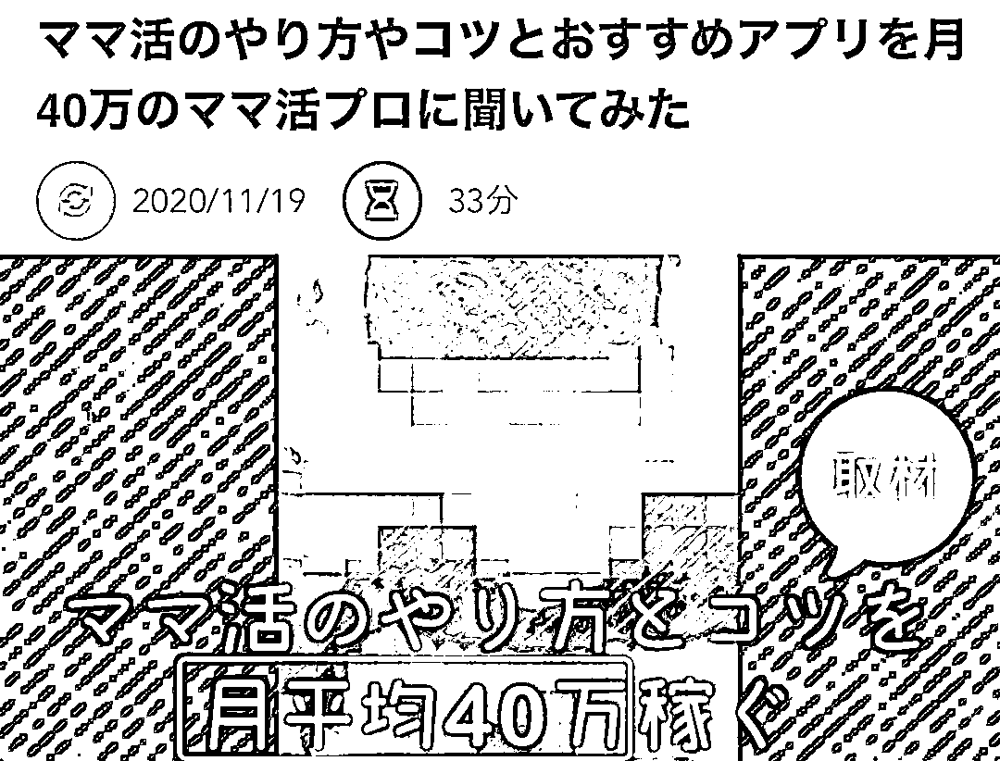
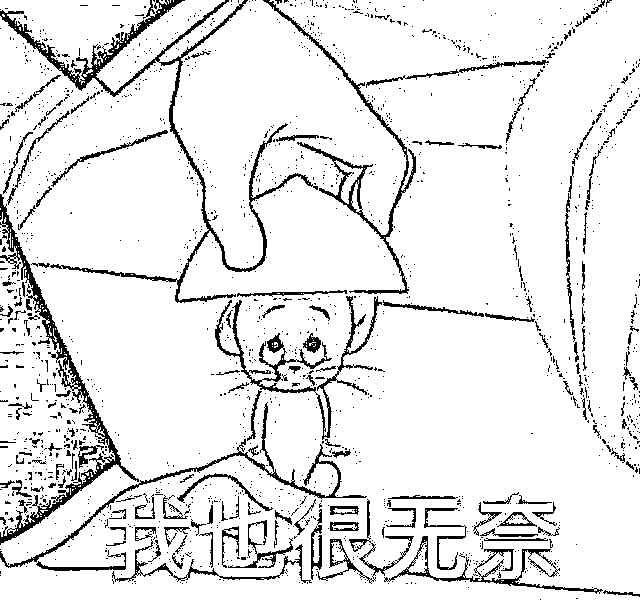
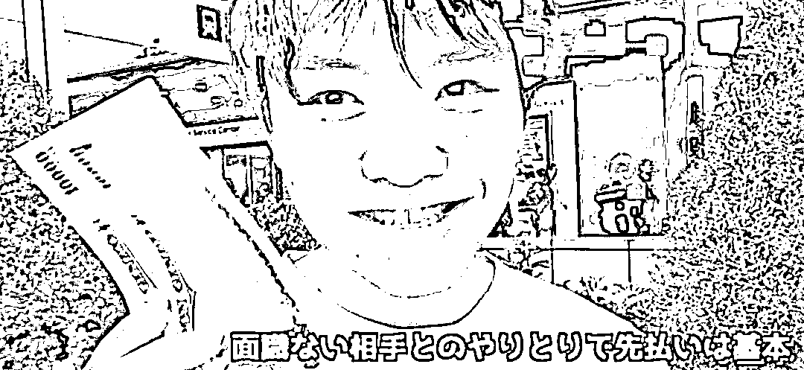

# 在互联网上吃软饭，是种什么体验？

> 原文：[`mp.weixin.qq.com/s?__biz=MzIyMDYwMTk0Mw==&mid=2247537639&idx=6&sn=0b6588fac9c5827906697f1d51375649&chksm=97cb98dfa0bc11c9ea58d706d12574c3e381fd4ef02b0f51c30e0ba1842b44537b1fbe51b048&scene=27#wechat_redirect`](http://mp.weixin.qq.com/s?__biz=MzIyMDYwMTk0Mw==&mid=2247537639&idx=6&sn=0b6588fac9c5827906697f1d51375649&chksm=97cb98dfa0bc11c9ea58d706d12574c3e381fd4ef02b0f51c30e0ba1842b44537b1fbe51b048&scene=27#wechat_redirect)

不晓得各位是否听说过**“爸爸活”**这项业务？

这个“爸爸活”在日本互联网界格外盛行，一些有钱的老爷们儿，为了化解内心的空虚，花钱请一些年龄能当自己女儿的妙龄女子幽会。

从吃饭聊天到逛街旅游，除了不搞涩涩，和正常的两性关系无二。

雨仔用通俗的话术来解释就是 —— **纯情大叔化身纯爱干爹进行纯粹包养**。

眼瞅着“爸爸活”让众多中年男人焕发青春，许多日本没钱的年轻小伙坐不住了。

他们先是强调不公平：为什么只有女性能靠此赚钱，男性却不能，**气抖冷**！

后来直接开摆：**阿姨，我不想努力了！**

纷纷在社交平台发帖，寻求妈妈年龄的阿姨花钱包养自己，发展“妈妈活”业务。

“来吧，想做越轨的事情吗？”“喜欢性感的素人女生吗？”

在他们集体毛遂自荐之下，**“妈妈活”**业务竟然真的诞生了。

一些财大气粗的富婆，主动在互联网上联系，愿意给予金钱换取约会。

而且不同于纯情的“爸爸活”那样仅停留在正常约会的层面，“妈妈活”存在**特殊关系**。

只是相对来说，数量较少。

“为那些妈妈活提供帮助。”“我现在接触 300 人。”“妈妈可以带你去。”

想必一定有人会好奇，那些提供“妈妈活”服务的小伙，到底都要做哪些事情。

雨仔去日本网站搜寻了一大圈，找到了一个名为**三山桑**的从业者的自述。

据三山桑说，他之所以加入“妈妈活”这行，就是因为缺钱。

原本他的月薪能达到 16 万日元（约合人民币 8000 元），但由于疫情，暴跌至 9 万日元（约合人民币 4500 元），月月入不敷出。

为了能够更好的生活，他从一个从事“爸爸活”的女性朋友那里了解了“妈妈活”的存在。

他听到朋友一个月能轻松赚 **20 万日元**（约合人民币 1 万元）时，顿时心动了。

于是乎，他就启动了推特小号，狂发自己的帅照，吸引“妈妈们”的关注。

不知是不是看过我国《星光大道》，三山桑居然深知只有卖惨才能得到青睐的道理。

所以他给自己立了一个**被埋没的人设** —— 一腔热血想成为设计师，却因才华出众遭到同事排挤，无奈委身于销售部，拿着绵薄的工资。

就这样，他一边发着郁郁不得志的推文，一边晒着仪表堂堂的自拍，坐等富婆上钩。

在一条接一条卖惨的推文中，三山桑旗开得胜，没几天就引起超过 500 名女性的关注。

其中有三名富婆更是直接私聊开撩，邀请他见面约会。

富婆甲带他品尝了高级寿司店，并送他名牌腰带，富婆乙和丙则给了大量零花钱。

不仅如此，他和三位富婆都去了酒店......

后来，三山桑又加大了卖惨力度，成功钓到更多富婆。

其中最大方的一个富婆，在还没见过面的情况下，就**疯狂打钱**。

三山桑说自己精神不稳定，在服用精神类药物，富婆抬手就是 1 万块。

三山桑说自己没钱花、日子过得很艰苦，富婆随即转来 1 万块。

三山桑说自己要过生日了，却没有收到任何礼物，富婆顿时用 **5 万块**进行安慰。

“我借给朋友七万块，这个月很拮据，你能帮帮我吗，我生活极其贫困。”

这吃相、这嘴脸，无论咋看，真心太难看了......

然而难看归难看，都无法阻止富婆**打钱的热情**。

雨仔真的好想知道，哪里有这样的富婆，也请给予我些许温暖吧！

三山桑就是一个缩影，有太多小伙靠着傍上富婆、吃着软饭，从而走上人生巅峰。

日本某机构曾做过统计，随机采访 900 名男性，有 6.4% 的有过“妈妈活”的经历。

其中 10 + 和 20 + 这两代最有市场，有人由于太抢手，要同时服务五六个富婆。

而那些站在行业顶端的小伙，每个月的收入至少会达到 **40 万日元**（约合人民币 2 万元）。

毕竟这一行没有什么门槛，只需满足“**形象好、会说话、脸皮厚**”就能胜任。

工作内容又分外轻松，不需要花一分钱，只需要把富婆陪开心就行。

要不是雨仔和日本不共戴天，不然也想飞到日本赚一桶金，绝对把富婆安排得明明白白。

当然了，也有不少人对“妈妈活”的存在表示**万分不理解**。

一方面，想不通为什么会有女性有这种需求；另一方面，不明白怎么会有男性做这种不光彩的勾当。 

如果说，“爸爸活”是男人本性使然，那“妈妈活”又是图啥呢？

实际上，这一切都是大环境导致的。

日本女性在婚后，基本逃不掉家庭主妇的命运，相夫教子的生活极其枯燥，难免有人想**寻求新鲜**。

比起去牛郎店喝花酒，“妈妈活”至少比较正经，在和年轻男孩约会的过程中，不仅能化解寂寞，还能享受到被陪伴的感觉。

通过这种方式，她们实实在在**得到了宣泄和治愈**。

对于男性来说，疫情让一些人连正常生活都难以支撑，只能另辟蹊径。

挣钱嘛，生意，不寒碜，总的来说，双方**各取所需**。

这么来看，小日子过得不错的日本朋友，在环境欠佳的状况中，依然能整出花活儿。

不仅在一定程度上变相**解决了就业问题**，还让一部分人过上了梦寐以求的生活。

这波，两全其美了有木有！

不过雨仔话又说回来，这种工作固然让人向往，但真心存在**很大的隐患**。

且不说只是个青春饭，也不说会不会有遇到仙人跳，万一这段经历被以后的对象知道，恐怕大部分人都无法接受吧。

可别为了一时的舒服，毁掉了一世的幸福。 

所以呀，别整天抱着什么“阿姨我不想努力”的富婆梦了，人啊，还是得努力。

与其做吃软饭的小白脸儿，把**肠胃搞好**才是王道！

来源：IT 之家

](https://mp.weixin.qq.com/s?__biz=Mzg5ODAwNzA5Ng==&mid=2247487973&idx=1&sn=1b62da6f2018402862a5c375e10c355e&chksm=c06878b2f71ff1a4fbe7df4dec626aa7e696154751693bf16f6c6a302ceaa4d1959040c70518&scene=21#wechat_redirect)

← 向右滑动与灰产圈互动交流 →

