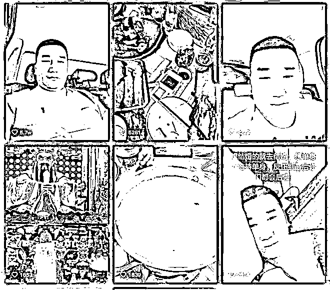
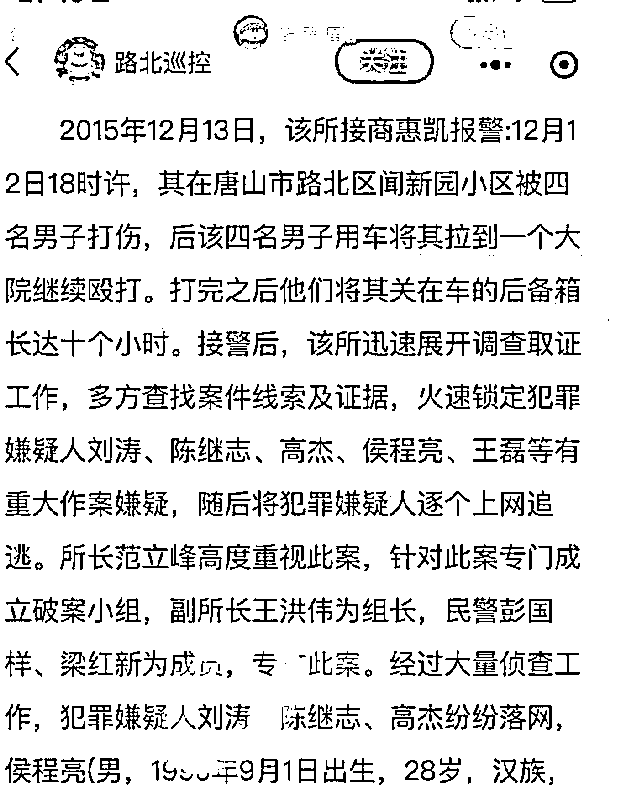
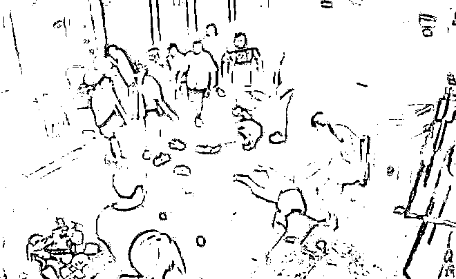

# 唐山打人案件指定由廊坊警方侦查办理！嫌犯背景曝光：其中两人案底累累

> 原文：[`mp.weixin.qq.com/s?__biz=MzIyMDYwMTk0Mw==&mid=2247537743&idx=1&sn=b6c2bf89008e8a94c56ca4a35bbbe5c3&chksm=97cb9f77a0bc16617879456116f5fea0a87860470d214f6b985eaf9f363aefb4b845c7e97221&scene=27#wechat_redirect`](http://mp.weixin.qq.com/s?__biz=MzIyMDYwMTk0Mw==&mid=2247537743&idx=1&sn=b6c2bf89008e8a94c56ca4a35bbbe5c3&chksm=97cb9f77a0bc16617879456116f5fea0a87860470d214f6b985eaf9f363aefb4b845c7e97221&scene=27#wechat_redirect)

河北省廊坊市公安局广阳分局 6 月 11 日通报称，根据省公安厅指定管辖，发生在唐山市路北区某烧烤店的寻衅滋事、暴力殴打他人案件，由廊坊市公安局广阳分局侦查办理。该局将严格依法办案，并自觉接受群众监督。

****

**延伸阅读：** 

# **唐山回应“打人事件嫌疑人有无保护伞？”**

河北唐山多名男子在烧烤店群殴女子事件引发关注。6 月 11 日，针对**该案有无保护伞**的问题，唐山市涉黑涉恶举报中心工作人员表示，唐山市常态化开展扫黑除恶工作，**“一露头就打，打狠打掉它，打黑打恶，绝不含糊”。**

有关“保护伞”的问题，该工作人员表示，**“谁也不会迁就，谁也不会保护，是谁就逮谁”。**

此外，该工作人员还透露，涉案施暴者至少 1 人有前科劣迹，**“目前两级政法机关已集中力量办案，彻底查实查清相关人员前科”。**

事发当晚，唐山市委书记武卫东主持召开全市疫情防控工作总指挥部会议暨重点工作调度会议。**会议强调，对烧烤店发生的寻衅滋事、暴力殴打他人恶劣事件，要从严从快依法严惩， 同时要举一反三在全市开展扫黑除恶专项斗争“回头看”。**

**延伸阅读：**

**嫌犯背景曝光：其中两人案底累累**

没有任何一个人在看了唐山烧烤店发生恶意伤人事件之后，会不感到生气和愤怒。

每一位关心这件事的朋友，都在时时刻刻关心事件的最新进展！

唯一让人觉得欣慰的是，目前 9 位涉案人员已经全部被抓。

涉案的 9 人中有 7 位是男性，这 7 位男性里面，主要参与动手打人的有 5 人，打人打得最凶狠的有 3 人。

根据现场的监控视频，我们可以将打人最狠的三位男性暂时称呼为：绿衣男，白衣男，黑色 boy 男。

绿衣男子就是挑起这起恶意伤人事件的第一人。

在视频里面，我们可以明显看到，绿衣男进入烧烤店之后，故意侵犯一位穿着白色上衣的女生。

期间，绿衣男子还时不时侮辱女生，言辞用语令人害怕。

在绿衣男子遭到女生的拒绝和反抗之后，他的第一反应就是暴打女生。

听到动静之后，绿衣男子的同行者纷纷冲进店内，对三个身材瘦小的女生一顿狂打。

尤其是白衣男和黑色 boy 男仿佛是帮兄弟“撑腰”一样，对着女生们拳打脚踢。

明明女生们已经被他们打得毫无反抗之力，可是他们依旧不放过，把女生从店内拉到店外继续暴打。

在将近 5 分钟的时间里，但凡有尝试去劝架的路人，都会被打人男子用拳头恐吓或吓跑。

所以，在几个女生被打的过程中，店内的客人没有一个人伸出援手。

只有被打的女生们互相帮助，尽管她们中有的人被拖行到楼梯坎撞到了头部，有的人被啤酒瓶和椅子砸得伤痕累累。

稍微让人觉得有一些暖心的是，有一位陌生女生尽管害怕可她还是想要冲进来保护被打的女生。

但陌生女生的男朋友抱住了她，因为女生想要保护别人，可是男朋友也想要保护她。

这是人之常情的举动，我们不能站在道德制高点去指责男孩的行为，因为他们已经比现场的大部分旁观者更勇敢了。

唐山烧烤店打人事件的经过大致就是如此，相关视频在网络上疯传之后，舆论愕然，社会各界纷纷发声。

不管是具有社会影响力的名人们还是关心这件事情的普通老百姓，所有人都希望将参与打人的施暴者尽快严惩。

好在，参与恶意打人的 9 人现在已全部被抓，打人最狠的三个人身份背景也被网友们扒得一干二净。

第一个绿衣男子叫陈某志。

据悉，他是一家水产公司的老板。

2018 年时，陈某志因为交通事故纠纷，被法院强制执行并限制高消费。

2020 年时，陈某志因为不得当利益纠纷被强制执行，执行标的 34281 元。

但是陈某志全部未履行，所以法院将其列为失信被执行人，也就是俗称的“老赖”。

第二个白衣男子叫刘某。

刘某和陈某志关系颇深，有网友爆料，刘某和陈某志都有过前科。

2019 年，刘某因为殴打他人被判处两年有期徒刑。

有人透露，陈某志也参与过两年前的打人事件，但目前爆料是否属实，还有待进一步的确认。

不过，这两人关系确实好，一起逃跑，一起被抓。

从网络上流传的视频来看，刘某和陈某志被抓时，一个趴在地上，一个蹲在地上，狼狈极了。

有懂车的网友指出，陈某志和刘某被抓时开的豪车大约要 200 万左右，由此可见，他们的确不是一般人。

第三个黑衣男子叫沈某俊。

他是九个人里面最后一个被抓到的人，而且沈某俊是在江苏被抓到的。

据了解，沈某俊是在高速服务区被发现的。

大概是 6 月 11 日中午一点左右，沈某俊在高速服务区发现有警察在检查，于是他把车开到了附近的加油站旁。

随后，沈某俊弃车逃跑，躲到了附近的草丛里。

可能是害怕，逃跑的过程中，沈某俊还跑掉了一只鞋子。（详见后一篇：唐山打人事件最后 1 人抓捕现场：跑丢鞋子躲进草丛被抓）

当时，室外温度约有 35 度左右，沈某俊因为被太阳照射动了一下头，于是，他被警方发现并控制住。

除了以上三名打人者之外，还有一位名叫曹某华的施暴者是这起事件中，我们不得不关注的人。

截止到现在，曹某华一直坚称自己与唐山烧烤店恶人伤人事件无关，他在网络平台录了好几段视频，撇清自己的关系。

但是，有网友在曹某华的账号下发问“扔凳子的那个人不是你？”时，曹某华的回答是“是我又能咋滴。”

尽管曹某华前言不搭后语，但是他依旧坚持自己没有打人。

不管曹某华是否动手打人了，事实总会水落石出，谎言总有被戳破的那一刻。

还有不得不提的一点是，有知情人透露，曹某华的身份也不简单。

据悉，曹某华也是有前科的人，而且经济实力雄厚。

但是，爆料是否属实，目前并没有确切的说法。

至于其他几位参与唐山烧烤店恶意伤人的涉事者，有一位戴帽子的男性似乎并没有打人，另外两人参与“程度不深”。

对于以上 9 位涉事者，不管他们是否有打人的举动，等待他们的都将是法律和道德的双重审判。

现在，我们最关心的应该是几位受伤女生的身体状况，希望受伤的女生们可以早一点恢复健康。

当然，我指的并不只是身体上的健康，更有心灵上的。

几位女生的遭遇，应该得到外界的帮助和保护。

因为很有可能“她是不幸的我，我是侥幸的她！”

今日若我冷眼旁观，他人祸临己身，则无人为我摇旗呐喊。

最后，希望施暴者能尽早受到应有的惩罚，给社会各界一个交代，也给几位被打的女生一份郑重的道歉。

来源：大 R 科普综合整理中国反诈骗联盟/大 R 警示/大 R 说安全/大 R 普法/网络等 编辑 ：大 R 先生

](https://mp.weixin.qq.com/s?__biz=Mzg5ODAwNzA5Ng==&mid=2247487973&idx=1&sn=1b62da6f2018402862a5c375e10c355e&chksm=c06878b2f71ff1a4fbe7df4dec626aa7e696154751693bf16f6c6a302ceaa4d1959040c70518&scene=21#wechat_redirect)

← 向右滑动与灰产圈互动交流 →

