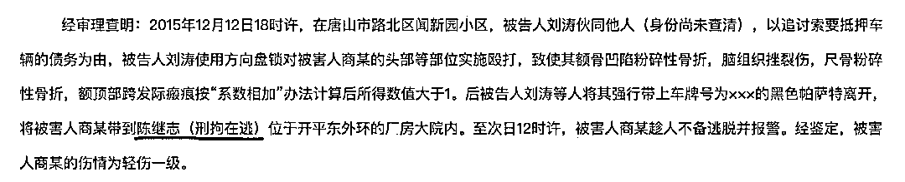
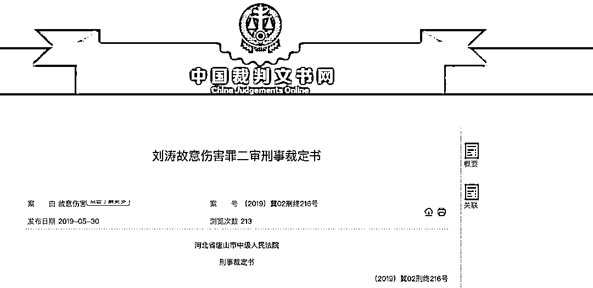
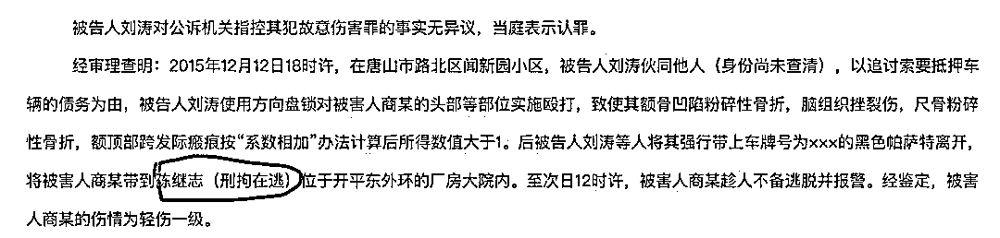

# 网暴老板娘？现在抓捕得有多快，当初打脸就有多狠

> 原文：[`mp.weixin.qq.com/s?__biz=MzIyMDYwMTk0Mw==&mid=2247537743&idx=2&sn=4aedf1a61845e3c0bad07fc64c60fb30&chksm=97cb9f77a0bc1661f439ec503b1c2e7044d0c33e905e525451a4aa83498f12516cc0c08f4535&scene=27#wechat_redirect`](http://mp.weixin.qq.com/s?__biz=MzIyMDYwMTk0Mw==&mid=2247537743&idx=2&sn=4aedf1a61845e3c0bad07fc64c60fb30&chksm=97cb9f77a0bc1661f439ec503b1c2e7044d0c33e905e525451a4aa83498f12516cc0c08f4535&scene=27#wechat_redirect)

图源：电视剧《人民的名义》

是谁给了他们一再为非作歹的底气？

唐山打人案，相关视频在网络上传播，只能用“举国震惊”来形容。

**这次唐山遇到的不是地壳运动，而是舆情海啸。**

但发生不到 24 小时，北京青年报已经给我们描述了一个全新的故事。

**“一男子靠近几名女子交谈”、“加入战局对抗几名女子”。**

如果没有视频，我真以为这几位女性联合调戏欺负这位男性，而这位男性的同伴只是为了保护这名男子。

我不清楚记者有没有现场调查，也不知道记者是否采访了受害者和警方，光通过一个路过的行人“张先生”描述，就试图篡改人们的记忆。

**新闻，不是这么做的。**

**更恶心的事还在后面，烧烤店老板娘被网暴了。** 

网友们打电话用最恶毒的语言谩骂骚扰老板娘，给烧烤店送来祭奠的白花，老板娘只能哭着闭店。 

[`mp.weixin.qq.com/mp/readtemplate?t=pages/video_player_tmpl&action=mpvideo&auto=0&vid=wxv_2438967406212464640`](https://mp.weixin.qq.com/mp/readtemplate?t=pages/video_player_tmpl&action=mpvideo&auto=0&vid=wxv_2438967406212464640)

你们没看视频吗？ 

事情发生的第五秒，老板娘就上去帮忙劝阻、拖开扭打。 

在四个壮汉的包围中，老板娘还是上前护住被打的女子，但体力上完全不是对手。

直到女子被拖出店外，老板娘才一脸茫然看着外面，前后也就十几秒钟。

要说正常人都是懵的，压根没反应过来是什么事要怎么处理。 

后老板娘出店，白衣男子直接指着老板娘威胁，具体说了啥我听不清，但肯定是别管闲事之类，随后老板娘怯懦退出了画面。 

**老板娘说，当时她报了警，那些人当时也在威胁她，店里被砸了，那些人没结账就跑了，她也是受害者......**

别忘了，她只是一个五十多岁的普通人。 

而店里，那些年轻力壮的看客也不少，从始至终在看戏，我不想评价他们，他们也是普通人。 

**从我自己的角度，在现场那么吓人的情况下，我可能也退缩。**

这事谁去谁进医院，你愿意为了陌生人去进医院？

都是喝醉的酒疯子，万一掏出把刀啥的，谁也不知道。

**我们无权简单谴责人性，在制度没有提供充分保护的情况下，绝大多数人都只会想着自保。**

**但这些键盘侠现实中唯唯诺诺，线上就敢重拳出击？**

对上前制止的老板娘进行网暴？我不理解。 

如果老板娘一直旁观，你们喷还有点理，问题是人家上前制止了，制止不了，力量有限能怪她吗？

**别忘了，如果没有老板娘帮忙调监控，我们或许永远看不到这个高清视频。**

暴徒可怕，扭曲的三观更可怕。

**网络喷子们，蠢到无可救药，也就敢对弱者报以老拳，跟那些施暴的渣滓有何区别。**

不怕下一个被打的是自己吗？

**唐山警方的抓捕效率很高，但也很讽刺。** 

网上流传其中一人被捕视频，像个孙子般被压在马路上，丝毫不见打人时的凶狠劲。

[`mp.weixin.qq.com/mp/readtemplate?t=pages/video_player_tmpl&action=mpvideo&auto=0&vid=wxv_2438282927492186112`](https://mp.weixin.qq.com/mp/readtemplate?t=pages/video_player_tmpl&action=mpvideo&auto=0&vid=wxv_2438282927492186112)

我对了一下，应该就是他在店里抡起椅子往女人身上砸。

也是他把被打女子从店里拎到店外继续殴打。 

另一张店外的截图能看到，他把同行的女人也打了。

不知是不是发现打错人，又反转 360 度上前抱着哄。

**总之是个只敢打女人的软蛋，只敢欺负弱者，看见拿枪的就怂了。**

最后一位嫌疑人沈小俊居然从唐山跑到了江苏盐城，而且是在高速服务区弃车逃跑。

连鞋子都跑丢了，最后躲进草丛被抓。

被抓时眉头紧皱一脸无奈样，让人心情大爽。

有趣的是，央视网报道时，给身边所有抓捕的警员都打了马赛克，就唯独把他的脸完整地放了出来。

按理说，媒体报道时对这种没有审判的犯罪嫌疑人，都是要打码处理，因为要保护隐私，但这次央视没有。 

**央视这种官媒不可能不懂，所以是故意的，你品。**

在官方的通报中，一个个名字逐渐披露。

**主犯：陈某志、刘某**

**帮凶：李某瑞**

这 3 个是唐山本地人。

在网上搜唐山本地犯罪新闻，刚好能关联到一条犯罪链，分别是**“陈继志、刘涛、李红瑞”。**

陈继志就是视频里的绿衣男，最开始是他性骚扰女孩。 

正脸长这样： 

第二位被曝光的刘某，原名刘涛。

2015 年，陈继志和刘涛就因黑社会行为犯罪了，他们暴力殴打一男子，还将其关在车的后备箱里长达十个小时。

非法拘禁殴打，这可三年起步了。

然而怎么罚的呢？

**他们逃了。**

2017 年，在逃中的刘涛，因无证驾驶并逃逸被捕。

警方一查，车主正是陈继志。

给大家看一下这起事故唐山发生严重交通事故！8 车相撞！

这种社会不安定分子，怎么潜逃中都能闹出这么大的事故！

问题是，唐山路北区交警都能快速找到肇事逃逸者刘涛，为什么路北区的刑警就能一直把刘涛放在眼皮子底下不抓，要一直等到 2018 年 3 月开始扫黑除恶才抓起来呢？

**是有多蔑视当地的警方，还是说背后的保护伞已经让他们天不怕地不怕？** 

这张@河北省唐山市路北区人民法院刑事判决书 显示，**2018 年一审时，陈继志是刑拘在逃状态。**

一审判决后刘涛不服提出上诉，直到 2019 年二审维持原判，**陈继志仍是刑拘在逃人员。**

但据@企查查 显示，2018 年陈继志出资 50 万成为一家水产养殖公司的老板。

**刑拘在逃人员也能开公司吗？**

这可能是重名，但这家公司的监事叫“李红瑞”，那么巧又能对应到警方通报里的“李 x 瑞”。

总结一下，刘涛 2015 年犯事、2018 年被抓、2020 年刚被放出来，不到 2 年又犯事，是惯犯。

**陈继志一直是刑拘在逃人员，不仅能开公司，还多次欠钱不还成为老赖。**

2018 年，陈继志两次被法院强制执行。

2020 年，陈继志曾被法院强制执行 34281 元。

拒不履行。 

一个刑拘在逃人员，你说厉害不厉害？

更让人不解的是，这些人明明犯案累累，但日子却过得还挺滋润。

在这次逃亡中，几名男子是开着奔驰迈巴赫离开的，牌照 7777。

说实话，豪车加这种数字的车牌，价值起码几百万了。

就是这么一群泼皮无赖的人渣，在多次犯案后，还能开上迈巴赫 7777，家底得有多厚？

**而这种厚家底，这些钱，又是怎么得来的？**

**唐山当地有黑恶势力，当地有关部门肯定知道；现在抓捕得有多快，起初的视而不见就有多打脸。** 

**所以他们在当地这么嚣张，一点也不奇怪。**

目前我关心的是，这帮人渣能判几年？

去年广西钦州的一起类似事件，一男子从车上冲下，对一女生猛然施暴并拖上车。 

这事情最后：**有关部门让男的写了个保证书就走了。**

2020 年浙江发生过一起相似度更高的案件，女生和朋友吃宵夜，遭遇陌生男骚扰，结果女生被陌生男人和同伙殴打致昏迷，衣服被撕烂，打人者逃离现场，女生住院 15 天。 

**4 个施暴者，被行政拘留 13 日或 10 日。**

我无法想象这种当街骚扰、殴打女性的行为，为什么老是判个行政拘留？要么就是写个保证书？

本案中，如果被打女子伤情未构成轻伤二级或以上的话，嫌犯可能只需要 10-15 天的行政拘留；

也有人说：如果被打女子是重伤的话，则最高可能判 10 年；

**但目前比较普遍的说法是，5 年以下刑罚。**

如果这样的话，那我还是更赞同网传的罗翔老师的建议：

**因为你我都清楚，法律的尊严，不应被恶人来挑衅！**

因为唐山打人事件的拳头，打中的是我们每个人，打伤的是我们所有人的安全感！

唐山这次社会地震，“震源”深，“震感”强，“破坏性”严重，“振动”传播快，“震级”已远超八级！

我估计，后面还会有强震、余震不断。

**请记住，每一次地震中，我们不是旁观者，我们只是幸存者罢了。**

来源：昌南大队长 

](https://mp.weixin.qq.com/s?__biz=Mzg5ODAwNzA5Ng==&mid=2247487973&idx=1&sn=1b62da6f2018402862a5c375e10c355e&chksm=c06878b2f71ff1a4fbe7df4dec626aa7e696154751693bf16f6c6a302ceaa4d1959040c70518&scene=21#wechat_redirect)

← 向右滑动与灰产圈互动交流 →

