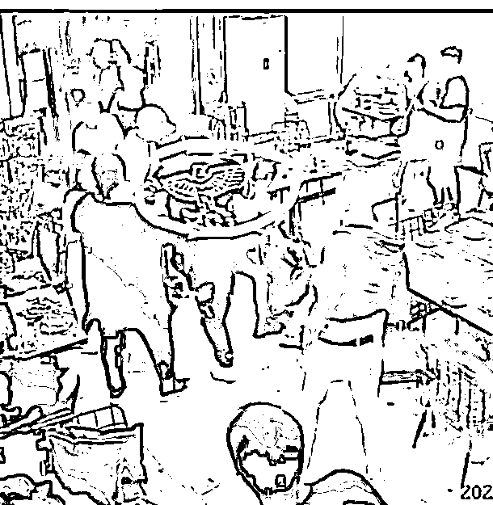
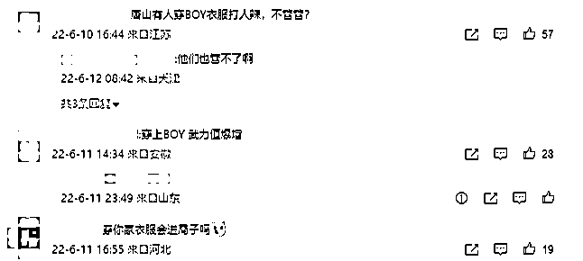
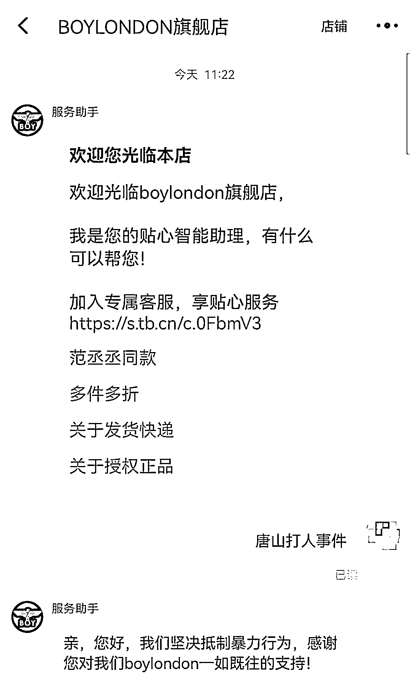
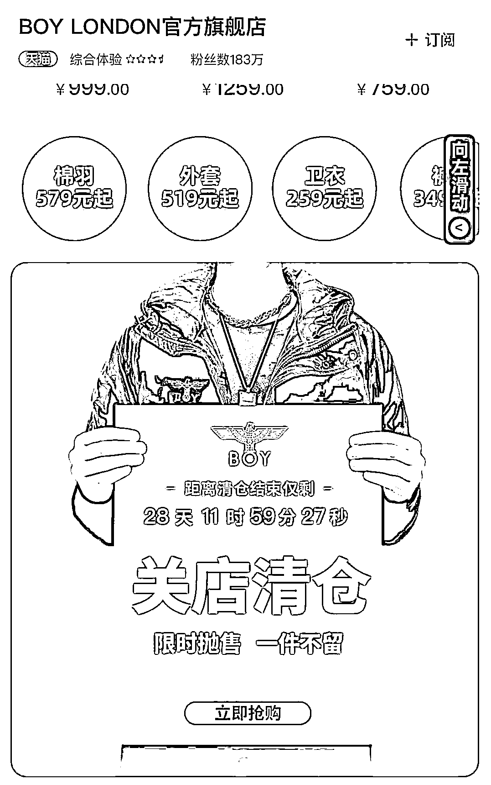
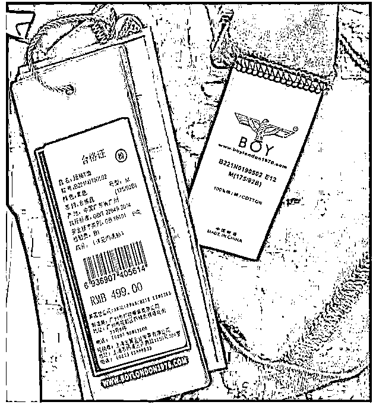
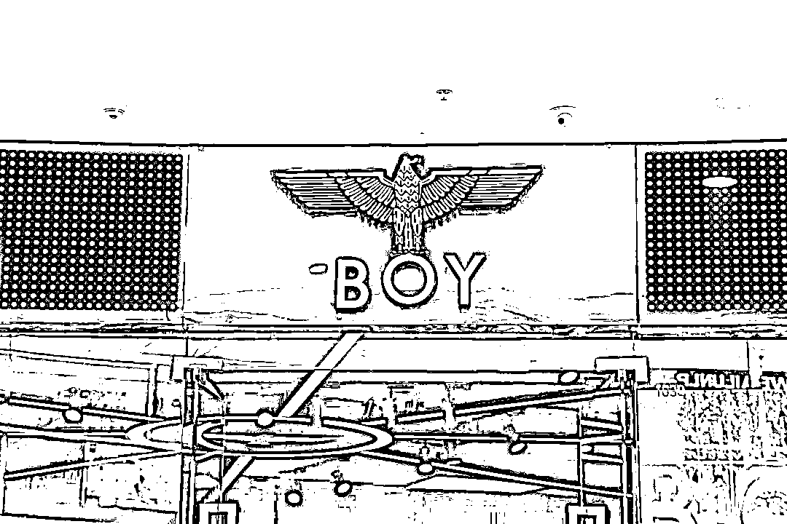

# 唐山打人男子所穿品牌遭网暴 网友：BOY 被黑得最惨的一次

> 原文：[`mp.weixin.qq.com/s?__biz=MzIyMDYwMTk0Mw==&mid=2247537743&idx=4&sn=23a186f949846c1fed6251332173e881&chksm=97cb9f77a0bc16617337b988f96a20f8d03cd997f9cabf0d709688d39ae5c7c10298c4d749dd&scene=27#wechat_redirect`](http://mp.weixin.qq.com/s?__biz=MzIyMDYwMTk0Mw==&mid=2247537743&idx=4&sn=23a186f949846c1fed6251332173e881&chksm=97cb9f77a0bc16617337b988f96a20f8d03cd997f9cabf0d709688d39ae5c7c10298c4d749dd&scene=27#wechat_redirect)

“你离潮人只差一件 BOY LONDON”——从前潮流圈盛传的这句话，现在可能不好使了。

近日，“唐山烧烤店打人事件”引起公愤。

有网友发现，视频中一名打人男子身穿 BOY LONDON 品牌短袖。随后，有网友制图“远离这类穿搭人群”，图上的穿搭要素就包括 BOY LONDON 品牌短袖 T 恤。但也有网友认为此图中的一些要素有失公允，表示“这是 BOY LONDON 被黑得最惨的一次”。网友@浪漫主义文学 更是非常直接地表示：“有的人打着维护正义的旗号变相地网暴他人，这种行为应该及时制止。”

6 月 12 日，红星资本局注意到，近年来在中国市场发展不太如意的 BOY LONDON，其天猫旗舰店已将#唐山打人事件#等关键词设置成自动回复，称“坚决抵制暴力行为，感谢消费者对 BOY LONDON 一如既往的支持”。

对于唐山打人事件后出现的网暴行为，红星新闻评论认为，面对一起恶性暴力事件，愤怒是一种本能，但并不意味着愤怒没有边界，甚至变为网暴。网友不能一边声讨违法者，又一边在违法的边缘试探。

**唐山打人事件后，品牌 BOY LONDON“躺枪”** 

6 月 10 日凌晨，唐山市一烧烤店内，多名男子围殴女性事件引发极大关注，舆论哗然。11 日下午，据唐山市公安局路北分局通报，该案 9 名涉案人员已全部归案。

6 月 12 日的最新通报显示，经廊坊市广阳区人民检察院批准，陈继志等 9 名犯罪嫌疑人已由廊坊市公安局广阳分局执行逮捕。

值得一提的是，现场视频截图显示，其中一名打人者身穿 BOY LONDON 品牌短袖。随后，**有网友制图“远离这类穿搭人群”，图上的穿搭要素包括：金链子、纹身、BOY LONDON 的 T 恤、不穿袜子的豆豆鞋子等。其中，BOY LONDON 的 logo 图案格外显眼。**

视频截图 

还有网友在 BOY LONDON 官方微博置顶内容下进行评论，留言包括“穿上 BOY 武力值爆增”、“穿你家衣服会进局子吗”等。

微博评论截图 

6 月 12 日，**红星资本局就此事询问 BOY LONDON 天猫旗舰店客服，发现求生欲满满的品牌方已将#唐山打人事件#等关键词设置成自动回复，称“坚决抵制暴力行为，感谢消费者对 BOY LONDON 一如既往的支持”。**

天猫旗舰店自动回复截图 

诚然，**在此次唐山打人事件中，包括 BOY LONDON 在内的一些品牌方“躺枪”十分无辜，有网友表示“这是 BOY LONDON 被黑得最惨的一次”。**

**为何关了又开？BOY LONDON 经销商生变** 

公开资料显示，BOY LONDON 于 1976 年创立于英国，其母公司名为安格洛联营公司。该品牌主打街头潮流风格，麦当娜、蕾哈娜、权志龙、鹿晗等都是其拥趸。

实际上，早在 1997 年 BOY LONDON 就进入中国市场，并于同年注册了“BOY LONDON”商标。2001 年，该公司在广州中华广场开设了第一间门店“流行前线”，来推广 BOY LONDON 这个品牌。

但近些年，BOY LONDON 在中国市场的发展不尽人意。

**去年 12 月，BOY LONDON 的天猫、京东官方店铺发布了关店清仓的消息，表示“限时抛售、一件不留”；在双十二期间更是设置了低至 3 折的清仓专区。**

据新京报报道，彼时在线客服介绍称，关店原因是“业务运营策略调整”，并告知“关店后消费者仍可正常享受退换货服务”。

图据新京报 

既然 BOY LONDON 去年就已关店清仓，那目前的“BOY LONDON 天猫旗舰店”又从何而来？二者又有什么区别呢？

6 月 12 日，红星资本局就此询问 BOY LONDON 天猫旗舰店客服，工作人员表示：**“因原中国总代理权到期，原代理店铺已陆续关闭。自 2022 年 1 月 1 日起，本店铺已获得 BOY LONDON（含旗下 BOY/BOYJUNIOR 等项目）合法授权并且是此平台开设的唯一官方旗舰店：‘BOYLONDON 旗舰店’（已通过平台认证）。”**

根据客服提供的图片显示，目前 BOY LONDON 的经销商为上海金翼企业发展有限公司。

天猫旗舰店客服供图 

**陷商标纠纷、假货横行，昔日潮牌风光不在** 

红星资本局发现，BOY LONDON 在中国市场的现状，或许与其日益下滑的品牌形象和市场定位紧密相关，而这背后的重要原因则是品牌授权纷争和假货横行。

公开资料显示，1994 年为开拓韩国市场，安格洛联营公司将 BOY LONDON 商标转让给韩国宝成公司，转让期为 10 年。但 2004 年合约到期后，韩国宝成公司未将商标权还给安格洛，还在破产前违约将 BOY LONDON 商标权转让给韩国自然人金甲琪。由此发生了金甲琪恶意盗用商标及在中国市场抢注商标的行为，并引发安格洛与金甲琪旷日持久的“商标争夺拉锯战”。

2017 年，经中国北京市高级人民法院审理，安格洛联营公司最终获判持有英国 BOY LONDON 品牌所有权，确认了 BOY LONDON 品牌在华的唯一性。次年，安格洛联营公司与其中国品牌授权方上海梵金投资管理有限公司共同召开发布会，宣告英国 BOY LONDON 品牌商标维权成功。

**但漫长的拉锯战，已让消费者对 BOY LONDON 品牌所属模糊不清；另一方面，BOY LONDON 假货横行，也降低了消费者的信任度。**

2019 年 4 月，上海杨浦公安分局宣布破获一起特大制售假冒注册商标商品案件，并在囤假窝点当场查获假冒 BOY LONDON 品牌服饰约 1.3 万件。

2020 年，开业仅一个多月的 BOY LONDON 上海南京东路旗舰店被曝涉假，遭市场监督管理部门执法而关闭。据媒体报道，除了该店，BOY LONDON 位于苏州红唐购物中心、扬州万象汇、扬州砂之船、南通港闸万达、兴化吾悦等购物中心的门店已陆续关闭。

2021 年 4 月 11 日，BOY LONDON 一家实体店。图据 IC photo 

**除了外部因素以外，近年来 BOY LONDON 自身在设计上也未见“出圈”，并未突破其 Logo 印花留给品牌的烙印；相反，越来越大的烫金 logo 让很多人觉得有些“浮夸”甚至“土气”。**

相比曾经的潮牌，如今的 BOY LONDON 常被网友们评论为“社会人的标配”、“非主流的最爱”。伴随着消费客群的下沉与变化，BOY LONDON 似乎与“潮牌定位”越来越远。

红星资本局原创 记者:俞瑶 谢雨桐编辑：任志江

](https://mp.weixin.qq.com/s?__biz=Mzg5ODAwNzA5Ng==&mid=2247487973&idx=1&sn=1b62da6f2018402862a5c375e10c355e&chksm=c06878b2f71ff1a4fbe7df4dec626aa7e696154751693bf16f6c6a302ceaa4d1959040c70518&scene=21#wechat_redirect)

← 向右滑动与灰产圈互动交流 →

