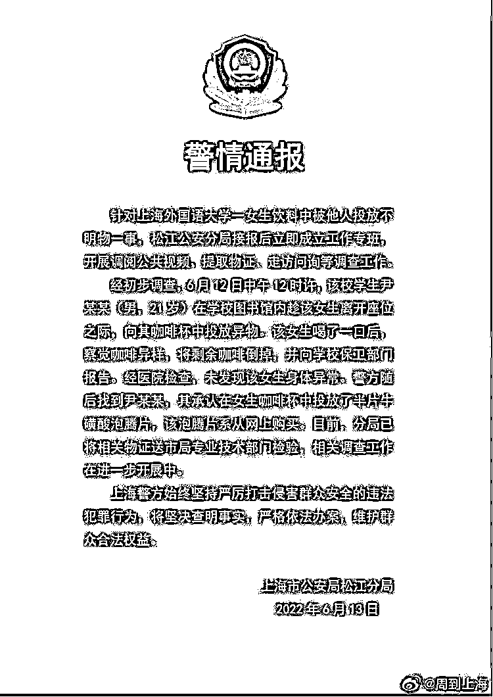
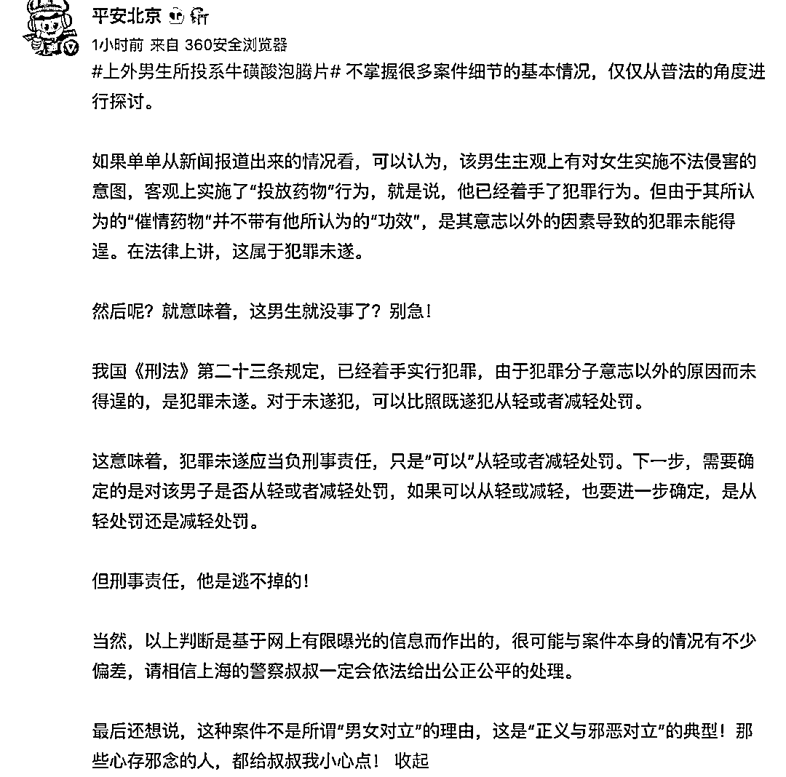
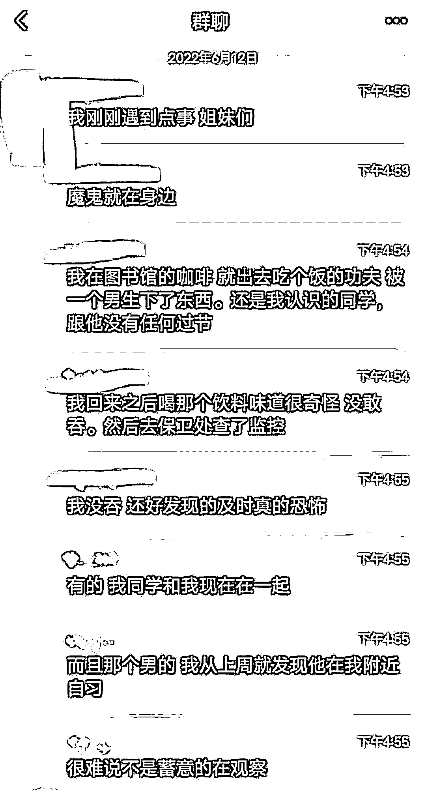
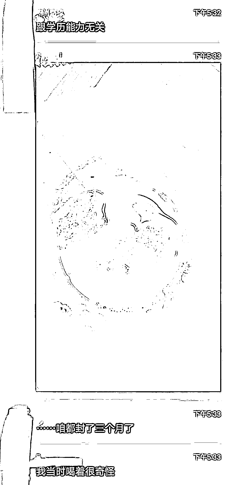
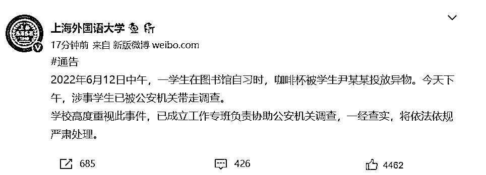

# 高校男生向女生杯中投异物，投的是什么？警方通报来了！

> 原文：[`mp.weixin.qq.com/s?__biz=MzIyMDYwMTk0Mw==&mid=2247537808&idx=4&sn=74d91b605eadafc24adc5049be16396e&chksm=97cb9fa8a0bc16beef2a21e2b05687cf56c5a515a84c6852a98ed41e89bfab4ec693c8af044f&scene=27#wechat_redirect`](http://mp.weixin.qq.com/s?__biz=MzIyMDYwMTk0Mw==&mid=2247537808&idx=4&sn=74d91b605eadafc24adc5049be16396e&chksm=97cb9fa8a0bc16beef2a21e2b05687cf56c5a515a84c6852a98ed41e89bfab4ec693c8af044f&scene=27#wechat_redirect)

6 月 13 日，上海市公安局松江分局发布警情通报称，针对上海外国语大学一女生饮料中被他人投放不明物一事，松江公安分局接报后立即成立工作专班，开展调阅公共视频、提取物证、走访问询等调查工作。

经初步调查，6 月 12 日中午 12 时许，该校学生尹某某(男，21 岁)在学校图书馆内趁该女生离开座位之际，向其咖啡杯中投放异物。该女生喝了一口后，察觉咖啡异样，将剩余咖啡倒掉，并向学校保卫部门报告。

经医院检查，未发现该女生身体异常。**警方随后找到尹某某，其承认在女生咖啡杯中投放了半片牛磺酸泡腾片，该泡腾片系从网上购买。**目前，分局已将相关物证送市局专业技术部门检验，相关调查工作在进一步开展中。

**关于“上外男生所投异物系牛磺酸泡腾片”一事，@平安北京 从新闻报道和最新通报所了解的信息中，对该男生是否会承担刑事责任，做出了以下分析：**

**此前报道：**

日前有网友爆料称，自己是上海外国语大学一名学生，6 月 12 日中午吃完饭回到图书馆后，感觉自己的咖啡味道有些奇怪。

该女生察觉异样后没有吞下咖啡，将剩余咖啡倒掉，并去保卫处查看监控发现，系一男生所为。网友称，男生与自己是同学关系，此前无过节。

据悉，男生系德语系 19 级学生。当事人于事后报警，并在医院做了身体检查，所幸无大碍。

[`v.qq.com/iframe/preview.html?width=500&height=375&auto=0&vid=c33428622bi`](https://v.qq.com/iframe/preview.html?width=500&height=375&auto=0&vid=c33428622bi)

12 日晚 23 时许，上海外国语大学在官方账号发布情况通报称，2022 年 6 月 12 日中午，一学生在图书馆自习时，咖啡杯被学生尹某某投放异物。12 日下午，涉事学生已被公安机关带走调查。

学校已成立工作专班负责协助公安机关调查，一经查实，将依法依规严肃处理。

来源：潇湘晨报综合@平安北京 记者 ： 骆一歌 实习生袁航 邝宣

](https://mp.weixin.qq.com/s?__biz=Mzg5ODAwNzA5Ng==&mid=2247487973&idx=1&sn=1b62da6f2018402862a5c375e10c355e&chksm=c06878b2f71ff1a4fbe7df4dec626aa7e696154751693bf16f6c6a302ceaa4d1959040c70518&scene=21#wechat_redirect)

← 向右滑动与灰产圈互动交流 →

