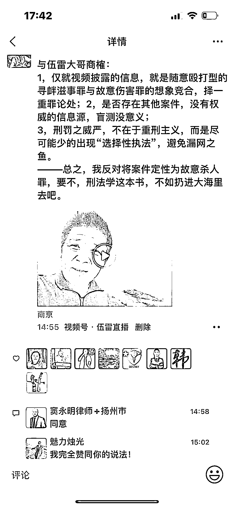

# 唐山暴力事件的六大要害

> 原文：[`mp.weixin.qq.com/s?__biz=MzIyMDYwMTk0Mw==&mid=2247537808&idx=5&sn=9dc21daf5517108d235b03caf74c9e5b&chksm=97cb9fa8a0bc16bec29a2856467e7590732b3bdc43144086387923826c7cb68ef22a667dc378&scene=27#wechat_redirect`](http://mp.weixin.qq.com/s?__biz=MzIyMDYwMTk0Mw==&mid=2247537808&idx=5&sn=9dc21daf5517108d235b03caf74c9e5b&chksm=97cb9fa8a0bc16bec29a2856467e7590732b3bdc43144086387923826c7cb68ef22a667dc378&scene=27#wechat_redirect)

**第 1 问：官方未披露具体罪名，此案该如何定性？**

  唐山案经廊坊市广阳区人民检察院批准，陈继志等 9 名犯罪嫌疑人已由廊坊市公安局广阳分局执行逮捕。对此，知名刑辩人伍雷大哥（李金星）认为：该团伙比他办理的那些涉黑案件更为严重，论法律性质涉嫌故意杀人罪，对此我旗帜鲜明的表示反对。我发了一条动态，兼与伍雷大哥商榷：

1，仅就视频披露的信息，此案是随意殴打型的寻衅滋事与故意伤害罪的想象竞合，应当择一重罪论处。

2，是否存在其他隐案，目前并没有权威的信息源，盲测没意义。

3，刑罚之威严不在于重刑主义，而是尽可能减少“选择性执法”，避免漏网之鱼。

———总之，我反对将案件定性为故意杀人罪，要不，刑法学这本书，不如扔进大海里去吧。

**第 2 问：派出所最初的治安调解方式，是否存在硬伤或重大违规？**

接处警的辖区派出所拟打算按照治安案件调解处理，网爆行凶者拿 60w 私了。当唐山事件裂变式传播并长时间霸占热搜榜，中央级的官媒也纷纷表态谴责，当地路北分局面临舆论炮轰。假如站在刑事辩护律师的立场冷静甄别，辖区派出所民警的处理思路是否存在硬伤？

依据公安部《公安机关办理伤害案件规定》（公通字[2005]98 号）第 30 条：对于因民间纠纷引起的殴打他人或者故意伤害他人身体的行为,情节较轻尚不够刑事处罚,具有下列情形之一的,经双方当事人同意,公安机关可以依法调解处理:

# （1）亲友、邻里或者同事之间因琐事发生纠纷,双方均有过错的;

# （2）未成年人、在校学生殴打他人或者故意伤害他人身体的;　　

# （3）行为人的侵害行为系由被害人事前的过错行为引起的;　　

# （4）其他适用调解处理更易化解矛盾的。

但与此同时，第 31 条又反方向规定了除外情形，即有下列情形之一的,不得调解处理:(一)雇凶伤害他人的;　(二)涉及黑社会性质组织的;　(三)寻衅滋事的;(四)聚众斗殴的;(五)累犯;(六)多次伤害他人身体的;(七)其他不宜调解处理的。

从视频来看，随意殴打型的寻衅滋事是显而易见的，除非你心盲。故，辖区派出所承办民警最初按照治安案件调解处理，即通过赔偿的方式达成治安调解协议结案，是涉嫌违规的。

**第 3 问：派出所的接处警工作，是否及时？** 

依据公安部《110 接处警工作规则》规定， 110 处警工作实行“一级处警”和“就近处警”、“分类处警”相结合的处警原则；处警民警到达现场后，应当根据有关规定对警情妥善处置。处警结束后，应当及时将处警情况向 110 报警服务台反馈，并做好处警记录。处警结果需要制作法律文书的，按有关规定办理。

6 月 10 日凌晨 2:41 开始的 2 分 16 秒内，路北分局 110 指挥中心陆续接到三人的电话报警（属重复关联），但直到 6：09 机场路派出所才反馈给指挥中心“已到达”，这中间整整间隔了 3 小时零 18 分钟！那么机场路派出所距离“老汉城烧烤”的距离是几百公里吗？不是的，是 1.6 公里，开车最快需要 5 分钟，**即便是开着手扶拖拉机，10 分钟也是可以到达的。**

我不确定当时的派出所内到底发生了什么？但是对于这样一起多人暴力殴打女性案件，这个接处警速度实在是过于拖沓了，期待公安系统内部的纪检组对此展开进一步的调查。讲真的，你们也是穿警服的，可能更专业一些。 

**第 4 问：指定廊坊异地管辖，合理否？**

河北省公安厅正面回应持续发酵的舆情，并果断指定廊坊公安异地管辖，是对于群众呼声的一种重视，是为了破除地方盘根错节的关系网可能带来的执法公正性质疑，而且这样的指定异地管辖，过去一般仅适用于涉黑涉恶案件或正处级以上公职人员的留置审查。

范辰、刘昌松 2 位帝都律师认为：唐山警界一哥是从廊坊调任过来的，指定廊坊有瓜田李下的袒护之嫌，对此我理解其担忧，但保留个人意见。首先，为什么不可以大胆假设，或许就是赵局长主动要求并提出建议由廊坊的刑警管辖？因为那里的刑侦队伍他更为熟悉，更富有战斗力一些。

第二、这 9 个被刑拘的犯罪嫌疑人真的是黑社会吗？现有已披露的信息尚不足以支撑，其实，从犯罪社会学的角度解读，真正的黑道大佬早已洗白上岸，开公司做产业，混几个政治光环，甚至是当地的慈善家，像这样打打杀杀的暴力份子，更接近反社会型人格障碍患者。可能有不少人会联系到云南的孙小果，可是孙小果作恶的年代，是上世纪九十年代末期，如今是 2022 年，真正的大佬往往具备一定的刑事法律风险防控意识的。

第三、哪怕是对待一个副厅级侦察员，我们同样不能搞有罪推定，刑法面前人人平等。故，我更为赞同南京蓝天彬律师的观点，认为这个指定管辖，是为了公平公正处理此案的现实需要。

**第 5 问：主犯陈继志的如烟往事，是否有深挖的必要？**

在一份唐山市路北区人民法院 2018 年 12 月 20 日作出的（2018）冀 0203 刑初 286 号刑事判决书中披露（已生效）：2015 年 12 月 12 日 18 时许，在唐山市路北区闻新园小区，被告人刘涛伙同他人（身份尚未查清），以追讨索要抵押车辆的债务为由，被告人刘涛使用方向盘锁对被害人商某的头部等部位实施殴打，致使其额骨凹陷粉碎性骨折，脑组织挫裂伤，尺骨粉碎性骨折，额顶部跨发际瘢痕按“系数相加”办法计算后所得数值大于 1。后被告人刘涛等人将其强行带上车牌号为×××的黑色帕萨特离开，将被害人商某带到陈继志（刑拘在逃）位于开平东外环的厂房大院内。至次日 12 时许，被害人商某趁人不备逃脱并报警。经鉴定，被害人商某的伤情为轻伤一级。

请注意：该案审判时，人民法院查明陈继志是刑拘在逃的状态，可是【路北巡控】披露“刘涛、陈继志、高杰在 2015 年 12 月已经落网”。看来，陈继志是唐山的孙悟空啊，飞越了看守所。

更为合理的推测是：当年的陈继志，极可能是被取保候审了，然后脱逃并成功躲过路北分局的眼眸，就此逍遥法外，当然这一切都止步于 2022 年 6 月 10 日的下午（视频开始疯传）。据此，唐山还是有回头看的必要，是否存在只见黑，而不见“伞”？

**第 6 问：要不要无限拔高，并将行凶者顶格处罚？**

一方面我特别同情被打的女孩子，特别是家里有闺女的，看了殴打视频心脏可能受不了，6 月 10 日下午，我下载并录屏分享到若干微信群的初衷，是希望大家给予关注，但随着客观形势的变化，我又隐隐有些担忧，怕无限制得拔高后，有可能走上了 83 年的那个唐山老路！

罪责刑相适应仍然是刑法最基本的原则，这需要全体国民遵循，当然也包括执法机关。诚然，视频降噪处理后，陈继志的确跟结账的同伴说了一句“把那些女的怼到路边 Cao 了”，这句话可恨之极，但是随后的猥亵抚摸动作，尚不能评价为刑法上强奸罪的“着手”，而随后的殴打，更符合恼羞成怒后产生的暴力伤害，这是一种瞬间的犯意转化。

故侦查机关最为稳妥的操作是：先以寻衅滋事罪刑拘和报请批捕，等待被害人的伤情鉴定报告，假如构成重伤，随意殴打型寻衅滋事是不能包容评价重伤结果的，想象竞合后择一重罪，故依据《刑法》第 234 条第二款，其量刑幅度为 3-10 年有期徒刑，

至于如何具体量化，则要进一步看双方是否达成刑事和解协议，犯罪嫌疑人（被告人）是否选择认罪认罚，部分被追诉人是否存在检举揭发同案犯其他犯罪事实并是否成立立功情节来综合认定。

**总之，网民的声音肯定是需要倾听的，但没必要无条件迎合，不枉不纵即可。**

来源：金陵刑辩人，宾曰语云   作者：辩护人付士峰 

](https://mp.weixin.qq.com/s?__biz=Mzg5ODAwNzA5Ng==&mid=2247487973&idx=1&sn=1b62da6f2018402862a5c375e10c355e&chksm=c06878b2f71ff1a4fbe7df4dec626aa7e696154751693bf16f6c6a302ceaa4d1959040c70518&scene=21#wechat_redirect)

← 向右滑动与灰产圈互动交流 →

