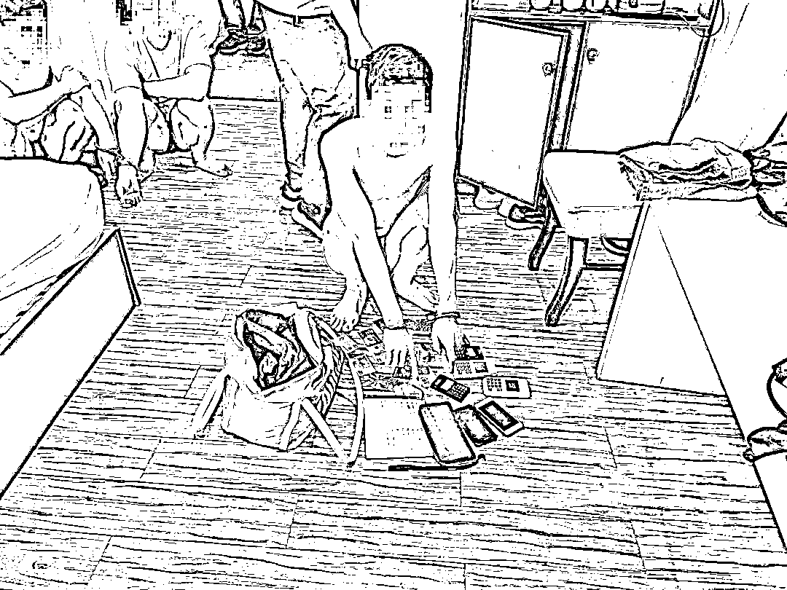
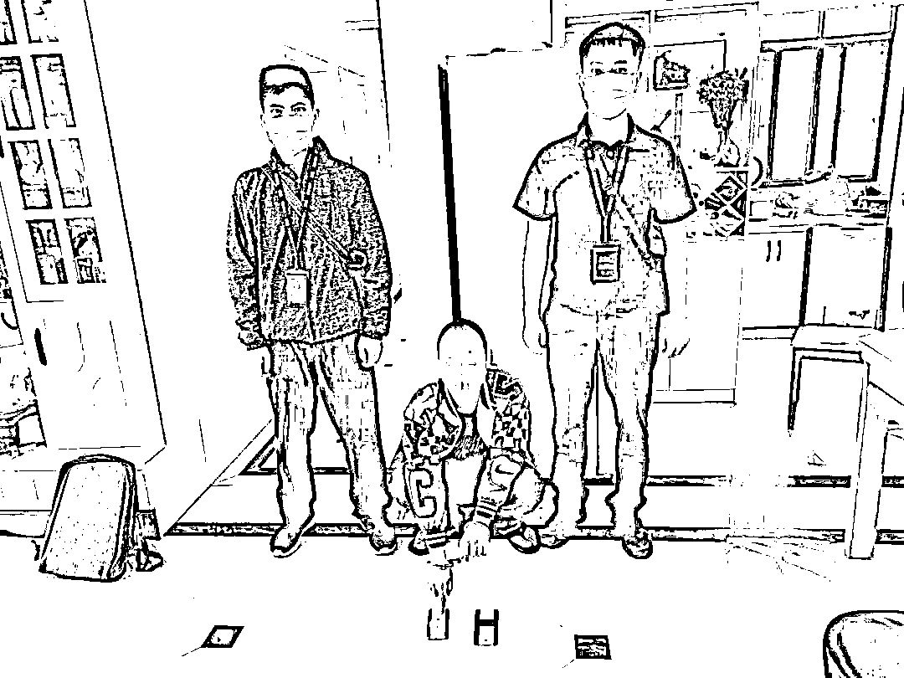

# 破案了！3 千名患者、50 万个捐赠者被网络众筹平台诈骗！

> 原文：[`mp.weixin.qq.com/s?__biz=MzIyMDYwMTk0Mw==&mid=2247537808&idx=7&sn=88b8287dab8526ecf0f9acee9f41faac&chksm=97cb9fa8a0bc16be342c4340673a80bccae586a697793964e35fd02c92be219a6cde3f26e02b&scene=27#wechat_redirect`](http://mp.weixin.qq.com/s?__biz=MzIyMDYwMTk0Mw==&mid=2247537808&idx=7&sn=88b8287dab8526ecf0f9acee9f41faac&chksm=97cb9fa8a0bc16be342c4340673a80bccae586a697793964e35fd02c92be219a6cde3f26e02b&scene=27#wechat_redirect)

你有没有见过这种情况

在微信群或者 QQ 群里面

有人轮番发各种“众筹”捐款的求助

求助的话术十分雷同

不少爱心人士慷慨捐助

但这有可能是诈骗！

近日，广西壮族自治区贵港市平南县公安局侦破了全国首例利用网络众筹平台诈骗重病老人特大系列案件，抓获该诈骗团伙成员 22 人，捣毁“空壳公司”12 个、诈骗网站 9 个，冻结涉案资金 30 余万元。

2022 年 3 月份，平南县公安局接到陈某海报案称：其父亲陈某某因脑出血住院急需用钱，一名自称“水滴筹”客服的人员到医院声称能用其公司的公益捐款平台无偿为困难病人筹款。该客服让其提供陈某某的住院资料办理网络筹款，并向其发送了“爱心筹助”筹款平台的链接，让其发送至自己的朋友圈、微信群筹款，共得筹款 16204 元。经反复催促和提出报警后，陈某海才从该筹款平台提现 11100 元，被平台诈骗了 5000 多元人民币。

接到报案后，平南县公安局办案民警经过分析，认为这是一个有组织、有预谋的团伙实施的诈骗，受害者也不仅仅是陈某某一人。

2022 年 5 月 18 日凌晨，在自治区公安厅网安总队、贵港市公安局的指挥下，平南县公安局多部门联动，对涉嫌利用“爱心捐助”、“爱心筹助”、“爱心筹款”、“大病救助”等 9 个非法众筹平台在湖南、广西两省（自治区）诈骗重病住院老人获捐的救助款系列案件进行收网，在湖南永州、广西南宁、百色、河池、贺州等地抓获以郭某某为首的诈骗团伙成员 22 人，捣毁空壳公司 12 个，诈骗网站 9 个；案件涉及爱心捐赠者 50 多万人，被骗困难患者 3 千多人，其中老人 900 多人，骗取 400 多万元；涉及区内外医院 800 多个，扣押公司电脑、公司印章、工作证、手腕带等工作工具一批，冻结涉案资金 30 多万元。

2020 年下半年起，以郭某某为首的诈骗团伙，利用身边亲人、朋友的名义注册多个空壳公司，搭建多个非法网络众筹平台，并安排地推人员从网上购买或从医院垃圾桶捡取各种陪护手腕带，冒充住院病人的陪护人混入广西、广东、湖南、湖北、江西等省区医院，将“爱心筹款”“爱心帮助”等非法平台伪装成全国性合法众筹平台进行众筹推广，或伪装成“水滴筹”“轻松筹”等合法公益平台的推广人员，骗取危重病人家属的信任，谎称为困难病人无偿在其公司的筹款平台发起众筹，故意隐瞒要收取 30%费用的事实，骗取病人 30%以上众筹款，部分案件甚至以不接电话，不回微信、短信，拉黑病人家属电话、微信等方式直接非法占有病人的全部捐款。

以郭某某为首的诈骗团伙骗取病危病重老人治病救命的财物，致使多个病危病重老人得不到及时救治；冒充公益性合法平台实施诈骗，致使 50 多万爱心群众对公益慈善捐款失去信任，造成恶劣社会影响；冒充住院病人的陪护人员，未经核酸检测，流窜混进医院病房，给防疫工作带来极大的公共安全风险。

为进一步维护老年人的合法权益，2022 年５月 25 日至５月 30 日，平南县公安局乘胜追击，先后打掉作案手法类似的诈骗团伙 3 个，捣毁非法平台 3 个，抓获团伙主要成员 16 人。

2022 年 6 月 9 日，平南县公安局依法对该诈骗团伙的 18 名主要成员执行逮捕。

来源：柳州晚报，利箭在行动

](https://mp.weixin.qq.com/s?__biz=Mzg5ODAwNzA5Ng==&mid=2247487973&idx=1&sn=1b62da6f2018402862a5c375e10c355e&chksm=c06878b2f71ff1a4fbe7df4dec626aa7e696154751693bf16f6c6a302ceaa4d1959040c70518&scene=21#wechat_redirect)

← 向右滑动与灰产圈互动交流 →

